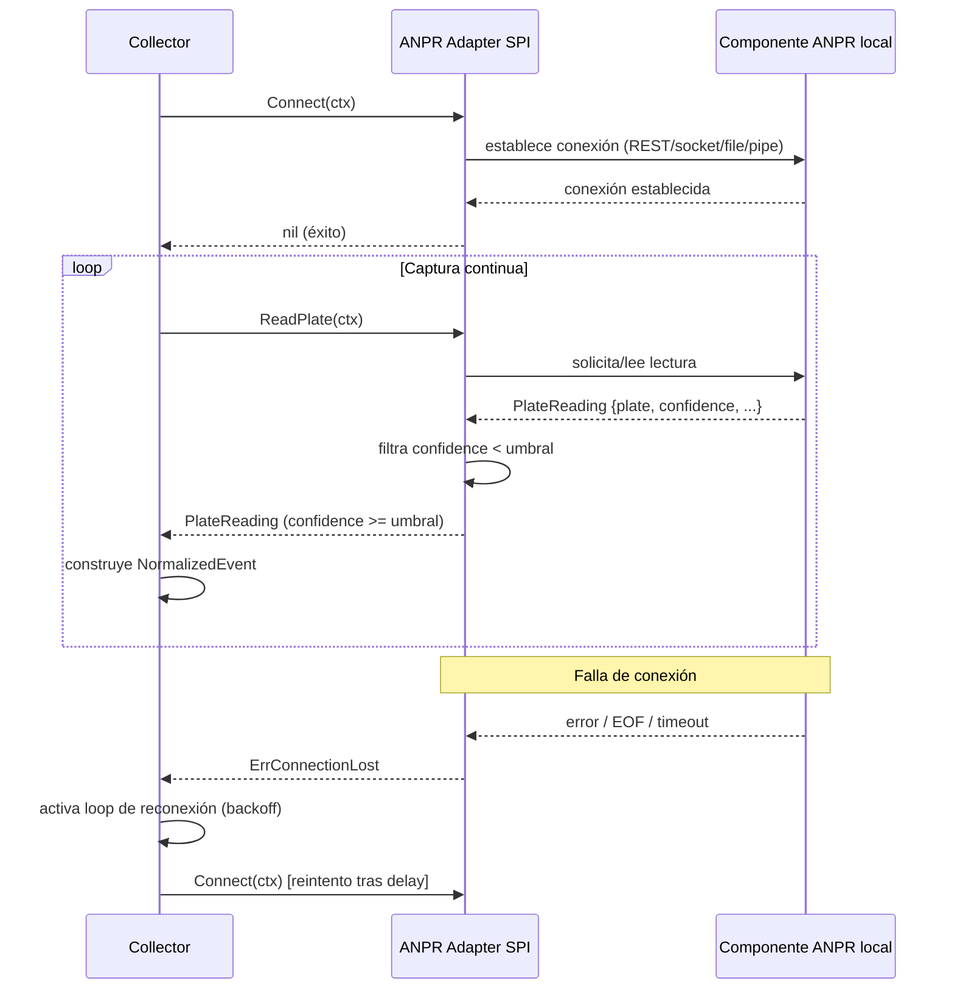

# ANPR Adapter SPI

**Subsistema:** ANPR Adapter SPI  
**Responsabilidad:** Abstracción para leer placas desde el componente ANPR local instalado en el dispositivo  
**Referencia arquitectural:** [Visión General](./overview.md) · [Propuesta §3.1](../propuesta-arquitectura-hurto-vehiculos.md#31-borde)

---

## 1. Propósito

El componente ANPR del dispositivo (instalado por el fabricante del hardware) puede exponer su salida de detección de matrículas a través de distintos mecanismos según el modelo y la versión del firmware. El **ANPR Adapter SPI** (Service Provider Interface) define un contrato Go único que desacopla el resto del agente de esa heterogeneidad, permitiendo seleccionar en tiempo de configuración la implementación apropiada sin modificar el código del Collector ni del Queue Manager.

---

## 2. Contrato Go (Interfaz SPI)

```go
// Package anpr define el contrato SPI que todo adaptador ANPR debe satisfacer.
package anpr

import "context"

// PlateReading representa una lectura cruda producida por el componente ANPR local.
type PlateReading struct {
    // Plate es la matrícula detectada en formato normalizado (mayúsculas, sin espacios).
    // Ejemplos: "ABC123", "XYZ-999", "CO-ABC-123"
    Plate string `json:"plate"`

    // Confidence es el índice de confianza de la detección, en el rango [0.0, 1.0].
    // Solo se entregan al Collector las lecturas con Confidence >= umbral configurado.
    Confidence float64 `json:"confidence"`

    // CapturedAt es el timestamp de la captura según el reloj del componente ANPR local.
    // Se almacena como referencia; el Collector aplica su propio timestamp dual (wall-clock + monotónico).
    CapturedAt int64 `json:"captured_at_unix_ms"`

    // ImagePath es la ruta en el filesystem local a la imagen capturada por el ANPR.
    // Puede estar vacía si el componente ANPR no produce imagen.
    ImagePath string `json:"image_path,omitempty"`

    // RawMeta contiene campos adicionales del componente ANPR (dirección, carril, score OCR, etc.)
    // que no forman parte del contrato canónico pero se preservan para diagnóstico.
    RawMeta map[string]string `json:"raw_meta,omitempty"`
}

// Adapter es el contrato SPI que toda implementación debe satisfacer.
// Una única instancia de Adapter corre en el agente durante todo su ciclo de vida.
type Adapter interface {
    // Connect establece (o restablece) la conexión con el componente ANPR local.
    // Se llama una vez al iniciar el agente y, de nuevo, tras cada desconexión detectada.
    // Debe respetar la cancelación del context para apagado limpio.
    Connect(ctx context.Context) error

    // ReadPlate bloquea hasta que hay una lectura disponible o hasta que el context
    // es cancelado. Retorna ErrNoReading si no hay datos (timeout interno del adapter);
    // el llamador reintenta de inmediato. Retorna un error fatal si la conexión se pierde.
    ReadPlate(ctx context.Context) (PlateReading, error)

    // Close libera los recursos de la conexión. Se llama en el apagado ordenado del agente.
    Close() error
}

// Errores canónicos del SPI
var (
    // ErrNoReading indica que no hay una nueva lectura disponible en este ciclo.
    // No es un error fatal; el Collector debe hacer polling de nuevo.
    ErrNoReading = errors.New("anpr: no reading available")

    // ErrConnectionLost indica que la conexión con el componente ANPR se perdió.
    // El Collector notifica al loop de reconexión y deja de llamar a ReadPlate.
    ErrConnectionLost = errors.New("anpr: connection lost")
)
```

**Reglas de uso:**

- El Collector llama a `ReadPlate` en un loop; al recibir `ErrConnectionLost` delega la reconexión al subsistema de backoff (§4) y no llama a `ReadPlate` hasta nueva conexión exitosa.
- El agente **nunca** genera un `NormalizedEvent` con placa vacía o con `Confidence < umbral_min` (configurable, valor por defecto: `0.70`). Las lecturas descartadas se registran en el log de nivel `DEBUG`.
- Si el componente ANPR no produce imagen, `ImagePath` llega vacío; el Image Store no crea entrada y el evento MQTT se publica sin referencia de imagen.

---

## 3. Implementaciones

### 3.1 REST Local (`rest`)

**Caso de uso:** El componente ANPR expone un servidor HTTP en `localhost` (típicamente `127.0.0.1:8080`) con un endpoint de polling o de streaming SSE/long-poll.

**Configuración:**

```toml
[anpr_adapter]
type = "rest"
endpoint = "http://127.0.0.1:8080/api/v1/readings"
poll_interval_ms = 200
timeout_ms = 1000
confidence_min = 0.70
```

**Comportamiento:**

- `Connect`: verifica que el endpoint responde con HTTP 200 y un payload JSON válido. Si no, retorna error (activa backoff).
- `ReadPlate`: hace `GET` al endpoint. Si la respuesta es `204 No Content`, retorna `ErrNoReading`. Si es `200`, deserializa el payload y valida el campo `confidence`.
- Si el servidor retorna `5xx` o no responde dentro del `timeout_ms`, retorna `ErrConnectionLost`.

**Esquema del payload JSON esperado:**

```json
{
  "plate": "ABC-123",
  "confidence": 0.94,
  "captured_at_unix_ms": 1715000000000,
  "image_path": "/var/anpr/images/abc123_1715000000000.jpg",
  "raw_meta": {
    "lane": "1",
    "direction": "outgoing",
    "ocr_score": "0.97"
  }
}
```

---

### 3.2 Socket UNIX (`unix_socket`)

**Caso de uso:** El componente ANPR publica lecturas como mensajes JSON delimitados por newline (`\n`) en un socket UNIX de tipo stream o datagram.

**Configuración:**

```toml
[anpr_adapter]
type = "unix_socket"
socket_path = "/run/anpr/readings.sock"
read_timeout_ms = 500
confidence_min = 0.70
```

**Comportamiento:**

- `Connect`: abre el socket con `net.Dial("unix", socket_path)`. Verifica que el socket existe y acepta conexión.
- `ReadPlate`: lee bytes hasta encontrar el delimitador `\n`; deserializa el JSON. Si el socket está cerrado (EOF), retorna `ErrConnectionLost`.
- El socket UNIX es el mecanismo preferido cuando el componente ANPR corre en el mismo host Linux: elimina overhead de red y autenticación HTTP.

---

### 3.3 Watch File (`watch_file`)

**Caso de uso:** El componente ANPR escribe cada lectura en un archivo de texto plano (un JSON por línea) en una ruta conocida del filesystem. El agente monitorea el archivo con `inotify` (Linux) o polling periódico.

**Configuración:**

```toml
[anpr_adapter]
type = "watch_file"
file_path = "/var/anpr/output/readings.jsonl"
poll_interval_ms = 100
confidence_min = 0.70
```

**Comportamiento:**

- `Connect`: verifica que el archivo existe y es legible. Si no existe, espera hasta creación (timeout configurable).
- `ReadPlate`: lee líneas nuevas desde el último offset conocido (el adapter lleva un puntero de posición). Si no hay líneas nuevas, retorna `ErrNoReading`.
- Si el archivo es rotado (tamaño menor al offset previo), el adapter resetea el offset a 0 y continúa.
- **Nota de robustez:** El watch file es el mecanismo de mayor latencia (limitado por `poll_interval_ms`). Usar únicamente cuando los otros mecanismos no están disponibles.

---

### 3.4 Named Pipe (`named_pipe`)

**Caso de uso:** El componente ANPR escribe lecturas como JSON delimitado por newline en un named pipe (FIFO) del sistema operativo.

**Configuración:**

```toml
[anpr_adapter]
type = "named_pipe"
pipe_path = "/var/anpr/pipe/readings"
read_timeout_ms = 500
confidence_min = 0.70
```

**Comportamiento:**

- `Connect`: abre el FIFO con `os.OpenFile(pipe_path, os.O_RDONLY, os.ModeNamedPipe)`. Bloquea hasta que el escritor (componente ANPR) abre el extremo de escritura.
- `ReadPlate`: lee bytes hasta `\n` y deserializa. Si el escritor cierra el extremo, retorna `ErrConnectionLost`.
- Los named pipes son adecuados para componentes ANPR en el mismo host que no mantienen un servidor de red pero sí soportan IPC POSIX estándar.

---

## 4. Manejo de Confianza (Confidence)

El parámetro `confidence_min` (por defecto `0.70`) es el umbral mínimo de confianza para que una lectura sea entregada al Collector. Las lecturas con `Confidence < confidence_min` se descartan localmente y se registran en el log estructurado con nivel `DEBUG` (campo `"event": "plate_discarded_low_confidence"`).

| `confidence_min` | Efecto |
|---|---|
| `0.70` (por defecto) | Descarta lecturas con alta incertidumbre; menor tasa de falsos positivos en cola |
| `0.50` | Mayor cobertura; mayor riesgo de matrículas erróneas en el cloud |
| `1.00` | Solo lecturas perfectas; no recomendado en condiciones de baja iluminación |

El umbral es configurable vía [Config/OTA Manager](./config-ota-manager.md) sin reiniciar el agente.

---

## 5. Política de Reconexión con Backoff Exponencial

Ante cualquier falla de conexión con el componente ANPR (independientemente de la implementación del adapter), el agente ejecuta el siguiente algoritmo de reconexión:

```
base_delay    = 1 s
max_delay     = 60 s
multiplier    = 2.0
jitter_factor = 0.2

attempt = 0
loop:
    delay = min(base_delay * multiplier^attempt, max_delay)
    delay += delay * random(-jitter_factor, +jitter_factor)  // jitter ±20%
    sleep(delay)
    result = adapter.Connect(ctx)
    if result == nil:
        log.Info("anpr reconnected", attempt=attempt)
        emit health_beacon_flag("anpr_available")
        break
    log.Warn("anpr reconnect failed", attempt=attempt, delay=delay, err=result)
    emit health_beacon_flag("anpr_unavailable")
    attempt++
```

**Tiempos de espera resultantes:**

| Intento | Delay base | Con jitter máximo |
|---|---|---|
| 1 | 1 s | ~1.2 s |
| 2 | 2 s | ~2.4 s |
| 3 | 4 s | ~4.8 s |
| 5 | 16 s | ~19.2 s |
| 7+ | 60 s (tope) | ~72 s |

**Reglas:**

- El agente **nunca termina** por falla del adapter ANPR (CR-01). El proceso sigue corriendo, el Health Beacon continúa publicando, y el Queue Manager retransmite eventos existentes.
- Al recuperar la conexión, el counter de intentos se resetea a 0.
- El flag `anpr_unavailable` se incluye en el siguiente payload del Health Beacon (ver [Health Beacon](./health-beacon.md)).
- El loop de reconexión respeta la cancelación del context (señal `SIGTERM`): si el context se cancela durante `sleep`, el loop termina limpiamente.

---

## 6. Diagrama de Secuencia — Flujo Normal



---

## 7. Selección de Implementación en Tiempo de Despliegue

La implementación activa se determina por el campo `type` en la configuración del agente. El binario incluye las cuatro implementaciones compiladas; no se requiere cambio de binario para cambiar de mecanismo:

```toml
[anpr_adapter]
# Valores válidos: "rest" | "unix_socket" | "watch_file" | "named_pipe"
type = "unix_socket"
```

Si `type` contiene un valor desconocido, el agente falla en el arranque con un error fatal descriptivo (no se inicia el servicio, systemd reporta `failed`).

---

## 8. Referencias Cruzadas

| Documento | Relación |
|---|---|
| [Collector](./collector.md) | Consumidor de `PlateReading`; construye el `NormalizedEvent` |
| [Health Beacon](./health-beacon.md) | Publica el flag `anpr_unavailable` cuando el adapter falla |
| [Config/OTA Manager](./config-ota-manager.md) | Actualiza `confidence_min` y `type` en caliente |
| [Visión General](./overview.md) | Ciclo de vida del agente y glosario canónico |
| [ADRs Locales](./adr-local.md) | Decisión sobre elección de mecanismo de integración ANPR |
| [Propuesta §6, Supuesto 1](../propuesta-arquitectura-hurto-vehiculos.md#6-supuestos) | Supuesto de que el ANPR local expone al menos un mecanismo compatible |
