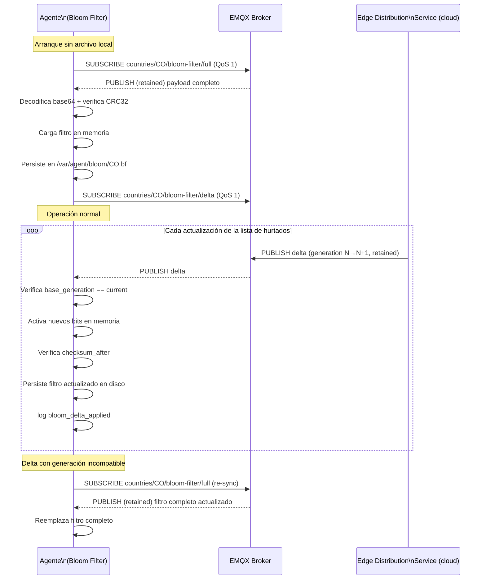

# Bloom Filter

**Subsistema:** Bloom Filter  
**Responsabilidad:** Filtrado probabilístico local de placas hurtadas del país para priorización de eventos  
**Referencia arquitectural:** [Visión General](./overview.md) · [Propuesta ADR-009](../propuesta-arquitectura-hurto-vehiculos.md#adr-009--bloom-filter-en-borde-para-hot-path-de-alertas)

---

## 1. Propósito

El Bloom filter mantiene en memoria una representación compacta de la lista de matrículas hurtadas del país asignado al dispositivo. Permite al [Collector](./collector.md) decidir **localmente** si una placa merece prioridad alta o debe descartarse (en `upload_mode: stolen_only`), sin necesidad de conectividad al cloud en el momento de la captura.

El filtro es probabilístico: puede producir **falsos positivos** (la placa aparece como hurtada cuando no lo está), pero **nunca falsos negativos** (si la placa está en la lista, siempre habrá hit). La confirmación canónica del match se realiza en el cloud contra la lista completa (ver [Propuesta §2.4](../propuesta-arquitectura-hurto-vehiculos.md#24-hot-path--captura-match-y-alerta)).

---

## 2. Parámetros del Filtro

Los parámetros están optimizados para la capacidad de hardware del dispositivo de referencia (2 cores, 1 GB RAM) y el volumen esperado de la lista de hurtados por país:

| Parámetro | Valor | Justificación |
|---|---|---|
| Capacidad esperada (`n`) | 1 000 000 placas | Límite superior conservador por país |
| Tasa de falsos positivos (`fp`) | ~1 % (0.01) | Equilibrio entre tamaño y precisión (ADR-009) |
| Tamaño del filtro (`m`) | ~9 585 059 bits (~1.14 MB) | Calculado con `m = -n·ln(fp) / (ln2)²` |
| Número de funciones hash (`k`) | 7 | Calculado con `k = (m/n)·ln(2)` ≈ 6.64 → redondea a 7 |
| Algoritmo hash | MurmurHash3 (64-bit) con doble hashing | Distribución uniforme, eficiencia en CPU embebido |
| Tamaño en memoria | ~1.2 MB (incluyendo estructura Go) | Bien dentro del límite de 50 MB RSS |

### 2.1 Fórmulas de Dimensionamiento

```
m (bits) = -n * ln(fp) / (ln(2))^2
         = -1_000_000 * ln(0.01) / (0.6931)^2
         = -1_000_000 * (-4.6052) / 0.4804
         = 9_585_059 bits ≈ 9.6 Mbits ≈ 1.14 MB

k (funciones hash) = (m / n) * ln(2)
                   = 9.585 * 0.6931
                   ≈ 6.64 → 7
```

### 2.2 Implementación de Doble Hashing

Para obtener `k` posiciones del bit array con solo dos funciones hash base (técnica de Kirsch-Mitzenmacher):

```go
func positions(plate string, m uint, k int) []uint {
    h1 := murmur3.Sum64([]byte(plate))
    h2 := murmur3.SeedSum64(42, []byte(plate))
    pos := make([]uint, k)
    for i := 0; i < k; i++ {
        pos[i] = uint((h1 + uint64(i)*h2) % uint64(m))
    }
    return pos
}
```

---

## 3. Serialización Binaria en Disco

El Bloom filter se persiste en disco en el archivo `/var/agent/bloom/<country_code>.bf` al aplicar cada actualización. El formato binario es el siguiente:

### 3.1 Cabecera (32 bytes fijos)

| Offset | Tamaño | Tipo | Campo | Descripción |
|---|---|---|---|---|
| 0 | 4 bytes | uint32 BE | `magic` | Valor fijo `0xBF01CE1B` (identificador de formato) |
| 4 | 1 byte | uint8 | `version` | Versión del formato binario (actualmente `1`) |
| 5 | 2 bytes | char[2] | `country_code` | Código ISO del país (ej. `CO`) |
| 7 | 8 bytes | uint64 BE | `m` | Número de bits del filtro |
| 15 | 1 byte | uint8 | `k` | Número de funciones hash |
| 16 | 8 bytes | int64 BE | `generation` | Contador de generación del filtro (monotónico) |
| 24 | 8 bytes | int64 BE | `created_at_unix_s` | Timestamp de creación (UNIX segundos) |

### 3.2 Cuerpo

Inmediatamente después de la cabecera: `ceil(m / 8)` bytes que representan el bit array del filtro en big-endian (bit más significativo del byte más significativo = posición 0).

### 3.3 Checksum

Los últimos 4 bytes del archivo contienen un CRC32 (IEEE) calculado sobre todos los bytes anteriores (cabecera + cuerpo). Al cargar el archivo, el agente verifica el CRC; si no coincide, trata el archivo como corrupto y activa el modo degradado (CR-05).

### 3.4 Ruta de Persistencia

```
/var/agent/bloom/<country_code>.bf
/var/agent/bloom/<country_code>.bf.tmp   ← escritura atómica temporal
```

La actualización del archivo es atómica: el agente escribe primero en `.tmp` y luego renombra sobre el archivo definitivo (`rename(2)`), evitando estados intermedios en caso de corte de energía durante la escritura.

---

## 4. Protocolo MQTT para Sincronización

El Bloom filter se mantiene actualizado mediante dos topics MQTT retained gestionados por el cloud:

### 4.1 Sincronización Completa (arranque sin filtro)

| Propiedad | Valor |
|---|---|
| Topic | `countries/<country_code>/bloom-filter/full` |
| QoS | 1 |
| Retain | `true` |
| Payload | Archivo binario completo del filtro (cabecera + cuerpo + CRC32) codificado en base64 |
| TTL del mensaje retained | Sin expiración (siempre disponible al reconectar) |

Al suscribirse a este topic, el agente recibe el último filtro completo publicado por el cloud. Esto ocurre al arrancar sin archivo local (modo degradado) o cuando el agente solicita explícitamente una resincronización completa.

### 4.2 Actualización Incremental (delta)

| Propiedad | Valor |
|---|---|
| Topic | `countries/<country_code>/bloom-filter/delta` |
| QoS | 1 |
| Retain | `true` |
| Payload | Objeto JSON con lista de posiciones de bits a activar |

**Esquema del payload delta:**

```json
{
  "generation": 1042,
  "base_generation": 1041,
  "country_code": "CO",
  "published_at": "2024-05-07T18:00:00Z",
  "new_bits": [4192847, 7831204, 2048391, "..."],
  "plates_added": 47,
  "checksum_after": "a3f4b2c1"
}
```

| Campo | Descripción |
|---|---|
| `generation` | Generación del filtro resultante tras aplicar el delta |
| `base_generation` | Generación sobre la cual se aplica el delta |
| `new_bits` | Lista de índices de bits (uint64) que deben activarse en el filtro |
| `plates_added` | Número de placas nuevas representadas en el delta (para log) |
| `checksum_after` | CRC32 hex del filtro resultante esperado; el agente verifica tras aplicar |

**Lógica de aplicación del delta:**

```go
func applyDelta(bf *BloomFilter, delta DeltaPayload) error {
    if delta.BaseGeneration != bf.generation {
        // Delta no aplicable a esta generación; solicitar filtro completo
        return ErrGenerationMismatch
    }
    for _, bitPos := range delta.NewBits {
        bf.setBit(bitPos)
    }
    bf.generation = delta.Generation
    // Verificar checksum
    if crc32hex(bf.bitArray) != delta.ChecksumAfter {
        return ErrChecksumMismatch
    }
    return bf.persistToDisk()
}
```

Si `ErrGenerationMismatch`, el agente se suscribe al topic `full` para obtener el filtro completo.

### 4.3 Tiempo Máximo de Sincronización Inicial

La sincronización completa inicial debe completarse en **menos de 30 segundos** sobre GSM 3G (objetivo de rendimiento de la propuesta, tabla §5.4).

**Análisis de capacidad:**

- Tamaño del archivo binario completo: ~1.14 MB (payload sin overhead MQTT)
- Base64 encoding: ~1.52 MB
- Throughput mínimo GSM 3G: ~128 kbps (EDGE) → ~16 KB/s
- Tiempo teórico en EDGE: 1.52 MB / 16 KB/s ≈ 97 s

Por lo tanto, para cumplir el objetivo de < 30 s en 3G real (~384 kbps → ~48 KB/s): 1.52 MB / 48 KB/s ≈ **32 s** (excede el SLO). Para garantizar el cumplimiento, el cloud **DEBE aplicar compresión ZSTD** al payload antes de publicar en el topic `full`. Este requisito se formaliza como contrato en el change `ingestion-mqtt` (Edge Distribution Service). Si el payload llega sin comprimir, el agente lo procesa igualmente pero puede exceder el SLO en EDGE/3G lento:

- Compresión ZSTD nivel 3 sobre bit array aleatorio: reducción ~15-20% → ~1.25 MB base64
- Tiempo en 3G a 384 kbps: 1.25 MB / 48 KB/s ≈ **26 s** (cumple objetivo)

El agente informa el tiempo de sincronización en el log estructurado (`"event": "bloom_sync_completed"`, `"duration_ms": ...`).

---

## 5. Flujo de Sincronización



---

## 6. Modo Degradado

El agente opera en **modo degradado** de Bloom filter en los siguientes casos (CR-05):

1. El archivo `/var/agent/bloom/<country_code>.bf` no existe al arrancar.
2. El archivo existe pero el CRC32 no coincide (archivo corrupto).
3. El archivo existe pero la cabecera contiene valores inválidos (magic incorrecto, versión desconocida).

**Comportamiento en modo degradado:**

| Aspecto | Comportamiento |
|---|---|
| `bloom_hit` para todos los eventos | `false` |
| Prioridad asignada | `NORMAL` para todos los eventos |
| `upload_mode: stolen_only` | No descarta eventos (política conservadora para no perder evidencia) |
| Log por cada evento | `WARN: bloom_filter_unavailable` |
| Solicitud de re-sync | Al conectar al broker MQTT, se suscribe a `countries/<country_code>/bloom-filter/full` |
| Duración del modo degradado | Hasta recibir el filtro completo del cloud |

El Collector registra una advertencia al procesar cada evento en modo degradado, y el Health Beacon incluye el flag `bloom_unavailable: true` en su payload (ver [Health Beacon](./health-beacon.md)).

---

## 7. Referencias Cruzadas

| Documento | Relación |
|---|---|
| [Collector](./collector.md) | Consulta el Bloom filter para determinar `bloom_hit` y `priority` |
| [Queue Manager](./queue-manager.md) | Recibe eventos con prioridad determinada por el filtro |
| [Health Beacon](./health-beacon.md) | Reporta el estado del filtro (`bloom_unavailable`) |
| [Config/OTA Manager](./config-ota-manager.md) | Puede triggear re-sincronización del filtro vía configuración |
| [ADRs Locales](./adr-local.md) | ADR-009 — justificación de parámetros exactos y delta vs descarga completa |
| [Propuesta ADR-009](../propuesta-arquitectura-hurto-vehiculos.md#adr-009--bloom-filter-en-borde-para-hot-path-de-alertas) | Decisión de diseño de alto nivel del filtro en borde |
| [Propuesta §2.5](../propuesta-arquitectura-hurto-vehiculos.md#25-cold-path--sincronización-de-vehículos-hurtados-por-país) | Cold path de sincronización de la lista de hurtados desde el país al dispositivo |
