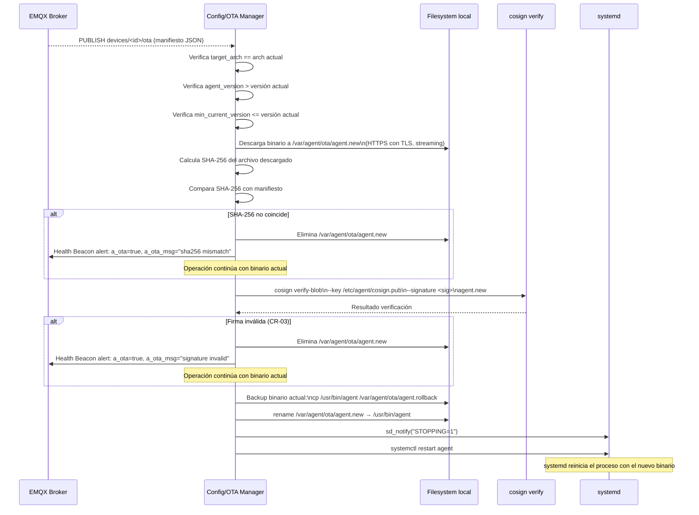

# Config/OTA Manager

**Subsistema:** Config/OTA Manager  
**Responsabilidad:** Gestión de configuración remota y actualización del binario del agente (OTA)  
**Referencia arquitectural:** [Visión General](./overview.md) · [Propuesta ADR-010](../propuesta-arquitectura-hurto-vehiculos.md#adr-010--pki-propia-con-certificados-cortos-para-dispositivos)

---

## 1. Propósito

El Config/OTA Manager permite operar y actualizar el agente sin acceso físico al dispositivo. Sus dos responsabilidades son distintas pero comparten el mecanismo MQTT:

1. **Configuración remota:** recibe actualizaciones de parámetros del agente (principalmente `upload_mode`) y las aplica en caliente sin reiniciar el proceso.
2. **Actualización OTA:** recibe manifiestos de actualización del binario, descarga el nuevo binario, verifica su firma cosign, lo reemplaza atómicamente y solicita el reinicio controlado via systemd.

---

## 2. Topics de Suscripción

El Config/OTA Manager se suscribe a los siguientes topics al establecer la sesión MQTT:

| Topic | Propósito | QoS | Retain |
|---|---|---|---|
| `devices/<device_id>/config` | Configuración específica del dispositivo | 1 | `true` |
| `fleet/<country_code>/config` | Configuración aplicada a toda la flota del país | 1 | `true` |
| `devices/<device_id>/ota` | Manifiesto OTA específico del dispositivo | 1 | `true` |
| `fleet/<country_code>/ota` | Manifiesto OTA aplicado a toda la flota del país | 1 | `true` |

Al suscribirse, el broker EMQX entrega inmediatamente el mensaje `retained` más reciente de cada topic (si existe). Esto garantiza que un dispositivo que acaba de arrancar recibe la configuración vigente y cualquier OTA pendiente sin esperar el próximo mensaje publicado.

**Precedencia:** Un mensaje en `devices/<device_id>/config` tiene precedencia sobre `fleet/<country_code>/config` si ambos definen el mismo parámetro.

---

## 3. Gestión de Configuración Remota

### 3.1 Parámetros Configurables Remotamente

| Parámetro | Tipo | Por defecto | Descripción |
|---|---|---|---|
| `upload_mode` | string | `stolen_only` | Modo de captura: `stolen_only` o `all` |
| `confidence_min` | float | `0.70` | Umbral mínimo de confianza del ANPR |
| `health_interval_s` | int | `60` | Intervalo del Health Beacon en segundos |
| `bloom_sync_force` | bool | `false` | Fuerza resincronización completa del Bloom filter |
| `log_level` | string | `INFO` | Nivel de log: `DEBUG`, `INFO`, `WARN`, `ERROR` |
| `disk_alert_threshold_mb` | int | `500` | Umbral de alerta de disco libre en MB |
| `event_retention_h` | int | `24` | Horas de retención de eventos `delivered` en SQLite |
| `ntp_drift_threshold_s` | float | `5.0` | Umbral de drift NTP para `clock_uncertain` |

### 3.2 Esquema del Payload de Configuración

```json
{
  "config_version": 42,
  "published_at": "2024-05-07T18:00:00Z",
  "authorized_by": "admin-colombia-01",
  "params": {
    "upload_mode": "all",
    "confidence_min": 0.72,
    "health_interval_s": 60,
    "log_level": "INFO"
  }
}
```

| Campo | Descripción |
|---|---|
| `config_version` | Versión monotónica del mensaje de configuración. El agente ignora versiones iguales o anteriores a la última aplicada. |
| `published_at` | Timestamp de publicación del mensaje. |
| `authorized_by` | **Obligatorio** cuando `upload_mode` cambia a `all`. Nombre o ID del administrador que autorizó el cambio. Vacío rechaza el cambio de modo. |
| `params` | Mapa de parámetros a actualizar. Solo los campos presentes se actualizan; los ausentes mantienen su valor actual. |

### 3.3 Cambio de `upload_mode` (CA-14)

El cambio de `upload_mode` es el parámetro más sensible porque `all` implica registro masivo de tránsito vehicular. La lógica de validación es:

```go
func (c *ConfigManager) applyConfig(msg ConfigMessage) error {
    if newMode, ok := msg.Params["upload_mode"]; ok {
        if newMode == "all" && strings.TrimSpace(msg.AuthorizedBy) == "" {
            log.Error("upload_mode_change_rejected",
                "reason", "authorized_by is required for upload_mode=all",
                "config_version", msg.ConfigVersion,
            )
            return ErrUnauthorizedModeChange
        }
        oldMode := c.current.UploadMode
        c.current.UploadMode = newMode
        log.Info("upload_mode_changed",
            "prev_value", oldMode,
            "new_value", newMode,
            "authorized_by", msg.AuthorizedBy,
            "applied_at", time.Now().UTC().Format(time.RFC3339),
            "config_version", msg.ConfigVersion,
        )
        c.auditLog.Append(AuditEntry{
            Timestamp:    time.Now().UTC(),
            ParameterKey: "upload_mode",
            PrevValue:    oldMode,
            NewValue:     newMode,
            AuthorizedBy: msg.AuthorizedBy,
        })
    }
    // Aplicar resto de parámetros...
    return nil
}
```

**Comportamiento:**

- El cambio se aplica al **siguiente evento procesado** por el Collector, sin reiniciar el agente.
- Los eventos ya encolados **no se reenvían ni eliminan retroactivamente**.
- El log de auditoría se escribe en `/var/agent/audit/config-changes.jsonl` (append-only).

### 3.4 Log de Auditoría de Cambios de Configuración

Cada cambio de parámetro se registra en `/var/agent/audit/config-changes.jsonl` en formato JSON Lines (una entrada por línea):

```json
{"timestamp":"2024-05-07T18:00:05Z","parameter":"upload_mode","prev_value":"stolen_only","new_value":"all","authorized_by":"admin-colombia-01","config_version":42,"device_id":"CO-BOG-DEV-00142"}
```

Este archivo es **append-only** y no se elimina en rotaciones normales. El tamaño máximo es 10 MB; al superarlo, se rota a `config-changes.jsonl.1` (una rotación histórica).

---

## 4. Actualización OTA

### 4.1 Formato del Manifiesto OTA

```json
{
  "manifest_version": 1,
  "agent_version": "1.5.0",
  "published_at": "2024-05-07T20:00:00Z",
  "target_arch": "linux/arm64",
  "download_url": "https://releases.ceiba-antihurto.io/agent/v1.5.0/agent-linux-arm64",
  "sha256": "e3b0c44298fc1c149afbf4c8996fb92427ae41e4649b934ca495991b7852b855",
  "cosign_signature": "eyJhbGciOiJFQ0RTQS...base64...",
  "cosign_public_key_ref": "sha256:abcdef1234...",
  "min_current_version": "1.3.0",
  "rollback_version": "1.4.2",
  "rollback_url": "https://releases.ceiba-antihurto.io/agent/v1.4.2/agent-linux-arm64"
}
```

| Campo | Descripción |
|---|---|
| `manifest_version` | Versión del esquema del manifiesto (actualmente `1`). |
| `agent_version` | Versión semántica del nuevo binario. |
| `target_arch` | Arquitectura objetivo (`linux/arm64`, `linux/amd64`). El agente verifica que coincida con su propia arquitectura antes de descargar. |
| `download_url` | URL HTTPS del binario nuevo. |
| `sha256` | Hash SHA-256 del binario (hex lowercase). Se verifica antes de la firma cosign. |
| `cosign_signature` | Firma cosign del binario en formato detached (base64). |
| `cosign_public_key_ref` | Digest de la clave pública cosign usada para firmar. El agente la valida contra la clave embebida en el binario actual. |
| `min_current_version` | Versión mínima del agente actual para aplicar esta OTA. Si el agente es más antiguo, rechaza con log y espera. |
| `rollback_version` | Versión a la que se hace rollback automático si la actualización falla. |
| `rollback_url` | URL del binario de rollback. |

### 4.2 Flujo de Descarga, Verificación y Reemplazo



### 4.3 Verificación con cosign

```bash
# Comando ejecutado por el agente para verificar el binario descargado
cosign verify-blob \
  --key /etc/agent/cosign.pub \
  --signature /tmp/agent.new.sig \
  /var/agent/ota/agent.new
```

La clave pública cosign (`/etc/agent/cosign.pub`) está embebida en el binario del agente durante la compilación y también se distribuye en el filesystem del dispositivo durante el provisioning inicial.

### 4.4 Reemplazo Atómico del Binario

```go
// 1. Verificar firma (ver §4.3)
// 2. Backup del binario actual
if err := copyFile("/usr/bin/agent", "/var/agent/ota/agent.rollback"); err != nil {
    return fmt.Errorf("ota: backup failed: %w", err)
}
// 3. Reemplazar atómicamente (rename en el mismo filesystem)
if err := os.Rename("/var/agent/ota/agent.new", "/usr/bin/agent"); err != nil {
    return fmt.Errorf("ota: rename failed: %w", err)
}
// 4. Solicitar reinicio via systemd
if err := sdnotify("STOPPING=1"); err != nil {
    log.Warn("ota: sd_notify STOPPING failed, systemd may not restart cleanly")
}
```

### 4.5 Rollback Automático

Si el agente nuevo no emite `READY=1` a systemd dentro de `TimeoutStartSec` (configurado en 30 s), systemd trata el inicio como fallido y ejecuta `ExecStartPre` que restaura el binario de rollback:

```ini
# En /etc/systemd/system/agent.service (ver también watchdog.md)
ExecStartPre=/bin/sh -c \
  'if [ -f /var/agent/ota/agent.rollback ] && \
   ! /usr/bin/agent --version-check; then \
     mv /var/agent/ota/agent.rollback /usr/bin/agent; \
   fi'
```

Alternativamente, si el agente arranca pero detecta internamente que está en una versión con problemas, puede leer `rollback_version` del manifiesto persistido y solicitar la descarga explícita del binario de rollback.

---

## 5. Referencias Cruzadas

| Documento | Relación |
|---|---|
| [Uploader](./uploader.md) | Comparte la sesión MQTT; el Config/OTA Manager se suscribe en la misma sesión |
| [Collector](./collector.md) | Recibe actualizaciones de `upload_mode` y `confidence_min` |
| [Bloom Filter](./bloom-filter.md) | Puede recibir señal de `bloom_sync_force` para resincronización |
| [Health Beacon](./health-beacon.md) | Reporta errores OTA con `a_ota: true` |
| [Watchdog](./watchdog.md) | Coordina el reinicio tras OTA exitoso |
| [Seguridad](./security.md) | Verificación de firma cosign; modo "config locked" ante tampering |
| [ADRs Locales](./adr-local.md) | Decisiones sobre manifiesto OTA y log de auditoría |
| [Propuesta ADR-010](../propuesta-arquitectura-hurto-vehiculos.md#adr-010--pki-propia-con-certificados-cortos-para-dispositivos) | Certificados de dispositivo y rotación automática |
