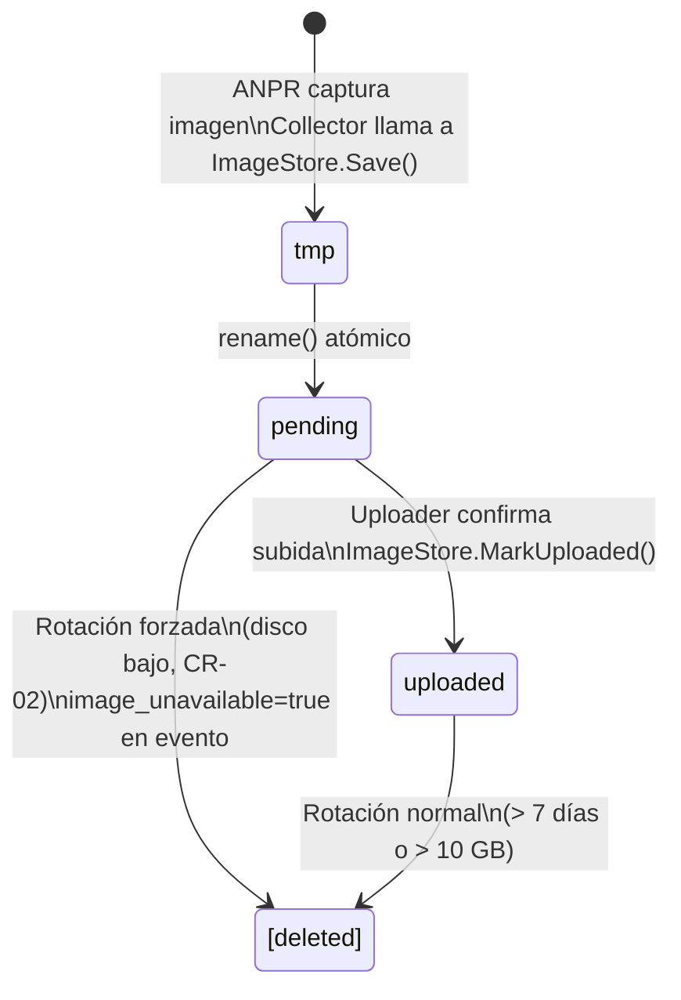

# Image Store

**Subsistema:** Image Store  
**Responsabilidad:** Almacenamiento temporal y rotación de imágenes capturadas por el dispositivo  
**Referencia arquitectural:** [Visión General](./overview.md) · [Propuesta §3.1](../propuesta-arquitectura-hurto-vehiculos.md#31-borde)

---

## 1. Propósito

El Image Store gestiona el ciclo de vida de las imágenes capturadas localmente antes de su subida al cloud. Opera de forma **no-bloqueante** respecto al flujo principal de captura: almacenar o rotar imágenes no puede detener ni retrasar la generación de nuevos eventos por el [Collector](./collector.md).

Las imágenes son evidencia probatoria; su integridad y disponibilidad son críticas mientras no hayan sido confirmadas como subidas al cloud.

---

## 2. Estructura de Directorios

```
/var/agent/images/
├── pending/          ← Imágenes no subidas aún (estado: pendiente de subida)
│   ├── CO-BOG-DEV-00142_20240507T143211_550e8400.jpg
│   └── CO-BOG-DEV-00142_20240507T143218_7c9e1234.jpg
├── uploaded/         ← Imágenes subidas con éxito (candidatas a eliminación)
│   └── CO-BOG-DEV-00142_20240507T140033_aabc9901.jpg
└── tmp/              ← Escrituras atómicas temporales
    └── .write_550e8400.tmp
```

**Reglas de estructura:**

- `pending/` contiene las imágenes aún no subidas. Son prioritarias y **no se eliminan** mientras haya espacio disponible, incluso si tienen más de 7 días.
- `uploaded/` contiene las imágenes cuya subida fue confirmada (`image_uri` actualizado en SQLite). Son las primeras candidatas a eliminación en la política de rotación.
- `tmp/` es un directorio de escritura atómica: las imágenes se escriben primero aquí y se mueven a `pending/` con `rename(2)` al completar la escritura. Si el proceso se interrumpe durante la escritura, los archivos `.tmp` quedan en este directorio y se limpian al arrancar.
- Los tres directorios deben estar en el mismo filesystem para garantizar que `rename(2)` sea una operación atómica (sin copia de datos).

---

## 3. Convención de Nombres de Archivo

Todos los archivos de imagen siguen el formato:

```
<device_id>_<timestamp_utc>_<event_id_short>.<extension>
```

| Segmento | Descripción | Ejemplo |
|---|---|---|
| `device_id` | Identificador del dispositivo (guiones permitidos) | `CO-BOG-DEV-00142` |
| `timestamp_utc` | ISO 8601 compacto en UTC (sin separadores de tiempo) | `20240507T143211` |
| `event_id_short` | Primeros 8 caracteres del `event_id` UUID (hex, sin guiones) | `550e8400` |
| `extension` | Formato de la imagen; típicamente `jpg`; también `png` si el ANPR produce PNG | `jpg` |

**Ejemplo completo:**

```
CO-BOG-DEV-00142_20240507T143211_550e8400.jpg
```

**Propiedades:**

- El nombre es único dentro del dispositivo: la combinación de `device_id` + `event_id_short` es prácticamente irrepetible dado que el `event_id` es UUID v5 idempotente.
- El `timestamp_utc` permite ordenar archivos cronológicamente en el filesystem sin necesidad de leer metadatos adicionales.
- La longitud del nombre de archivo (≤ 48 caracteres) es compatible con todos los sistemas de archivos relevantes (ext4, FAT32, exFAT).

---

## 4. Escritura Atómica

Para evitar que el [Uploader](./uploader.md) intente leer un archivo parcialmente escrito, la escritura de cada imagen sigue el patrón atómico:

```go
func (s *ImageStore) Save(deviceID, eventID string, capturedAt time.Time, data []byte, ext string) (string, error) {
    filename := buildFilename(deviceID, capturedAt, eventID, ext)
    tmpPath  := filepath.Join(s.tmpDir, ".write_"+eventID[:8]+".tmp")
    finalPath := filepath.Join(s.pendingDir, filename)

    // 1. Escribir en tmp
    if err := os.WriteFile(tmpPath, data, 0640); err != nil {
        return "", fmt.Errorf("image_store: write tmp: %w", err)
    }

    // 2. Mover atómicamente a pending (rename en el mismo filesystem)
    if err := os.Rename(tmpPath, finalPath); err != nil {
        os.Remove(tmpPath) // limpiar si rename falla
        return "", fmt.Errorf("image_store: rename to pending: %w", err)
    }

    return finalPath, nil
}
```

Esta operación es **no-bloqueante** desde el punto de vista del Collector: el Collector llama a `Save` de forma asíncrona (en una goroutine separada), entregando primero el `NormalizedEvent` al Queue Manager sin esperar a que la imagen esté en disco.

---

## 5. Política de Rotación

La rotación se activa cuando se cumple **cualquiera** de las siguientes condiciones (lo que ocurra primero), tal como define CA-06:

| Condición | Umbral |
|---|---|
| Antigüedad de la imagen más antigua en `uploaded/` | > 7 días |
| Tamaño total del directorio `/var/agent/images/` | > 10 GB |
| Espacio libre en disco | < 500 MB (umbral de alerta del Queue Manager, CR-02) |

### 5.1 Orden de Eliminación

1. **Primera pasada — imágenes ya subidas (`uploaded/`):** Se eliminan en orden cronológico ascendente (más antiguas primero) hasta que el espacio libre supera 1 GB o se elimina la imagen `uploaded/` más vieja > 7 días.

2. **Segunda pasada — imágenes pendientes más antiguas (`pending/`):** Solo si la primera pasada no fue suficiente para recuperar espacio y el disco libre sigue por debajo de 500 MB. Se eliminan las más antiguas primero. Al eliminar una imagen `pending/`, el Queue Manager actualiza el evento correspondiente: `image_path = NULL`, `image_unavailable = true` en el campo `payload_json` (CR-07).

**Regla absoluta:** Nunca se elimina el payload de metadatos (la fila en SQLite) durante la rotación de imágenes. Solo el archivo de imagen. El evento MQTT se publicará igualmente con `image_unavailable: true`.

### 5.2 Goroutine de Rotación

La rotación corre en una goroutine independiente con `time.Ticker` de 5 minutos. No adquiere locks sobre el pipeline de captura. Utiliza `syscall.Statfs` para medir el espacio libre antes de cada pasada de eliminación.

```go
// Pseudocódigo de la goroutine de rotación
func (s *ImageStore) rotationLoop(ctx context.Context) {
    ticker := time.NewTicker(5 * time.Minute)
    defer ticker.Stop()
    for {
        select {
        case <-ticker.C:
            freeBytes, _ := checkDiskFree(s.baseDir)
            totalBytes, _ := dirSize(s.baseDir)

            if freeBytes < diskAlertThresholdBytes || totalBytes > maxTotalBytes {
                s.evictUploaded()
            }
            if freeBytes < diskAlertThresholdBytes {
                s.evictOldestPending() // solo si la primera pasada no fue suficiente
            }
        case <-ctx.Done():
            return
        }
    }
}
```

---

## 6. Marcación de Imagen como Subida

Cuando el [Uploader](./uploader.md) confirma la subida exitosa de una imagen, notifica al Image Store para moverla de `pending/` a `uploaded/`:

```go
func (s *ImageStore) MarkUploaded(imagePath string) error {
    filename := filepath.Base(imagePath)
    destPath := filepath.Join(s.uploadedDir, filename)
    return os.Rename(imagePath, destPath)
}
```

Esta operación también es `rename(2)` — atómica y sin copia de datos.

---

## 7. Diagrama de Ciclo de Vida de una Imagen



---

## 8. Limpieza al Arranque

Al iniciar el agente, el Image Store limpia el directorio `tmp/` de archivos `.tmp` residuales de escrituras interrumpidas:

```go
func (s *ImageStore) cleanTmpOnStart() {
    entries, _ := os.ReadDir(s.tmpDir)
    for _, e := range entries {
        if strings.HasSuffix(e.Name(), ".tmp") {
            os.Remove(filepath.Join(s.tmpDir, e.Name()))
            log.Info("image_store: removed stale tmp file", "file", e.Name())
        }
    }
}
```

---

## 9. Métricas Expuestas al Health Beacon

```go
type ImageStoreStats struct {
    PendingCount    int   `json:"pending_count"`
    PendingBytes    int64 `json:"pending_bytes"`
    UploadedCount   int   `json:"uploaded_count"`
    UploadedBytes   int64 `json:"uploaded_bytes"`
    TotalBytes      int64 `json:"total_bytes"`
    OldestPendingMs int64 `json:"oldest_pending_age_ms"`
}
```

---

## 10. Referencias Cruzadas

| Documento | Relación |
|---|---|
| [Collector](./collector.md) | Llama a `ImageStore.Save()` de forma asíncrona al recibir una lectura |
| [Queue Manager](./queue-manager.md) | Almacena `image_path`; coordina con Image Store en alertas de disco bajo |
| [Uploader](./uploader.md) | Lee la imagen desde `pending/`, llama a `MarkUploaded()` tras subida exitosa |
| [Health Beacon](./health-beacon.md) | Consume `ImageStoreStats` para el payload de salud |
| [Visión General](./overview.md) | Restricciones de footprint (10 GB máximo en imágenes) |
| [Propuesta §6, Supuesto 4](../propuesta-arquitectura-hurto-vehiculos.md#6-supuestos) | Supuesto de tamaño de imagen (≤ 500 KB full, ≤ 50 KB thumbnail) |
