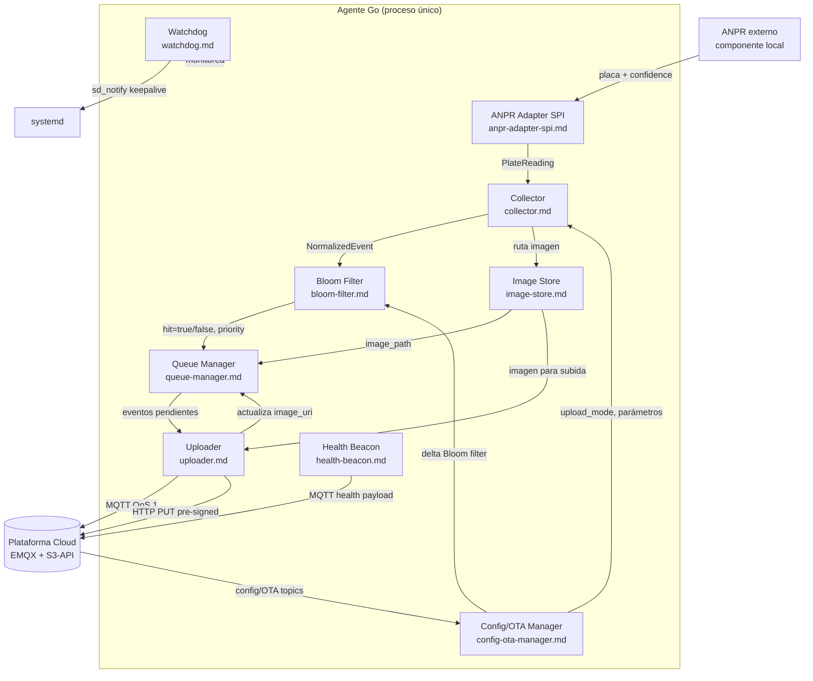

# Agente de Borde — Visión General

**Componente:** Agente Go — proceso único en dispositivo de borde  
**Versión del documento:** 1.0  
**Referencia arquitectural:** [Propuesta de Arquitectura §2.3](../propuesta-arquitectura-hurto-vehiculos.md#23-diagrama-del-agente-de-borde)

---

## 1. Propósito

El agente de borde es el proceso Go que corre en cada dispositivo de captura de tránsito. Actúa como el punto de integración entre el hardware local (cámara + ANPR + GPS + GSM) y la plataforma cloud, garantizando la **captura, normalización, persistencia y transmisión confiable** de eventos de matrícula incluso ante cortes de energía de hasta 1 hora y fallas de conectividad de hasta 4 horas.

El agente se distribuye como un único **binario estático Go** (~30 MB) gestionado como servicio systemd. No requiere runtime externo ni contenedor.

---

## 2. Ciclo de Vida del Proceso

### 2.1 Arranque

1. **Carga de configuración.** Lee `/etc/agent/config.toml` y variables de entorno (ver [Config/OTA Manager](./config-ota-manager.md)). Valida campos obligatorios (`device_id`, `country_code`, rutas de certificados mTLS).
2. **Apertura de la base SQLite.** Aplica `PRAGMA journal_mode=WAL` y `PRAGMA synchronous=NORMAL`. Retoma eventos no confirmados (ver [Queue Manager](./queue-manager.md)).
3. **Carga del Bloom filter.** Intenta leer el archivo binario del filtro desde disco. Si está ausente o corrupto, entra en modo degradado (ver [Bloom Filter](./bloom-filter.md) y CR-05).
4. **Inicio del Watchdog interno.** El hilo principal registra su goroutine de keepalive hacia systemd vía `sd_notify` (ver [Watchdog](./watchdog.md)).
5. **Conexión al ANPR local.** El ANPR Adapter SPI inicia la implementación configurada (REST, socket UNIX, watch file o named pipe) y ejecuta el ciclo de reconexión con backoff exponencial (ver [ANPR Adapter SPI](./anpr-adapter-spi.md)).
6. **Sesión MQTT persistente.** El Uploader establece la sesión MQTT 5 con el broker EMQX usando mTLS. El Health Beacon y el Config/OTA Manager se suscriben a sus topics respectivos.
7. **Listo para operación.** El agente emite `READY=1` a systemd y comienza el ciclo de captura.

### 2.2 Operación Normal

El agente opera de forma continua hasta recibir señal de terminación. Cada captura sigue el flujo descrito en la sección 3.

### 2.3 Apagado Ordenado

Al recibir `SIGTERM` (emitido por systemd al detener el servicio):

1. El ANPR Adapter cierra la conexión al componente ANPR.
2. El Collector termina de procesar el evento en curso (si existe).
3. El Queue Manager cierra la base SQLite con `PRAGMA wal_checkpoint(TRUNCATE)`.
4. El Uploader cierra la sesión MQTT con `CleanSession=false` (la sesión persiste en el broker).
5. El proceso termina con código 0.

### 2.4 Terminación Abrupta (corte de energía)

Al recuperar energía, el arranque (§2.1) retoma todos los eventos en estado `pending` o `in_flight` desde la SQLite WAL. No se pierde ningún evento que haya completado la escritura en disco. Tiempo máximo de recuperación desde arranque del sistema hasta primer evento transmitido: **< 30 segundos** en hardware de referencia (CA-12).

---

## 3. Diagrama de Flujo de Datos Interno

El siguiente diagrama muestra el flujo de datos entre los ocho subsistemas del agente para el camino normal de captura y transmisión.

**Flujo principal (camino caliente):**

1. El **ANPR Adapter SPI** recibe la lectura de placa del componente ANPR local y la normaliza al tipo `PlateReading`.
2. El **Collector** construye el evento normalizado: adjunta GPS, timestamps dual y genera el `event_id` (UUID v5).
3. El **Bloom Filter** evalúa si la placa está en la lista de vehículos hurtados del país; determina prioridad (`HIGH` si hay hit).
4. El **Queue Manager** persiste el evento en SQLite WAL antes de cualquier transmisión.
5. El **Image Store** almacena la imagen capturada en el filesystem local y notifica la ruta al Queue Manager.
6. El **Uploader** lee eventos de la cola, obtiene URL pre-firmada, sube la imagen y publica el evento por MQTT QoS 1.
7. El **Health Beacon** publica métricas del sistema cada 60 segundos de forma independiente.
8. El **Config/OTA Manager** recibe actualizaciones de configuración y OTA del cloud; aplica cambios de `upload_mode` y deltas del Bloom filter.
9. El **Watchdog** emite keepalive a systemd mientras el agente responde; ante hang o deadlock, systemd reinicia el proceso.

---

## 4. Restricciones de Footprint

Estas restricciones son parte de los atributos de calidad no negociables del agente (CA-13):

| Recurso | Límite | Referencia |
|---|---|---|
| Binario en disco | ~30 MB (estático, sin CGO) | CA-13 |
| RSS del proceso | < 50 MB en operación sostenida | CA-13 |
| CPU sostenida | < 5% en 2 cores bajo carga normal (1 captura / 5 s) | CA-13 |
| Almacenamiento SQLite | Alerta cuando disco libre < 500 MB | CR-02 |
| Almacenamiento imágenes | Rotación al superar 10 GB o 7 días | CA-06 |

**Estrategias de cumplimiento:**

- El binario se compila con `CGO_ENABLED=0` y `GOARCH=arm64` o `amd64` según hardware objetivo; se aplica `upx` opcional para reducir tamaño adicional.
- Las goroutines de cada subsistema se diseñan sin busy-loops; usan canales con buffer o `time.Ticker` para evitar consumo espurio de CPU.
- El Bloom filter reside en memoria (~1.2 MB para 1 M placas, fp=1%); la SQLite WAL evita escrituras síncronas costosas.
- La carga de imágenes es no-bloqueante respecto a la captura: el Image Store opera en su propia goroutine.

---

## 5. Restricciones de Resiliencia

| Escenario | Duración máxima soportada | Mecanismo |
|---|---|---|
| Sin conectividad GSM | 4 horas | Store-and-forward en SQLite; retransmisión al recuperar red |
| Sin energía eléctrica (batería) | 1 hora | SQLite WAL survives power cut; recuperación en < 30 s al arrancar |
| ANPR no disponible | Indefinida (sin captura) | Backoff exponencial; alerta en Health Beacon (`anpr_unavailable`) |
| Bloom filter ausente | Indefinida (modo degradado) | Todos los eventos con prioridad NORMAL; solicita sync al reconectar |
| Certificado mTLS vencido | Hasta rotación automática | Cola local acumula; no transmite hasta cert válido |

---

## 6. Glosario Canónico

Los siguientes términos se utilizan de forma consistente en toda la documentación del componente:

| Término | Definición |
|---|---|
| **agente de borde** | El proceso Go único que corre en el dispositivo de captura. |
| **store-and-forward** | Patrón de persistencia local con retransmisión confiable: el evento se escribe en disco antes de intentar enviarlo al cloud. |
| **event_id** | Identificador idempotente del evento de captura. UUID v5 calculado sobre `device_id + plate + monotonic_timestamp`. Clave de deduplicación en el cloud. |
| **PlateReading** | Estructura Go que representa la lectura cruda del componente ANPR: matrícula, confidence score, timestamp. |
| **NormalizedEvent** | Estructura Go del evento completo después de la normalización por el Collector: incluye GPS, timestamps dual, `event_id`, prioridad y rutas de imagen. |
| **hot path** | Flujo de captura → persistencia → transmisión de metadatos por MQTT; latencia objetivo p95 < 2 s desde captura hasta alerta en cloud. |
| **cold path** | Transmisión diferida de imágenes por URL pre-firmada; no bloquea el hot path. |
| **ACL por país** | Control de acceso a topics MQTT segmentado por `country_code`; solo el agente del país puede publicar en sus propios topics. |
| **upload_mode** | Parámetro configurable remotamente: `stolen_only` (por defecto, solo hits Bloom filter) o `all` (todos los eventos). |
| **hit Bloom filter** | Coincidencia probabilística entre una placa y la lista de vehículos hurtados del país. FP ~1%. La confirmación canónica ocurre en el cloud. |
| **modo degradado** | Estado del agente cuando el Bloom filter no está disponible: opera con prioridad NORMAL para todos los eventos; no descarta eventos en `upload_mode: stolen_only`. |
| **mTLS** | Mutual TLS: autenticación bidireccional con certificado de dispositivo emitido por Vault PKI (TTL 90 días). |
| **clock_uncertain** | Campo booleano del evento que indica que el drift NTP supera el umbral configurado (por defecto 5 s) en el momento de la captura. |
| **image_unavailable** | Campo booleano del evento MQTT que indica que la imagen local fue eliminada por rotación antes de ser subida. |
| **keepalive watchdog** | Señal `sd_notify(WATCHDOG=1)` que el agente emite periódicamente a systemd para confirmar que está operativo. |
| **OTA** | Over-The-Air: actualización del binario del agente enviada desde el cloud via topic MQTT retained. |
| **cosign** | Herramienta de firma de artefactos; se usa para verificar la integridad del binario OTA antes de reemplazar el binario activo. |
| **delta Bloom filter** | Actualización incremental del filtro de placas; minimiza el tamaño de descarga frente a la sincronización completa. |

---

## 7. Referencias Cruzadas

| Documento | Contenido |
|---|---|
| [ANPR Adapter SPI](./anpr-adapter-spi.md) | Contrato Go del adapter, cuatro implementaciones, backoff de reconexión |
| [Collector](./collector.md) | Esquema del evento normalizado, algoritmo de `event_id`, timestamps dual |
| [Bloom Filter](./bloom-filter.md) | Parámetros del filtro, serialización, sync MQTT, modo degradado |
| [Queue Manager](./queue-manager.md) | Esquema SQLite, WAL, prioridades, recuperación tras corte |
| [Image Store](./image-store.md) | Estructura de directorios, convención de nombres, política de rotación |
| [Uploader](./uploader.md) | Topics MQTT, URL pre-firmada, reintentos, idempotencia |
| [Health Beacon](./health-beacon.md) | Payload de salud, topic, intervalo, compresión |
| [Config/OTA Manager](./config-ota-manager.md) | Manifiesto OTA, cosign, `upload_mode`, log de auditoría |
| [Watchdog](./watchdog.md) | Configuración systemd, criterios de keepalive, recuperación |
| [Seguridad](./security.md) | mTLS, certificados, privacidad, Ley 1581 |
| [ADRs Locales](./adr-local.md) | Decisiones SQLite WAL, MQTT keep-alive, parámetros Bloom filter |
| [Propuesta Arquitectural §2.3](../propuesta-arquitectura-hurto-vehiculos.md#23-diagrama-del-agente-de-borde) | Diagrama de contenedores del agente en contexto de la plataforma |
