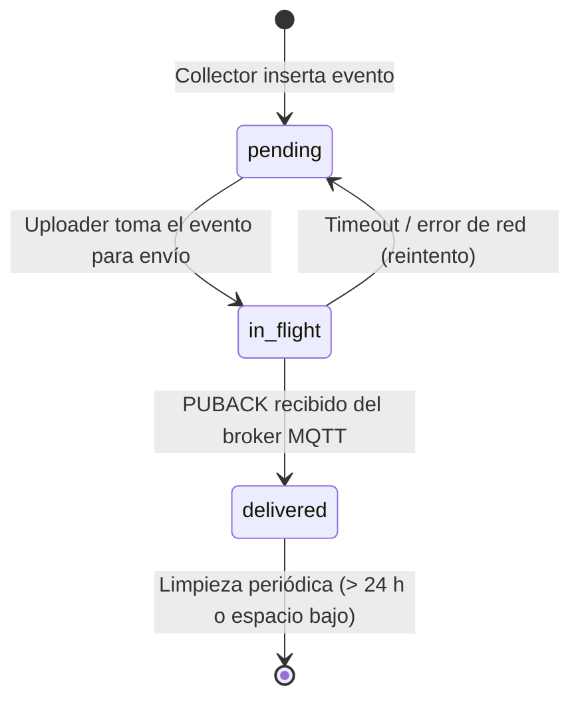
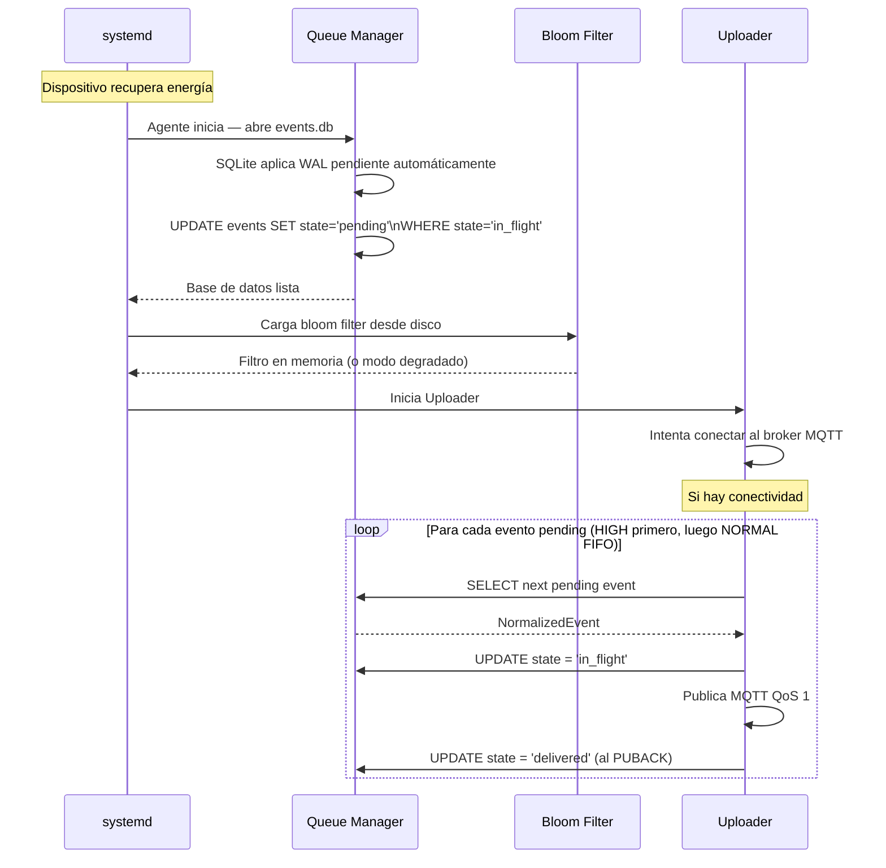
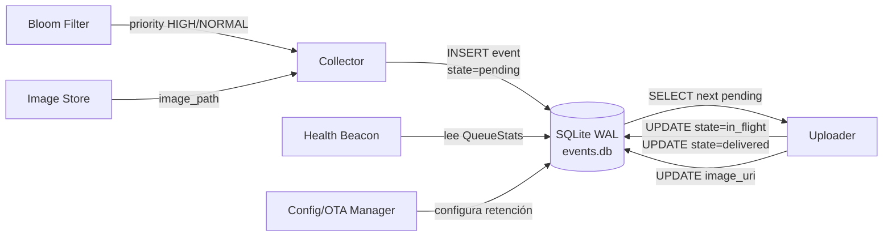

# Queue Manager

**Subsistema:** Queue Manager  
**Responsabilidad:** Persistencia confiable de eventos pendientes de transmisión; supervivencia ante cortes de energía; gestión de prioridad y orden de envío  
**Referencia arquitectural:** [Visión General](./overview.md) · [Propuesta ADR-001](../propuesta-arquitectura-hurto-vehiculos.md#adr-001--patrón-edge-first-con-store-and-forward)

---

## 1. Propósito

El Queue Manager es el núcleo del patrón **store-and-forward** del agente. Garantiza que ningún evento se pierda entre su generación por el [Collector](./collector.md) y su confirmación de entrega por el [Uploader](./uploader.md), incluso ante cortes de energía, reinicios del proceso o pérdidas de conectividad prolongadas.

Toda operación de escritura en el Queue Manager precede a cualquier intento de transmisión al cloud (CA-02).

---

## 2. Tecnología: SQLite en Modo WAL

La base de datos local es **SQLite 3** con modo WAL (Write-Ahead Logging) activado. Esta combinación ofrece:

- **Lecturas no bloqueantes durante escrituras:** el Uploader puede leer eventos de la cola mientras el Collector escribe nuevos sin contención.
- **Consistencia ante corte de energía:** el WAL garantiza que las transacciones confirmadas sobreviven a cortes abruptos. Al reiniciar, SQLite aplica automáticamente el WAL pendiente.
- **Bajo overhead:** el `synchronous=NORMAL` en modo WAL reduce las llamadas a `fsync` al mínimo necesario sin sacrificar durabilidad de las transacciones confirmadas.

### 2.1 Configuración de Pragmas

Los siguientes pragmas se aplican **en cada apertura de la base de datos** (al arrancar el agente):

```sql
PRAGMA journal_mode = WAL;
PRAGMA synchronous  = NORMAL;
PRAGMA busy_timeout = 5000;     -- 5 segundos de espera ante bloqueo (ms)
PRAGMA foreign_keys = ON;
PRAGMA auto_vacuum  = INCREMENTAL;
```

**Justificación de `synchronous=NORMAL`:**

En modo WAL con `synchronous=NORMAL`, SQLite solo llama a `fsync` al hacer un checkpoint, no en cada commit. Esto significa que en caso de corte de energía **después** de un commit pero **antes** del siguiente checkpoint, se pueden perder los últimos commits (ventana típica: < 100 ms). Para el caso de uso del agente esta pérdida es aceptable porque:

1. El evento existe en memoria del proceso hasta que el commit regresa con éxito.
2. El corte de energía que ocurre exactamente en esa ventana de < 100 ms tiene probabilidad muy baja.
3. El `event_id` idempotente permite regenerar el evento si se perdió (el componente ANPR puede haberlo re-capturado).

Si se requiere durabilidad absoluta, se puede usar `synchronous=FULL`, con el costo de ~2x en latencia de escritura. Ver [ADRs Locales](./adr-local.md).

### 2.2 Ruta del Archivo de Base de Datos

```
/var/agent/queue/events.db
/var/agent/queue/events.db-wal      ← WAL file (gestionado por SQLite)
/var/agent/queue/events.db-shm      ← shared memory file (gestionado por SQLite)
```

---

## 3. Esquema de la Tabla Principal

```sql
CREATE TABLE IF NOT EXISTS events (
    -- Identificación
    event_id        TEXT        NOT NULL PRIMARY KEY,  -- UUID v5 idempotente
    device_id       TEXT        NOT NULL,
    country_code    TEXT        NOT NULL,

    -- Prioridad y encolamiento
    priority        TEXT        NOT NULL DEFAULT 'NORMAL'
                                CHECK (priority IN ('HIGH', 'NORMAL')),
    state           TEXT        NOT NULL DEFAULT 'pending'
                                CHECK (state IN ('pending', 'in_flight', 'delivered')),

    -- Contenido
    payload_json    TEXT        NOT NULL,  -- NormalizedEvent serializado (sin campos internos)
    image_path      TEXT,                  -- Ruta local de la imagen (puede ser NULL)
    image_uri       TEXT,                  -- URI en cloud tras subida exitosa (puede ser NULL)

    -- Tiempos
    created_at      INTEGER     NOT NULL,  -- UNIX ms (wall-clock al momento de inserción)
    sent_at         INTEGER,               -- UNIX ms del último intento de envío MQTT
    delivered_at    INTEGER,               -- UNIX ms del PUBACK recibido del broker

    -- Diagnóstico
    retry_count     INTEGER     NOT NULL DEFAULT 0,
    last_error      TEXT                              -- Último mensaje de error (para diagnóstico)
);

-- Índice para la consulta del Uploader: eventos pendientes ordenados por prioridad y antigüedad
CREATE INDEX IF NOT EXISTS idx_events_queue
    ON events (state, priority DESC, created_at ASC)
    WHERE state IN ('pending', 'in_flight');

-- Índice para operaciones de limpieza: búsqueda por antigüedad
CREATE INDEX IF NOT EXISTS idx_events_created_at
    ON events (created_at ASC)
    WHERE state = 'delivered';
```

### 3.1 Descripción de Columnas

| Columna | Tipo | Descripción |
|---|---|---|
| `event_id` | TEXT PK | UUID v5 idempotente calculado por el Collector. Clave de deduplicación en el cloud. |
| `device_id` | TEXT | Identificador del dispositivo. |
| `country_code` | TEXT | Código ISO 3166-1 alpha-2 del país. |
| `priority` | TEXT | `HIGH` si hubo hit en el Bloom filter; `NORMAL` en caso contrario. |
| `state` | TEXT | Estado del ciclo de vida del evento en la cola. |
| `payload_json` | TEXT | JSON completo del `NormalizedEvent` (sin `state` ni `image_path`). |
| `image_path` | TEXT | Ruta local de la imagen. NULL si no hay imagen o ya fue eliminada. |
| `image_uri` | TEXT | URI en el object storage cloud. NULL hasta la subida exitosa. |
| `created_at` | INTEGER | Timestamp UNIX en milisegundos de la inserción. |
| `sent_at` | INTEGER | Timestamp UNIX ms del último intento de publicación MQTT. |
| `delivered_at` | INTEGER | Timestamp UNIX ms de recepción del PUBACK. |
| `retry_count` | INTEGER | Número de reintentos de envío hasta el momento. |
| `last_error` | TEXT | Último error de envío registrado (para diagnóstico y alertas). |

### 3.2 Estados del Ciclo de Vida



| Estado | Descripción |
|---|---|
| `pending` | Evento persistido, esperando ser enviado o reenviado. |
| `in_flight` | El Uploader tiene el evento en proceso de envío activo. |
| `delivered` | El broker MQTT confirmó la entrega con PUBACK. El evento puede eliminarse según política. |

**Invariante de recuperación:** Al arrancar el agente, todos los eventos en estado `in_flight` se revierten a `pending`. Esto garantiza que ningún evento queda "bloqueado" tras un reinicio abrupto (CA-12).

```sql
-- Ejecutar al arranque, antes de iniciar el Uploader:
UPDATE events SET state = 'pending', sent_at = NULL
WHERE state = 'in_flight';
```

---

## 4. Política de Prioridad FIFO con Elevación HIGH

### 4.1 Consulta de Siguiente Evento a Enviar

El Uploader solicita al Queue Manager el próximo evento a enviar mediante la siguiente consulta:

```sql
SELECT event_id, payload_json, image_path, image_uri, priority, retry_count
FROM events
WHERE state = 'pending'
ORDER BY
    CASE priority WHEN 'HIGH' THEN 0 ELSE 1 END ASC,  -- HIGH primero
    created_at ASC                                       -- FIFO dentro de cada prioridad
LIMIT 1;
```

**Semántica:**

- Los eventos `HIGH` (hits Bloom filter) siempre preceden a los eventos `NORMAL` en el orden de envío.
- Dentro de cada nivel de prioridad, el orden es FIFO estricto por `created_at`.
- Cuando se recupera conectividad tras un período offline, los eventos `HIGH` acumulados se transmiten antes que los `NORMAL`, garantizando que las alertas de vehículos hurtados lleguen al cloud con mínima latencia adicional (CA-11).

### 4.2 Transición de Estado al Enviar

```go
// Al tomar un evento para envío:
BEGIN IMMEDIATE;
UPDATE events SET state = 'in_flight', sent_at = unixEpochMs()
WHERE event_id = ? AND state = 'pending';
COMMIT;

// Al recibir PUBACK:
BEGIN IMMEDIATE;
UPDATE events SET state = 'delivered', delivered_at = unixEpochMs()
WHERE event_id = ? AND state = 'in_flight';
COMMIT;

// Al fallar el envío (timeout / error de red):
BEGIN IMMEDIATE;
UPDATE events
SET state = 'pending',
    retry_count = retry_count + 1,
    last_error = ?
WHERE event_id = ? AND state = 'in_flight';
COMMIT;
```

---

## 5. Secuencia de Recuperación tras Corte de Energía

El siguiente diagrama describe la secuencia completa de recuperación tras un corte de energía abrupto (CA-12):



**Tiempo máximo de recuperación:** Desde el arranque del sistema hasta el primer evento transmitido, el objetivo es **< 30 segundos** en hardware de referencia (CA-12). Esto incluye: arranque del SO Linux (~10 s), inicio del agente (~1 s), apertura SQLite + WAL recovery (~1 s), carga del Bloom filter (~0.5 s), establecimiento de sesión MQTT (~3 s), primera transmisión (~1 s).

---

## 6. Gestión del Almacenamiento y Alerta de Disco

### 6.1 Limpieza de Eventos Entregados

Los eventos en estado `delivered` se eliminan periódicamente mediante una goroutine de mantenimiento que corre cada 15 minutos:

```sql
-- Eliminar eventos entregados con más de 24 horas de antigüedad
DELETE FROM events
WHERE state = 'delivered'
  AND delivered_at < (unixEpochMs() - 86400000);
```

El valor de retención (24 h) es configurable vía [Config/OTA Manager](./config-ota-manager.md).

### 6.2 Umbral de Alerta de Disco

Cuando el espacio libre en el filesystem que contiene `/var/agent/queue/events.db` cae por debajo de **500 MB**, el Queue Manager:

1. Emite un log de nivel `WARN` con campo `"event": "disk_low"`.
2. Notifica al Health Beacon para incluir el flag `disk_low: true` en el próximo payload.
3. Inicia la eliminación de imágenes locales ya subidas (coordina con el [Image Store](./image-store.md)).
4. **No descarta** eventos de metadatos (`payload_json`) que aún no han sido confirmados por el broker (CR-02).

### 6.3 Consulta de Espacio en Disco

```go
func checkDiskSpace(dbPath string) (freeBytes int64, err error) {
    var stat syscall.Statfs_t
    if err := syscall.Statfs(filepath.Dir(dbPath), &stat); err != nil {
        return 0, err
    }
    return int64(stat.Bavail) * int64(stat.Bsize), nil
}
```

---

## 7. Estadísticas del Queue Manager para Health Beacon

El Queue Manager expone las siguientes métricas al [Health Beacon](./health-beacon.md):

```go
type QueueStats struct {
    PendingTotal    int `json:"pending_total"`
    PendingHigh     int `json:"pending_high"`
    PendingNormal   int `json:"pending_normal"`
    InFlight        int `json:"in_flight"`
    DeliveredLast1h int `json:"delivered_last_1h"`
    OldestPendingMs int64 `json:"oldest_pending_ms"` // antigüedad del evento pending más viejo
    DiskFreeBytes   int64 `json:"disk_free_bytes"`
    DiskLowAlert    bool  `json:"disk_low_alert"`
}
```

---

## 8. Diagrama de Interacción con Otros Subsistemas



---

## 9. Referencias Cruzadas

| Documento | Relación |
|---|---|
| [Collector](./collector.md) | Inserta `NormalizedEvent` en la cola tras normalización |
| [Bloom Filter](./bloom-filter.md) | Determina la prioridad (`HIGH`/`NORMAL`) de cada evento |
| [Image Store](./image-store.md) | Provee `image_path`; coordina eliminación ante disco bajo |
| [Uploader](./uploader.md) | Lee eventos de la cola, actualiza estado y `image_uri` |
| [Health Beacon](./health-beacon.md) | Consume `QueueStats` para el payload de salud |
| [Config/OTA Manager](./config-ota-manager.md) | Configura retención, umbral de disco y `upload_mode` |
| [Watchdog](./watchdog.md) | Al reiniciar tras watchdog, el Queue Manager revierte `in_flight` a `pending` |
| [ADRs Locales](./adr-local.md) | ADR-001 — justificación de SQLite WAL con `synchronous=NORMAL` vs `FULL` |
| [Propuesta ADR-001](../propuesta-arquitectura-hurto-vehiculos.md#adr-001--patrón-edge-first-con-store-and-forward) | Decisión de diseño de alto nivel del patrón store-and-forward |
