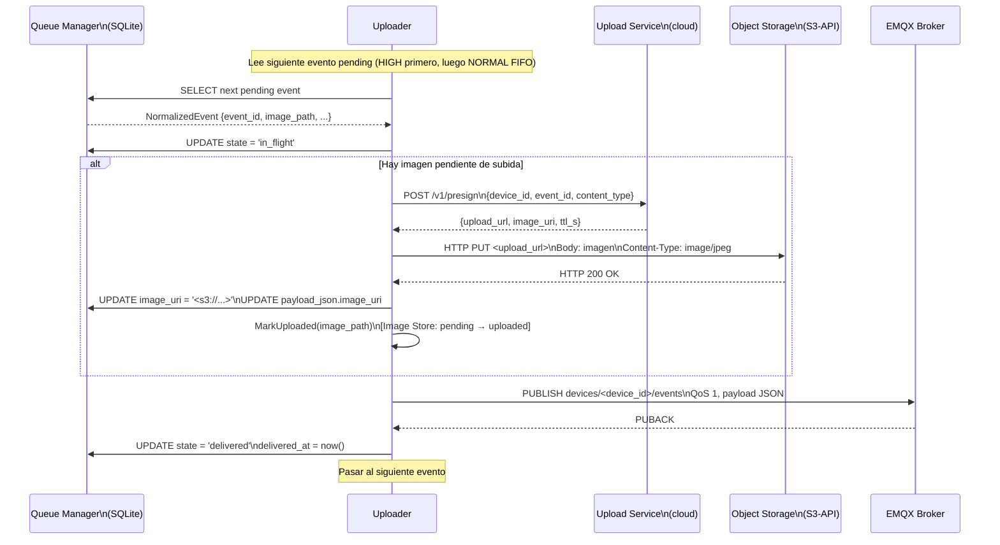

# Uploader

**Subsistema:** Uploader  
**Responsabilidad:** Transmisión de metadatos de eventos por MQTT y de imágenes por URL pre-firmada al object storage  
**Referencia arquitectural:** [Visión General](./overview.md) · [Propuesta ADR-002](../propuesta-arquitectura-hurto-vehiculos.md#adr-002--mqtt-5-como-protocolo-principal-de-telemetría) · [Propuesta ADR-003](../propuesta-arquitectura-hurto-vehiculos.md#adr-003--imágenes-vía-urls-pre-firmadas-a-object-storage)

---

## 1. Propósito

El Uploader es el único subsistema que se comunica con el cloud. Su responsabilidad es:

1. Publicar eventos de metadatos en el broker MQTT con QoS 1 y esperar la confirmación (PUBACK).
2. Obtener una URL pre-firmada del Upload Service para cada imagen y realizar el `HTTP PUT` directo al object storage S3-API.
3. Mantener el estado de cada evento en la base SQLite del [Queue Manager](./queue-manager.md) hasta la confirmación de entrega.
4. Reintentar los envíos fallidos con backoff exponencial sin duplicar eventos ya confirmados (idempotencia por `event_id`).

---

## 2. Topics MQTT de Publicación

| Topic | Contenido | QoS | Retain |
|---|---|---|---|
| `devices/<device_id>/events` | Payload JSON del `NormalizedEvent` | 1 | false |
| `devices/<device_id>/health` | Payload msgpack/CBOR del Health Beacon | 1 | false |

La variable `<device_id>` es el identificador único del dispositivo configurado en `/etc/agent/config.toml`.

**Ejemplo de topic para el dispositivo de referencia:**

```
devices/CO-BOG-DEV-00142/events
```

### 2.1 Configuración de la Sesión MQTT

El Uploader establece una sesión MQTT 5 con las siguientes propiedades:

```toml
[mqtt]
broker_url       = "mqtts://mqtt.ceiba-antihurto.io:8883"
client_id        = "CO-BOG-DEV-00142"       # == device_id; único por dispositivo
clean_start      = false                     # Sesión persistente (QoS 1 garantizado)
keep_alive_s     = 60                        # Keep-alive: 60 segundos (ADR-002)
connect_timeout_s = 10
tls_cert_path    = "/etc/agent/certs/device.crt"
tls_key_path     = "/etc/agent/certs/device.key"
tls_ca_path      = "/etc/agent/certs/ca.crt"
max_payload_bytes = 262144                   # 256 KB (ver ADRs Locales)
```

**`clean_start = false`**: Con sesión persistente, el broker EMQX retiene el estado de la sesión (mensajes no entregados con QoS 1) entre reconexiones. Esto garantiza que un mensaje publicado con QoS 1 que no recibió PUBACK sea entregado automáticamente al reconectar, sin necesidad de re-publicación por parte del agente.

---

## 3. Flujo Completo de Transmisión de un Evento

### 3.1 Diagrama de Secuencia



### 3.2 Manejo de Imagen Eliminada Antes de Subir (CR-07)

Si al intentar leer la imagen desde `image_path` el archivo no existe (eliminado por rotación):

```go
_, err := os.Stat(event.ImagePath)
if os.IsNotExist(err) {
    // Marcar en el payload: sin imagen, pero publicar el evento igualmente
    event.ImageUnavailable = true
    event.ImagePath = ""
    event.ImageURI  = ""
    log.Warn("image_unavailable_before_upload",
        "event_id", event.EventID,
        "image_path", event.ImagePath,
    )
    // Continuar con la publicación MQTT sin imagen
}
```

El evento MQTT se publica con `image_unavailable: true` y sin `image_uri`. El cloud procesa el evento de metadatos de forma independiente.

---

## 4. Obtención de URL Pre-firmada

### 4.1 Request al Upload Service

```http
POST /v1/presign HTTP/1.1
Host: upload.ceiba-antihurto.io
Authorization: Bearer <device_jwt>
Content-Type: application/json

{
  "device_id": "CO-BOG-DEV-00142",
  "event_id": "550e8400-e29b-41d4-a716-446655440000",
  "content_type": "image/jpeg",
  "file_size_bytes": 184320
}
```

### 4.2 Response del Upload Service

```json
{
  "upload_url": "https://minio.ceiba-antihurto.io/evidence-co/events/2024/05/07/550e8400.jpg?X-Amz-Signature=...",
  "image_uri": "s3://ceiba-evidence-co/events/2024/05/07/CO-BOG-DEV-00142/550e8400.jpg",
  "ttl_s": 300
}
```

| Campo | Descripción |
|---|---|
| `upload_url` | URL pre-firmada para `HTTP PUT` directo al object storage. TTL: 300 s (5 minutos). |
| `image_uri` | URI canónica de la imagen en el object storage. Se almacena en SQLite y se incluye en el payload MQTT. |
| `ttl_s` | Tiempo de vida de la URL pre-firmada en segundos. |

**TTL de la URL pre-firmada:** 300 segundos. Si el `PUT` no se completa antes de que expire la URL, el Uploader solicita una nueva URL al Upload Service antes de reintentar. No reutiliza URLs expiradas.

### 4.3 HTTP PUT al Object Storage

```http
PUT /evidence-co/events/2024/05/07/CO-BOG-DEV-00142/550e8400.jpg?X-Amz-Signature=... HTTP/1.1
Content-Type: image/jpeg
Content-Length: 184320

<binary image data>
```

El Uploader hace streaming del archivo desde disco al objeto S3 sin cargarlo completo en memoria (usa `io.Copy` con buffer de 64 KB) para respetar el límite de RSS.

---

## 5. Manejo de PUBACK y Reintentos

### 5.1 Timeout de PUBACK

El Uploader espera el PUBACK del broker MQTT durante un timeout configurable (por defecto 10 s). Si no llega en ese tiempo:

1. El evento permanece en estado `in_flight` en SQLite.
2. El Uploader inicia el backoff exponencial para el reintento.
3. Al reconectar o al expirar el backoff, el agente consulta de nuevo si el broker tiene el PUBACK pendiente en la sesión persistente (MQTT 5 session state) o re-publica el evento.

### 5.2 Algoritmo de Backoff Exponencial para MQTT

```
base_delay    = 2 s
max_delay     = 120 s
multiplier    = 2.0
jitter_factor = 0.25

delay = min(base_delay * multiplier^retry_count, max_delay)
delay += delay * random(-jitter_factor, +jitter_factor)
```

| `retry_count` | Delay base | Con jitter máximo |
|---|---|---|
| 0 | 2 s | ~2.5 s |
| 1 | 4 s | ~5 s |
| 2 | 8 s | ~10 s |
| 4 | 32 s | ~40 s |
| 6+ | 120 s (tope) | ~150 s |

El `retry_count` se persiste en la columna `retry_count` de la tabla `events` en SQLite.

### 5.3 Reconexión al Broker MQTT

El Uploader gestiona la reconexión al broker de forma independiente del ciclo de publicación. Al detectar desconexión:

1. Cierra el cliente MQTT limpiamente.
2. Ejecuta backoff exponencial (igual algoritmo que §5.2).
3. Al reconectar, reanuda el ciclo de publicación desde los eventos `pending` y `in_flight`.
4. Los eventos `in_flight` que no recibieron PUBACK se revierten a `pending` y se reintentan (el `clean_start=false` garantiza que el broker también tiene el estado de sesión).

---

## 6. Idempotencia en Reenvío

El mecanismo de deduplicación se basa en el `event_id` como clave de deduplicación:

- En el **agente**: el Queue Manager no permite dos filas con el mismo `event_id` (columna `PRIMARY KEY`). Si el Collector intenta insertar un evento con `event_id` ya existente, la operación es ignorada con `INSERT OR IGNORE`.
- En el **cloud**: el Deduplicator del pipeline Kafka usa el `event_id` como clave de estado (ver [Propuesta §3.3](../propuesta-arquitectura-hurto-vehiculos.md#33-backbone-y-procesamiento)). Eventos duplicados recibidos por el broker MQTT son filtrados antes de ser procesados.
- El agente puede re-publicar el mismo `event_id` múltiples veces (tras reintentos); el cloud siempre produce un único evento canónico con ese identificador.

---

## 7. Comportamiento en Modo Offline (CA-11)

Cuando el broker MQTT no es alcanzable:

1. El Uploader detecta la falla de conexión y activa el backoff de reconexión.
2. El Collector sigue capturando eventos y el Queue Manager los persiste en SQLite.
3. La cola puede crecer indefinidamente hasta el límite de disco (controlado por Queue Manager § 6).
4. Al recuperar conectividad, el Uploader transmite en orden de prioridad: todos los `HIGH` primero, luego los `NORMAL` en FIFO por `created_at`.
5. No se duplican eventos ya confirmados: los `delivered` permanecen marcados como tal en SQLite.

---

## 8. Validación de Certificado mTLS (CR-04)

Si el broker rechaza la conexión por certificado vencido o revocado:

1. El Uploader registra el error `"event": "mqtt_auth_failed"` con el código de error TLS.
2. La cola SQLite acumula eventos de forma local.
3. El Health Beacon incluye `cert_expired: true` en el próximo payload que pueda enviar.
4. El agente **no transmite datos** hasta que el certificado sea válido.
5. El [Config/OTA Manager](./config-ota-manager.md) puede recibir un nuevo certificado via OTA cuando se restablezca la conectividad con un certificado temporal de emergencia.

---

## 9. Referencias Cruzadas

| Documento | Relación |
|---|---|
| [Queue Manager](./queue-manager.md) | Lee eventos; actualiza `state`, `image_uri`, `retry_count` |
| [Image Store](./image-store.md) | Lee imágenes de `pending/`; llama a `MarkUploaded()` tras subida |
| [Health Beacon](./health-beacon.md) | Publica en `devices/<device_id>/health` usando la misma sesión MQTT |
| [Config/OTA Manager](./config-ota-manager.md) | Se suscribe a topics de configuración y OTA usando la misma sesión MQTT |
| [Seguridad](./security.md) | Uso del certificado mTLS de dispositivo para la sesión MQTT |
| [ADRs Locales](./adr-local.md) | ADR-002 — keep-alive 60 s, sesión persistente, tamaño máximo de payload MQTT |
| [Propuesta ADR-002](../propuesta-arquitectura-hurto-vehiculos.md#adr-002--mqtt-5-como-protocolo-principal-de-telemetría) | Decisión de MQTT 5 con QoS 1 y sesiones persistentes |
| [Propuesta ADR-003](../propuesta-arquitectura-hurto-vehiculos.md#adr-003--imágenes-vía-urls-pre-firmadas-a-object-storage) | Decisión de separar imágenes del broker MQTT |
