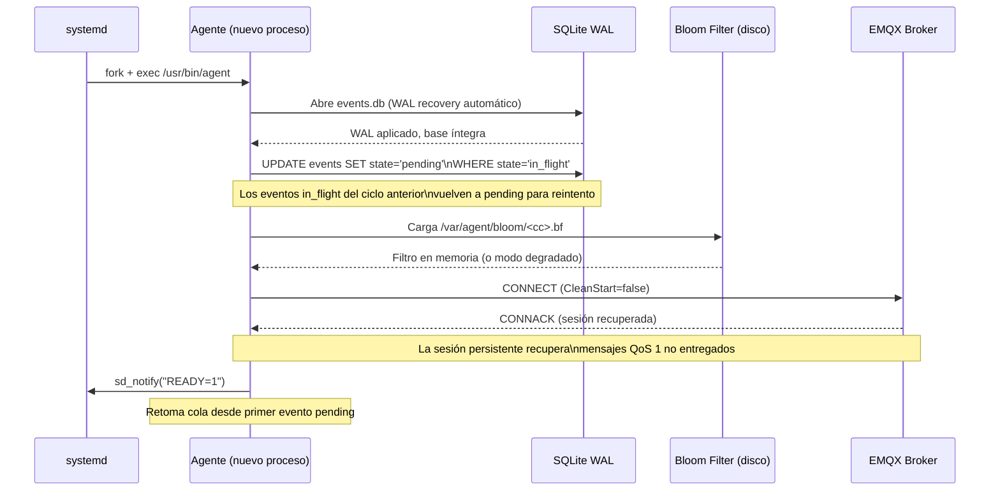

# Watchdog

**Subsistema:** Watchdog  
**Responsabilidad:** Garantizar la auto-recuperación del agente ante hangs, deadlocks o consumo anómalo de recursos  
**Referencia arquitectural:** [Visión General](./overview.md) · [Propuesta §3.1](../propuesta-arquitectura-hurto-vehiculos.md#31-borde)

---

## 1. Propósito

El Watchdog integra el agente con el mecanismo de watchdog de **systemd**, asegurando que ante cualquier condición de falla irrecuperable (hang, deadlock, OOM), el proceso sea reiniciado automáticamente y el agente retome el procesamiento de la cola SQLite sin pérdida de datos.

El watchdog opera en dos niveles:

1. **Nivel systemd (externo):** systemd reinicia el proceso si no recibe keepalive en el intervalo configurado.
2. **Nivel interno (goroutine de salud):** el agente monitorea la salud de sus goroutines internas y deja de emitir keepalive ante condiciones de falla detectadas.

---

## 2. Configuración Recomendada de systemd

El agente se instala como servicio systemd en `/etc/systemd/system/agent.service`:

```ini
[Unit]
Description=Agente Anti-Hurto de Vehículos
Documentation=https://docs.ceiba-antihurto.io/agente-borde/
After=network-online.target
Wants=network-online.target

[Service]
Type=notify
ExecStartPre=/bin/sh -c \
  'if [ -f /var/agent/ota/agent.rollback ] && \
   ! /usr/bin/agent --version-check 2>/dev/null; then \
     mv /var/agent/ota/agent.rollback /usr/bin/agent; \
     echo "ota: rollback applied"; \
   fi'
ExecStart=/usr/bin/agent --config /etc/agent/config.toml
ExecStopPost=/bin/sh -c 'echo "agent stopped at $(date -u +%Y-%m-%dT%H:%M:%SZ)" >> /var/log/agent-stops.log'

# Reinicio automático
Restart=on-failure
RestartSec=5s

# Control de ráfagas de reinicio
StartLimitInterval=120s
StartLimitBurst=5

# Watchdog de systemd
WatchdogSec=30s
NotifyAccess=main

# Límites de recursos
LimitNOFILE=65536
MemoryMax=200M

# Directorio de trabajo
WorkingDirectory=/var/agent
User=agent
Group=agent

# Seguridad adicional
PrivateTmp=true
NoNewPrivileges=true
ProtectSystem=strict
ReadWritePaths=/var/agent /etc/agent /var/log/agent-stops.log

[Install]
WantedBy=multi-user.target
```

### 2.1 Parámetros Clave

| Parámetro | Valor | Justificación |
|---|---|---|
| `WatchdogSec=30s` | 30 segundos | El agente emite keepalive cada 10 s (1/3 del WatchdogSec, según recomendación systemd). Si systemd no recibe keepalive por 30 s, envía `SIGABRT` y luego `SIGKILL` al proceso. |
| `Restart=on-failure` | on-failure | Reinicia ante cualquier salida no-cero, incluyendo la señal del watchdog. No reinicia ante `systemctl stop`. |
| `RestartSec=5s` | 5 segundos | Espera 5 s entre el fallo y el reinicio para dar tiempo al OS de liberar recursos (sockets, file descriptors). |
| `StartLimitBurst=5` | 5 reinicios | Si el agente falla más de 5 veces en 120 s, systemd detiene los reinicios automáticos y eleva una alerta. |
| `StartLimitInterval=120s` | 2 minutos | Ventana de tiempo para contar los `StartLimitBurst`. |
| `MemoryMax=200M` | 200 MB | Límite de memoria del cgroup. Si el proceso supera 200 MB, el OOM killer del kernel lo termina y systemd lo reinicia. Este límite es holgado respecto al objetivo de 50 MB RSS para detectar fugas de memoria. |
| `Type=notify` | notify | El agente emite `READY=1` via `sd_notify` al completar el arranque. Si no emite `READY=1` antes de `TimeoutStartSec` (por defecto 90 s), systemd considera el arranque fallido. |

---

## 3. Keepalive desde el Agente

El agente emite el keepalive de watchdog desde una **goroutine dedicada** que verifica la salud de los subsistemas críticos antes de cada emisión:

```go
// Package watchdog implementa la integración con el watchdog de systemd.
package watchdog

import (
    "context"
    "time"
    "github.com/coreos/go-systemd/v22/daemon"
)

// HealthChecker es la interfaz que los subsistemas deben implementar para
// participar en el ciclo de watchdog.
type HealthChecker interface {
    IsHealthy() bool
    Name() string
}

// Watchdog gestiona el keepalive hacia systemd.
type Watchdog struct {
    checkers []HealthChecker
    interval time.Duration // = WatchdogSec / 3
}

// Run es la goroutine principal del watchdog.
// Emite sd_notify(WATCHDOG=1) solo si todos los HealthCheckers reportan salud.
func (w *Watchdog) Run(ctx context.Context) {
    ticker := time.NewTicker(w.interval)
    defer ticker.Stop()

    for {
        select {
        case <-ticker.C:
            allHealthy := true
            for _, chk := range w.checkers {
                if !chk.IsHealthy() {
                    log.Error("watchdog_check_failed",
                        "subsystem", chk.Name(),
                        "action", "suppressing keepalive",
                    )
                    allHealthy = false
                    break
                }
            }
            if allHealthy {
                daemon.SdNotify(false, daemon.SdNotifyWatchdog)
            }
            // Si no es healthy: no emite keepalive.
            // systemd reiniciará el proceso tras WatchdogSec sin keepalive.

        case <-ctx.Done():
            daemon.SdNotify(false, daemon.SdNotifyStopping)
            return
        }
    }
}
```

### 3.1 Cálculo del Intervalo de Keepalive

systemd recomienda emitir el keepalive con frecuencia de `WatchdogSec / 3` para tolerancia ante retrasos esporádicos:

```
WatchdogSec       = 30 s
Intervalo emisión = 30 / 3 = 10 s
```

El agente calcula este valor en tiempo de arranque leyendo la variable de entorno `WATCHDOG_USEC` que systemd inyecta en el proceso.

---

## 4. Criterios de Emisión del Keepalive

El agente emite `WATCHDOG=1` únicamente si **todos** los siguientes criterios son verdaderos:

| Criterio | Subsistema responsable | Verificación |
|---|---|---|
| La goroutine del Collector está viva y procesando | Collector | Heartbeat interno cada 5 s |
| La goroutine del Queue Manager puede ejecutar una transacción SQLite de lectura | Queue Manager | `SELECT 1 FROM events LIMIT 1` con timeout de 1 s |
| El RSS del proceso es < 180 MB (90% del límite `MemoryMax`) | Watchdog interno | `/proc/<pid>/status VmRSS` |
| No hay goroutine bloqueada en deadlock por más de `WatchdogSec / 2` | Watchdog interno | Detector de goroutines estancadas |

### 4.1 Detector de Goroutines Estancadas

```go
// Para cada goroutine crítica, se mantiene un canal de heartbeat:
func (c *Collector) heartbeatLoop(ctx context.Context, beats chan<- struct{}) {
    ticker := time.NewTicker(5 * time.Second)
    for {
        select {
        case <-ticker.C:
            select {
            case beats <- struct{}{}:
            default: // canal lleno — ok, el watchdog ya lo leyó
            }
        case <-ctx.Done():
            return
        }
    }
}

// El watchdog verifica que cada canal recibió al menos un beat en los últimos WatchdogSec/2:
func (w *Watchdog) collectorIsHealthy() bool {
    select {
    case <-w.collectorBeats:
        return true
    case <-time.After(w.interval / 2):
        return false // sin heartbeat en el período: deadlock probable
    }
}
```

---

## 5. Criterios de No-Emisión (Condiciones que Suprimen el Keepalive)

El agente suprime el keepalive (y por tanto induce el reinicio por systemd) ante:

| Condición | Detección | Acción |
|---|---|---|
| **Hang del Collector** | Sin heartbeat de la goroutine del Collector por más de `WatchdogSec / 2` | Suprime keepalive → systemd reinicia |
| **Deadlock del Queue Manager** | Transacción SQLite de verificación no responde en 1 s | Suprime keepalive |
| **OOM inminente** | RSS > 180 MB (90% del límite cgroup) | Suprime keepalive; también hace `runtime.GC()` como último recurso |
| **Panic no recuperado en goroutine crítica** | El defer de recuperación en cada goroutine llama a `os.Exit(1)` | systemd reinicia por `Restart=on-failure` |

**Nota sobre OOM del kernel:** Si el proceso supera `MemoryMax=200M`, el kernel lo termina con `SIGKILL` directamente. systemd lo reinicia por `Restart=on-failure`. No es necesario que el agente detecte esto internamente.

---

## 6. Secuencia de Recuperación de Estado al Reiniciar

Al reiniciar tras una terminación por watchdog (o por cualquier otra causa), el agente sigue la secuencia de arranque estándar descrita en [Visión General §2.1](./overview.md#21-arranque), con los siguientes pasos específicos de recuperación:



**Tiempo objetivo de recuperación:** < 30 segundos desde el arranque del SO hasta el primer evento transmitido (CA-12).

---

## 7. Integración con OTA

Al recibir un manifiesto OTA exitoso y verificado, el [Config/OTA Manager](./config-ota-manager.md) coordina con el Watchdog para un reinicio ordenado:

1. Config/OTA Manager emite `sd_notify("STOPPING=1")` antes de solicitar el reinicio.
2. La goroutine del Watchdog deja de emitir keepalive.
3. systemd espera `TimeoutStopSec` (por defecto 10 s) para el apagado ordenado.
4. Si el proceso no termina limpiamente en ese tiempo, systemd envía `SIGKILL`.
5. systemd ejecuta el proceso nuevo con `ExecStartPre` para verificar rollback si es necesario.

---

## 8. Monitoreo Externo (Health Beacon)

El estado del watchdog se refleja en el [Health Beacon](./health-beacon.md) a través del campo `uptime_seconds`: un valor bajo o recurrentemente bajo indica reinicios frecuentes. El operador puede configurar alertas en el sistema de monitoreo cloud si `uptime_seconds` cae por debajo de un umbral (por ejemplo, < 300 s) con frecuencia.

---

## 9. Referencias Cruzadas

| Documento | Relación |
|---|---|
| [Visión General](./overview.md) | Ciclo de vida completo del agente; secuencia de arranque |
| [Queue Manager](./queue-manager.md) | Revisión de estado `in_flight` → `pending` al reiniciar |
| [Bloom Filter](./bloom-filter.md) | Recarga del filtro desde disco al reiniciar |
| [Config/OTA Manager](./config-ota-manager.md) | Coordinación del reinicio tras OTA exitoso |
| [Health Beacon](./health-beacon.md) | `uptime_seconds` como indicador de estabilidad |
| [Seguridad](./security.md) | Modo "config locked" ante tampering detectado por el watchdog |
