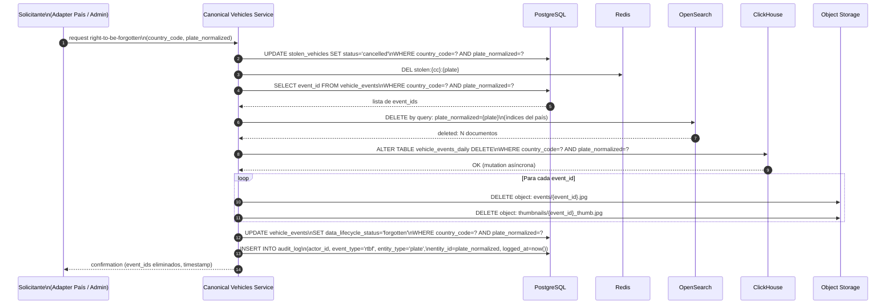

# Ciclo de Vida de Datos — Retención, Purga y Soberanía

**Componente:** Almacenamiento de lectura — gobierno de datos  
**Versión del documento:** 1.0  
**Referencia:** [postgresql-schema.md](./postgresql-schema.md) · [opensearch-ilm.md](./opensearch-ilm.md) · [clickhouse-schema.md](./clickhouse-schema.md) · [redis-schema.md](./redis-schema.md)

---

## 1. Tabla Unificada de Retención

| Almacén | Tipo de dato | Retención por defecto | Retención máxima configurable | Herramienta de automatización |
|---|---|---|---|---|
| **PostgreSQL** | `vehicle_events` (avistamientos) | 24 meses | 60 meses (regulación policial) | pg_partman (drop de partición) |
| **PostgreSQL** | `stolen_vehicles` (canónica hurtos) | Indefinida mientras status = `stolen` | N/A | Cambio de status → soft delete |
| **PostgreSQL** | `incidents` (recuperaciones) | 7 años (evidencia procesal) | 10 años | Tarea periódica con DELETE + pg_partman |
| **PostgreSQL** | `audit_log` (accesos) | 7 años (Ley 1581 / equivalentes) | 10 años | pg_partman RANGE por año |
| **OpenSearch** | `vehicle-events-{cc}-{YYYY-MM}` | 24 meses | 60 meses | ILM (política `vehicle-events-lifecycle`) |
| **ClickHouse** | `vehicle_events_daily` | 24 meses | Configurable por país con TTL | TTL de motor MergeTree |
| **ClickHouse** | `vehicle_events_h3_hourly` | Indefinida | N/A (datos agregados, bajo volumen) | Sin TTL |
| **Redis** | `stolen:{cc}:{plate}` | 24 h (TTL auto) | 24 h | TTL de Redis (automático) |
| **Redis** | Sesiones y rate-limit | 1 h / 2 min | Configurable | TTL de Redis (automático) |
| **Object Storage** | Imágenes full | 6 meses | 24 meses | S3 Lifecycle Rule |
| **Object Storage** | Thumbnails | 24 meses | 60 meses | S3 Lifecycle Rule |
| **Object Storage** | Audit log (S3 Object Lock) | 7 años | 10 años | S3 Object Lock (WORM) |

> **Retención por defecto** es la configuración de referencia. Cada país puede definir su propia política dentro de los límites legales, configurando los parámetros correspondientes en el Helm chart (ver [helm/README.md](./helm/README.md)).

---

## 2. Herramientas de Automatización por Almacén

### 2.1 PostgreSQL — pg_partman

```sql
-- Configurar mantenimiento automático (ejecutar desde cron o pg_cron)
SELECT partman.run_maintenance(p_analyze := true);

-- Ver particiones programadas para eliminación
SELECT parent_table, partition_tablename, partition_range
FROM partman.show_partitions('public.vehicle_events_co')
WHERE partition_range < now() - INTERVAL '24 months';

-- pg_partman eliminará automáticamente las particiones según p_retention
-- Configuración: p_retention = '24 months', p_retention_keep_table = false
```

### 2.2 OpenSearch — ILM

La política `vehicle-events-lifecycle` automatiza todo el ciclo de vida (ver [opensearch-ilm.md](./opensearch-ilm.md)). El índice de un mes específico se elimina automáticamente al superar 730 días desde su creación.

### 2.3 ClickHouse — TTL de Motor

```sql
-- El TTL se evalúa durante los merges automáticos de ClickHouse.
-- Para forzar la evaluación del TTL (ej. después de configurar una nueva retención):
ALTER TABLE vehicle_events_daily MATERIALIZE TTL;

-- Verificar filas próximas a vencer
SELECT
    count()         AS rows_to_expire,
    country_code
FROM vehicle_events_daily
WHERE event_ts < now() - INTERVAL 23 MONTH
GROUP BY country_code;
```

### 2.4 Redis — TTL Automático

Redis gestiona la expiración de claves automáticamente. No se requiere mantenimiento manual. Si una clave pierde su TTL (ej. después de un failover sin AOF), el proceso de recarga desde PostgreSQL la restaura (ver [redis-schema.md](./redis-schema.md) §2.5).

### 2.5 Object Storage — S3 Lifecycle Rules

```json
// Regla de lifecycle para imágenes full (retención 6 meses)
{
  "Rules": [
    {
      "ID": "expire-full-images",
      "Status": "Enabled",
      "Filter": { "Prefix": "events/" },
      "Expiration": { "Days": 180 }
    },
    {
      "ID": "expire-thumbnails",
      "Status": "Enabled",
      "Filter": { "Prefix": "thumbnails/" },
      "Expiration": { "Days": 730 }
    },
    {
      "ID": "audit-log-object-lock",
      "Status": "Enabled",
      "Filter": { "Prefix": "audit/" },
      "ObjectLockLegalHold": { "Status": "ON" }
    }
  ]
}
```

---

## 3. Flujo Right-to-Be-Forgotten

El "derecho al olvido" se aplica principalmente cuando un vehículo es removido de la lista de vehículos hurtados (recuperación o cancelación del reporte). El sistema no almacena datos de personas naturales más allá del `owner_id_hash` (HMAC del DNI), por lo que el derecho al olvido se traduce en la eliminación de los datos del vehículo.

### 3.1 Diagrama del Flujo



### 3.2 Pasos Detallados

| Paso | Sistema | Operación | Notas |
|---|---|---|---|
| 1 | PostgreSQL `stolen_vehicles` | UPDATE status → `cancelled` | Inmediato; el vehículo deja de considerarse hurtado |
| 2 | Redis | DEL `stolen:{cc}:{plate}` | Inmediato; el Matcher Service deja de encontrar el vehículo |
| 3 | PostgreSQL `vehicle_events` | UPDATE SET `data_lifecycle_status='forgotten'` | Soft delete; los registros se retienen para auditoría pero no se proyectan en vistas nuevas (CA-19) |
| 4 | OpenSearch | DELETE by query | Elimina todos los documentos indexados del vehículo |
| 5 | ClickHouse | ALTER TABLE ... DELETE (mutation) | Asíncrono; puede tardar minutos en completarse |
| 6 | Object Storage | DELETE objetos | Elimina imágenes full y thumbnails de los eventos |
| 7 | `audit_log` | INSERT (inmutable) | Registra el ejercicio del derecho con `event_type='rtbf'`, `entity_type='plate'` y timestamp |

> **Importante:** La tabla `audit_log` es **inmutable** (append-only). El registro del ejercicio del derecho al olvido queda en el audit log de forma permanente, pero sin contener datos del propietario del vehículo (solo `plate_normalized` enmascarada y el actor del sistema que procesó la solicitud).

### 3.3 Tiempo Esperado de Completación

| Operación | Tiempo esperado |
|---|---|
| Redis DEL | < 1 ms |
| PostgreSQL DELETE (con partición) | 1–30 s según volumen |
| OpenSearch delete by query | 1–60 s según número de índices |
| ClickHouse mutation (asíncrona) | 1–30 min (mutation en background) |
| Object Storage DELETE | 1–10 min (depende del número de objetos) |
| **Total hasta confirmación** | **< 5 min** (excepto ClickHouse que continúa en background) |

---

## 4. Residencia Regional por País

El sistema soporta el despliegue de datos de un país en una región geográfica específica, cumpliendo con regulaciones de soberanía de datos (ej. Ley 1581 Colombia, LFPDPPP México).

### 4.1 Configuración

```yaml
# values-regional.yaml — ejemplo para Colombia en región sudamericana
countryIsolation:
  enabled: true
  countries:
    - code: CO
      region: sa-east-1       # AWS São Paulo / GCP southamerica-east1
      postgresql:
        endpoint: pg-co.sa-east-1.rds.amazonaws.com
      opensearch:
        endpoint: https://opensearch-co.sa-east-1.es.amazonaws.com
      clickhouse:
        cluster: clickhouse-sa-east
      redis:
        sentinel_hosts:
          - redis-co-0.sa-east-1:26379
          - redis-co-1.sa-east-1:26379
          - redis-co-2.sa-east-1:26379
```

### 4.2 Estrategia de Aislamiento por `country_code`

- **PostgreSQL:** La partición `vehicle_events_co` puede hacer `DETACH` y `ATTACH` a una instancia PostgreSQL separada en la región sudamericana. Los adapters hexagonales del `search-service` soportan múltiples conexiones por país.
- **OpenSearch:** Los índices `vehicle-events-co-*` pueden estar en un cluster OpenSearch distinto. El `search-service` enruta las queries por `country_code`.
- **ClickHouse:** El cluster ClickHouse puede tener shards en diferentes regiones; los datos de Colombia se asignan a shards en `sa-east-1`.
- **Redis:** Instancia Sentinel independiente por región para datos de alta sensibilidad.
