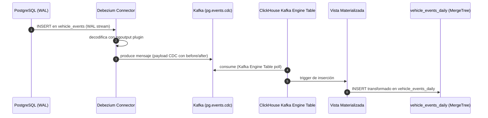

# Debezium CDC — Conector PostgreSQL → Kafka → ClickHouse

**Componente:** Almacenamiento de lectura — pipeline CDC  
**Versión del documento:** 1.0  
**Referencia:** [adr-clickhouse-ingestion.md](./adr-clickhouse-ingestion.md) · [postgresql-schema.md](./postgresql-schema.md) · [clickhouse-schema.md](./clickhouse-schema.md)

---

## 1. Propósito

El conector Debezium captura los cambios del Write-Ahead Log (WAL) de PostgreSQL y los publica como eventos Kafka en el tópico `pg.events.cdc`. ClickHouse consume ese tópico mediante una Kafka Engine Table y una vista materializada para mantener la tabla analítica `vehicle_events_daily` sincronizada con la fuente de verdad operacional.

---

## 2. Diagrama de Flujo



---

## 3. Configuración del Conector Debezium

### 3.1 Parámetros del Conector

```json
{
  "name": "debezium-vehicle-events",
  "config": {
    "connector.class": "io.debezium.connector.postgresql.PostgresConnector",
    "tasks.max": "1",

    "database.hostname": "pg-primary.antihurto.svc.cluster.local",
    "database.port": "5432",
    "database.user": "debezium_replication",
    "database.password": "${file:/opt/kafka/external-configuration/pg-credentials/password}",
    "database.dbname": "antihurto",
    "database.server.name": "antihurto-pg",

    "plugin.name": "pgoutput",
    "slot.name": "debezium_slot_events",
    "publication.name": "debezium_pub_events",
    "publication.autocreate.mode": "filtered",

    "table.include.list": "public.vehicle_events",

    "topic.prefix": "pg",
    "topic.creation.enable": "true",
    "topic.creation.default.replication.factor": "3",
    "topic.creation.default.partitions": "12",

    "transforms": "unwrap,addFields",
    "transforms.unwrap.type": "io.debezium.transforms.ExtractNewRecordState",
    "transforms.unwrap.drop.tombstones": "false",
    "transforms.unwrap.delete.handling.mode": "rewrite",
    "transforms.unwrap.add.fields": "op,source.lsn,source.ts_ms,table",
    "transforms.addFields.type": "org.apache.kafka.connect.transforms.InsertField$Value",
    "transforms.addFields.static.field": "cdc_version",
    "transforms.addFields.static.value": "1",

    "key.converter": "org.apache.kafka.connect.json.JsonConverter",
    "key.converter.schemas.enable": "false",
    "value.converter": "org.apache.kafka.connect.json.JsonConverter",
    "value.converter.schemas.enable": "false",

    "heartbeat.interval.ms": "10000",
    "snapshot.mode": "initial",
    "snapshot.locking.mode": "minimal",

    "errors.tolerance": "all",
    "errors.deadletterqueue.topic.name": "pg.events.cdc.dlq",
    "errors.deadletterqueue.topic.replication.factor": "3",
    "errors.deadletterqueue.context.headers.enable": "true"
  }
}
```

### 3.2 Publicación PostgreSQL (pgoutput)

```sql
-- Crear la publicación en PostgreSQL (ejecutar como superusuario)
CREATE PUBLICATION debezium_pub_events
    FOR TABLE public.vehicle_events;

-- Verificar la publicación
SELECT pubname, pubtables FROM pg_publication_tables
WHERE pubname = 'debezium_pub_events';
```

---

## 4. Formato del Payload CDC

Cada mensaje en el tópico `pg.events.cdc` tiene la siguiente estructura JSON (después de la transformación `ExtractNewRecordState`):

### 4.1 Ejemplo — INSERT (op = "c")

```json
{
  "event_id": "550e8400-e29b-41d4-a716-446655440000",
  "country_code": "CO",
  "device_id": "dev-co-001",
  "plate_raw": "ABC-123",
  "plate_normalized": "ABC123",
  "event_ts": "2026-05-13T14:30:00.000Z",
  "received_ts": "2026-05-13T14:30:01.234Z",
  "confidence": 97.50,
  "location": {
    "x": -74.0721,
    "y": 4.7109,
    "srid": 4326
  },
  "image_uri": "s3://antihurto-co/events/2026/05/13/550e8400.jpg",
  "thumbnail_uri": "s3://antihurto-co/events/2026/05/13/550e8400_thumb.jpg",
  "clock_uncertain": false,
  "image_unavailable": false,
  "enrichment_version": 1,
  "extensions": null,
  "created_at": "2026-05-13T14:30:01.234Z",
  "__op": "c",
  "__source_lsn": "0/1A5F230",
  "__source_ts_ms": 1747147801234,
  "__table": "vehicle_events",
  "cdc_version": "1"
}
```

### 4.2 Payload CDC Completo (before/after, sin SMT)

Para referencia interna, el payload CDC nativo de Debezium (antes de la transformación `ExtractNewRecordState`) incluye los campos `before` y `after`:

```json
{
  "schema": { "...": "..." },
  "payload": {
    "before": null,
    "after": {
      "event_id": "550e8400-e29b-41d4-a716-446655440000",
      "country_code": "CO",
      "plate_normalized": "ABC123",
      "event_ts": 1747147800000000,
      "confidence": "97.50",
      "...": "..."
    },
    "source": {
      "version": "2.7.0.Final",
      "connector": "postgresql",
      "name": "antihurto-pg",
      "ts_ms": 1747147801234,
      "snapshot": "false",
      "db": "antihurto",
      "sequence": "[\"0/1A5F118\",\"0/1A5F230\"]",
      "schema": "public",
      "table": "vehicle_events",
      "txId": 789,
      "lsn": 27521584,
      "xmin": null
    },
    "op": "c",
    "ts_ms": 1747147801500,
    "transaction": null
  }
}
```

### 4.3 Evento de DELETE (op = "d")

```json
{
  "event_id": "550e8400-e29b-41d4-a716-446655440000",
  "country_code": "CO",
  "plate_normalized": "ABC123",
  "__op": "d",
  "__source_lsn": "0/1A5F400",
  "__source_ts_ms": 1747148000000,
  "__table": "vehicle_events",
  "cdc_version": "1",
  "__deleted": "true"
}
```

> Los eventos de DELETE en `vehicle_events` son raros (solo por right-to-be-forgotten). ClickHouse los procesa marcando la fila con un flag de borrado en el motor `ReplacingMergeTree`.

---

## 5. Kafka Engine Table en ClickHouse

```sql
-- Kafka Engine Table: consumidor del tópico CDC
CREATE TABLE vehicle_events_kafka
(
    event_id            String,
    country_code        FixedString(2),
    device_id           String,
    plate_normalized    String,
    event_ts            DateTime64(3, 'UTC'),
    received_ts         DateTime64(3, 'UTC'),
    confidence          Float32,
    location_x          Float64,    -- longitud (x del WKB PostGIS)
    location_y          Float64,    -- latitud  (y del WKB PostGIS)
    image_uri           Nullable(String),
    thumbnail_uri       Nullable(String),
    clock_uncertain     UInt8,
    image_unavailable   UInt8,
    enrichment_version  UInt8,
    __op                String,
    __source_lsn        String,
    __source_ts_ms      UInt64,
    cdc_version         String
)
ENGINE = Kafka
SETTINGS
    kafka_broker_list = 'kafka-0:9092,kafka-1:9092,kafka-2:9092',
    kafka_topic_list = 'pg.events.cdc',
    kafka_group_name = 'clickhouse-cdc-consumer',
    kafka_format = 'JSONEachRow',
    kafka_num_consumers = 4,
    kafka_skip_broken_messages = 10;
```

---

## 6. Vista Materializada de Ingestión

```sql
-- Vista materializada que inserta desde la Kafka Engine Table en MergeTree
CREATE MATERIALIZED VIEW vehicle_events_cdc_mv
TO vehicle_events_daily
AS
SELECT
    toUUID(event_id)                        AS event_id,
    country_code,
    device_id,
    plate_normalized,
    toDateTime64(event_ts, 3, 'UTC')        AS event_ts,
    toDateTime64(received_ts, 3, 'UTC')     AS received_ts,
    toFloat32(confidence)                   AS confidence,
    toFloat64(location_x)                   AS lon,
    toFloat64(location_y)                   AS lat,
    geoToH3(location_x, location_y, 8)     AS h3_index_8,
    image_uri,
    thumbnail_uri,
    toUInt8(clock_uncertain)               AS clock_uncertain,
    toUInt8(image_unavailable)             AS image_unavailable,
    toUInt8(enrichment_version)            AS enrichment_version,
    __op                                    AS cdc_op,
    __source_lsn                            AS source_lsn,
    now()                                   AS ingested_at
FROM vehicle_events_kafka
WHERE __op IN ('c', 'r', 'u')  -- Ignorar deletes en la vista (manejado por ReplacingMergeTree)
;
```

---

## 7. Lag Esperado y Monitoreo

### 7.1 Estimación de Lag

| Etapa | Latencia esperada | Percentil |
|---|---|---|
| PostgreSQL INSERT → WAL commit | < 1 ms | p99 |
| WAL → Debezium decode | < 100 ms | p95 |
| Debezium → Kafka produce | < 50 ms | p95 |
| Kafka → ClickHouse consume | < 500 ms | p95 |
| **Total extremo a extremo** | **< 2 s** | p95 |
| **Pico con retraso de Kafka** | **< 5 s** | p99 |

### 7.2 Métricas de Monitoreo

```promql
# Lag del conector Debezium (segundos desde el evento hasta la producción en Kafka)
debezium_metrics_MilliSecondsBehindSource{connector="debezium-vehicle-events"} / 1000

# Tamaño del slot de replicación (bytes de WAL retenidos)
pg_replication_slot_pg_wal_lsn_diff{slot_name="debezium_slot_events"}

# Mensajes producidos por segundo
rate(debezium_metrics_NumberOfCommittedTransactions{connector="debezium-vehicle-events"}[5m])

# Tasa de errores en el conector
rate(debezium_metrics_NumberOfErrorsTotal{connector="debezium-vehicle-events"}[5m])
```

Alertas completas en [slo-observability.md](./slo-observability.md).

---

## 8. Dead-Letter Queue

El conector está configurado con `errors.tolerance=all` y `errors.deadletterqueue.topic.name=pg.events.cdc.dlq`. Los mensajes que fallan en la transformación o en la serialización se envían a este tópico con headers que incluyen el error original.

### 8.1 Runbook DLQ

```bash
# Inspeccionar mensajes en DLQ
kafka-console-consumer.sh \
  --bootstrap-server kafka-0:9092 \
  --topic pg.events.cdc.dlq \
  --from-beginning \
  --property print.headers=true \
  --max-messages 10

# Los headers incluyen:
# __connect.errors.topic = pg.events.cdc
# __connect.errors.offset = 12345
# __connect.errors.exception.message = <mensaje de error>

# Si el error es transitorio (ej. timeout de red), reiniciar el conector:
curl -X POST http://kafka-connect:8083/connectors/debezium-vehicle-events/restart?includeTasks=true
```

### 8.2 Reingestión desde DLQ

Si se acumulan mensajes en el DLQ por un error corregible (ej. cambio de schema), se puede reingestar usando un consumer/producer que lea el DLQ y publique de vuelta en `pg.events.cdc` después de la corrección.

---

## 9. Recuperación ante Pérdida del Slot

Si el slot `debezium_slot_events` es eliminado o se invalida (por ejemplo, si el disco del primario se agotó y PostgreSQL eliminó el slot para protegerse), el procedimiento es:

```bash
# 1. Detener el conector
curl -X DELETE http://kafka-connect:8083/connectors/debezium-vehicle-events

# 2. Eliminar el offset guardado en Kafka (para forzar snapshot inicial)
# Conectar al consumer group y resetear offsets:
kafka-consumer-groups.sh --bootstrap-server kafka-0:9092 \
  --group debezium-vehicle-events \
  --topic antihurto-pg.public.vehicle_events \
  --reset-offsets --to-earliest --execute

# 3. Volver a crear el conector (tomará snapshot inicial)
curl -X POST http://kafka-connect:8083/connectors \
  -H "Content-Type: application/json" \
  -d @debezium-vehicle-events.json

# 4. ClickHouse recibirá todos los eventos desde el inicio del snapshot.
# Usar ReplacingMergeTree para que los duplicados se dedupliquen en el próximo merge.
```
