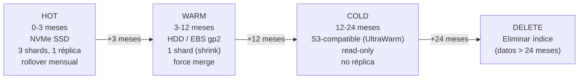

# OpenSearch — Index Lifecycle Management (ILM)

**Componente:** Almacenamiento de lectura — capa OpenSearch  
**Versión del documento:** 1.0  
**Referencia:** [opensearch-schema.md](./opensearch-schema.md) · [data-lifecycle.md](./data-lifecycle.md)

---

## 1. Propósito

La política ILM automatiza el ciclo de vida de los índices de avistamientos (`vehicle-events-{country_code}-{YYYY-MM}`), moviéndolos progresivamente desde almacenamiento caliente (acceso frecuente) hasta su eliminación al superar el periodo de retención.

---

## 2. Fases del Ciclo de Vida



| Fase | Periodo | Almacenamiento | Shards | Réplicas | Acciones |
|---|---|---|---|---|---|
| **Hot** | 0–3 meses | NVMe SSD | 3 | 1 | Rollover mensual, indexación activa |
| **Warm** | 3–12 meses | HDD / EBS gp2 | 1 (shrink) | 0 | Force merge (1 segment), read-only |
| **Cold** | 12–24 meses | S3 / UltraWarm | N/A | 0 | Read-only, migrado a UltraWarm |
| **Delete** | > 24 meses | — | — | — | Eliminar índice completo |

---

## 3. Configuración JSON de la Política ILM

```json
PUT /_plugins/_ism/policies/vehicle-events-lifecycle
{
  "policy": {
    "description": "Ciclo de vida para índices vehicle-events-{country}-{YYYY-MM}",
    "default_state": "hot",
    "states": [
      {
        "name": "hot",
        "actions": [
          {
            "rollover": {
              "min_index_age": "30d",
              "min_size": "50gb"
            }
          }
        ],
        "transitions": [
          {
            "state_name": "warm",
            "conditions": {
              "min_index_age": "90d"
            }
          }
        ]
      },
      {
        "name": "warm",
        "actions": [
          {
            "read_only": {}
          },
          {
            "shrink": {
              "num_new_shards": 1,
              "max_shard_size": "50gb"
            }
          },
          {
            "force_merge": {
              "max_num_segments": 1
            }
          },
          {
            "replica_count": {
              "number_of_replicas": 0
            }
          }
        ],
        "transitions": [
          {
            "state_name": "cold",
            "conditions": {
              "min_index_age": "365d"
            }
          }
        ]
      },
      {
        "name": "cold",
        "actions": [
          {
            "cold_migrate": {
              "timestamp_field": "event_ts"
            }
          }
        ],
        "transitions": [
          {
            "state_name": "delete",
            "conditions": {
              "min_index_age": "730d"
            }
          }
        ]
      },
      {
        "name": "delete",
        "actions": [
          {
            "delete": {}
          }
        ],
        "transitions": []
      }
    ],
    "ism_template": [
      {
        "index_patterns": ["vehicle-events-*"],
        "priority": 100
      }
    ]
  }
}
```

---

## 4. Plantillas de Índice para Rollover Automático

La plantilla de índice define el mapping y los settings que se aplican automáticamente al crear un nuevo índice que coincide con el patrón. Referencia el mapping completo de [opensearch-schema.md](./opensearch-schema.md).

```json
PUT /_index_template/vehicle-events-template
{
  "index_patterns": ["vehicle-events-*"],
  "priority": 200,
  "template": {
    "settings": {
      "number_of_shards": 3,
      "number_of_replicas": 1,
      "refresh_interval": "5s",
      "plugins.index_state_management.policy_id": "vehicle-events-lifecycle",
      "analysis": {
        "analyzer": {
          "plate_analyzer": {
            "type": "custom",
            "tokenizer": "standard",
            "filter": ["lowercase", "asciifolding", "plate_ngram"]
          }
        },
        "filter": {
          "plate_ngram": {
            "type": "ngram",
            "min_gram": 3,
            "max_gram": 7
          }
        }
      }
    },
    "mappings": {
      "dynamic": "strict",
      "properties": {
        "event_id":           { "type": "keyword" },
        "country_code":       { "type": "keyword" },
        "device_id":          { "type": "keyword" },
        "plate_raw":          { "type": "keyword" },
        "plate_normalized": {
          "type": "keyword",
          "fields": {
            "text": { "type": "text", "analyzer": "plate_analyzer" }
          }
        },
        "event_ts":           { "type": "date", "format": "strict_date_optional_time_nanos" },
        "received_ts":        { "type": "date", "format": "strict_date_optional_time_nanos" },
        "confidence":         { "type": "float" },
        "location":           { "type": "geo_point" },
        "image_uri":          { "type": "keyword", "index": false, "doc_values": false },
        "thumbnail_uri":      { "type": "keyword", "index": false, "doc_values": false },
        "clock_uncertain":    { "type": "boolean" },
        "image_unavailable":  { "type": "boolean" },
        "enrichment_version": { "type": "short" },
        "extensions":         { "type": "object", "enabled": false }
      }
    }
  }
}
```

---

## 5. Rollover Manual

El rollover automático ocurre cuando se cumple alguna condición (30 días o 50 GB). Para forzarlo manualmente (ej. antes de una operación de mantenimiento):

```bash
# Rollover del alias de Colombia
POST /vehicle-events-co/_rollover/vehicle-events-co-2026-06
{
  "conditions": {}
}

# Verificar el nuevo índice
GET /vehicle-events-co-2026-06
```

---

## 6. Runbook de Verificación y Recuperación

### 6.1 Verificar Estado de las Políticas ILM

```bash
# Verificar política asignada
GET /_plugins/_ism/policies/vehicle-events-lifecycle

# Verificar estado de todos los índices bajo la política
GET /_plugins/_ism/explain/vehicle-events-*

# Verificar el estado de un índice específico
GET /_plugins/_ism/explain/vehicle-events-co-2026-03
```

### 6.2 Diagnóstico de Índice Atascado en una Fase

```bash
# Ver el historial de errores de ISM para un índice
GET /_plugins/_ism/explain/vehicle-events-co-2026-01
# Buscar el campo "last_updated_time" y "failed_step" en la respuesta

# Reiniciar la política ISM para un índice atascado
POST /_plugins/_ism/retry/vehicle-events-co-2026-01
{
  "state": "warm"
}
```

### 6.3 Forzar Transición a Fase Delete (purga manual)

```bash
# PRECAUCIÓN: Esta operación es irreversible.
# Cambiar el estado de un índice a "delete" directamente:
POST /_plugins/_ism/change_policy/vehicle-events-co-2024-01
{
  "policy_id": "vehicle-events-lifecycle",
  "state": "delete"
}

# O eliminar directamente si el índice ya está vencido:
DELETE /vehicle-events-co-2024-01
```

### 6.4 Recuperación de Índice Eliminado Accidentalmente

Si un índice se eliminó accidentalmente y el periodo de retención no había vencido:

1. **Si hay snapshot:** restaurar desde el snapshot del repositorio S3.
2. **Si no hay snapshot:** Re-indexar desde el tópico Kafka `vehicle.events.enriched` (requiere que el tópico tenga retención suficiente configurada). Coordinar con el equipo de backbone-procesamiento.

```bash
# Restaurar desde snapshot (ejemplo)
POST /_snapshot/antihurto-s3-repo/snapshot-2026-05/_restore
{
  "indices": "vehicle-events-co-2026-03",
  "rename_pattern": "(.+)",
  "rename_replacement": "restored-$1"
}

# Verificar restauración
GET /restored-vehicle-events-co-2026-03/_count
```

---

## 7. Control de Errores 404 — Índice Eliminado por ILM (CR-04)

Cuando la política ILM elimina un índice (fase `delete`, datos > 24 meses), cualquier búsqueda directa sobre ese índice retorna un error 404 de OpenSearch. El `search-service` debe manejar este caso de forma explícita:

### 7.1 Comportamiento Esperado

| Escenario | Respuesta del search-service | Código HTTP al cliente |
|---|---|---|
| Búsqueda con filtro de fechas dentro del período de retención | Resultado normal | 200 |
| Búsqueda sobre índice en fase `cold` (12–24 meses) | Resultado lento pero válido | 200 |
| Búsqueda sobre índice eliminado (> 24 meses) | Error semántico controlado | 410 Gone |
| Búsqueda sin filtro de fecha que cubre rango parcialmente expirado | Resultado parcial con cabecera de advertencia | 206 Partial Content |

### 7.2 Detección y Respuesta Semántica

```python
# Pseudocódigo del search-service — manejo de 404 de OpenSearch
try:
    results = opensearch_client.search(index=f"vehicle-events-{country_code}-{year_month}", ...)
except opensearch.NotFoundError as e:
    if e.status_code == 404:
        raise RetentionPeriodExceededError(
            message=f"Los datos solicitados superan el período de retención de 24 meses.",
            requested_period=year_month,
            retention_months=24
        )
    raise  # Propagar otros errores 404 (índice nunca existió)
```

**Respuesta HTTP al cliente:**

```json
// HTTP 410 Gone
{
  "error": "RETENTION_PERIOD_EXCEEDED",
  "message": "Los datos del período 2024-01 superan el período de retención máximo de 24 meses.",
  "requested_period": "2024-01",
  "retention_months": 24,
  "earliest_available": "2024-04"
}
```

> **Sin fallo silencioso:** el servicio nunca retorna resultados parciales sin advertencia cuando parte del rango solicitado ha sido eliminado. Si la búsqueda abarca múltiples meses y solo algunos están expirados, se usa `HTTP 206` con la cabecera `X-Retention-Warning: partial-data-expired`.

### 7.3 Runbook — Verificar Qué Índices Existen

```bash
# Listar todos los índices activos y sus fechas de creación
GET /vehicle-events-co-*?h=index,creation.date.string,status

# Verificar el índice más antiguo disponible por país
GET /_cat/indices/vehicle-events-co-*?s=creation.date&format=json | head -1
```

---

## 8. Configuración del Repositorio de Snapshots

```json
PUT /_snapshot/antihurto-s3-repo
{
  "type": "s3",
  "settings": {
    "bucket": "antihurto-opensearch-snapshots",
    "base_path": "vehicle-events",
    "server_side_encryption": true,
    "region": "us-east-1",
    "endpoint": ""
  }
}

// Política de snapshots automáticos
PUT /_plugins/_sm/policies/vehicle-events-snapshot-policy
{
  "description": "Snapshot diario de índices vehicle-events",
  "creation": {
    "schedule": {
      "cron": {
        "expression": "0 2 * * *",
        "timezone": "UTC"
      }
    },
    "time_limit": "2h"
  },
  "deletion": {
    "schedule": {
      "cron": {
        "expression": "0 3 * * *",
        "timezone": "UTC"
      }
    },
    "condition": {
      "max_age": "30d",
      "max_count": 30
    },
    "time_limit": "1h"
  },
  "snapshot_config": {
    "repository": "antihurto-s3-repo",
    "indices": "vehicle-events-*",
    "ignore_unavailable": true,
    "include_global_state": false,
    "partial": false
  }
}
```
