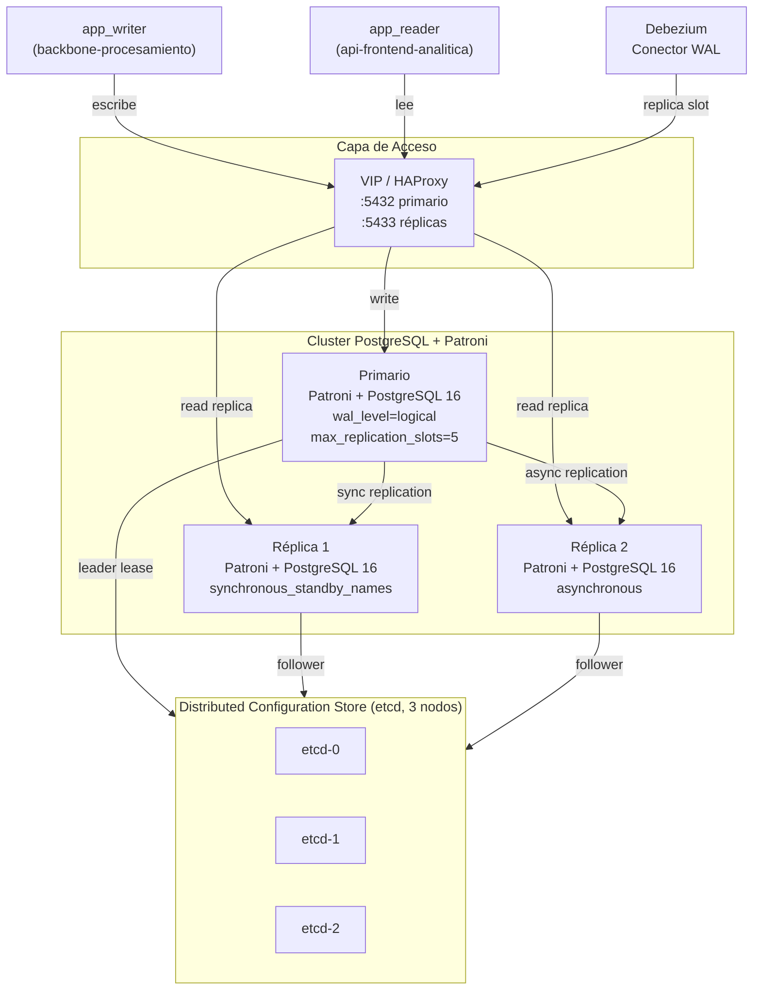

# PostgreSQL — Alta Disponibilidad

**Componente:** Almacenamiento de lectura — capa PostgreSQL  
**Versión del documento:** 1.0  
**Referencia:** [postgresql-schema.md](./postgresql-schema.md) · [debezium-cdc.md](./debezium-cdc.md) · [slo-observability.md](./slo-observability.md)

---

## 1. Objetivo de Disponibilidad

PostgreSQL debe cumplir el SLO de disponibilidad global del sistema: **99.9 % anual (≈ 8.7 h acumuladas)**. Para lograrlo, se requiere:

- Failover automático ante fallo del primario en < 30 s (RTO del almacén).
- Replicación síncrona a al menos una réplica (RPO = 0 transacciones confirmadas).
- Continuidad del conector Debezium durante el failover (reconexión automática).

---

## 2. Topología On-Prem: Patroni

Patroni es el gestor de HA para despliegues on-prem (RKE2, Rancher) o en nubes donde se prefiere control total del cluster. Utiliza un Distributed Configuration Store (DCS) como árbitro de consenso.

### 2.1 Diagrama de Topología



### 2.2 Configuración Patroni (fragmento)

```yaml
# patroni.yml — configuración de referencia
scope: antihurto-pg
name: pg-primary-0

restapi:
  listen: 0.0.0.0:8008
  connect_address: pg-primary-0:8008

etcd3:
  hosts:
    - etcd-0:2379
    - etcd-1:2379
    - etcd-2:2379

bootstrap:
  dcs:
    ttl: 30
    loop_wait: 10
    retry_timeout: 30
    maximum_lag_on_failover: 1048576  # 1 MB de lag máximo para elegir réplica en failover
    synchronous_mode: true            # Requiere confirmación de al menos 1 réplica síncrona
    synchronous_mode_strict: false    # Permite continuar si no hay réplicas síncronas disponibles

postgresql:
  listen: 0.0.0.0:5432
  connect_address: pg-primary-0:5432
  data_dir: /data/postgresql
  pg_hba:
    - host replication debezium_replication 0.0.0.0/0 md5
    - host all all 0.0.0.0/0 md5

  parameters:
    # Parámetros CDC — requeridos por Debezium
    wal_level: logical                 # Habilita decodificación lógica del WAL
    max_replication_slots: 5           # 1 para Debezium + margen para réplicas y DR
    max_wal_senders: 10                # Conexiones de replicación simultáneas
    wal_keep_size: 1024                # MB de WAL a retener (protege el slot Debezium durante lag)
    # Parámetros de rendimiento
    shared_buffers: 4GB
    effective_cache_size: 12GB
    work_mem: 64MB
    maintenance_work_mem: 1GB
    max_connections: 200
    # Parámetros de escritura
    synchronous_commit: remote_write   # Confirma cuando la réplica síncrona ha escrito (no ha fsync)
    checkpoint_completion_target: 0.9
    wal_compression: on
```

### 2.3 VIP y HAProxy

```
# haproxy.cfg — fragmento
frontend pg_write
    bind *:5432
    default_backend pg_primary

frontend pg_read
    bind *:5433
    default_backend pg_replicas

backend pg_primary
    option tcp-check
    server pg-0 pg-primary-0:5432 check port 8008  # Patroni API /primary
    server pg-1 pg-replica-1:5432 check port 8008 backup
    server pg-2 pg-replica-2:5432 check port 8008 backup

backend pg_replicas
    balance roundrobin
    option tcp-check
    server pg-1 pg-replica-1:5432 check port 8008  # Patroni API /replica
    server pg-2 pg-replica-2:5432 check port 8008
```

HAProxy consulta el endpoint REST de Patroni (`/primary`, `/replica`) para detectar el estado de cada nodo. Solo el primario responde `HTTP 200` en `/primary`; las réplicas responden `HTTP 200` en `/replica`.

---

## 3. Equivalente Gestionado: RDS Multi-AZ / CloudSQL HA

Para despliegues en AWS (RDS) o GCP (CloudSQL), la HA es gestionada por el proveedor. El mismo Helm chart de la plataforma soporta ambas opciones mediante values distintos.

### 3.1 Comparación

| Característica | Patroni on-prem | AWS RDS Multi-AZ | GCP CloudSQL HA |
|---|---|---|---|
| Failover automático | Sí (Patroni) | Sí (RDS managed) | Sí (CloudSQL managed) |
| RTO típico | 10–30 s | 60–120 s | 60–90 s |
| RPO | 0 (sync standby) | 0 (sync standby) | 0 (sync standby) |
| Control de `wal_level` | Total | Sí (parameter group) | Sí (flags) |
| Réplicas de lectura | Manual (HAProxy) | Read Replicas gestionadas | Read Replicas gestionadas |
| Replication slots | Sí | Sí (via parameter group) | Sí |
| Costo operacional | Alto (SRE) | Bajo | Bajo |
| Portabilidad | Máxima | Media (detrás de adapter) | Media (detrás de adapter) |

### 3.2 Parámetros CDC en RDS Multi-AZ

```
# AWS RDS Parameter Group — parámetros requeridos para Debezium
rds.logical_replication     = 1      # Activa wal_level=logical automáticamente
max_replication_slots       = 5
max_wal_senders             = 10
wal_sender_timeout          = 60000  # ms
```

### 3.3 Parámetros CDC en CloudSQL HA (GCP)

```
# GCP CloudSQL database flags
cloudsql.logical_decoding   = on
max_replication_slots       = 5
max_wal_senders             = 10
```

---

## 4. Mismo Helm Chart, Values Distintos

El Helm chart de PostgreSQL (`bitnami/postgresql-ha` o `crunchy-data/pgo`) se usa en todos los entornos. El modo de HA se controla por values:

```yaml
# values-pg-onprem.yaml (Patroni)
mode: patroni
patroni:
  enabled: true
  etcd:
    endpoints:
      - etcd-0:2379
      - etcd-1:2379
      - etcd-2:2379
replicaCount: 2
postgresql:
  parameters:
    wal_level: logical
    max_replication_slots: "5"
    max_wal_senders: "10"
```

```yaml
# values-pg-rds.yaml (RDS — solo configmap con connection string)
mode: external
externalDatabase:
  host: antihurto.xxxx.us-east-1.rds.amazonaws.com
  port: 5432
  user: app_writer
  existingSecret: rds-credentials
  database: antihurto
```

---

## 5. Parámetros CDC — Requerimientos de Debezium

Para que el conector Debezium funcione correctamente, el primario PostgreSQL debe tener:

| Parámetro | Valor requerido | Justificación |
|---|---|---|
| `wal_level` | `logical` | Habilita la decodificación lógica del WAL requerida por `pgoutput` |
| `max_replication_slots` | ≥ 5 | 1 para Debezium (`debezium_slot_events`) + réplicas físicas + margen |
| `max_wal_senders` | ≥ 10 | Conexiones concurrentes de replicación (Debezium + réplicas + DR) |
| `wal_keep_size` | ≥ 1024 MB | Retiene segmentos WAL mientras el slot está activo pero Debezium tiene lag |

> **Alerta operacional:** Si el slot `debezium_slot_events` acumula lag y `wal_keep_size` se agota, PostgreSQL puede retener segmentos WAL indefinidamente, consumiendo disco hasta el 100%. Esta condición tiene una alerta Prometheus configurada en [slo-observability.md](./slo-observability.md).

---

## 6. Runbook de Failover Manual

Este runbook aplica a la topología Patroni on-prem. Para RDS/CloudSQL, el failover es transparente y gestionado por el proveedor.

### 6.1 Failover Planificado (mantenimiento)

```bash
# 1. Verificar estado del cluster
patronictl -c /etc/patroni/patroni.yml list

# 2. Iniciar switchover manual (el leader actual cede al candidato)
patronictl -c /etc/patroni/patroni.yml switchover antihurto-pg \
  --master pg-primary-0 --candidate pg-replica-1 --scheduled now

# 3. Verificar que el nuevo primario está activo
patronictl -c /etc/patroni/patroni.yml list

# 4. Verificar que Debezium reconectó automáticamente
# (el conector usa el VIP de HAProxy; HAProxy ya apunta al nuevo primario)
curl http://kafka-connect:8083/connectors/debezium-vehicle-events/status | jq .connector.state
# Esperado: "RUNNING"
```

### 6.2 Failover No Planificado (caída del primario)

```bash
# Patroni detecta la caída del primario vía el DCS (etcd) en el ciclo de 10 s (loop_wait).
# El failover automático ocurre en 10-30 s sin intervención manual.

# Verificar estado post-failover
patronictl -c /etc/patroni/patroni.yml list

# Si el antiguo primario vuelve, se incorpora automáticamente como réplica.
# Si no se une en 5 minutos, forzar reinserción:
patronictl -c /etc/patroni/patroni.yml reinit antihurto-pg pg-primary-0
```

### 6.3 Verificar Integridad de Debezium Post-Failover

```bash
# 1. Verificar que el slot existe en el nuevo primario
psql -h <nuevo-primario> -U debezium_replication \
  -c "SELECT slot_name, active, restart_lsn FROM pg_replication_slots;"

# 2. Si el slot no existe (se perdió en el failover), recrear y reiniciar el conector:
# El slot se crea automáticamente cuando Debezium se conecta.
# Reiniciar el conector desde el offset guardado en Kafka:
curl -X POST http://kafka-connect:8083/connectors/debezium-vehicle-events/restart

# 3. Monitorear el lag:
curl http://kafka-connect:8083/connectors/debezium-vehicle-events/status | \
  jq '.tasks[].trace // "OK"'
```

---

## 7. Backups y PITR

| Estrategia | Herramienta | Frecuencia | Retención |
|---|---|---|---|
| Base continua | pgBackRest (on-prem) / RDS Automated Backups | Diario | 30 días |
| WAL archivado (PITR) | pgBackRest + S3-API / RDS PITR | Continuo | 30 días |
| Snapshot lógico (schema + datos críticos) | pg_dump comprimido | Semanal | 90 días |
| Keycloak PostgreSQL | pg_dump | Diario | 30 días |

> **Objetivo PITR:** recuperación a cualquier punto en los últimos 30 días con RPO en segundos.
