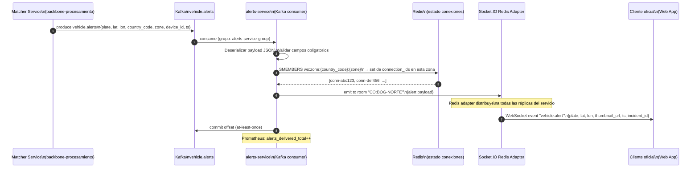

# alerts-service — Especificación

**Componente:** `api-frontend-analitica`  
**Versión del documento:** 1.0  
**OpenAPI:** [openapi/alerts-service.yaml](./openapi/alerts-service.yaml)  
**ADR de protocolo:** [adr-realtime-protocol.md](./adr-realtime-protocol.md)

---

## 1. Responsabilidad

El `alerts-service` es el gateway de distribución de alertas en tiempo real. Tiene dos responsabilidades complementarias:

1. **Consumir el tópico Kafka `vehicle.alerts`** producido por el Matcher Service y distribuir cada alerta a los oficiales conectados cuya zona coincida con la zona de la alerta.
2. **Exponer un endpoint REST** para recuperar alertas históricas (usado por la Web App al reconectarse).

---

## 2. Diagrama de Secuencia — Flujo Kafka → WebSocket



---

## 3. Schema del Tópico `vehicle.alerts`

**Nombre del tópico:** `vehicle.alerts`  
**Producido por:** Matcher Service (backbone-procesamiento)  
**Particionado por:** `country_code + zone` (hash)  
**Retención:** 7 días (suficiente para recuperación de alertas históricas)

```json
{
  "alert_id": "alrt-2026-05-13-co-abc123-001",
  "plate": "ABC-123",
  "plate_normalized": "ABC123",
  "event_id": "evt-2026-05-13-co-abc123-004",
  "country_code": "CO",
  "zone": "BOG-NORTE",
  "lat": 4.710989,
  "lon": -74.072092,
  "device_id": "dev-bog-norte-042",
  "confidence": 0.94,
  "thumbnail_url": "https://minio.anti-hurto.internal/thumbnails/2026/05/13/abc123-004.jpg?X-Amz-Expires=300&X-Amz-Signature=...",
  "vehicle_brand": "Chevrolet",
  "vehicle_color": "Rojo",
  "vehicle_model": "2019",
  "incident_id": "inc-abc123-2026-05",
  "stolen_since": "2026-04-28T09:15:00Z",
  "produced_at": "2026-05-13T14:32:08.001Z"
}
```

**Campos del payload:**

| Campo | Tipo | Descripción |
|---|---|---|
| `alert_id` | string | ID único de la alerta. |
| `plate` / `plate_normalized` | string | Matrícula cruda y normalizada. |
| `event_id` | string | Referencia al evento de avistamiento. |
| `country_code` | string | Tenant del alert. |
| `zone` | string | Zona geográfica donde se detectó. Determina a qué oficiales se enruta. |
| `lat` / `lon` | number | Coordenadas del avistamiento. |
| `device_id` | string | Dispositivo captura. |
| `confidence` | number | Confianza ANPR (0.0–1.0). |
| `thumbnail_url` | string | URL pre-firmada del thumbnail (TTL 5 min desde producción). |
| `vehicle_brand`, `vehicle_color`, `vehicle_model` | string | Datos del vehículo hurtado (de `stolen_vehicles`). |
| `incident_id` | string | ID del incidente asociado. |
| `stolen_since` | string (ISO 8601) | Fecha de hurto del vehículo. |
| `produced_at` | string (ISO 8601) | Timestamp de producción en Kafka. |

---

## 4. Endpoint REST — GET /v1/alerts

Permite recuperar alertas históricas para la zona del oficial. Usado principalmente al reconectarse.

### Parámetros

| Parámetro | Tipo | Ubicación | Requerido | Descripción |
|---|---|---|---|---|
| `since` | string (ISO 8601) | query | No | Alertas desde este timestamp. Default: 1 hora atrás. |
| `country` | string | query | No | Override de `country_code`. Solo `role=admin`. |
| `zone` | string | query | No | Filtrar por zona específica. Default: zona del token del oficial. |
| `limit` | integer | query | No | Máximo de alertas a retornar. Default: 50. Máximo: 500. Si el total supera el límite, la respuesta incluye `truncated: true`. |

### Respuesta — 200 OK

```json
{
  "data": [
    {
      "alert_id": "alrt-2026-05-13-co-abc123-001",
      "plate": "ABC123",
      "country_code": "CO",
      "zone": "BOG-NORTE",
      "lat": 4.710989,
      "lon": -74.072092,
      "device_id": "dev-bog-norte-042",
      "confidence": 0.94,
      "thumbnail_url": "https://...",
      "vehicle_brand": "Chevrolet",
      "vehicle_color": "Rojo",
      "incident_id": "inc-abc123-2026-05",
      "produced_at": "2026-05-13T14:32:08.001Z"
    }
  ],
  "total": 3,
  "since": "2026-05-13T13:32:08.001Z"
}
```

---

## 5. Estado de Conexiones WebSocket en Redis

El schema de estado de conexiones WebSocket en Redis:

```
# Información por conexión activa
ws:conn:{connection_id} → HASH {
  country_code: "CO",
  zone: "BOG-NORTE",
  officer_id: "usr-pol-001",
  connected_at: "2026-05-13T14:00:00Z"
}
TTL: 300 s (renovado por heartbeat Socket.IO cada 25 s)

# Índice inverso: zona → set de connection_ids
ws:zone:{country_code}:{zone} → SET [conn-abc123, conn-def456, ...]
TTL: 300 s (renovado al registrar/heartbeat)
```

**Operaciones Redis:**

| Operación | Comando Redis | Momento |
|---|---|---|
| Conexión | `HSET ws:conn:{id} ...` + `SADD ws:zone:CO:BOG-NORTE {id}` | Al conectar cliente WebSocket |
| Heartbeat | `EXPIRE ws:conn:{id} 300` + `EXPIRE ws:zone:CO:BOG-NORTE 300` | Cada 25 s (Socket.IO heartbeat) |
| Desconexión | `DEL ws:conn:{id}` + `SREM ws:zone:CO:BOG-NORTE {id}` | Al desconectar cliente |
| Fan-out | `SMEMBERS ws:zone:{cc}:{zone}` | Al recibir alerta de Kafka |

---

## 6. Manejo de Desconexión y Reconexión

### Desconexión del Cliente

1. Socket.IO detecta desconexión (timeout heartbeat o cierre de conexión TCP).
2. `alerts-service` elimina las claves Redis del cliente (`ws:conn:{id}`, `SREM ws:zone:...`).
3. Prometheus: `ws_disconnections_total` increments.

### Reconexión del Cliente

1. Socket.IO client intenta reconexión con exponential backoff (1 s → 2 s → 4 s → ... max 30 s).
2. Al reconectar, el cliente envía evento `authenticate` con el JWT.
3. El servidor valida el JWT y re-registra la conexión en Redis.
4. El cliente solicita alertas perdidas vía REST:
   ```
   GET /v1/alerts?since={last_received_at}&country=CO
   ```
5. Las alertas perdidas se muestran en la UI como "alertas durante desconexión".

### Socket.IO Redis Adapter para Multi-Réplica

```
# En el código del servidor (NestJS / Node.js):
import { createAdapter } from "@socket.io/redis-adapter";

const pubClient = createClient({ url: process.env.REDIS_URL });
const subClient = pubClient.duplicate();
io.adapter(createAdapter(pubClient, subClient));

# Esto permite que cualquier instancia del alerts-service
# emita a un room sin importar qué instancia tiene la conexión
io.to("CO:BOG-NORTE").emit("vehicle.alert", alertPayload);
```

Con el Redis adapter, la arquitectura de despliegue en K8s es:

```
[Kong] → [alerts-service pod 1] ─┐
       → [alerts-service pod 2] ─┼→ [Redis pub/sub] → broadcast a todos los pods
       → [alerts-service pod 3] ─┘
```

---

## 7. Puertos Hexagonales

### 7.1 `AlertsKafkaPort`

```typescript
interface AlertsKafkaPort {
  subscribe(
    topic: string,
    groupId: string,
    handler: (alert: VehicleAlert) => Promise<void>
  ): Promise<void>;
  
  commit(offset: KafkaOffset): Promise<void>;
}
```

**Adapter `KafkaAlertsAdapter`:** usa `kafkajs` para consumir `vehicle.alerts`. Semántica at-least-once (commit manual después de procesamiento exitoso).

### 7.2 `AlertsStatePort`

```typescript
interface AlertsStatePort {
  registerConnection(params: {
    connection_id: string;
    country_code: string;
    zone: string;
    officer_id: string;
  }): Promise<void>;
  
  removeConnection(connection_id: string): Promise<void>;
  
  renewConnectionTTL(connection_id: string): Promise<void>;
  
  getConnectionsByZone(country_code: string, zone: string): Promise<string[]>;
}
```

**Adapter `RedisAlertsStateAdapter`:** implementa los comandos Redis descritos en §5.

---

## 8. Métricas Prometheus

| Métrica | Tipo | Labels | Descripción |
|---|---|---|---|
| `ws_active_connections` | Gauge | `country_code` | Conexiones WebSocket activas por país. |
| `alerts_received_total` | Counter | `country_code`, `zone` | Alertas recibidas de Kafka. |
| `alerts_delivered_total` | Counter | `country_code`, `zone` | Alertas entregadas exitosamente vía WebSocket. |
| `alerts_no_subscribers_total` | Counter | `country_code`, `zone` | Alertas sin oficiales conectados en la zona. |
| `alerts_e2e_latency_seconds` | Histogram | `country_code` | Latencia desde `produced_at` en Kafka hasta emisión WebSocket. |
| `ws_disconnections_total` | Counter | `country_code`, `reason` | Desconexiones WebSocket (normal, timeout, error). |
| `kafka_consumer_lag` | Gauge | `topic`, `partition` | Lag del consumer group. SLO: < 1000 mensajes. |

---

## 9. Ejemplo de Request/Response REST

### Request

```http
GET /v1/alerts?since=2026-05-13T13:30:00Z&country=CO
Host: api.anti-hurto.internal
X-Country-Code: CO
X-Role: officer
X-Zone: BOG-NORTE
X-Trace-ID: 7c3f1a2b9d4e5f6a
```

### Response

```http
HTTP/1.1 200 OK
Content-Type: application/json
X-Trace-ID: 7c3f1a2b9d4e5f6a

{
  "data": [
    {
      "alert_id": "alrt-2026-05-13-co-abc123-001",
      "plate": "ABC123",
      "country_code": "CO",
      "zone": "BOG-NORTE",
      "lat": 4.710989,
      "lon": -74.072092,
      "device_id": "dev-bog-norte-042",
      "confidence": 0.94,
      "thumbnail_url": "https://minio.anti-hurto.internal/thumbnails/2026/05/13/abc123-004.jpg?X-Amz-Expires=300&...",
      "vehicle_brand": "Chevrolet",
      "vehicle_color": "Rojo",
      "vehicle_model": "2019",
      "incident_id": "inc-abc123-2026-05",
      "stolen_since": "2026-04-28T09:15:00Z",
      "produced_at": "2026-05-13T14:32:08.001Z"
    }
  ],
  "total": 1,
  "since": "2026-05-13T13:30:00Z"
}
```

---

## 10. Referencias

- [openapi/alerts-service.yaml](./openapi/alerts-service.yaml)
- [adr-realtime-protocol.md](./adr-realtime-protocol.md)
- [almacenamiento-lectura/redis-schema.md](../almacenamiento-lectura/redis-schema.md)
- [slo-observability.md](./slo-observability.md)
