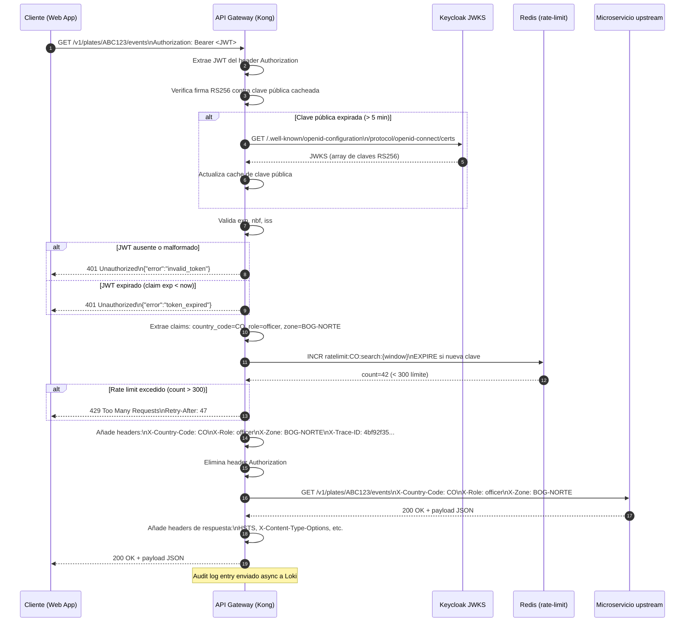

# API Gateway — Configuración Kong OSS

**Componente:** `api-frontend-analitica`  
**Versión del documento:** 1.0  
**ADR de referencia:** [ADR-GW-01 — Selección de API Gateway](./adr-api-gateway.md)

---

## 1. Visión General

El API Gateway es el **punto único de entrada** para todos los microservicios de dominio. Se despliega usando Kong OSS en **DB-less mode** (configuración declarativa via ConfigMap en K8s) con el Kong Ingress Controller (KIC).

Responsabilidades:
- Terminación TLS y HSTS.
- Validación de JWT emitidos por Keycloak (RS256, JWKS endpoint).
- Extracción y propagación de claims `country_code`, `role`, `zone` como headers HTTP.
- Rate-limiting por tenant con ventana deslizante y Redis.
- Routing por prefijo de ruta a microservicios upstream.
- CORS.
- Audit logging de requests.
- Propagación de trazas distribuidas (X-Trace-ID / OpenTelemetry).

---

## 2. Validación JWT con JWKS

### 2.1 Configuración del Plugin JWT

```yaml
# kong-plugin-jwt.yaml (KongPlugin CRD)
apiVersion: configuration.konghq.com/v1
kind: KongPlugin
metadata:
  name: jwt-keycloak
  namespace: anti-hurto
plugin: jwt
config:
  # Keycloak JWKS endpoint (realm por país)
  # El realm se determina dinámicamente por el header Host o claim iss
  key_claim_name: sub
  claims_to_verify:
    - exp
    - nbf
  # RS256 — clave pública cacheada localmente
  # Se obtiene del JWKS endpoint de Keycloak
  secret_is_base64: false
  run_on_preflight: false
```

### 2.2 Cache de Clave Pública JWKS

Kong OSS no tiene cache JWKS nativo integrado; se utiliza el plugin `openid-connect` en modo limitado o se pre-configura la clave pública RS256 por realm. La estrategia de cache:

```yaml
# kong-consumer-keycloak.yaml
# Para cada realm (país), se registra el Consumer con la clave pública RS256
# La clave se rota via CRD update (GitOps)
apiVersion: configuration.konghq.com/v1
kind: KongConsumer
metadata:
  name: keycloak-co
  namespace: anti-hurto
  annotations:
    kubernetes.io/ingress.class: kong
username: keycloak-co
credentials:
  - jwt-co-secret
---
# JWTSecret con la public key del realm CO de Keycloak
apiVersion: configuration.konghq.com/v1
kind: Secret
metadata:
  name: jwt-co-secret
  namespace: anti-hurto
  labels:
    konghq.com/credential: jwt
type: Opaque
stringData:
  kongCredType: jwt
  key: "https://keycloak.internal/realms/co"  # iss claim value
  algorithm: RS256
  rsa_public_key: |
    -----BEGIN PUBLIC KEY-----
    ... (clave RS256 del realm CO de Keycloak)
    -----END PUBLIC KEY-----
```

**TTL de cache de clave pública:** 5 minutos. Se implementa via un CronJob K8s que obtiene la clave del JWKS endpoint de Keycloak cada 5 minutos y actualiza el Secret si cambió.

### 2.3 Manejo de Fallo del JWKS Endpoint

Si el endpoint JWKS de Keycloak no responde:
- La última clave cacheada sigue siendo válida hasta expiración del Secret (configurable, default 1h).
- Si la clave expiró y JWKS no responde, el gateway rechaza requests con `503 Service Unavailable` + header `Retry-After: 30`.
- Alerta Prometheus: `gateway_jwks_cache_miss_total` > 0 durante 5 minutos activa PagerDuty.

---

## 3. Extracción y Propagación de Claims

El plugin `request-transformer` de Kong extrae claims del JWT y los propaga como headers HTTP a los microservicios upstream:

```yaml
apiVersion: configuration.konghq.com/v1
kind: KongPlugin
metadata:
  name: claims-propagation
  namespace: anti-hurto
plugin: request-transformer
config:
  add:
    headers:
      - "X-Country-Code:$(jwt_claims.country_code)"
      - "X-Role:$(jwt_claims.role)"
      - "X-Zone:$(jwt_claims.zone)"
      - "X-User-Id:$(jwt_claims.sub)"
  remove:
    headers:
      - Authorization  # no se pasa el JWT a los upstream (zero-trust interno)
```

Los microservicios de dominio **no validan JWT**. Confían en los headers `X-Country-Code`, `X-Role` y `X-Zone` para la lógica de autorización. Esta decisión simplifica los microservicios y centraliza la seguridad en el gateway.

| Header | Valor de ejemplo | Descripción |
|---|---|---|
| `X-Country-Code` | `CO` | ISO 3166-1 alpha-2. Discriminador de tenant. |
| `X-Role` | `officer` | Rol del usuario: `officer`, `analyst`, `admin`, `supervisor`, `auditor`. |
| `X-Zone` | `BOG-NORTE` | Zona geográfica del oficial (sólo para `officer` y `supervisor`). |
| `X-User-Id` | `usr-abc123` | Sub claim del JWT. Usado para audit log. |
| `X-Trace-ID` | `4bf92f3577b34da6` | OpenTelemetry trace ID inyectado por el gateway. |

---

## 4. Rate-Limiting por Tenant

### 4.1 Configuración del Plugin

```yaml
apiVersion: configuration.konghq.com/v1
kind: KongPlugin
metadata:
  name: rate-limiting-tenant
  namespace: anti-hurto
plugin: rate-limiting-advanced
config:
  limit:
    - 1000    # requests por ventana
  window_size:
    - 60      # segundos
  window_type: sliding
  identifier: consumer
  # Clave en Redis: ratelimit:{tenant}:{endpoint}:{window}
  # Ejemplo: ratelimit:CO:search:1748131200
  namespace: ratelimit
  strategy: redis
  redis:
    host: redis-master.default.svc.cluster.local
    port: 6379
    database: 1
    timeout: 2000
  sync_rate: 0.25  # sincroniza con Redis cada 250ms
  error_code: 429
  error_message: "API rate limit exceeded. See Retry-After header."
  hide_client_headers: false  # expone RateLimit-* headers al cliente
```

### 4.2 Respuesta de Rate Limit Excedido

```http
HTTP/1.1 429 Too Many Requests
Content-Type: application/json
Retry-After: 47
RateLimit-Limit: 1000
RateLimit-Remaining: 0
RateLimit-Reset: 1748131247

{
  "error": "rate_limit_exceeded",
  "message": "API rate limit exceeded. See Retry-After header.",
  "retry_after": 47
}
```

### 4.3 Límites por Endpoint

| Endpoint / Grupo | Límite (req/min) | Alcance |
|---|---|---|
| `GET /v1/plates/*` | 300 | por `X-Country-Code` |
| `GET /v1/alerts` | 600 | por `X-Country-Code` |
| `POST /v1/incidents/*` | 120 | por `X-User-Id` |
| `GET /v1/analytics/*` | 60 | por `X-Country-Code` |
| `* /v1/devices/*` | 120 | por `X-Country-Code` |
| `* /v1/vehicles/*` | 120 | por `X-Country-Code` |

---

## 5. Routing por Prefijo de Ruta

```yaml
# Kong Ingress config
apiVersion: networking.k8s.io/v1
kind: Ingress
metadata:
  name: anti-hurto-api
  namespace: anti-hurto
  annotations:
    kubernetes.io/ingress.class: kong
    konghq.com/plugins: jwt-keycloak,claims-propagation,rate-limiting-tenant,audit-log,cors
spec:
  rules:
    - host: api.anti-hurto.internal
      http:
        paths:
          - path: /v1/plates
            pathType: Prefix
            backend:
              service:
                name: search-service
                port:
                  number: 8080
          - path: /v1/alerts
            pathType: Prefix
            backend:
              service:
                name: alerts-service
                port:
                  number: 8080
          - path: /v1/incidents
            pathType: Prefix
            backend:
              service:
                name: incident-service
                port:
                  number: 8080
          - path: /v1/analytics
            pathType: Prefix
            backend:
              service:
                name: analytics-service
                port:
                  number: 8080
          - path: /v1/devices
            pathType: Prefix
            backend:
              service:
                name: devices-service
                port:
                  number: 8080
          - path: /v1/vehicles
            pathType: Prefix
            backend:
              service:
                name: vehicles-service
                port:
                  number: 8080
```

---

## 5.1 Autorización por Rol en Rutas de Escritura

Ciertas rutas requieren un rol específico además del JWT válido. Esta verificación ocurre **en el API Gateway**, antes de que el request llegue al microservicio, mediante un plugin `pre-function` de Kong con Lua.

### Configuración — Plugin de Autorización por Rol

```yaml
# kong-plugin-authz-vehicles.yaml (KongPlugin CRD)
apiVersion: configuration.konghq.com/v1
kind: KongPlugin
metadata:
  name: authz-vehicles-write
  namespace: anti-hurto
plugin: pre-function
config:
  access:
    - |
      -- Autorización de rol para rutas de escritura en /v1/vehicles
      local method = kong.request.get_method()
      if method == "POST" or method == "PATCH" or method == "DELETE" then
        local role = kong.request.get_header("X-Role")
        if role ~= "admin" then
          -- Añade contexto al audit log estructurado (enviado a Loki vía plugin http-log).
          -- La métrica gateway_authz_rejected_total se deriva en Prometheus mediante una
          -- recording rule sobre los logs de Loki con label {endpoint, required_role, actual_role}.
          kong.log.set_named_ctx("authz_rejected", {
            endpoint      = "/v1/vehicles",
            required_role = "admin",
            actual_role   = role or "none"
          })
          return kong.response.exit(403, {
            error    = "forbidden",
            message  = "This endpoint requires role=admin.",
            required_role = "admin"
          })
        end
      end
```

Este plugin se aplica **únicamente** a `vehicles-service` anotando el `Service` de Kubernetes (Kong KIC aplica los plugins declarados en la anotación del Service upstream):

```yaml
# vehicles-service Service annotation (Kong KIC)
apiVersion: v1
kind: Service
metadata:
  name: vehicles-service
  namespace: anti-hurto
  annotations:
    # Plugins globales heredados del Ingress + authz-vehicles-write exclusivo de este servicio
    konghq.com/plugins: "jwt-keycloak,claims-propagation,rate-limiting-tenant,authz-vehicles-write,audit-log,cors"
spec:
  selector:
    app: vehicles-service
  ports:
    - port: 8080
      targetPort: 8080
```

> **Nota de implementación:** Kong KIC aplica plugins a nivel de `Service` para configuraciones por-upstream. Esto es equivalente a un plugin `per-route` en Kong DB-less y es la forma canónica de aplicar plugins distintos a rutas dentro del mismo Ingress.

### Respuesta de Rechazo — 403 Forbidden

```http
HTTP/1.1 403 Forbidden
Content-Type: application/json

{
  "error": "forbidden",
  "message": "This endpoint requires role=admin.",
  "required_role": "admin"
}
```

La métrica `gateway_authz_rejected_total{endpoint="/v1/vehicles",required_role="admin",actual_role="officer"}` se incrementa por cada rechazo.

---

## 6. TLS, HSTS y CORS

### 6.1 TLS Termination

```yaml
spec:
  tls:
    - hosts:
        - api.anti-hurto.internal
      secretName: api-anti-hurto-tls  # cert-manager o Vault PKI
```

Certificado gestionado por `cert-manager` con `ClusterIssuer` apuntando a Vault PKI interno (o Let's Encrypt para ambientes cloud). TLS 1.2 mínimo; TLS 1.3 preferido.

### 6.2 HSTS

```yaml
apiVersion: configuration.konghq.com/v1
kind: KongPlugin
metadata:
  name: response-headers
plugin: response-transformer
config:
  add:
    headers:
      - "Strict-Transport-Security:max-age=31536000; includeSubDomains"
      - "X-Content-Type-Options:nosniff"
      - "X-Frame-Options:DENY"
      - "Referrer-Policy:strict-origin-when-cross-origin"
```

### 6.3 CORS

```yaml
apiVersion: configuration.konghq.com/v1
kind: KongPlugin
metadata:
  name: cors
plugin: cors
config:
  origins:
    - "https://app.anti-hurto.internal"
    - "https://admin.anti-hurto.internal"
  methods:
    - GET
    - POST
    - PATCH
    - DELETE
    - OPTIONS
  headers:
    - Accept
    - Authorization
    - Content-Type
    - X-Requested-With
  credentials: true
  max_age: 3600
  preflight_continue: false
```

---

## 7. Audit Logging

Todos los requests que pasan por el API Gateway se registran en formato JSON estructurado:

```yaml
apiVersion: configuration.konghq.com/v1
kind: KongPlugin
metadata:
  name: audit-log
plugin: http-log
config:
  http_endpoint: "http://loki-gateway.monitoring.svc.cluster.local/loki/api/v1/push"
  method: POST
  content_type: application/json
  timeout: 1000
  keepalive: 60000
  flush_timeout: 2
  retry_count: 3
```

**Formato del log de audit:**

```json
{
  "timestamp": "2026-05-13T14:32:07.123Z",
  "trace_id": "4bf92f3577b34da6a3ce929d0e0e4736",
  "method": "GET",
  "path": "/v1/plates/ABC123/events",
  "status": 200,
  "latency_ms": 187,
  "user_id": "usr-abc123",
  "country_code": "CO",
  "role": "officer",
  "zone": "BOG-NORTE",
  "ip": "10.0.1.42",
  "user_agent": "Mozilla/5.0 (Chrome/124)",
  "kong_node": "kong-pod-abc12"
}
```

---

## 8. Diagrama de Secuencia — Flujo de Autenticación y Routing



---

## 9. Métricas Prometheus

| Métrica | Tipo | Descripción |
|---|---|---|
| `gateway_requests_total{status,route,method}` | Counter | Total de requests por ruta y estado HTTP. |
| `gateway_upstream_latency_seconds{route}` | Histogram | Latencia del upstream (p50, p95, p99). |
| `gateway_auth_rejected_total{reason}` | Counter | Requests rechazados por autenticación JWT (`invalid_token`, `expired_token`, `missing_token`). |
| `gateway_authz_rejected_total{endpoint,required_role,actual_role}` | Counter | Requests rechazados por autorización de rol (403 Forbidden). Ejemplo: officer intentando escribir en `/v1/vehicles`. |
| `gateway_jwks_cache_miss_total` | Counter | Requests al JWKS endpoint de Keycloak (cache miss). |
| `gateway_ratelimit_hit_total{route,country_code}` | Counter | Requests rechazados por rate limit. |

---

## 10. Referencias

- [ADR-GW-01 — Selección de API Gateway](./adr-api-gateway.md)
- [slo-observability.md — Métricas del Gateway](./slo-observability.md)
- [helm/README.md — Instalación del Gateway](./helm/README.md)
- [ADR-011 — Multi-tenant por País](../propuesta-arquitectura-hurto-vehiculos.md#adr-011--multi-tenant-por-país-con-aislamiento-de-datos)
