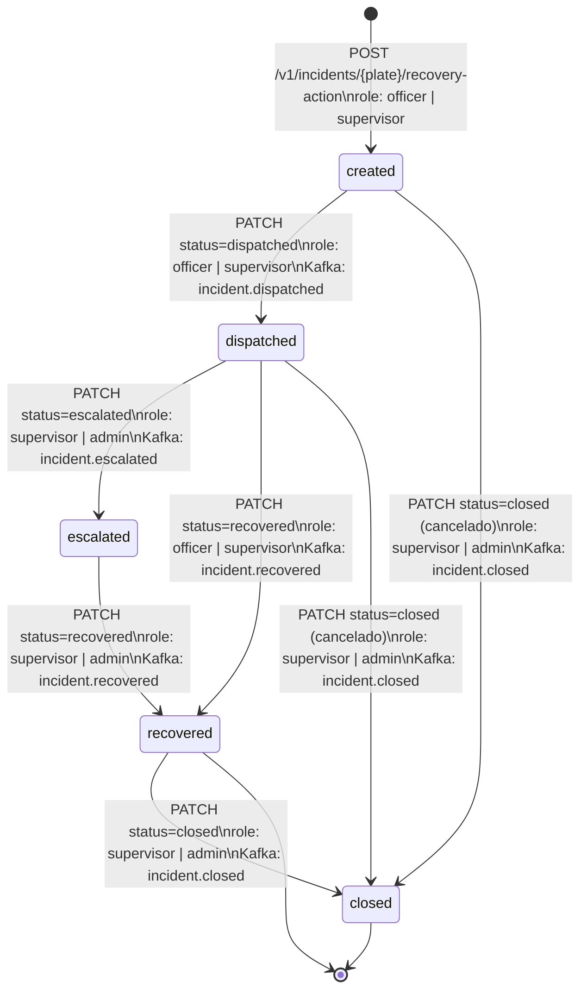

# incident-service — Especificación

**Componente:** `api-frontend-analitica`  
**Versión del documento:** 1.0  
**OpenAPI:** [openapi/incident-service.yaml](./openapi/incident-service.yaml)

---

## 1. Responsabilidad

El `incident-service` gestiona el **ciclo de vida de la recuperación de vehículos hurtados**: desde que el oficial decide actuar sobre una alerta hasta que el vehículo es recuperado y el estado se propaga al sistema del país correspondiente.

El servicio:
- Crea y gestiona incidentes asociados a matrículas hurtadas.
- Registra transiciones de estado con reglas de rol/autorización.
- Emite eventos Kafka `incident.events` para notificar al backbone.
- Propaga el estado de recuperación al adapter del país vía `CountrySyncPort` (write-back).
- Mantiene un `audit_log` inmutable de todas las acciones.

---

## 2. Diagrama de Estados del Incidente



### Transiciones Válidas

| Estado Actual | Estado Siguiente | Roles Permitidos | Descripción |
|---|---|---|---|
| — | `created` | `officer`, `supervisor` | El oficial decide actuar sobre una alerta. |
| `created` | `dispatched` | `officer`, `supervisor` | Unidad policial despachada al punto de la alerta. |
| `dispatched` | `escalated` | `supervisor`, `admin` | El caso requiere recursos adicionales. |
| `dispatched` | `recovered` | `officer`, `supervisor` | El vehículo fue recuperado en el campo. |
| `escalated` | `recovered` | `supervisor`, `admin` | El vehículo fue recuperado tras escalación. |
| `recovered` | `closed` | `supervisor`, `admin` | Caso cerrado oficialmente. |
| `created` | `closed` | `supervisor`, `admin` | Cancelación del incidente (falsa alarma). |
| `dispatched` | `closed` | `supervisor`, `admin` | Cancelación tras despacho (falsa alarma confirmada). |

---

## 3. Endpoints

### POST /v1/incidents/{plate}/recovery-action

Crea un nuevo incidente de recuperación para la matrícula especificada.

**Roles permitidos:** `officer`, `supervisor`

#### Path Parameters

| Parámetro | Tipo | Descripción |
|---|---|---|
| `plate` | string | Matrícula del vehículo. Se normaliza internamente. |

#### Request Body

```json
{
  "action": "dispatch_unit",
  "notes": "Vehículo avistado en Calle 72 con Carrera 11. Se despacha patrulla BOG-N-042.",
  "assigned_unit": "PAT-BOG-N-042",
  "location": {
    "lat": 4.710989,
    "lon": -74.072092
  }
}
```

| Campo | Tipo | Requerido | Descripción |
|---|---|---|---|
| `action` | enum | Sí | `dispatch_unit` \| `alert_only`. |
| `notes` | string | No | Notas del oficial (max 500 chars). |
| `assigned_unit` | string | No | Identificador de la unidad despachada. |
| `location` | object | No | Coordenadas del punto de despacho (útil si difiere del avistamiento). |

#### Respuesta — 201 Created

```json
{
  "incident_id": "inc-abc123-2026-05-042",
  "plate": "ABC123",
  "country_code": "CO",
  "status": "dispatched",
  "created_at": "2026-05-13T14:35:00.000Z",
  "updated_at": "2026-05-13T14:35:00.000Z",
  "created_by": "usr-pol-001",
  "assigned_unit": "PAT-BOG-N-042",
  "notes": "Vehículo avistado en Calle 72 con Carrera 11. Se despacha patrulla BOG-N-042.",
  "audit_entries": []
}
```

#### Errores

| Código | `error` | Descripción |
|---|---|---|
| 400 | `invalid_plate_format` | Matrícula inválida. |
| 401 | `unauthorized` | JWT inválido o ausente. |
| 403 | `forbidden_role` | El rol del usuario no puede crear incidentes. |
| 403 | `forbidden_country` | El vehículo pertenece a un `country_code` diferente al del usuario. |
| 409 | `incident_already_active` | Ya existe un incidente activo para esta matrícula en el país. |
| 404 | `plate_not_found` | La matrícula no existe en `stolen_vehicles`. |

---

### GET /v1/incidents/{plate}

Retorna el incidente activo (o el más reciente) para la matrícula.

**Roles permitidos:** todos.

#### Respuesta — 200 OK

```json
{
  "incident_id": "inc-abc123-2026-05-042",
  "plate": "ABC123",
  "country_code": "CO",
  "status": "dispatched",
  "created_at": "2026-05-13T14:35:00.000Z",
  "updated_at": "2026-05-13T14:36:30.000Z",
  "created_by": "usr-pol-001",
  "assigned_unit": "PAT-BOG-N-042",
  "notes": "Vehículo avistado en Calle 72 con Carrera 11.",
  "audit_entries": [
    {
      "entry_id": "aud-inc-abc123-001",
      "incident_id": "inc-abc123-2026-05-042",
      "action": "status_change",
      "from_status": "created",
      "to_status": "dispatched",
      "actor_id": "usr-pol-001",
      "actor_role": "officer",
      "timestamp": "2026-05-13T14:35:00.000Z",
      "notes": "Despacho de unidad PAT-BOG-N-042"
    }
  ]
}
```

---

### PATCH /v1/incidents/{id}/status

Actualiza el estado del incidente.

**Roles permitidos:** según tabla de transiciones de §2.

#### Path Parameters

| Parámetro | Tipo | Descripción |
|---|---|---|
| `id` | string | ID del incidente (formato `inc-{plate}-{YYYY-MM}-{seq}`). |

#### Request Body

```json
{
  "status": "recovered",
  "notes": "Vehículo recuperado en Carrera 30 con Calle 80. Sin novedad.",
  "recovery_location": {
    "lat": 4.682831,
    "lon": -74.103421
  }
}
```

| Campo | Tipo | Requerido | Descripción |
|---|---|---|---|
| `status` | enum | Sí | Nuevo estado (ver tabla de transiciones). |
| `notes` | string | No | Notas adicionales (max 500 chars). |
| `recovery_location` | object | No | Coordenadas de recuperación (obligatorio si `status=recovered`). |

#### Respuesta — 200 OK

```json
{
  "incident_id": "inc-abc123-2026-05-042",
  "plate": "ABC123",
  "country_code": "CO",
  "status": "recovered",
  "updated_at": "2026-05-13T15:10:00.000Z",
  "country_sync_status": "pending"
}
```

#### Errores

| Código | `error` | Descripción |
|---|---|---|
| 400 | `invalid_transition` | La transición de estado no es válida según las reglas de §2. |
| 400 | `recovery_location_required` | Se requieren coordenadas de recuperación para `status=recovered`. |
| 401 | `unauthorized` | JWT inválido o ausente. |
| 403 | `forbidden_transition` | El rol del usuario no puede hacer esta transición. |
| 404 | `incident_not_found` | Incidente no encontrado. |
| 409 | `incident_already_closed` | El incidente ya está cerrado. |

---

## 4. Schema `audit_log`

Cada transición de estado genera una entrada inmutable en la tabla `audit_log`:

```json
{
  "entry_id": "aud-inc-abc123-001",
  "entity_type": "incident",
  "entity_id": "inc-abc123-2026-05-042",
  "incident_id": "inc-abc123-2026-05-042",
  "plate": "ABC123",
  "country_code": "CO",
  "event_type": "STATUS_CHANGE",
  "action": "status_change",
  "from_status": "dispatched",
  "to_status": "recovered",
  "actor_id": "usr-pol-001",
  "actor_role": "officer",
  "ip_address": "10.0.1.42",
  "user_agent": "Mozilla/5.0 (Chrome/124)",
  "timestamp": "2026-05-13T15:10:00.000Z",
  "notes": "Vehículo recuperado en Carrera 30 con Calle 80.",
  "metadata": {
    "recovery_location": { "lat": 4.682831, "lon": -74.103421 },
    "assigned_unit": "PAT-BOG-N-042"
  }
}
```

La tabla `audit_log` es **append-only**: no existen operaciones UPDATE ni DELETE. Se protege mediante constraint de base de datos y política de IAM.

---

## 5. Schema del Evento Kafka `incident.events`

**Tópico:** `incident.events`  
**Particionado por:** `country_code + plate_normalized`

```json
{
  "event_type": "incident.recovered",
  "incident_id": "inc-abc123-2026-05-042",
  "plate_normalized": "ABC123",
  "country_code": "CO",
  "zone": "BOG-NORTE",
  "previous_status": "dispatched",
  "new_status": "recovered",
  "actor_id": "usr-pol-001",
  "actor_role": "officer",
  "recovery_location": {
    "lat": 4.682831,
    "lon": -74.103421
  },
  "notes": "Vehículo recuperado en Carrera 30 con Calle 80.",
  "timestamp": "2026-05-13T15:10:00.000Z"
}
```

**Tipos de evento (`event_type`):**
- `incident.created`
- `incident.dispatched`
- `incident.escalated`
- `incident.recovered`
- `incident.closed`

---

## 6. Puerto Hexagonal `CountrySyncPort`

```typescript
interface CountrySyncPort {
  notifyRecovery(params: {
    country_code: string;
    plate_normalized: string;
    incident_id: string;
    recovery_location: { lat: number; lon: number };
    recovered_at: Date;
    actor_id: string;
  }): Promise<CountrySyncResult>;
}

interface CountrySyncResult {
  supported: boolean;
  status: "success" | "pending" | "unsupported";
  external_reference?: string;
}
```

### Lógica de Write-Back

Cuando un incidente transiciona a `recovered` (ver tabla §2), el servicio invoca el write-back:

1. El `incident-service` actualiza el estado en PostgreSQL.
2. Emite el evento `incident.recovered` al tópico Kafka `incident.events`.
3. Invoca `CountrySyncPort.notifyRecovery()`.

> **Nota:** el write-back ocurre en la transición a `recovered`, no en `recovered → closed`. El cierre (`closed`) es una confirmación administrativa interna que no requiere re-notificar al sistema del país.

**Comportamiento según soporte del adapter del país:**

| Caso | Comportamiento |
|---|---|
| Adapter soporta write-back | `CountrySyncPort` envía la notificación al adapter del país. El vehículo se marca como recuperado en la BD policial. `country_sync_status: "success"`. |
| Adapter no soporta write-back | `CountrySyncPort` retorna `{supported: false, status: "unsupported"}`. El `incident-service` inserta una entrada en `audit_log` con `event_type: "WRITE_BACK_NOT_SUPPORTED"` y retorna `country_sync_status: "unsupported"` en la respuesta. No se genera error al usuario. El operador debe actualizar manualmente la BD policial. |
| Adapter falla temporalmente | `CountrySyncPort` retorna `{status: "pending"}`. Un retry job reintenta cada 5 min hasta 24 h. |

**Adapter `KafkaCountrySyncAdapter`:** publica un mensaje en el tópico `country.sync.recovery.{country_code}` que el adapter del país consume. Si el tópico no existe para ese país, retorna `unsupported`.

---

## 7. Métricas Prometheus

| Métrica | Tipo | Labels | Descripción |
|---|---|---|---|
| `incidents_created_total` | Counter | `country_code` | Incidentes creados. |
| `incidents_by_status` | Gauge | `country_code`, `status` | Incidentes activos por estado. |
| `incident_write_duration_seconds` | Histogram | `operation` | Latencia de escritura (POST, PATCH). |
| `incident_country_sync_total` | Counter | `country_code`, `status` | Resultados del write-back al país. |
| `incident_state_transition_total` | Counter | `from_status`, `to_status` | Conteo de transiciones. |

---

## 8. Referencias

- [openapi/incident-service.yaml](./openapi/incident-service.yaml)
- [almacenamiento-lectura/postgresql-schema.md](../almacenamiento-lectura/postgresql-schema.md) — tabla `incidents` y `audit_log`
- [slo-observability.md](./slo-observability.md)
- [ADR-005 — Arquitectura Hexagonal](../propuesta-arquitectura-hurto-vehiculos.md#adr-005--arquitectura-hexagonal-para-servicios-sensibles-a-la-nube)
