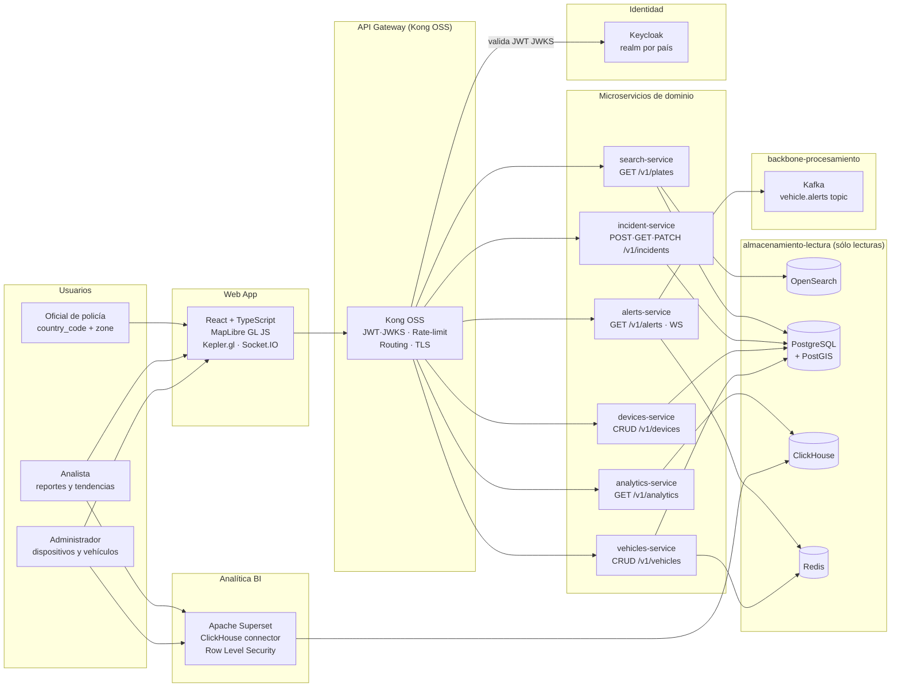

# API, Frontend y Analítica — Visión General

**Componente:** Capa de exposición de datos (Pilar 6 — Hot path / Cold path)  
**Versión del documento:** 1.0  
**Última actualización:** 2026-05-13  
**Referencia arquitectural:** [Propuesta de Arquitectura §3.6](../propuesta-arquitectura-hurto-vehiculos.md#36-api-frontend-y-analítica)  
**ADRs aplicados:** [ADR-005](../propuesta-arquitectura-hurto-vehiculos.md#adr-005--arquitectura-hexagonal-para-servicios-sensibles-a-la-nube) · [ADR-008](../propuesta-arquitectura-hurto-vehiculos.md#adr-008--cqrs-pragmático-con-eventos-como-fuente) · [ADR-011](../propuesta-arquitectura-hurto-vehiculos.md#adr-011--multi-tenant-por-país-con-aislamiento-de-datos) · [ADR-GW-01](./adr-api-gateway.md) · [ADR-RT-01](./adr-realtime-protocol.md) · [ADR-CARTO-01](./adr-cartography.md)

---

## 1. Propósito

Este componente define la **capa de exposición** del Sistema Anti-Hurto de Vehículos: el conjunto de microservicios de dominio, el API Gateway, la Web App React y la capa de analítica con Apache Superset que materializa el Pilar 6 de la propuesta — _Hot path / Cold path separados_ — desde la perspectiva de los usuarios finales.

La capa consume **únicamente** los contratos de lectura definidos en [`docs/almacenamiento-lectura/`](../almacenamiento-lectura/overview.md) (PostgreSQL+PostGIS, OpenSearch, ClickHouse, Redis) y el tópico Kafka `vehicle.alerts` producido por `backbone-procesamiento`. No escribe directamente en ningún almacén de `almacenamiento-lectura`; sus escrituras transaccionales van a PostgreSQL vía los servicios de dominio (`incident-service`, `vehicles-service`, `devices-service`).

---

## 2. Diagrama C4 Nivel 2 — Capa API / Frontend / Analítica

---

## 3. Relaciones con Capas Adyacentes

### 3.1 Lecturas desde `almacenamiento-lectura`

| Microservicio | Almacén leído | Operación |
|---|---|---|
| `search-service` | OpenSearch | Búsqueda por matrícula (exacta + fuzzy) |
| `search-service` | PostgreSQL+PostGIS | Coordenadas, metadatos y presigned URLs |
| `alerts-service` | Redis | Estado de conexiones WebSocket |
| `alerts-service` | Kafka | Consumo tópico `vehicle.alerts` |
| `incident-service` | PostgreSQL | Lectura y escritura del ciclo de vida del incidente |
| `analytics-service` | ClickHouse | Heatmaps H3, tendencias, rutas |
| `devices-service` | PostgreSQL | CRUD de dispositivos por `country_code` |
| `vehicles-service` | PostgreSQL | CRUD de `stolen_vehicles` canónico |
| `vehicles-service` | Redis | Invalidación cache `stolen:{cc}:{plate}` |

### 3.2 Evento Kafka de entrada

El `alerts-service` consume el tópico `vehicle.alerts` producido por el `Matcher Service` en `backbone-procesamiento`. El schema del payload se define en [`alerts-service.md §3`](./alerts-service.md).

### 3.3 Escrituras transaccionales

Los microservicios `incident-service`, `vehicles-service` y `devices-service` escriben en PostgreSQL. Estas escrituras son la **única fuente de mutación** en esta capa. No se escribe directamente en OpenSearch, ClickHouse ni en tópicos Kafka de backbone.

---

## 4. Tabla de SLOs por Operación

| Servicio | Operación | SLO | Percentil | Métrica Prometheus |
|---|---|---|---|---|
| `search-service` | Búsqueda por matrícula (fuzzy) | p95 < 300 ms | p95 | `search_request_duration_seconds` |
| `search-service` | Carga de trayectoria con thumbnails (≤ 50 eventos) | p95 < 800 ms | p95 | `search_trajectory_duration_seconds` |
| `alerts-service` | Latencia captura → entrega WebSocket al oficial | p95 < 2 s end-to-end | p95 | `alerts_e2e_latency_seconds` |
| `incident-service` | POST recovery-action (escritura + Kafka event) | p95 < 500 ms | p95 | `incident_write_duration_seconds` |
| `analytics-service` | Heatmap H3 país (7 días) | p95 < 3 s | p95 | `analytics_query_duration_seconds` |
| `analytics-service` | Tendencias diarias (rango 30 días) | p95 < 3 s | p95 | `analytics_query_duration_seconds` |
| `devices-service` | GET /v1/devices (paginado) | p95 < 200 ms | p95 | `devices_request_duration_seconds` |
| `vehicles-service` | GET /v1/vehicles (paginado) | p95 < 200 ms | p95 | `vehicles_request_duration_seconds` |
| API Gateway | Auth + routing overhead | p95 < 20 ms | p95 | `gateway_upstream_latency_seconds` |

---

## 5. Perfiles de Usuario y Vistas

### 5.1 Oficial de Policía

**Claims JWT:** `role=officer`, `country_code=CO`, `zone=BOG-NORTE`

| Vista | Funcionalidad |
|---|---|
| **Búsqueda por matrícula** | Ingresa placa (ej. `ABC123`) y obtiene trayectoria en mapa con cada avistamiento: fecha/hora, lugar, thumbnail del vehículo. Accede a imagen completa vía presigned URL. |
| **Alertas en vivo** | Panel WebSocket que muestra en tiempo real alertas de vehículos hurtados detectados en su zona. Sonido + notificación push. |
| **Panel de recuperación** | Despachcha unidad al último punto conocido. Marca vehículo como recuperado. Cierra el incidente. |
| **Mapa operacional** | Vista de mapa (MapLibre GL) con ubicaciones recientes de alertas activas filtradas por `zone`. |

### 5.2 Analista

**Claims JWT:** `role=analyst`, `country_code=CO`

| Vista | Funcionalidad |
|---|---|
| **Dashboard de tendencias** | Gráficas de hurtos por fecha y ciudad (últimos 30/90 días). Exportar CSV. |
| **Heatmap de zonas peligrosas** | Mapa de calor H3 con densidad de hurtos por celda hexagonal. Filtro por rango de fechas y ciudad. Powered by Kepler.gl. |
| **Rutas de escape** | Visualización de secuencias de avistamiento de vehículos hurtados (rutas más frecuentes). |
| **Superset embebido** | Acceso a dashboards BI de Apache Superset filtrados por `country_code` mediante Row Level Security. |

### 5.3 Administrador

**Claims JWT:** `role=admin`, `country_code=CO`

| Vista | Funcionalidad |
|---|---|
| **Gestión de dispositivos** | CRUD de dispositivos captura. Trigger OTA async. Estado de conectividad. |
| **Gestión de vehículos hurtados** | CRUD manual de registros en `stolen_vehicles`. Requires `role=admin`. Genera audit log entry. |
| **Configuración de zonas** | Definir/editar zonas geográficas para enrutamiento de alertas. |
| **Auditoría** | Consulta del `audit_log` de accesos a datos de placa y vehículo. |

---

## 6. ADRs Aplicados

| ADR | Decisión | Impacto en esta capa |
|---|---|---|
| **ADR-005** | Arquitectura hexagonal | Todos los puertos de acceso a almacenes están encapsulados en interfaces: `EventsIndexPort`, `EventsRepositoryPort`, `ObjectStoragePort`, `AlertsKafkaPort`, `AlertsStatePort`, `AnalyticsRepositoryPort`, `CountrySyncPort`. Adapters intercambiables por cloud. |
| **ADR-008** | CQRS pragmático | Esta capa es el lado Q (query) del CQRS. No escribe en OpenSearch ni ClickHouse. Solo lee proyecciones materializadas por `backbone-procesamiento`. |
| **ADR-011** | Multi-tenant por país | `country_code` del JWT se propaga como header `X-Country-Code` a todos los microservicios. Filtra todas las consultas. Ningún microservicio devuelve datos de otro tenant. |
| **ADR-GW-01** | Kong OSS como API Gateway | Punto único de entrada con plugins nativos para JWT/JWKS, rate-limiting Redis y routing declarativo. Ver [adr-api-gateway.md](./adr-api-gateway.md). |
| **ADR-RT-01** | WebSocket / Socket.IO | Protocolo de tiempo real para alertas con soporte de reconnection y sticky sessions / Redis adapter en K8s. Ver [adr-realtime-protocol.md](./adr-realtime-protocol.md). |
| **ADR-CARTO-01** | MapLibre GL JS + Kepler.gl | Cartografía OSS cloud-agnostic sobre tiles OSM. Ver [adr-cartography.md](./adr-cartography.md). |

---

## 7. Glosario de Componentes

| Término | Definición |
|---|---|
| **API Gateway** | Kong OSS como proxy único de entrada. Valida JWT JWKS, aplica rate-limiting por tenant, enruta por prefijo de ruta, termina TLS. |
| **search-service** | Microservicio que orquesta búsqueda de eventos por matrícula combinando OpenSearch + PostgreSQL + presigned URLs de object storage. |
| **alerts-service** | Microservicio que consume el tópico Kafka `vehicle.alerts` y distribuye alertas a los oficiales conectados via WebSocket (Socket.IO) según su zona. |
| **incident-service** | Microservicio que gestiona el ciclo de vida del incidente de recuperación: created → dispatched → escalated → recovered → closed. |
| **analytics-service** | Microservicio que expone endpoints de heatmap H3, tendencias y rutas frecuentes consultando las vistas materializadas de ClickHouse. |
| **devices-service** | Microservicio CRUD para la gestión de dispositivos captura con soporte de OTA async (HTTP 202). |
| **vehicles-service** | Microservicio CRUD para la gestión manual de `stolen_vehicles` (sólo `role=admin`). Coordina invalidación de cache Redis. |
| **Web App** | Aplicación React + TypeScript multi-tenant con módulos de búsqueda, alertas, incidentes, analítica y admin. |
| **Apache Superset** | Herramienta BI OSS conectada a ClickHouse con Row Level Security por `country_code`. |
| **EventsIndexPort** | Puerto hexagonal (ADR-005) que abstrae la consulta a OpenSearch en `search-service`. |
| **EventsRepositoryPort** | Puerto hexagonal que abstrae la consulta a PostgreSQL+PostGIS en `search-service`. |
| **ObjectStoragePort** | Puerto hexagonal que abstrae la generación de presigned URLs de object storage (S3-API / MinIO). |
| **AlertsKafkaPort** | Puerto hexagonal que abstrae el consumo del tópico Kafka `vehicle.alerts` en `alerts-service`. |
| **AlertsStatePort** | Puerto hexagonal que abstrae la persistencia de estado de conexiones WebSocket en Redis. |
| **AnalyticsRepositoryPort** | Puerto hexagonal que abstrae las consultas a ClickHouse en `analytics-service`. |
| **CountrySyncPort** | Puerto hexagonal en `incident-service` que abstrae el write-back al adapter del país cuando un vehículo es **marcado como recuperado** (`status=recovered`). Se invoca en la transición a `recovered`, no en la confirmación administrativa de cierre (`closed`). Implementado por `KafkaCountrySyncAdapter`, que publica en el tópico `country.sync.recovery.{country_code}` para que el adapter del país lo consuma. |
| **vehicle.alerts** | Tópico Kafka producido por el Matcher Service con el payload de alerta (matrícula, coordenadas, device_id, country_code, zone, timestamp). |
| **X-Country-Code** | Header HTTP propagado por el API Gateway con el `country_code` del claim JWT del usuario. |
| **X-Role** | Header HTTP propagado por el API Gateway con el `role` del claim JWT del usuario. |
| **X-Zone** | Header HTTP propagado por el API Gateway con el `zone` del claim JWT del usuario. |

---

## 8. Índice de Documentos de Este Componente

| Documento | Contenido |
|---|---|
| [adr-api-gateway.md](./adr-api-gateway.md) | ADR de selección de API Gateway (Kong OSS vs. Envoy vs. NGINX Ingress) |
| [adr-realtime-protocol.md](./adr-realtime-protocol.md) | ADR de protocolo de tiempo real (WebSocket/Socket.IO vs. SSE vs. Long Polling) |
| [adr-cartography.md](./adr-cartography.md) | ADR de librería de cartografía (MapLibre GL JS vs. Leaflet vs. OpenLayers) |
| [api-gateway.md](./api-gateway.md) | Configuración detallada de Kong OSS: JWT, rate-limiting, routing, TLS, audit |
| [search-service.md](./search-service.md) | Spec del microservicio de búsqueda por matrícula |
| [alerts-service.md](./alerts-service.md) | Spec del microservicio de alertas en tiempo real |
| [incident-service.md](./incident-service.md) | Spec del microservicio de gestión de recuperación |
| [analytics-service.md](./analytics-service.md) | Spec del microservicio de analítica (heatmaps, tendencias, rutas) |
| [devices-service.md](./devices-service.md) | Spec del microservicio de gestión de dispositivos |
| [vehicles-service.md](./vehicles-service.md) | Spec del microservicio de vehículos hurtados |
| [webapp-architecture.md](./webapp-architecture.md) | Arquitectura de la Web App React multi-tenant |
| [superset-integration.md](./superset-integration.md) | Integración Apache Superset + ClickHouse en K8s |
| [slo-observability.md](./slo-observability.md) | SLOs verificables, métricas Prometheus, dashboards Grafana, alertas |
| [helm/README.md](./helm/README.md) | Subcharts Helm por microservicio + Superset |
| [terraform/README.md](./terraform/README.md) | Módulos Terraform: api-gateway, superset, webapp |
| [openapi/search-service.yaml](./openapi/search-service.yaml) | OpenAPI 3.1 — search-service |
| [openapi/alerts-service.yaml](./openapi/alerts-service.yaml) | OpenAPI 3.1 — alerts-service |
| [openapi/incident-service.yaml](./openapi/incident-service.yaml) | OpenAPI 3.1 — incident-service |
| [openapi/analytics-service.yaml](./openapi/analytics-service.yaml) | OpenAPI 3.1 — analytics-service |
| [openapi/devices-service.yaml](./openapi/devices-service.yaml) | OpenAPI 3.1 — devices-service |
| [openapi/vehicles-service.yaml](./openapi/vehicles-service.yaml) | OpenAPI 3.1 — vehicles-service |
