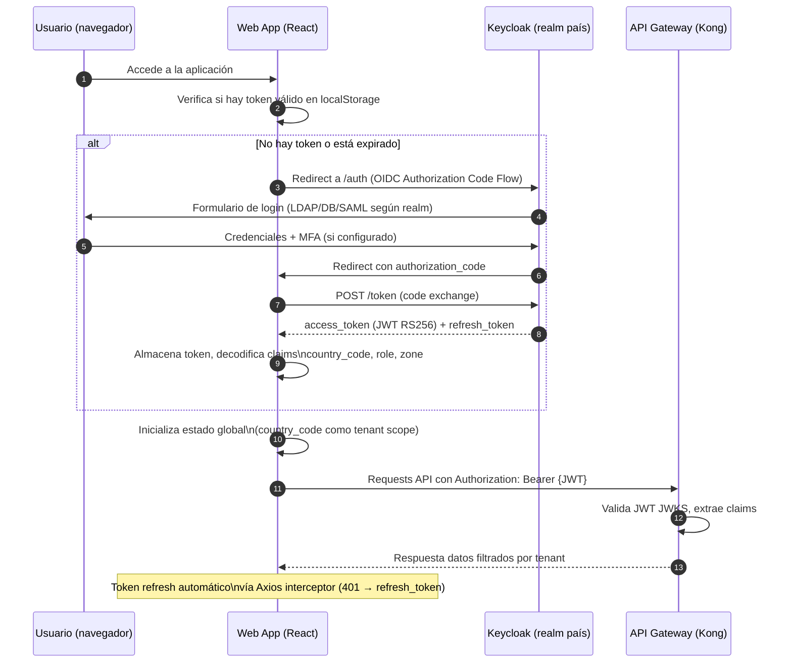

# Web App — Arquitectura React

**Componente:** `api-frontend-analitica`  
**Versión del documento:** 1.0  
**Stack:** React 18 + TypeScript + MapLibre GL JS + Kepler.gl + Socket.IO  
**ADR de cartografía:** [adr-cartography.md](./adr-cartography.md)  
**ADR de tiempo real:** [adr-realtime-protocol.md](./adr-realtime-protocol.md)

---

## 1. Estructura de Módulos

La Web App está organizada en módulos por bounded context, cada uno con sus propias rutas, componentes, hooks y servicios:

```
src/
├── modules/
│   ├── search/           # Búsqueda por matrícula + trayectoria
│   ├── alerts/           # Alertas en tiempo real (WebSocket)
│   ├── incidents/        # Gestión de recuperación
│   ├── analytics/        # Heatmaps, tendencias, rutas (Kepler.gl)
│   └── admin/            # Dispositivos, vehículos, auditoría
├── core/
│   ├── auth/             # Estado JWT, tenant scope, guards
│   ├── api/              # Axios interceptor, base URLs
│   ├── map/              # MapLibre GL JS configuración base
│   ├── i18n/             # Internacionalización es/en
│   └── observability/    # OpenTelemetry, X-Trace-ID
├── shared/
│   ├── components/       # UI components reutilizables
│   ├── hooks/            # Custom hooks compartidos
│   └── types/            # TypeScript types compartidos
├── App.tsx
└── main.tsx
```

---

## 2. Gestión del Estado JWT y `country_code` como Tenant Scope

### 2.1 Estado de Autenticación

El JWT decodificado se almacena en el estado global (Zustand o React Context). Los claims se extraen al inicio de sesión:

```typescript
// src/core/auth/authStore.ts
import { create } from 'zustand';

interface AuthState {
  token: string | null;
  claims: {
    sub: string;
    country_code: string;  // discriminador de tenant global
    role: 'officer' | 'supervisor' | 'analyst' | 'admin' | 'auditor';
    zone?: string;
    exp: number;
  } | null;
  isAuthenticated: boolean;
  setToken: (token: string) => void;
  clearAuth: () => void;
}

export const useAuthStore = create<AuthState>((set) => ({
  token: null,
  claims: null,
  isAuthenticated: false,
  setToken: (token: string) => {
    const claims = decodeJwt(token);
    set({ token, claims, isAuthenticated: true });
  },
  clearAuth: () => set({ token: null, claims: null, isAuthenticated: false }),
}));
```

### 2.2 `country_code` como Tenant Scope Global

El `country_code` del JWT es el **discriminador de tenant** para toda la aplicación:
- Todas las queries a la API incluyen implícitamente el `country_code` (el API Gateway lo extrae del JWT).
- Los componentes de UI muestran sólo datos del `country_code` del usuario.
- El módulo analytics filtra por `country_code` en todas las queries a ClickHouse.

```typescript
// src/core/auth/useTenant.ts
export function useTenant() {
  const claims = useAuthStore((state) => state.claims);
  return {
    countryCode: claims?.country_code ?? null,
    role: claims?.role ?? null,
    zone: claims?.zone ?? null,
  };
}
```

---

## 3. Integración con el API Gateway (Interceptor Axios/Fetch)

### 3.1 Axios Interceptor

```typescript
// src/core/api/apiClient.ts
import axios from 'axios';

const apiClient = axios.create({
  baseURL: import.meta.env.VITE_API_BASE_URL,
  timeout: 10000,
});

// Request interceptor: añade JWT y X-Trace-ID
apiClient.interceptors.request.use((config) => {
  const token = useAuthStore.getState().token;
  if (token) {
    config.headers.Authorization = `Bearer ${token}`;
  }
  // Propagación de trace ID para correlación con logs del backend
  config.headers['X-Trace-ID'] = generateTraceId();
  return config;
});

// Response interceptor: maneja 401 (refresh token) y 429 (retry)
apiClient.interceptors.response.use(
  (response) => response,
  async (error) => {
    if (error.response?.status === 401) {
      // Intentar refresh vía Keycloak
      const refreshed = await refreshToken();
      if (refreshed) {
        return apiClient.request(error.config);
      }
      useAuthStore.getState().clearAuth();
      window.location.href = '/login';
    }
    if (error.response?.status === 429) {
      const retryAfter = error.response.headers['retry-after'];
      // Notificar al usuario con el tiempo de espera
      showRateLimitNotification(retryAfter);
    }
    return Promise.reject(error);
  }
);
```

---

## 4. Módulo de Mapa (MapLibre GL JS)

### 4.1 Configuración Base

```typescript
// src/core/map/MapBase.tsx
import Map, { Marker, Popup, Layer, Source } from 'react-map-gl/maplibre';

export const MapBase: React.FC<{ children?: React.ReactNode }> = ({ children }) => {
  return (
    <Map
      mapStyle={import.meta.env.VITE_MAP_STYLE_URL}
      initialViewState={{
        longitude: -74.0721,  // Bogotá por defecto
        latitude: 4.7110,
        zoom: 11,
      }}
      style={{ width: '100%', height: '100%' }}
    >
      {children}
    </Map>
  );
};
```

### 4.2 Capa de Puntos (Trayectoria de Placa)

```typescript
// src/modules/search/components/PlateTrajectoryLayer.tsx
const POINT_LAYER_STYLE: LayerProps = {
  id: 'plate-events',
  type: 'circle',
  paint: {
    'circle-radius': 8,
    'circle-color': [
      'case',
      ['==', ['get', 'is_stolen'], true], '#ef4444',  // rojo para hurtados
      '#3b82f6'   // azul para no hurtados
    ],
    'circle-stroke-width': 2,
    'circle-stroke-color': '#ffffff',
    'circle-opacity': 0.85,
  },
};
```

### 4.3 Popup de Evento

Al hacer clic en un punto, se muestra un popup con: timestamp, dirección, device_id, confidence y thumbnail:

```typescript
// src/modules/search/components/EventPopup.tsx
interface EventPopupProps {
  event: PlateEvent;
  onClose: () => void;
  onViewFullImage: (thumbnailUrl: string) => void;
}
```

### 4.4 Centrado Automático en Alerta

Al recibir una alerta vía WebSocket, el mapa se centra automáticamente en la coordenada de la alerta:

```typescript
// src/modules/alerts/hooks/useAlertMapFocus.ts
export function useAlertMapFocus(mapRef: RefObject<MapRef>) {
  const { lastAlert } = useAlertsStore();
  
  useEffect(() => {
    if (lastAlert && mapRef.current) {
      mapRef.current.flyTo({
        center: [lastAlert.lon, lastAlert.lat],
        zoom: 15,
        duration: 1500,
      });
    }
  }, [lastAlert]);
}
```

---

## 5. Módulo de Alertas (Socket.IO)

### 5.1 Conexión y Autenticación

```typescript
// src/modules/alerts/hooks/useAlertsSocket.ts
import { io, Socket } from 'socket.io-client';

export function useAlertsSocket() {
  const { token } = useAuthStore();
  const socketRef = useRef<Socket | null>(null);
  
  useEffect(() => {
    if (!token) return;
    
    const socket = io(import.meta.env.VITE_ALERTS_WS_URL, {
      auth: { token },
      transports: ['websocket', 'polling'],
      reconnectionDelay: 1000,
      reconnectionDelayMax: 30000,
      reconnectionAttempts: Infinity,
    });
    
    socket.on('vehicle.alert', (alert: Alert) => {
      useAlertsStore.getState().addAlert(alert);
      playAlertSound();
      // La tarjeta de alerta renderizada en AlertsPanel incluye dos botones de acción:
      // - "Despachar unidad": dispara POST /v1/incidents/{plate}/recovery-action { action: "dispatch_unit" }
      // - "Abrir incidente": navega a /incidents/{plate} para ver el estado actual o crear uno nuevo
    });
    
    socket.on('connect', () => {
      // Al reconectar, solicitar alertas perdidas
      const lastReceivedAt = useAlertsStore.getState().lastReceivedAt;
      if (lastReceivedAt) {
        fetchMissedAlerts(lastReceivedAt);
      }
    });
    
    socket.on('disconnect', (reason) => {
      console.warn('WebSocket disconnected:', reason);
    });
    
    socketRef.current = socket;
    return () => { socket.disconnect(); };
  }, [token]);
  
  return socketRef;
}
```

### 5.1.1 Componente `AlertCard` — Contenido y Acciones

Cada alerta recibida se renderiza como una tarjeta con los siguientes elementos:

| Elemento | Valor mostrado |
|---|---|
| Matrícula | `alert.plate` en negrita |
| Timestamp | `alert.produced_at` en hora local |
| Coordenadas textuales | `${alert.lat.toFixed(5)}, ${alert.lon.toFixed(5)}` |
| Miniatura del vehículo | `` (desde URL pre-firmada) |
| Botón "Despachar unidad" | `POST /v1/incidents/{plate}/recovery-action { action: "dispatch_unit" }` |
| Botón "Abrir incidente" | Navega a `/incidents/{plate}` para ver el estado actual |

Los botones sólo están visibles para roles `officer` y `supervisor`. El rol `analyst` ve las tarjetas en modo lectura.

### 5.2 Polling en Reconexión

```typescript
// src/modules/alerts/services/alertsApi.ts
export async function fetchMissedAlerts(since: string): Promise<Alert[]> {
  const response = await apiClient.get('/v1/alerts', {
    params: { since, limit: 200 }
  });
  return response.data.data;
}
```

---

## 6. Módulo de Analítica (Kepler.gl + Trend Charts)

### 6.1 Heatmap H3 con Kepler.gl

```typescript
// src/modules/analytics/components/HeatmapView.tsx
import KeplerGl from '@kepler.gl/components';
import { addDataToMap } from '@kepler.gl/actions';

// El dataset H3 se carga desde analytics-service GET /v1/analytics/heatmap
// y se convierte al formato de dataset de Kepler.gl
function transformHeatmapData(cells: HeatmapCell[]): KeplerDataset {
  return {
    data: {
      fields: [
        { name: 'h3_index', type: 'string' },
        { name: 'event_count', type: 'integer' },
        { name: 'avg_confidence', type: 'real' },
      ],
      rows: cells.map(c => [c.h3_index, c.event_count, c.avg_confidence]),
    },
  };
}
```

### 6.2 Gráficas de Tendencias

Las tendencias se renderizan con Recharts (compatible con el ecosistema React):

```typescript
// src/modules/analytics/components/TrendsChart.tsx
import { LineChart, Line, XAxis, YAxis, CartesianGrid, Tooltip } from 'recharts';

// Datos: analytics-service GET /v1/analytics/trends
```

---

## 7. Internacionalización (i18n)

```typescript
// src/core/i18n/index.ts
import i18n from 'i18next';
import { initReactI18next } from 'react-i18next';

i18n.use(initReactI18next).init({
  lng: 'es',  // defecto español
  fallbackLng: 'en',
  resources: {
    es: { translation: require('./locales/es.json') },
    en: { translation: require('./locales/en.json') },
  },
  interpolation: { escapeValue: false },
});
```

Cadenas internacionalizadas: mensajes de UI, etiquetas de formularios, textos de error. Los identificadores técnicos (plate, country_code, event_id) no se traducen.

---

## 8. Integración Superset (Embed)

Los dashboards de Apache Superset se integran en el módulo analytics vía iframe embed con token de guest o SSO Keycloak:

```typescript
// src/modules/analytics/components/SupersetDashboard.tsx
export const SupersetDashboard: React.FC<{ dashboardId: string }> = ({ dashboardId }) => {
  const { token: jwtToken } = useAuthStore();
  const supersetUrl = import.meta.env.VITE_SUPERSET_EMBED_URL;
  
  // Opción A: Embed via guest token
  const embedUrl = `${supersetUrl}/embedded/${dashboardId}?standalone=1`;
  
  return (
    <iframe
      src={embedUrl}
      title="Analytics Dashboard"
      style={{ width: '100%', height: '100%', border: 'none' }}
      sandbox="allow-scripts allow-same-origin allow-forms"
    />
  );
};
```

Ver [`superset-integration.md`](./superset-integration.md) para la configuración de Row Level Security por `country_code`.

---

## 9. Diagrama del Flujo de Autenticación UI



---

## 10. Variables de Entorno

```env
# .env.production
VITE_API_BASE_URL=https://api.anti-hurto.internal/v1
VITE_ALERTS_WS_URL=wss://api.anti-hurto.internal/alerts
VITE_KEYCLOAK_URL=https://keycloak.anti-hurto.internal
VITE_KEYCLOAK_REALM=co                           # Por país
VITE_MAP_STYLE_URL=https://tiles.openstreetmap.org/styles/basic/style.json
VITE_SUPERSET_EMBED_URL=https://superset.anti-hurto.internal
VITE_ENV=production
```

---

## 11. Referencias

- [adr-cartography.md](./adr-cartography.md)
- [adr-realtime-protocol.md](./adr-realtime-protocol.md)
- [api-gateway.md](./api-gateway.md) — autenticación JWT
- [superset-integration.md](./superset-integration.md) — embed dashboards
- [helm/README.md](./helm/README.md) — despliegue y variables de entorno
