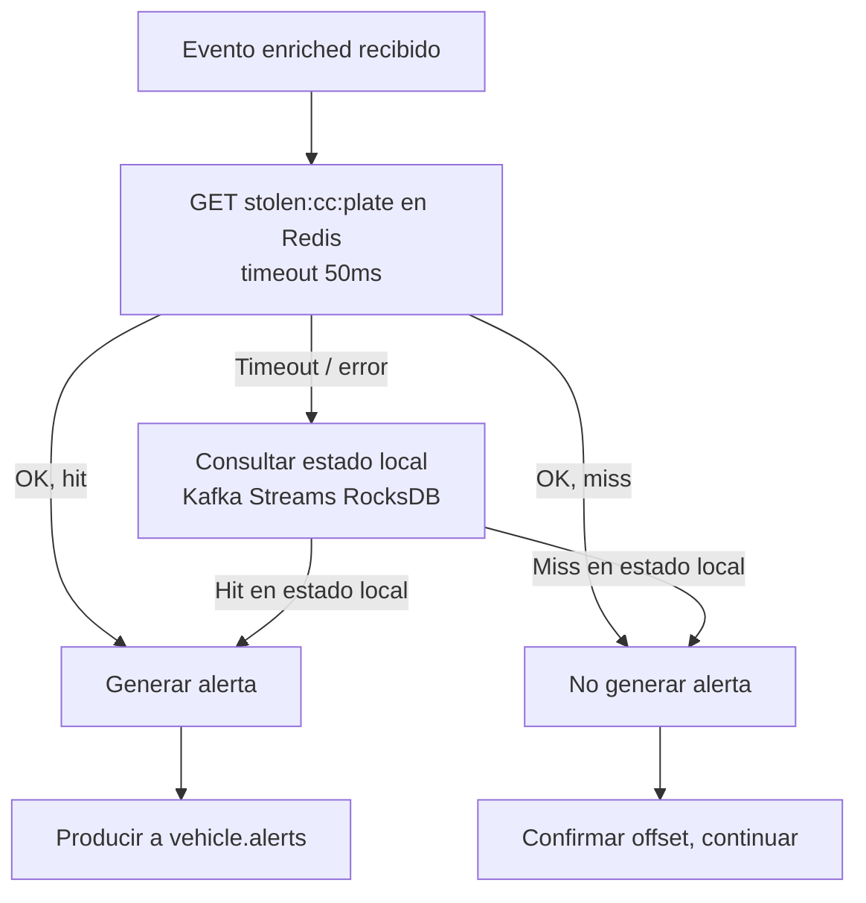

# ADR — Estrategia de Fallback del Matcher Service ante Indisponibilidad de Redis

**ID:** ADR-BP-02 (complementa ADR-008)  
**Estado:** Aprobado  
**Fecha:** 2026-05-13  
**Componente:** backbone-procesamiento → Matcher Service  
**Autores:** Erik Rodríguez

---

## 1. Contexto

El Matcher Service consume eventos del tópico `vehicle.events.enriched` y coteja la placa normalizada contra la lista roja de vehículos hurtados almacenada en Redis (clave `stolen:{country_code}:{plate_normalized}`). Redis es la fuente de verdad operacional de la lista roja en el hot path, actualizada por el Canonical Vehicles Service vía el tópico `stolen.vehicles.events`.

El Matcher Service debe decidir qué hacer cuando **Redis no está disponible** (timeout de conexión, cluster Redis en estado degradado, partición de red entre el pod del Matcher y Redis). Existen dos estrategias polares:

- **Fail open:** si Redis no responde, el Matcher asume que la placa **no está** en la lista roja y no genera alerta (el evento pasa sin cotejo).
- **Fail closed:** si Redis no responde, el Matcher usa un mecanismo alternativo para intentar el cotejo antes de decidir.

Esta decisión afecta directamente la seguridad pública: un comportamiento fail open implica que, durante una ventana de indisponibilidad de Redis, ningún vehículo hurtado generará alerta — incluso si el oficial de policía podría haberlo interceptado.

---

## 2. Criterios de Evaluación

| Criterio | Peso | Descripción |
|---|---|---|
| **Seguridad pública** | MUY ALTA | Bajo ninguna condición de fallo de infraestructura el sistema debe perder silenciosamente alertas de vehículos hurtados. La consecuencia es que un vehículo hurtado transita sin que ningún oficial sea notificado. |
| **Disponibilidad del pipeline** | ALTA | El Matcher Service no debe detenerse ante fallo de Redis; debe continuar procesando eventos (aunque sea en modo degradado). |
| **Latencia del hot path** | ALTA | La estrategia de fallback no debe introducir latencia adicional significativa en el caso nominal (Redis disponible). |
| **Consistencia del cotejo** | MEDIA | La lista roja en el estado de fallback puede estar levemente desactualizada respecto a Redis. Esto es aceptable durante una ventana de indisponibilidad limitada (minutos a horas). |
| **Complejidad operacional** | MEDIA | La solución debe ser operable por el equipo SRE sin mecanismos exóticos. |

---

## 3. Opciones Evaluadas

### Opción A: Fail open — no generar alerta si Redis no responde

**Descripción:** Si Redis no está disponible, el Matcher Service trata el evento como un miss (placa no en lista roja) y no produce alerta a `vehicle.alerts`.

**Ventajas:**
- Implementación simple (no requiere estado local).
- Sin latencia adicional en el caso nominal.
- Sin consumo adicional de memoria/CPU.

**Desventajas:**
- **Inaceptable desde el punto de vista de seguridad pública.** Durante cualquier ventana de indisponibilidad de Redis (por breve que sea), todos los vehículos hurtados que pasen por los dispositivos quedarán sin alerta. Esto contradice el propósito principal del sistema.
- La indisponibilidad de Redis puede durar minutos (failover de Redis Sentinel) hasta horas en escenarios de incidente mayor.
- No es auditable: el sistema no puede distinguir entre "placa no hurtada" y "no pudo verificar".

**Veredicto:** Descartada. Incompatible con el requisito de seguridad pública.

---

### Opción B: Fail closed — detener el pipeline hasta que Redis se recupere

**Descripción:** Si Redis no está disponible, el Matcher Service pausa el procesamiento de eventos (no avanza el offset Kafka) hasta que Redis recupere disponibilidad.

**Ventajas:**
- No hay posibilidad de perder alertas (los eventos quedan en el tópico Kafka esperando).
- Simplicidad conceptual: el sistema simplemente espera.

**Desventajas:**
- El lag de Kafka `vehicle.events.enriched` crece durante la indisponibilidad de Redis; cuando Redis se recupera, hay un pico de procesamiento acumulado.
- El SLO p95 < 2 s se incumple para todos los eventos durante la ventana de indisponibilidad.
- Si la indisponibilidad dura más que la retención del tópico `vehicle.events.enriched` (48 h), se pierden eventos.
- Experiencia operacional degradada: el pipeline visible "se congela" sin generar alertas durante el fallo.

**Veredicto:** Descartada. El impacto en el SLO y la degradación visible durante el fallo son inaceptables cuando existe una alternativa con estado local.

---

### Opción C: Fail closed con estado local Kafka Streams (local state store) ✅ SELECCIONADA

**Descripción:** El Matcher Service usa Kafka Streams para mantener un **estado local** (RocksDB) que es una réplica de la lista roja. El tópico `stolen.vehicles.events` alimenta este estado local vía un `GlobalKTable`. En el flujo nominal:

1. El Matcher consulta Redis primero (`GET stolen:{country_code}:{plate_normalized}`) con un timeout estricto de **50 ms**.
2. Si Redis responde: se usa la respuesta de Redis (fuente de verdad actualizada).
3. Si Redis no responde (timeout o error de conexión): el Matcher consulta el estado local RocksDB para la misma clave.
   - Si la placa está en el estado local: genera la alerta (fail closed — el cotejo se realiza, no se omite).
   - Si la placa no está en el estado local: no genera alerta (comportamiento idéntico a un miss normal).
4. En ningún caso se omite el cotejo ni se genera una alerta sin verificar.

El estado local se mantiene actualizado por el consumo continuo de `stolen.vehicles.events`. La desincronización máxima respecto a Redis depende del lag del consumidor de ese tópico (objetivo: < 30 s bajo carga normal).



**Ventajas:**
- **Fail closed:** el cotejo siempre ocurre, ya sea contra Redis o contra el estado local. No hay posibilidad de omitir el cotejo silenciosamente.
- El pipeline continúa procesando eventos durante la indisponibilidad de Redis, sin acumular lag en Kafka.
- El SLO p95 < 2 s puede mantenerse incluso con Redis degradado (la consulta al estado local RocksDB tiene latencia < 5 ms).
- El estado local actúa como caché secundaria warm: siempre está disponible ya que es local al proceso.
- Auditable: se registra la métrica `matcher_fallback_used_total` diferenciando los eventos que usaron el fallback.

**Desventajas:**
- El estado local puede estar levemente desactualizado respecto a Redis en el instante del fallback (ej. un vehículo fue removido de la lista roja en Redis pero aún está en el estado local → puede generar una alerta de falso positivo que el Alert Service o el oficial deberán descartar). El riesgo de falso negativo (vehículo hurtado recientemente que aún no llegó al estado local) es el opuesto y está mitigado por el bajo lag del estado local (< 30 s).
- Mayor consumo de memoria por pod del Matcher Service (RocksDB con toda la lista roja del país: estimado ~500 MB por millón de vehículos).
- Requiere la topología Kafka Streams con `GlobalKTable` sobre `stolen.vehicles.events`.

---

## 4. Decisión

**Se adopta la Opción C: fail closed con Kafka Streams local state store (RocksDB) como fallback de Redis.**

### Puerto hexagonal `StolenVehiclesPort`

El Matcher Service implementa un puerto hexagonal para el cotejo:

```go
// StolenVehiclesPort define el contrato de consulta de la lista roja.
type StolenVehiclesPort interface {
    // IsStolen coteja la placa contra la lista roja.
    // Retorna (true, vehicleData, nil) si la placa está hurtada.
    // Retorna (false, nil, nil) si la placa no está en la lista.
    // Retorna (false, nil, err) si hay un error que impide el cotejo.
    IsStolen(ctx context.Context, countryCode, plateNormalized string) (bool, *StolenVehicle, error)
}
```

**Implementación con fallback:**

```go
// RedisPrimaryLocalFallbackAdapter implementa StolenVehiclesPort con Redis primario
// y estado local Kafka Streams como fallback.
type RedisPrimaryLocalFallbackAdapter struct {
    redisClient    RedisClient
    localStateStore StateStore   // Kafka Streams RocksDB
    redisTimeout   time.Duration // 50 ms
}

func (a *RedisPrimaryLocalFallbackAdapter) IsStolen(
    ctx context.Context, countryCode, plate string,
) (bool, *StolenVehicle, error) {

    key := fmt.Sprintf("stolen:%s:%s", countryCode, plate)

    // Intento primario: Redis con timeout estricto
    ctxRedis, cancel := context.WithTimeout(ctx, a.redisTimeout)
    defer cancel()

    val, err := a.redisClient.Get(ctxRedis, key)
    if err == nil {
        // Redis respondió correctamente
        metrics.MatcherRedisHit.Inc()
        return val != nil, parseStolenVehicle(val), nil
    }

    // Redis no disponible: usar estado local (fail closed)
    metrics.MatcherRedisFallbackUsed.Inc()
    localVal, localErr := a.localStateStore.Get(key)
    if localErr != nil {
        return false, nil, localErr // Error en estado local — no omitir cotejo
    }
    return localVal != nil, parseStolenVehicle(localVal), nil
}
```

---

## 5. Justificación de Seguridad Pública

La elección fail closed se fundamenta en el **principio de mínimo riesgo para la seguridad pública**:

> Un falso positivo (alerta generada por un vehículo que ya salió de la lista roja) puede ser descartado por el oficial de policía en segundos. Un falso negativo (vehículo hurtado que pasa sin alerta porque el sistema no verificó) puede resultar en que el vehículo escape sin ser interceptado.

La asimetría entre los costos de estos dos tipos de error es la razón por la que el sistema debe siempre intentar el cotejo, incluso en condiciones degradadas. El estado local RocksDB garantiza que el cotejo siempre ocurre, con una tasa de desactualización acotada y monitoreable.

---

## 6. Consecuencias

### Positivas
- El sistema cumple con su propósito de seguridad pública incluso durante fallos de Redis.
- El SLO p95 < 2 s se mantiene durante el fallback (RocksDB local < 5 ms vs. Redis ~1–5 ms).
- La métrica `matcher_fallback_used_total` permite detectar problemas de Redis antes de que sean críticos.
- La topología Kafka Streams con `GlobalKTable` sobre `stolen.vehicles.events` ya es parte del diseño del Matcher Service; no introduce nueva infraestructura.
- La métrica `matcher_redis_duration_seconds` es observable en el caso nominal sin overhead adicional.

### Negativas / Riesgos
- Mayor consumo de memoria por pod (~500 MB adicionales por millón de vehículos en la lista roja).
- Riesgo de falso positivo durante el fallback por desactualización del estado local. Mitigación: el Alert Service incluye una validación adicional contra PostgreSQL para alertas generadas durante el fallback (`matcher_fallback_used = true` en el header del mensaje de alerta).
- La correcta sincronización del `GlobalKTable` depende de que el tópico `stolen.vehicles.events` tenga retención suficiente (30 días configurados).

### Métricas de monitoreo
- `matcher_redis_duration_seconds` — histograma de latencia de las consultas a Redis.
- `matcher_fallback_used_total` — contador de eventos que usaron el fallback local.
- `matcher_redis_errors_total` — errores de conexión con Redis.
- `matcher_local_state_size_bytes` — tamaño del state store local.
- `matcher_local_state_lag_seconds` — desincronización estimada del estado local respecto a Redis.

Ver definición completa en [slo-observability.md](./slo-observability.md).

---

## 7. Relación con ADR-008

ADR-008 establece el uso de Kafka Streams con state store para el Deduplicator. Esta decisión extiende el mismo patrón al Matcher Service: el `GlobalKTable` sobre `stolen.vehicles.events` es una tabla de estado que el Matcher mantiene localmente vía Kafka Streams, consistente con la arquitectura de streaming definida en ADR-008. Ambos componentes usan RocksDB como implementación del state store.

---

## 8. Revisión

Esta decisión se revisará si:
- La tasa de `matcher_fallback_used_total` supera el 5 % de forma sostenida (indica problema sistémico con Redis, no incidente transitorio).
- El tamaño de la lista roja supera 10 millones de vehículos por país, haciendo inviable el estado local en memoria.
- Se establece un SLA de exactitud de cotejo que requiera garantías más estrictas sobre la sincronización del estado local.
