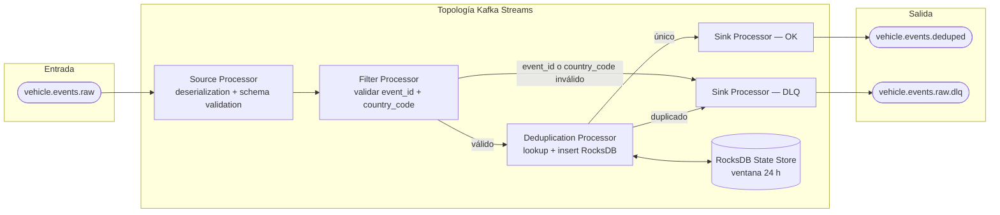

# Backbone de Procesamiento — Deduplicator

**Componente:** backbone-procesamiento → Deduplicator  
**Versión del documento:** 1.0  
**Última actualización:** 2026-05-13

---

## 1. Responsabilidad

El Deduplicator es el primer componente del hot path. Consume eventos crudos del tópico `vehicle.events.raw` y elimina los reintentos idempotentes generados por el mecanismo QoS 1 del agente de borde (un evento puede llegar múltiples veces si el agente no recibe confirmación de entrega en tiempo).

**Garantías del Deduplicator:**
- Cada `event_id` único se produce exactamente una vez a `vehicle.events.deduped` dentro de la ventana de 24 horas.
- Los eventos con `event_id` ausente o nulo se redirigen al DLQ `vehicle.events.raw.dlq` sin propagarse (CR-01).
- Los eventos con `country_code` ausente se redirigen al DLQ con motivo `MISSING_COUNTRY_CODE` (CR-10).
- Los eventos válidos se producen a `vehicle.events.deduped` con todos los campos originales preservados y `device_id` como clave de partición.

---

## 2. Arquitectura Interna

El Deduplicator es una aplicación **Kafka Streams** que implementa la topología de deduplicación con exactly-once semantics.



> **Nota:** Los duplicados se envían al DLQ marcados como `DUPLICATE` (no como error) para propósitos de auditoría. Los mensajes inválidos (sin `event_id` o sin `country_code`) se envían al DLQ marcados como `MISSING_FIELD`.

---

## 3. Estado RocksDB — Estructura de la Clave

El Deduplicator usa un **KeyValueStore** de Kafka Streams respaldado por RocksDB. La estructura de la clave de estado es:

```
clave  : {country_code}:{event_id}
valor  : {processed_at_unix_ms}  (long, 8 bytes)
```

**Ejemplo:**
```
clave  : "CO:550e8400-e29b-41d4-a716-446655440000"
valor  : 1747144200000
```

### 3.1 Ventana de Retención de 24 Horas

El state store usa un **WindowStore** con ventana de retención de **86 400 segundos (24 horas)**. Los registros cuya `processed_at` sea anterior a 24 h se eliminan automáticamente por la política de retención del WindowStore de Kafka Streams.

El tiempo de referencia para la ventana es el `event_ts` del evento (no el tiempo de procesamiento del servidor), lo que garantiza que dos reintentos del mismo evento llegados en momentos distintos se dedupliquen correctamente incluso si hay lag en el pipeline.

### 3.2 Algoritmo de Deduplicación

```
PARA cada mensaje m en vehicle.events.raw:
    SI m.event_id ES nulo O vacío:
        producir m a vehicle.events.raw.dlq con header dlq.reason=MISSING_EVENT_ID
        CONTINUAR

    SI m.country_code ES nulo O vacío:
        producir m a vehicle.events.raw.dlq con header dlq.reason=MISSING_COUNTRY_CODE
        CONTINUAR

    clave := m.country_code + ":" + m.event_id
    existente := state_store.get(clave, ventana=24h)

    SI existente NO ES nulo:
        # Duplicado confirmado
        producir m a vehicle.events.raw.dlq con header dlq.reason=DUPLICATE
        incrementar contador deduplicator.duplicates.discarded
        CONTINUAR

    # Evento único
    state_store.put(clave, now_ms(), ventana=24h)
    producir m a vehicle.events.deduped con clave_particion=m.device_id
    incrementar contador deduplicator.events.forwarded
```

---

## 4. Configuración Kafka Streams

```properties
# Identificación
application.id=deduplicator-v1
bootstrap.servers=kafka-broker-1:9092,kafka-broker-2:9092,kafka-broker-3:9092

# Exactly-once semantics (EOS)
processing.guarantee=exactly_once_v2
transaction.timeout.ms=10000

# Paralelismo
num.stream.threads=4
# Nota: el número de hilos debe ser <= número de particiones de vehicle.events.raw (24)

# State store
state.dir=/var/lib/kafka-streams/deduplicator
rocksdb.config.setter=com.antihurto.deduplicator.RocksDbConfig

# Rebalanceo
session.timeout.ms=45000
heartbeat.interval.ms=15000
max.poll.interval.ms=300000

# Commit
commit.interval.ms=100
# Nota: EOS hace commit en cada batch de transacciones; este valor aplica al poll loop interno

# Serialización
default.key.serde=org.apache.kafka.common.serialization.Serdes$StringSerde
default.value.serde=io.confluent.kafka.streams.serdes.avro.SpecificAvroSerde
schema.registry.url=http://schema-registry:8081
```

### 4.1 Configuración RocksDB

```java
// RocksDbConfig.java — ajuste para el state store de deduplicación
public class RocksDbConfig implements RocksDBConfigSetter {
    @Override
    public void setConfig(String storeName, Options options, Map<String, Object> configs) {
        options.setWriteBufferSize(64 * 1024 * 1024);        // 64 MB write buffer
        options.setMaxWriteBufferNumber(3);
        options.setTargetFileSizeBase(64 * 1024 * 1024);
        options.setCompressionType(CompressionType.LZ4_COMPRESSION);
        options.setBottommostCompressionType(CompressionType.ZSTD_COMPRESSION);
        options.setLevelCompactionDynamicLevelBytes(true);
        // Bloom filters para reducir false positive en lookups
        BlockBasedTableConfig tableConfig = new BlockBasedTableConfig();
        tableConfig.setFilterPolicy(new BloomFilter(10, false));
        tableConfig.setBlockCacheSize(128 * 1024 * 1024); // 128 MB block cache
        options.setTableFormatConfig(tableConfig);
    }
}
```

### 4.2 Recursos por Pod (Kubernetes)

| Recurso | Request | Limit |
|---|---|---|
| CPU | 500m | 2000m |
| RAM | 1 Gi | 3 Gi |
| Disco (RocksDB state) | 10 Gi (PVC) | — |

> El estado RocksDB se persiste en un PersistentVolumeClaim para sobrevivir a reinicios del pod. Sin PVC, el Deduplicator reconstruiría el estado desde el changelog topic de Kafka Streams en cada reinicio (proceso que puede tomar varios minutos con 24 h de estado acumulado).

---

## 5. Dead-Letter Topic — `vehicle.events.raw.dlq`

| Propiedad | Valor |
|---|---|
| **Tópico** | `vehicle.events.raw.dlq` |
| **Retención** | 7 días |
| **Particiones** | 24 (mismas que `vehicle.events.raw`) |
| **Replication factor** | 3 |
| **min.insync.replicas** | 2 |

**Headers Kafka en mensajes del DLQ:**

| Header | Descripción |
|---|---|
| `dlq.reason` | `DUPLICATE`, `MISSING_EVENT_ID`, `MISSING_COUNTRY_CODE`, `SCHEMA_VALIDATION_FAILED` |
| `dlq.source.topic` | `vehicle.events.raw` |
| `dlq.source.partition` | Número de partición de origen |
| `dlq.source.offset` | Offset de origen |
| `dlq.timestamp` | Timestamp ISO 8601 del rechazo |
| `dlq.component` | `deduplicator` |
| `dlq.original_event_id` | `event_id` del mensaje original (o `null` si ausente) |

---

## 6. Métricas Prometheus

| Métrica | Tipo | Descripción |
|---|---|---|
| `deduplicator_events_processed_total` | Counter | Total de eventos procesados (todos, incluyendo duplicados e inválidos). |
| `deduplicator_duplicates_discarded_total` | Counter | Eventos duplicados descartados (CA-01). |
| `deduplicator_events_forwarded_total` | Counter | Eventos únicos producidos a `vehicle.events.deduped` (CA-02). |
| `deduplicator_dlq_messages_total` | Counter | Mensajes enviados al DLQ; label `reason` con valores `DUPLICATE`, `MISSING_EVENT_ID`, `MISSING_COUNTRY_CODE`, `SCHEMA_VALIDATION_FAILED`. |
| `deduplicator_processing_duration_seconds` | Histogram | Latencia de procesamiento por evento (desde consume hasta produce). Objetivo p95 < 100 ms. |
| `deduplicator_state_store_size_bytes` | Gauge | Tamaño del state store RocksDB en disco. |
| `deduplicator_state_store_entries` | Gauge | Número de entradas activas en el state store. |
| `deduplicator_kafka_consumer_lag` | Gauge | Lag del consumer group `deduplicator-cg` en `vehicle.events.raw`. Alerta si > 10 000. |
| `deduplicator_rocksdb_block_cache_hit_ratio` | Gauge | Ratio de hits en el block cache de RocksDB. Objetivo > 0.90. |

---

## 7. Comportamiento ante Fallos

| Escenario | Comportamiento |
|---|---|
| **Pod reiniciado sin PVC** | Kafka Streams reconstruye el changelog desde el changelog topic (`deduplicator-v1-KTABLE-SUPPRESS-STATE-STORE-0000000004-changelog`). Tiempo estimado de recuperación: 5–15 min según volumen de estado. |
| **Pod reiniciado con PVC** | RocksDB recarga el estado desde disco. Tiempo estimado: < 30 s. |
| **Kafka broker no disponible** | Kafka Streams retrocede con backoff exponencial. Los eventos se acumulan en `vehicle.events.raw` (retención 24 h). |
| **Schema Registry no disponible** | El Deduplicator no puede deserializar los mensajes; se detiene el consumo. Se activa la alerta `deduplicator_schema_registry_unavailable`. |
| **State store RocksDB corrupto** | Kafka Streams detecta la corrupción y reconstruye el estado desde el changelog topic. El pod puede reiniciarse automáticamente vía liveness probe si el proceso queda en estado de error. |

---

## 8. Exactly-Once Semantics (EOS)

El Deduplicator usa `processing.guarantee=exactly_once_v2` de Kafka Streams. Esto garantiza que:

- Cada mensaje de `vehicle.events.raw` produce exactamente un efecto en `vehicle.events.deduped` o `vehicle.events.raw.dlq`, incluso ante reinicios o fallos durante el procesamiento.
- Las escrituras al state store RocksDB y la producción al tópico de salida son atómicas a nivel de transacción Kafka.

> EOS tiene un overhead de rendimiento (~10–20 % respecto a at-least-once). Con las particiones y recursos dimensionados (4 hilos, 24 particiones, 500 eventos/seg por partición) el overhead es manejable.

---

## 9. Despliegue

El Deduplicator se despliega como un **Deployment de Kubernetes** (no StatefulSet, ya que el estado se gestiona vía PVC + Kafka Streams changelog recovery). Ver [helm/README.md](./helm/README.md) para los values de Helm configurables y [terraform/README.md](./terraform/README.md) para el provisionamiento del state topic de Kafka Streams.

```
Imagen Docker: antihurto/deduplicator:1.0.0
Deployment replicas: 1 (instancia única por diseño de Kafka Streams; escalar requiere aumentar particiones)
PVC: 10 Gi, storageClass: fast-ssd
LivenessProbe: GET /health/liveness — 200 OK
ReadinessProbe: GET /health/readiness — 200 OK (incluye verificación de state store y conexión Kafka)
```

---

## 10. Criterios de Aceptación Cubiertos

| CA/CR | Verificación |
|---|---|
| CA-01: Duplicado descartado en ventana 24 h | `deduplicator_duplicates_discarded_total` incrementa; el evento no llega a `vehicle.events.deduped`. |
| CA-02: Evento único avanza preservando campos | El payload en `vehicle.events.deduped` es byte-a-byte igual al original; clave de partición = `device_id`. |
| CR-01: `event_id` ausente → DLQ | Header `dlq.reason=MISSING_EVENT_ID` en `vehicle.events.raw.dlq`. |
| CR-10: `country_code` ausente → DLQ | Header `dlq.reason=MISSING_COUNTRY_CODE` en `vehicle.events.raw.dlq`. |
