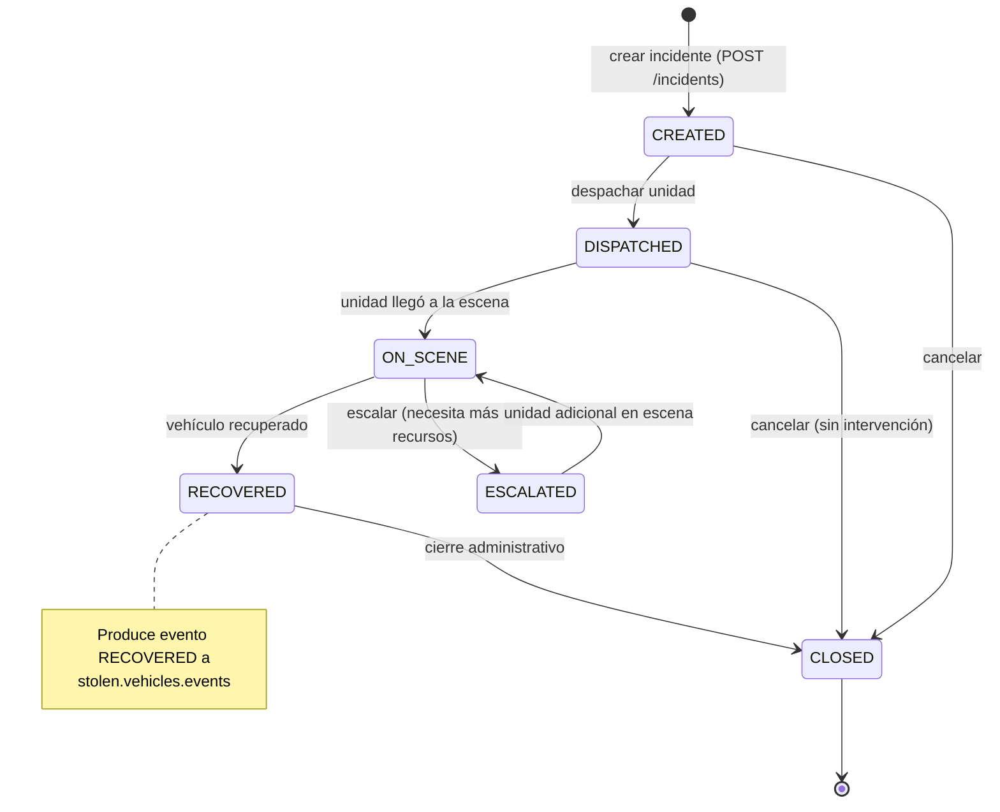
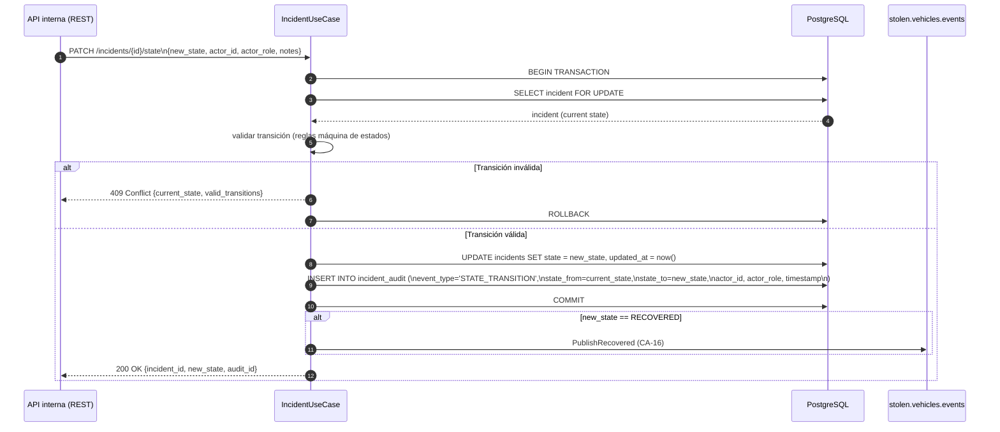

# Backbone de Procesamiento — incident-service

**Componente:** backbone-procesamiento → incident-service  
**Versión del documento:** 1.0  
**Última actualización:** 2026-05-13

---

## 1. Responsabilidad

El incident-service gestiona el ciclo de vida completo de la recuperación de vehículos hurtados, desde que el oficial de policía crea un incidente (como respuesta a una alerta) hasta que el vehículo es recuperado o el caso se cierra. Sus responsabilidades son:

1. **Mantener la máquina de estados** del incidente con transiciones controladas.
2. **Persiste un log de auditoría inmutable** (`incident_audit`) con cada transición: sin updates ni deletes, solo inserts.
3. **Rechazar transiciones inválidas** (ej. retroceder de `RECOVERED` a `DISPATCHED`) con error 409 Conflict.
4. **Producir un evento `RECOVERED`** al tópico `stolen.vehicles.events` cuando un incidente alcanza ese estado, para que el Canonical Vehicles Service y el sincronizacion-paises puedan actualizar la lista roja.
5. **Exponer una API interna** consumida por el `api-frontend-analitica / incident-service` (la capa de frontend que el oficial usa).

---

## 2. Máquina de Estados



### 2.1 Reglas de Transición

| Estado Origen | Estados Destino Válidos | Notas |
|---|---|---|
| `CREATED` | `DISPATCHED`, `CLOSED` | La creación asigna un oficial y una unidad. |
| `DISPATCHED` | `ON_SCENE`, `CLOSED` | CLOSED = cancelación sin intervención. |
| `ON_SCENE` | `RECOVERED`, `ESCALATED` | — |
| `ESCALATED` | `ON_SCENE` | Vuelta a escena con más recursos. |
| `RECOVERED` | `CLOSED` | El vehículo fue recuperado físicamente. |
| `CLOSED` | *(ninguno)* | Estado terminal. Transiciones rechazadas con 409. |

**CR-07:** Cualquier intento de transición no listada en la tabla anterior retorna **HTTP 409 Conflict** con el estado actual del incidente y sin modificar la base de datos ni el log de auditoría.

---

## 3. Esquema de Tablas en PostgreSQL

### 3.1 Tabla `incidents`

```sql
CREATE TABLE incidents (
    incident_id       UUID          NOT NULL DEFAULT gen_random_uuid(),
    country_code      CHAR(2)       NOT NULL,
    alert_id          UUID          NOT NULL,
    plate_normalized  TEXT          NOT NULL,
    state             TEXT          NOT NULL DEFAULT 'CREATED',
    assigned_officer  TEXT,                     -- user_id del oficial asignado
    assigned_unit     TEXT,                     -- identificador de unidad
    notes             TEXT,
    created_at        TIMESTAMPTZ   NOT NULL DEFAULT now(),
    updated_at        TIMESTAMPTZ   NOT NULL DEFAULT now(),
    closed_at         TIMESTAMPTZ,
    recovered_at      TIMESTAMPTZ,
    location          GEOGRAPHY(POINT, 4326),   -- última ubicación conocida del vehículo

    PRIMARY KEY (incident_id, country_code),
    FOREIGN KEY (alert_id, country_code) REFERENCES alerts(alert_id, country_code)
) PARTITION BY LIST (country_code);

CREATE INDEX idx_incidents_plate     ON incidents (plate_normalized, country_code);
CREATE INDEX idx_incidents_state     ON incidents (state, country_code) WHERE state NOT IN ('CLOSED');
CREATE INDEX idx_incidents_officer   ON incidents (assigned_officer, country_code);
```

### 3.2 Tabla `incident_audit` (append-only)

La tabla de auditoría es **inmutable por diseño**: solo permite INSERT. El rol `app_writer` tiene permiso únicamente de INSERT; no tiene UPDATE ni DELETE sobre esta tabla. Esta garantía se refuerza a nivel de base de datos con un trigger que rechaza intentos de UPDATE/DELETE.

```sql
CREATE TABLE incident_audit (
    audit_id      BIGSERIAL     NOT NULL,
    incident_id   UUID          NOT NULL,
    country_code  CHAR(2)       NOT NULL,
    event_type    TEXT          NOT NULL,   -- ej. 'STATE_TRANSITION', 'NOTE_ADDED', 'OFFICER_CHANGED'
    state_from    TEXT,                     -- estado anterior (null en creación)
    state_to      TEXT          NOT NULL,   -- nuevo estado
    actor_id      TEXT          NOT NULL,   -- user_id del actor (oficial/supervisor/sistema)
    actor_role    TEXT          NOT NULL,   -- rol del actor
    timestamp     TIMESTAMPTZ   NOT NULL DEFAULT now(),
    metadata      JSONB,                    -- datos adicionales de la transición

    PRIMARY KEY (audit_id, country_code)
) PARTITION BY LIST (country_code);

-- Trigger que rechaza UPDATE y DELETE
CREATE OR REPLACE FUNCTION incident_audit_immutable()
RETURNS TRIGGER AS $$
BEGIN
    RAISE EXCEPTION 'La tabla incident_audit es inmutable. Solo se permiten INSERT.'
        USING ERRCODE = 'insufficient_privilege';
END;
$$ LANGUAGE plpgsql;

CREATE TRIGGER prevent_incident_audit_modification
    BEFORE UPDATE OR DELETE ON incident_audit
    FOR EACH ROW EXECUTE FUNCTION incident_audit_immutable();

-- Índices de auditoría
CREATE INDEX idx_audit_incident  ON incident_audit (incident_id, country_code, timestamp DESC);
CREATE INDEX idx_audit_actor     ON incident_audit (actor_id, country_code, timestamp DESC);
CREATE INDEX idx_audit_timestamp ON incident_audit (timestamp DESC, country_code);
```

---

## 4. Puerto Hexagonal

```go
// IncidentRepositoryPort — persistencia del incidente
type IncidentRepositoryPort interface {
    Create(ctx context.Context, incident Incident) (*Incident, error)
    GetByID(ctx context.Context, incidentID, countryCode string) (*Incident, error)
    TransitionState(
        ctx context.Context,
        incidentID, countryCode string,
        newState string,
        actorID, actorRole string,
        metadata map[string]interface{},
    ) (*Incident, error)
}

// StolenVehiclesEventsPort — producción del evento RECOVERED a Kafka
type StolenVehiclesEventsPort interface {
    PublishRecovered(ctx context.Context, event RecoveredEvent) error
}

type RecoveredEvent struct {
    EventType       string    // siempre "RECOVERED"
    CountryCode     string
    PlateNormalized string
    IncidentID      string
    RecoveredAt     time.Time
    ActorID         string
}
```

---

## 5. Flujo de Transición de Estado con Auditoría



---

## 6. Producción del Evento `RECOVERED` (CA-16)

Cuando el estado del incidente pasa a `RECOVERED`:

```json
{
  "event_type":       "RECOVERED",
  "country_code":     "CO",
  "plate_normalized": "ABC123X",
  "incident_id":      "inc-uuid-here",
  "recovered_at":     "2026-05-13T16:45:00.000Z",
  "actor_id":         "officer-keycloak-uuid"
}
```

Este evento se publica al tópico `stolen.vehicles.events`. El Canonical Vehicles Service lo consume para:
1. Actualizar el estado del vehículo en PostgreSQL (`status = 'recovered'`).
2. Eliminar la clave `stolen:{country_code}:{plate_normalized}` de Redis.
3. Notificar al Edge Distribution Service para actualizar los Bloom filters en los agentes de borde.

El servicio `sincronizacion-paises` también puede consumir este evento para propagar el estado de recuperación al adapter del país correspondiente.

---

## 7. API Interna

El incident-service expone una API REST interna (no pública; accesible solo desde otros servicios del cluster a través del API Gateway con el rol `incident_writer`):

| Método | Path | Descripción | Roles permitidos |
|---|---|---|---|
| `POST` | `/v1/incidents` | Crear un nuevo incidente a partir de una alerta. | officer, supervisor |
| `GET` | `/v1/incidents/{id}` | Obtener el estado actual de un incidente. | officer, supervisor, admin, auditor |
| `PATCH` | `/v1/incidents/{id}/state` | Transicionar el estado del incidente. | officer, supervisor |
| `GET` | `/v1/incidents/{id}/audit` | Obtener el log de auditoría del incidente. | supervisor, admin, auditor |
| `GET` | `/v1/incidents` | Listar incidentes por `country_code` y filtros. | supervisor, admin, analyst |

Todos los endpoints requieren JWT válido con claims `country_code` y `role`. La validación se realiza en el API Gateway (Kong) con el plugin de autenticación JWT de Keycloak.

---

## 8. Métricas Prometheus

| Métrica | Tipo | Descripción |
|---|---|---|
| `incident_created_total` | Counter | Incidentes creados; label `country_code`. |
| `incident_state_transitions_total` | Counter | Transiciones de estado; labels `from_state`, `to_state`, `country_code`. |
| `incident_invalid_transitions_total` | Counter | Intentos de transición inválida rechazados con 409 (CR-07). |
| `incident_recovered_total` | Counter | Incidentes llegados al estado RECOVERED. |
| `incident_recovered_event_published_total` | Counter | Eventos RECOVERED publicados a `stolen.vehicles.events` (CA-16). |
| `incident_recovered_event_errors_total` | Counter | Fallos al publicar el evento RECOVERED a Kafka. |
| `incident_api_duration_seconds` | Histogram | Latencia de las operaciones de la API interna. |
| `incident_audit_insert_total` | Counter | Registros insertados en `incident_audit`. |

---

## 9. Criterios de Aceptación Cubiertos

| CA/CR | Verificación |
|---|---|
| CA-15: Creación de incidente + log auditoría | POST /incidents → INSERT en `incidents` con `state=CREATED`; INSERT en `incident_audit` con `state_from=null`, `state_to=CREATED`; tabla `incident_audit` no permite UPDATE/DELETE. |
| CA-16: Propagación RECOVERED a sincronizacion-paises | Al transicionar a `RECOVERED`, se produce evento `RECOVERED` a `stolen.vehicles.events`. |
| CA-18: Aislamiento multi-tenant | Todos los endpoints validan `country_code` del JWT contra el `country_code` del incidente. |
| CR-07: Transición inválida rechazada | Intento `RECOVERED → DISPATCHED` → HTTP 409 Conflict; sin modificación en PostgreSQL ni en `incident_audit`. |
