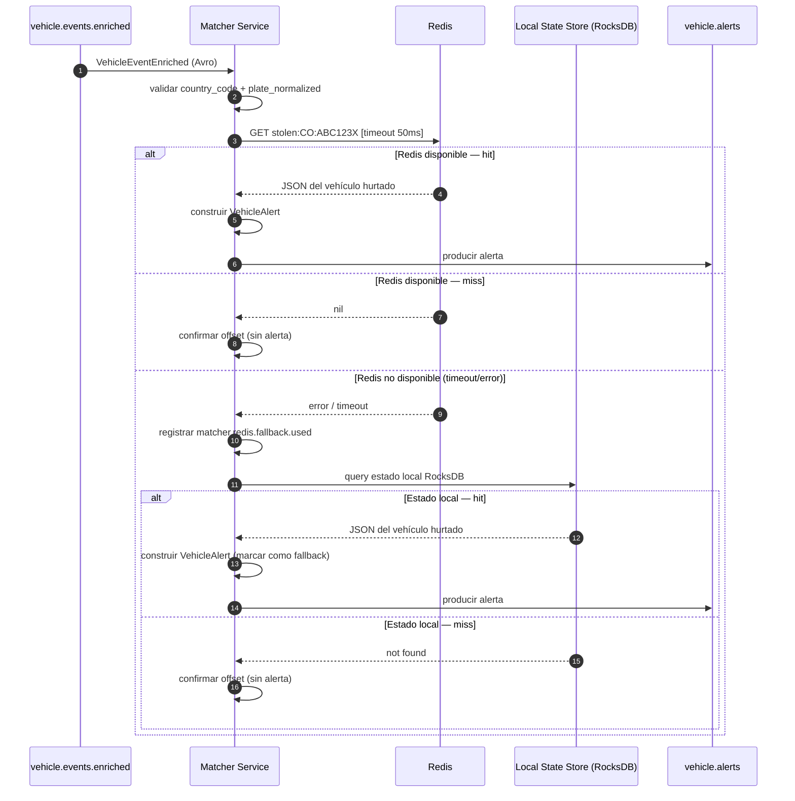

# Backbone de Procesamiento — Matcher Service

**Componente:** backbone-procesamiento → Matcher Service  
**Versión del documento:** 1.0  
**Última actualización:** 2026-05-13

---

## 1. Responsabilidad

El Matcher Service es el tercer componente del hot path. Consume eventos del tópico `vehicle.events.enriched` y coteja la placa normalizada de cada evento contra la lista roja de vehículos hurtados.

**Resultado del cotejo:**
- **Hit:** la placa está en la lista roja → se produce un evento de alerta al tópico `vehicle.alerts`.
- **Miss:** la placa no está en la lista roja → el evento se descarta sin generar alerta.
- **Fallback:** Redis no disponible → se usa el estado local Kafka Streams como caché secundaria (ver [adr-matcher-fallback.md](./adr-matcher-fallback.md)).

**Garantías:**
- El cotejo siempre ocurre, incluso ante fallo de Redis (fail closed — ADR-BP-02).
- Un miss genuino (placa no hurtada) no genera ningún mensaje adicional.
- El aislamiento multi-tenant se garantiza: el cotejo incluye `country_code` en la clave Redis.

---

## 2. Protocolo Redis

### 2.1 Estructura de Clave

```
stolen:{country_code}:{plate_normalized}
```

**Ejemplos:**
```
stolen:CO:ABC123X   → vehículo hurtado en Colombia con placa ABC123X
stolen:VE:XYZ789A   → vehículo hurtado en Venezuela con placa XYZ789A
stolen:MX:ABC1234   → vehículo hurtado en México con placa ABC1234
```

### 2.2 Valor Almacenado

El valor es un string JSON serializado con los datos del vehículo hurtado (subset del modelo canónico), suficiente para incluir en el payload de la alerta:

```json
{
  "country_code":     "CO",
  "plate_normalized": "ABC123X",
  "brand":            "Chevrolet",
  "vehicle_class":    "Automóvil",
  "line":             "Spark",
  "color":            "Rojo",
  "model_year":       2020,
  "stolen_at":        "2025-11-01T08:00:00Z",
  "stolen_location":  "Bogotá, Cundinamarca",
  "schema_version":   1
}
```

### 2.3 TTL y Expiración

Las claves Redis **no tienen TTL fijo**. Son creadas/actualizadas por el Canonical Vehicles Service cuando llega un evento `STOLEN` o `UPDATED` del tópico `stolen.vehicles.events`, y eliminadas cuando llega un evento `RECOVERED`. Esto garantiza:
- CR-04: una clave expirada o eliminada retorna `nil` → no genera alerta.
- La consistencia entre Redis y PostgreSQL es eventual; Redis es la caché operacional del hot path.

### 2.4 Operación Redis

```
GET stolen:{country_code}:{plate_normalized}
```

Timeout estricto: **50 ms**. Si la operación tarda más de 50 ms, se considera un fallo y se activa el fallback (ver sección 4).

---

## 3. Flujo de Procesamiento



---

## 4. Fallback — Estado Local Kafka Streams

El Matcher Service mantiene un `GlobalKTable` de Kafka Streams sobre el tópico `stolen.vehicles.events`. Esta tabla se replica localmente en RocksDB y sirve como fuente secundaria cuando Redis no responde.

**Clave del estado local:** `{country_code}:{plate_normalized}` (mismo formato que Redis, sin el prefijo `stolen:`).

**Actualización:** el `GlobalKTable` se actualiza continuamente por el consumo de `stolen.vehicles.events`. El lag esperado respecto a Redis es < 30 s bajo carga normal.

**Política de actualización ante evento `RECOVERED`:**
```
CUANDO llega evento RECOVERED para clave country_code:plate_normalized:
    state_store.delete(country_code + ":" + plate_normalized)
```

Esto garantiza que el estado local también refleja la remoción de vehículos de la lista roja.

Ver la especificación completa de la estrategia de fallback en [adr-matcher-fallback.md](./adr-matcher-fallback.md).

---

## 5. Puerto Hexagonal `StolenVehiclesPort`

```go
// StolenVehiclesPort define el contrato de consulta de la lista roja.
// Implementado por RedisPrimaryLocalFallbackAdapter (producción)
// y MockStolenVehiclesAdapter (tests).
type StolenVehiclesPort interface {
    // IsStolen coteja la placa contra la lista roja.
    // Retorna (true, vehicleData, nil) si la placa está hurtada.
    // Retorna (false, nil, nil) si la placa no está en la lista.
    // Retorna (false, nil, err) si hay un error que impide el cotejo (estado local también falló).
    IsStolen(
        ctx context.Context,
        countryCode, plateNormalized string,
    ) (bool, *StolenVehicle, error)
}

type StolenVehicle struct {
    CountryCode     string
    PlateNormalized string
    Brand           string
    VehicleClass    string
    Line            string
    Color           string
    ModelYear       int
    StolenAt        time.Time
    StolenLocation  string
    SchemaVersion   int
}
```

**Implementaciones del puerto:**
- `RedisPrimaryLocalFallbackAdapter` (producción): Redis con timeout 50 ms + fallback RocksDB.
- `RedisOnlyAdapter` (staging/pre-prod sin Kafka Streams): solo Redis, sin fallback.
- `MockStolenVehiclesAdapter` (tests): retorna resultados configurables.

---

## 6. Schema del Payload de Alerta (`VehicleAlert`)

El Matcher Service construye el siguiente payload cuando confirma un hit:

```json
{
  "alert_id":          "77a1b2c3-d4e5-6789-abcd-ef0123456789",
  "event_id":          "550e8400-e29b-41d4-a716-446655440000",
  "country_code":      "CO",
  "plate_normalized":  "ABC123X",
  "device_id":         "dev-co-001",
  "location": {
    "lat": 4.7109,
    "lon": -74.0721
  },
  "street":            "Av. El Dorado",
  "city":              "Bogotá",
  "event_ts":          "2026-05-13T14:30:00.000Z",
  "alert_ts":          "2026-05-13T14:30:00.700Z",
  "image_uri":         "s3://antihurto-co/events/2026/05/13/550e8400.jpg",
  "thumbnail_uri":     "s3://antihurto-co/events/2026/05/13/550e8400_thumb.jpg",
  "confidence":        97.5,
  "via_fallback":      false,
  "stolen_vehicle": {
    "brand":           "Chevrolet",
    "vehicle_class":   "Automóvil",
    "line":            "Spark",
    "color":           "Rojo",
    "model_year":      2020,
    "stolen_at":       "2025-11-01T08:00:00Z",
    "stolen_location": "Bogotá, Cundinamarca"
  }
}
```

> El campo `via_fallback = true` indica que la alerta fue generada usando el estado local de Kafka Streams (Redis no estaba disponible). El Alert Service puede usar este campo para validar adicionalmente contra PostgreSQL antes de distribuir la alerta.

---

## 7. Configuración del Servicio

```yaml
# matcher-service config (variables de entorno / ConfigMap Kubernetes)
KAFKA_BOOTSTRAP_SERVERS: "kafka-broker-1:9092,kafka-broker-2:9092,kafka-broker-3:9092"
KAFKA_GROUP_ID: "matcher-cg"
KAFKA_INPUT_TOPIC: "vehicle.events.enriched"
KAFKA_OUTPUT_TOPIC: "vehicle.alerts"
KAFKA_STOLEN_VEHICLES_TOPIC: "stolen.vehicles.events"
SCHEMA_REGISTRY_URL: "http://schema-registry:8081"

REDIS_ADDR: "redis-sentinel:26379"
REDIS_MASTER_NAME: "mymaster"
REDIS_PASSWORD: "${REDIS_PASSWORD}"
REDIS_TIMEOUT_MS: "50"
REDIS_MAX_RETRIES: "0"           # Sin reintentos; fallo inmediato → fallback

KAFKA_STREAMS_STATE_DIR: "/var/lib/matcher-streams"
KAFKA_STREAMS_APP_ID: "matcher-v1"

METRICS_PORT: "9090"
HEALTH_PORT: "8080"
```

---

## 8. Métricas Prometheus

| Métrica | Tipo | Descripción |
|---|---|---|
| `matcher_events_processed_total` | Counter | Total de eventos procesados. |
| `matcher_hits_total` | Counter | Hits confirmados (placa en lista roja). |
| `matcher_misses_total` | Counter | Misses (placa no en lista roja). |
| `matcher_fallback_used_total` | Counter | Eventos donde Redis no estaba disponible y se usó el estado local. |
| `matcher_fallback_hits_total` | Counter | Hits confirmados vía estado local (no Redis). |
| `matcher_redis_duration_seconds` | Histogram | Latencia de consultas Redis. Objetivo p95 < 50 ms. |
| `matcher_redis_errors_total` | Counter | Errores de conexión con Redis. |
| `matcher_redis_timeouts_total` | Counter | Timeouts en consultas Redis. |
| `matcher_local_state_size_bytes` | Gauge | Tamaño del state store RocksDB. |
| `matcher_local_state_lag_seconds` | Gauge | Desincronización estimada del estado local respecto a Redis. |
| `matcher_processing_duration_seconds` | Histogram | Latencia total del ciclo (consume → produce o descartar). Objetivo p95 < 150 ms. |
| `matcher_alerts_produced_total` | Counter | Alertas producidas a `vehicle.alerts`. |
| `matcher_kafka_consumer_lag` | Gauge | Lag del consumer group `matcher-cg` en `vehicle.events.enriched`. |

---

## 9. Recursos por Pod (Kubernetes)

| Recurso | Request | Limit |
|---|---|---|
| CPU | 250m | 1500m |
| RAM | 512 Mi | 2 Gi |
| Disco (RocksDB state) | 5 Gi (PVC) | — |

Réplicas: 1 por cada 8 particiones de `vehicle.events.enriched` (máximo 3 réplicas con 24 particiones). El Kafka Streams `GlobalKTable` se replica íntegramente en cada instancia.

---

## 10. Criterios de Aceptación Cubiertos

| CA/CR | Verificación |
|---|---|
| CA-08: Match positivo en Redis → alerta producida | `matcher_hits_total` incrementa; alerta en `vehicle.alerts` con todos los campos requeridos. |
| CA-09: Miss en Redis → sin alerta | `matcher_misses_total` incrementa; ningún mensaje a `vehicle.alerts`. |
| CA-10: Fallback ante Redis no disponible | `matcher_fallback_used_total` incrementa; cotejo ocurre contra estado local; fail closed garantizado. |
| CA-18: Aislamiento multi-tenant | Clave Redis incluye `country_code`; eventos de distintos países no se mezclan. |
| CR-04: Clave Redis expirada → sin alerta | Redis retorna `nil`; comportamiento igual que miss normal. |
| CR-10: `country_code` ausente → DLQ | Header `dlq.reason=MISSING_COUNTRY_CODE` en el DLQ correspondiente. |
