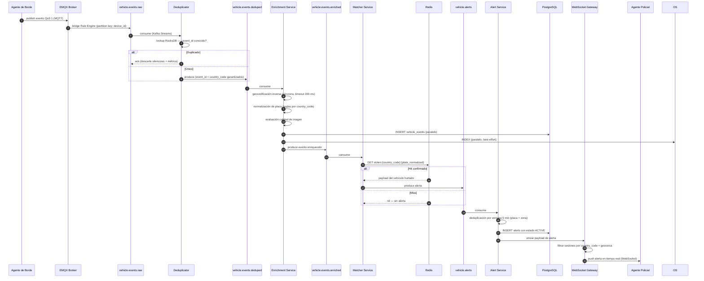

# Backbone de Procesamiento — Visión General

**Componente:** backbone-procesamiento (Pilar 6 — Hot path / Cold path)  
**Versión del documento:** 1.0  
**Última actualización:** 2026-05-13

---

## 1. Narrativa del Backbone

El backbone de procesamiento es el núcleo funcional de la plataforma Anti-Hurto de Vehículos. Recibe los eventos crudos que los agentes de borde publican vía MQTT y los somete a un pipeline ordenado de transformación para garantizar:

- **Exactitud:** eliminar duplicados causados por reintentos QoS 1 del agente.
- **Riqueza:** enriquecer cada evento con geocodificación inversa, normalización de placa por país y evaluación de calidad de imagen.
- **Seguridad pública:** cotejar cada placa contra la lista roja centralizada en Redis y generar alertas a los oficiales de policía relevantes en la zona.
- **Trazabilidad:** proyectar todos los eventos a tres stores de lectura (PostgreSQL, OpenSearch, ClickHouse via CDC) para soportar búsqueda operacional, analítica y auditoría.

El SLO primario del backbone es **p95 < 2 s** desde el `event_timestamp` del evento crudo hasta la entrega de la alerta al WebSocket Gateway (medición end-to-end del hot path completo). El cold path (ClickHouse vía Debezium CDC) opera de forma totalmente asíncrona y su latencia no impacta el SLO de alertas.

---

## 2. Diagrama del Pipeline Completo

```mermaid
flowchart LR
    subgraph INGEST[Capa de Ingestión — upstream]
        MQTT([EMQX Broker])
    end

    subgraph HOT[Hot Path — SLO p95 < 2 s]
        direction TB
        K1([vehicle.events.raw])
        DEDUP[Deduplicator\nKafka Streams + RocksDB]
        K2([vehicle.events.deduped])
        ENR[Enrichment Service\ngeo · placa · imagen]
        K3([vehicle.events.enriched])
        MATCH[Matcher Service\nRedis lookup]
        K4([vehicle.alerts])
        ALERT[Alert Service\ndedup · routing PostGIS]
        WS[WebSocket Gateway\nJWT · geocerca · reconexión]
        POL([Agentes de Policía])

        K1 --> DEDUP --> K2 --> ENR --> K3 --> MATCH --> K4 --> ALERT --> WS --> POL
    end

    subgraph WRITES[Proyecciones de Escritura]
        PG[(PostgreSQL + PostGIS\nevents · alerts · incidents)]
        OS[(OpenSearch\nvehicle-events-{cc}-{YYYY-MM})]
    end

    subgraph COLD[Cold Path — analítica asíncrona]
        DEB[Debezium CDC\nKafka Connect]
        K5([pg.events.cdc])
        CH[(ClickHouse\nKafka Engine Table)]
    end

    subgraph INCIDENT[Gestión de Incidentes]
        INC[incident-service\nmáquina de estados]
        K6([stolen.vehicles.events])
    end

    subgraph DLQ[Dead-Letter Topics]
        DLQ1([vehicle.events.raw.dlq])
        DLQ2([vehicle.events.enriched.dlq])
        DLQ3([vehicle.alerts.dlq])
    end

    MQTT -->|bridge EMQX Rule Engine| K1

    ENR -->|INSERT| PG
    ENR -->|INDEX| OS

    ALERT -->|INSERT| PG

    PG -->|WAL replication| DEB
    DEB --> K5 --> CH

    WS -->|notificaciones pendientes| PG

    INC -->|INSERT + UPDATE| PG
    INC --> K6

    DEDUP -->|event_id nulo o country_code ausente| DLQ1
    ENR -->|geocoding FAILED o coordenadas inválidas| DLQ2
    ALERT -->|alerta sin routing posible| DLQ3
```

### 2.1 Flujo de Secuencia — Hot Path



---

## 3. Glosario de Componentes

| Componente | Abreviatura | Responsabilidad resumida |
|---|---|---|
| **Deduplicator** | DED | Elimina reintentos QoS 1 del agente mediante estado RocksDB con ventana de 24 h. |
| **Enrichment Service** | ENR | Geocodifica coordenadas GPS, normaliza placa por país, evalúa calidad de imagen; proyecta a PostgreSQL y OpenSearch. |
| **Matcher Service** | MAT | Coteja la placa normalizada contra la lista roja en Redis; en caso de hit, produce una alerta al tópico `vehicle.alerts`. |
| **Alert Service** | ALS | Persiste alertas en PostgreSQL, aplica deduplicación por ventana de 5 min y enruta al WebSocket Gateway según geocerca. |
| **WebSocket Gateway** | WS | Gestiona sesiones de agentes policiales (JWT + geocerca), entrega alertas en tiempo real y recupera alertas pendientes en reconexión. |
| **incident-service** | INC | Gestiona el ciclo de vida de recuperación del vehículo (máquina de estados); produce evento `RECOVERED` a `stolen.vehicles.events`. |
| **Debezium CDC** | DEB | Captura cambios del WAL de PostgreSQL y los publica al tópico `pg.events.cdc` para ingestión en ClickHouse. |
| **Schema Registry** | SR | Versiona los schemas Avro de los tópicos Kafka; los productores y consumidores validan contra él antes de serializar/deserializar. |

### 3.1 Tópicos Kafka del Pipeline

| Tópico | Descripción |
|---|---|
| `vehicle.events.raw` | Eventos crudos del agente de borde, recibidos del bridge EMQX. |
| `vehicle.events.deduped` | Eventos únicos después del Deduplicator; se garantiza unicidad de `event_id`. |
| `vehicle.events.enriched` | Eventos enriquecidos con geocodificación, placa normalizada y calidad de imagen. |
| `vehicle.alerts` | Alertas generadas por el Matcher Service ante un match positivo con la lista roja. |
| `stolen.vehicles.events` | Eventos de sincronización de vehículos hurtados (producidos por Country Adapters y por el incident-service). |
| `pg.events.cdc` | Cambios del WAL de PostgreSQL capturados por Debezium; consumidos por ClickHouse. |

---

## 4. SLO p95 < 2 s — Presupuesto de Latencia por Etapa

El SLO **p95 < 2 000 ms** se mide desde el `event_timestamp` del evento crudo (momento de captura en el dispositivo) hasta el timestamp de entrega de la alerta al WebSocket Gateway.

### 4.1 Tabla de Presupuesto de Latencia

| Etapa | Componente | Presupuesto p95 | Acumulado p95 | Métrica Prometheus |
|---|---|---|---|---|
| **Red agente → MQTT broker** | EMQX | ≤ 150 ms | 150 ms | `mqtt_publish_latency_seconds` |
| **Bridge EMQX → Kafka** | EMQX Rule Engine | ≤ 50 ms | 200 ms | `emqx_kafka_bridge_latency_seconds` |
| **Deduplicación** | Deduplicator | ≤ 100 ms | 300 ms | `deduplicator_processing_duration_seconds` |
| **Enriquecimiento** | Enrichment Service | ≤ 300 ms | 600 ms | `enrichment_processing_duration_seconds` |
| **Cotejo Redis** | Matcher Service | ≤ 50 ms | 650 ms | `matcher_redis_duration_seconds` |
| **Procesamiento Matcher** | Matcher Service | ≤ 100 ms | 750 ms | `matcher_processing_duration_seconds` |
| **Alert Service (dedup + persistencia)** | Alert Service | ≤ 200 ms | 950 ms | `alert_processing_duration_seconds` |
| **Entrega WebSocket** | WebSocket Gateway | ≤ 100 ms | 1 050 ms | `ws_delivery_duration_seconds` |
| **Margen de seguridad** | — | 950 ms | **2 000 ms** | — |

> El margen de 950 ms acomoda jitter de red, GC pauses y contención ocasional en Kafka. Si el p95 se acerca a 1 500 ms en producción, el SRE debe revisar el etapa con mayor contribución usando el dashboard `backbone-slo-budget`.

### 4.2 Condiciones del SLO

- **Carga nominal:** hasta 5 000 eventos/seg agregados (todos los países).
- **Eventos de alerta:** proporción ~0.1 % del total de eventos (solo los que producen hit en Redis generan alerta).
- **Excluido del SLO:** el tiempo de captura del ANPR en el dispositivo; la latencia de la red GSM antes de alcanzar el MQTT broker (no controlable por el sistema); el cold path (Debezium → ClickHouse).
- **Ventana de medición:** ventanas de 5 minutos en producción; 1 min en pre-prod con carga sintética.

---

## 5. Referencias Cruzadas

| Documento | Descripción |
|---|---|
| [kafka-topics.md](./kafka-topics.md) | Especificación completa de los 6 tópicos Kafka del pipeline. |
| [adr-geocoding-strategy.md](./adr-geocoding-strategy.md) | Decisión síncrona vs. asíncrona para geocodificación inversa. |
| [adr-matcher-fallback.md](./adr-matcher-fallback.md) | Decisión fail closed vs. fail open en el Matcher Service. |
| [postgresql-schema.md](./postgresql-schema.md) | Perspectiva de escritura a PostgreSQL desde el backbone. |
| [opensearch-schema.md](./opensearch-schema.md) | Perspectiva de indexación en OpenSearch desde el backbone. |
| [deduplicator.md](./deduplicator.md) | Especificación completa del Deduplicator. |
| [enrichment-service.md](./enrichment-service.md) | Especificación completa del Enrichment Service. |
| [matcher-service.md](./matcher-service.md) | Especificación completa del Matcher Service. |
| [alert-service.md](./alert-service.md) | Especificación completa del Alert Service. |
| [websocket-gateway.md](./websocket-gateway.md) | Especificación completa del WebSocket Gateway. |
| [incident-service.md](./incident-service.md) | Especificación completa del incident-service. |
| [debezium-cdc.md](./debezium-cdc.md) | Especificación del conector Debezium y el cold path. |
| [slo-observability.md](./slo-observability.md) | Presupuesto de error, métricas Prometheus y dashboards Grafana. |
| [helm/README.md](./helm/README.md) | Guía de despliegue con Helm en Kubernetes. |
| [terraform/README.md](./terraform/README.md) | Guía de módulos Terraform para infraestructura del backbone. |
| [docs/ingestion-mqtt/overview.md](../ingestion-mqtt/overview.md) | Upstream: ingestión MQTT (Pilar 2). |
| [docs/almacenamiento-lectura/overview.md](../almacenamiento-lectura/overview.md) | Downstream: stores de lectura (almacenamiento-lectura). |
