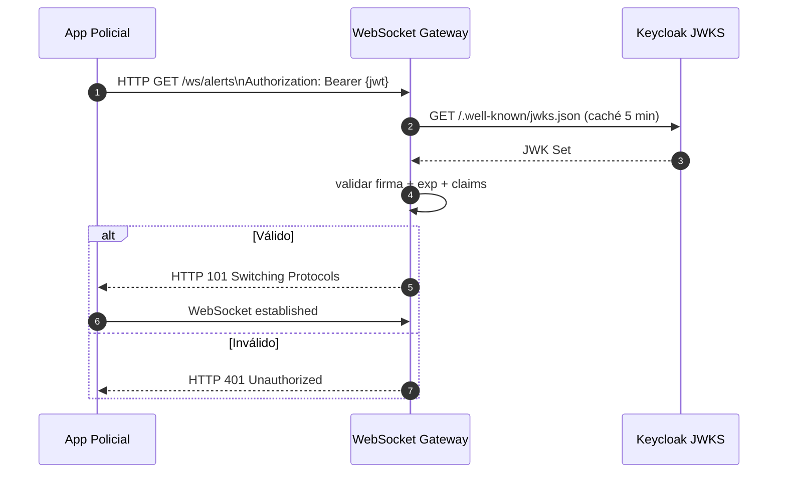
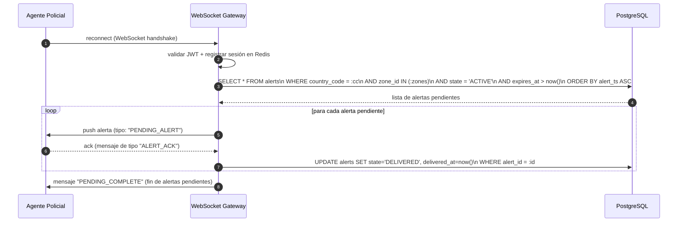

# Backbone de Procesamiento — WebSocket Gateway

**Componente:** backbone-procesamiento → WebSocket Gateway  
**Versión del documento:** 1.0  
**Última actualización:** 2026-05-13

---

## 1. Responsabilidad

El WebSocket Gateway es el punto de entrega de alertas en tiempo real a los agentes de policía. Gestiona conexiones WebSocket persistentes, autentica a los agentes mediante JWT emitido por Keycloak, filtra las alertas entrantes por `country_code` y geocerca (`zone_id`), y garantiza la entrega de alertas pendientes cuando un agente se reconecta.

**Interfaces que expone:**
- **WebSocket** (hacia los clientes policiales): protocolo de mensajería basado en JSON sobre WebSocket estándar (RFC 6455).
- **gRPC interno** (desde el Alert Service): interfaz de envío de alertas para distribución inmediata.
- **HTTP REST** (interno): endpoint de consulta de alertas pendientes por zona (usado en reconexión).

---

## 2. Protocolo WebSocket

### 2.1 URL de Conexión

```
wss://api.antihurto.{country_tld}/ws/alerts
```

Ejemplo: `wss://api.antihurto.co/ws/alerts`

El Gateway está detrás del API Gateway (Kong OSS). La autenticación ocurre en el handshake HTTP antes de upgradar a WebSocket.

### 2.2 Autenticación en el Handshake

El cliente incluye el JWT en el header HTTP `Authorization: Bearer {token}` durante el handshake WebSocket. El Gateway valida el JWT con las siguientes comprobaciones:

1. **Firma:** verificación con la clave pública del realm de Keycloak correspondiente al `country_code` del token (JWKS endpoint de Keycloak). Ver [docs/identidad-seguridad/jwt-claims-schema.md](../identidad-seguridad/jwt-claims-schema.md).
2. **Expiración (`exp`):** el token debe ser válido en el momento del handshake.
3. **Claims obligatorios:** `sub` (user ID), `country_code`, `role` (debe ser `officer`, `supervisor` o `admin`), `zone` (lista de zone IDs a los que el agente tiene acceso).
4. **Audience (`aud`):** debe incluir `antihurto-ws` (configurado en el realm de Keycloak).

Si la validación falla, el Gateway responde con HTTP 401 y no upgrada la conexión.



### 2.3 Registro de Sesión

Tras la autenticación exitosa, el Gateway registra la sesión del agente en Redis:

```
clave  : ws:session:{session_id}
valor  : JSON {user_id, country_code, zones: [...], connected_at, last_ping}
TTL    : 300 s (renovado en cada ping/pong del protocolo WebSocket keep-alive)
```

El `session_id` es un UUID generado por el Gateway en el momento de la conexión. Se incluye en los logs y métricas para correlación.

**Estructura del registro de sesión en Redis:**
```json
{
  "session_id":   "f47ac10b-58cc-4372-a567-0e02b2c3d479",
  "user_id":      "keycloak-user-uuid",
  "country_code": "CO",
  "zones":        ["Z-BOG-1", "Z-BOG-2"],
  "role":         "officer",
  "connected_at": "2026-05-13T14:29:00.000Z",
  "last_ping":    "2026-05-13T14:30:55.000Z"
}
```

**Índice secundario en Redis para routing por zona:**
```
clave  : ws:zone:{country_code}:{zone_id}
tipo   : Set
miembros: [session_id, ...]
TTL    : 300 s (renovado en cada ping)
```

Este índice permite al Gateway encontrar todas las sesiones activas de una zona en O(1) sin escanear todas las sesiones.

---

## 3. Filtrado por `country_code` + Geocerca

Cuando el Alert Service envía una alerta, el Gateway aplica el siguiente filtro de distribución:

```
PARA cada alerta recibida con {country_code, zone_id}:
    sesiones := SMEMBERS ws:zone:{country_code}:{zone_id}
    SI sesiones está vacío:
        incrementar ws_alerts_no_active_agents
        RETORNAR (alerta queda ACTIVE en PostgreSQL para reconexión)

    PARA cada session_id EN sesiones:
        sessión := GET ws:session:{session_id}
        SI sesión ES nula (TTL expirado):
            SREM ws:zone:{country_code}:{zone_id} session_id
            CONTINUAR
        websocket_connections[session_id].send(payload_alerta)
        incrementar ws_alerts_delivered
```

**Garantía de aislamiento multi-tenant (CA-18):**
- La clave del índice incluye `country_code`: las sesiones venezolanas (`ws:zone:VE:*`) son completamente separadas de las colombianas (`ws:zone:CO:*`).
- Un agente colombiano no puede suscribirse a zonas venezolanas: el JWT solo contiene zonas del realm de Keycloak `country_code=CO`.

---

## 4. Entrega de Alertas Pendientes en Reconexión (CR-06)

Cuando un agente se reconecta exitosamente (handshake WebSocket completado), el Gateway ejecuta automáticamente la entrega de alertas pendientes:



**Ventana de retención de alertas pendientes:** configurable, por defecto `expires_at = alert_ts + 24 h`. Alertas con `expires_at < now()` se procesan como `EXPIRED` por un CronJob de limpieza y no se envían en reconexión.

---

## 5. Esquema del Payload de Alerta

El payload enviado por WebSocket al cliente policial tiene el siguiente formato JSON:

```json
{
  "type":    "NEW_ALERT",
  "payload": {
    "alert_id":         "77a1b2c3-d4e5-6789-abcd-ef0123456789",
    "event_id":         "550e8400-e29b-41d4-a716-446655440000",
    "country_code":     "CO",
    "plate_normalized": "ABC123X",
    "zone_id":          "Z-BOG-1",
    "location": {
      "lat": 4.7109,
      "lon": -74.0721
    },
    "street":           "Av. El Dorado",
    "city":             "Bogotá",
    "alert_ts":         "2026-05-13T14:30:00.700Z",
    "event_ts":         "2026-05-13T14:30:00.000Z",
    "thumbnail_uri":    "https://cdn.antihurto.co/events/2026/05/13/550e8400_thumb.jpg",
    "image_uri":        "https://cdn.antihurto.co/events/2026/05/13/550e8400.jpg",
    "confidence":       97.5,
    "stolen_vehicle": {
      "brand":          "Chevrolet",
      "line":           "Spark",
      "color":          "Rojo",
      "model_year":     2020,
      "stolen_at":      "2025-11-01T08:00:00Z",
      "stolen_location": "Bogotá, Cundinamarca"
    }
  }
}
```

> Las URLs de imagen en el payload son URLs pre-firmadas de corta duración (TTL 5 min) generadas por el Gateway en el momento de la entrega. El cliente debe solicitar nuevas URLs si necesita acceder a la imagen después del TTL.

### 5.1 Tipos de Mensaje del Protocolo

| `type` | Dirección | Descripción |
|---|---|---|
| `NEW_ALERT` | Server → Client | Nueva alerta en tiempo real. |
| `PENDING_ALERT` | Server → Client | Alerta pendiente enviada en reconexión. |
| `PENDING_COMPLETE` | Server → Client | Fin del replay de alertas pendientes. |
| `ALERT_ACK` | Client → Server | Acuse de recibo de una alerta (incluye `alert_id`). |
| `PING` | Client → Server | Keep-alive del cliente (responde con `PONG`). |
| `PONG` | Server → Client | Respuesta al `PING`. |
| `ERROR` | Server → Client | Error de protocolo o autenticación expirada. |

### 5.2 Keep-alive y Timeout de Sesión

- El cliente debe enviar un `PING` cada 60 segundos.
- El servidor responde con `PONG`.
- Si no se recibe ningún mensaje del cliente en 120 segundos, el Gateway cierra la conexión y elimina la sesión de Redis.

---

## 6. Renovación de Token JWT

El JWT de Keycloak tiene una vida útil típica de 5 minutos (configurable por realm). Para sesiones WebSocket de larga duración:

- El cliente envía el nuevo token en un mensaje de tipo especial `TOKEN_REFRESH` con el campo `token: "{nuevo_jwt}"`.
- El Gateway revalida el nuevo token; si es válido, actualiza la sesión. Si es inválido o expirado, cierra la conexión con código 4001 (autenticación expirada).

---

## 7. Métricas Prometheus

| Métrica | Tipo | Descripción |
|---|---|---|
| `ws_active_sessions` | Gauge | Número de sesiones WebSocket activas; label `country_code`. |
| `ws_connections_total` | Counter | Total de conexiones establecidas (handshake exitoso). |
| `ws_disconnections_total` | Counter | Total de desconexiones; label `reason` (`normal_close`, `timeout`, `auth_expired`). |
| `ws_auth_failures_total` | Counter | Intentos de conexión con JWT inválido o expirado. |
| `ws_alerts_delivered_total` | Counter | Alertas entregadas exitosamente (tiempo real + reconexión). |
| `ws_alerts_no_active_agents_total` | Counter | Alertas donde no había sesiones activas en la zona. |
| `ws_pending_alerts_delivered_total` | Counter | Alertas pendientes entregadas en reconexión. |
| `ws_delivery_duration_seconds` | Histogram | Latencia desde recepción de la alerta hasta entrega al WebSocket. Objetivo p95 < 100 ms. |
| `ws_sessions_per_zone` | Gauge | Sesiones activas por zone; labels `country_code`, `zone_id`. |

---

## 8. Despliegue

El WebSocket Gateway es un servicio **stateless** respecto al estado de alertas (el estado se almacena en Redis y PostgreSQL). Sin embargo, las conexiones WebSocket son persistentes y están ancladas a instancias específicas. Por ello:

- Se usa un `Service` de Kubernetes con **affinity de sesión** (sticky sessions basadas en `session_id` cookie o IP hash) para que las reconexiones del mismo cliente vayan preferentemente a la misma instancia.
- Si una instancia muere, el cliente reconecta a otra instancia; el Gateway recupera el estado de sesión desde Redis y las alertas pendientes desde PostgreSQL.

```yaml
replicas: 3
resources:
  requests:
    cpu: "250m"
    memory: "256Mi"
  limits:
    cpu: "1000m"
    memory: "1Gi"
```

---

## 9. Criterios de Aceptación Cubiertos

| CA/CR | Verificación |
|---|---|
| CA-13: Alerta entregada a agente en zona correcta | Filtro por `country_code + zone_id` en el índice Redis; agentes de otras zonas no reciben la alerta. |
| CA-14: SLO p95 < 2 s (contribución del Gateway) | `ws_delivery_duration_seconds` p95 < 100 ms. |
| CA-18: Aislamiento multi-tenant | Claves Redis segmentadas por `country_code`; JWT valida `country_code` contra realm de Keycloak. |
| CR-05: Sin agentes activos — sin error | `ws_alerts_no_active_agents_total` incrementa; alerta queda ACTIVE para reconexión. |
| CR-06: Reconexión — alertas pendientes entregadas | SELECT de alertas ACTIVE para las zonas del agente; push inmediato tras reconexión exitosa. |
