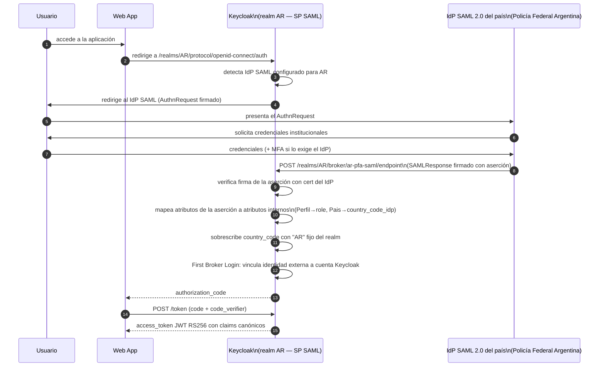
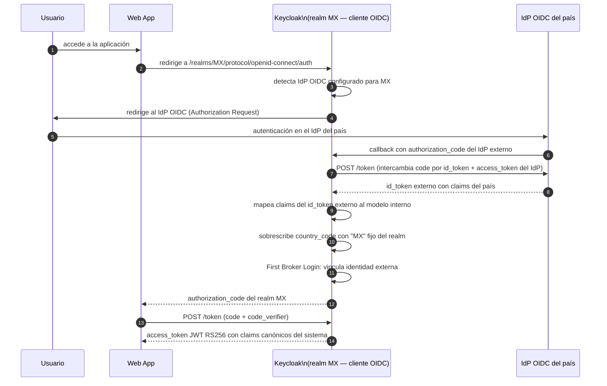

# Federación SAML 2.0 y OIDC — Identity Provider Broker

**Módulo:** `identidad-seguridad`
**Versión:** 1.0
**Última actualización:** 2026-05-13

---

## 1. Descripción general

Cuando un país ya cuenta con un IdP institucional que soporta SAML 2.0 o OIDC, Keycloak actúa como **SP (Service Provider)** para SAML o como **cliente OIDC** para el IdP externo. En este modelo, Keycloak delega la autenticación al IdP del país y consume la aserción/claims resultante para emitir el JWT canónico del sistema.

Esta modalidad aplica a países como Argentina (IdP SAML 2.0 de la Policía Federal) y cualquier país con una infraestructura de identidad corporativa estándar.

---

## 2. Flujo SAML 2.0 Web SSO (SP-initiated)



---

## 3. Flujo OIDC Authorization Code con IdP externo



---

## 4. Parámetros de configuración del IdP en Keycloak

### 4.1 IdP SAML 2.0

| Parámetro Keycloak | Descripción | Ejemplo |
|---|---|---|
| `alias` | Identificador interno del IdP en el realm | `ar-pfa-saml` |
| `displayName` | Nombre visible en la pantalla de login | `Policía Federal Argentina` |
| `singleSignOnServiceUrl` | Endpoint SSO del IdP SAML | `https://idp.policia.ar/saml/sso` |
| `singleLogoutServiceUrl` | Endpoint de logout del IdP SAML | `https://idp.policia.ar/saml/slo` |
| `signingCertificate` | Certificado público del IdP para verificar firmas | PEM del certificado del IdP; almacenado en Vault: `vault kv get secret/keycloak/idp-ar-saml/signing-cert` |
| `wantAuthnRequestsSigned` | Keycloak firma el AuthnRequest | `true` |
| `validateSignature` | Keycloak verifica la firma de la aserción | `true` |
| `nameIDPolicyFormat` | Formato del NameID solicitado | `urn:oasis:names:tc:SAML:1.1:nameid-format:unspecified` |
| `principalAttribute` | Atributo de la aserción usado como identificador único | `uid` o `email` según el IdP |

### 4.2 IdP OIDC

| Parámetro Keycloak | Descripción | Ejemplo |
|---|---|---|
| `alias` | Identificador interno del IdP en el realm | `mx-sspc-oidc` |
| `authorizationUrl` | Endpoint de autorización del IdP | `https://idp.sspc.gob.mx/oauth2/authorize` |
| `tokenUrl` | Endpoint de token del IdP | `https://idp.sspc.gob.mx/oauth2/token` |
| `userInfoUrl` | Endpoint userinfo del IdP | `https://idp.sspc.gob.mx/oauth2/userinfo` |
| `jwksUrl` | Endpoint JWKS del IdP para verificar id_token | `https://idp.sspc.gob.mx/.well-known/jwks.json` |
| `clientId` | Client ID registrado en el IdP del país | `keycloak-sistema-antihurto` |
| `clientSecret` | Secreto del cliente OIDC | Almacenado en Vault: `vault kv get secret/keycloak/idp-mx-oidc/client-secret` |
| `defaultScopes` | Scopes solicitados al IdP | `openid profile email` |

---

## 5. Mapeo de atributos/claims externos a atributos internos

### 5.1 Mapeo desde SAML (aserción)

| Atributo en aserción SAML | Atributo Keycloak | Claim JWT | Regla |
|---|---|---|---|
| `Perfil` / `perfil` | `role` | `role` | Valor de la aserción SAML; debe mapearse a los cinco roles canónicos |
| `Pais` / `país` | `country_code_idp` | — | Solo informativo; el claim `country_code` se fija por realm |
| `UID` / `mail` | `username` / `email` | `preferred_username` / `email` | Identificador del usuario en el IdP |
| `CN` / `givenName` | `firstName` | `given_name` | Nombre del usuario |
| `SN` / `surname` | `lastName` | `family_name` | Apellido |
| `Department` / `zona` | `zone` | `zone` | Zona geográfica |

### 5.2 Regla de override de `country_code`

**El claim `country_code` del IdP externo (SAML o OIDC) nunca se usa como fuente del claim `country_code` del JWT del sistema.**

Independientemente de lo que el IdP externo devuelva en su aserción o claims, Keycloak siempre aplica el Hardcoded claim mapper del realm que fija `country_code = "AR"` (o el código del país correspondiente). Esto garantiza que:

1. Un IdP mal configurado no puede emitir tokens con `country_code` incorrecto.
2. Un IdP comprometido no puede elevarse a otro país.

---

## 6. First Broker Login — vinculación de identidades externas

Cuando un usuario se autentica por primera vez a través de un IdP externo (SAML u OIDC), Keycloak ejecuta el flujo **First Broker Login** para vincular la identidad externa a una cuenta en el realm.

Configuración recomendada para el sistema:

| Opción | Configuración | Justificación |
|---|---|---|
| `Review Profile` | `off` | Los atributos provienen del IdP del país; el usuario no debe modificarlos |
| `Automatically Link Existing Account` | `on` si el email es verificado por el IdP | Permite vincular con cuenta preexistente |
| `Create New Account if Not Exists` | `on` | Crea una cuenta de Keycloak automáticamente |
| `Verify Email` | `off` (si el IdP verifica el email) | Evitar paso adicional si el IdP ya valida el email |

---

## 7. Pasos de onboarding para un nuevo país con IdP SAML

1. **Obtener metadatos del IdP SAML del país** (XML con entidad, endpoints y certificado de firma).
2. **Almacenar el certificado del IdP en Vault:**

   ```bash
   vault kv put secret/keycloak/idp-ar-saml/signing-cert \
     cert="$(cat ar-idp-signing.pem)"
   ```

3. **Registrar el IdP en Keycloak** vía API de administración o Terraform:

   ```bash
   # POST /admin/realms/AR/identity-provider/instances
   curl -X POST \
     -H "Authorization: Bearer ${ADMIN_TOKEN}" \
     -H "Content-Type: application/json" \
     -d @ar-saml-idp-config.json \
     "${KEYCLOAK_URL}/admin/realms/AR/identity-provider/instances"
   ```

4. **Configurar los mappers** de atributos de aserción SAML a atributos internos de Keycloak.
5. **Verificar con usuario de prueba** del IdP del país.
6. **Obtener los metadatos SP de Keycloak** para registrar Keycloak como SP en el IdP del país:

   ```
   GET /realms/AR/broker/ar-pfa-saml/endpoint/descriptor
   ```

7. **Activar el IdP en el realm** y verificar el flujo completo de autenticación.
