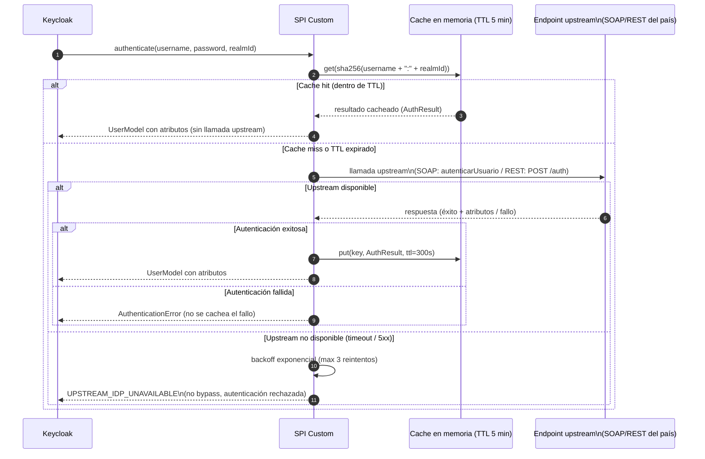

# Federación SPI Custom — Endpoints SOAP/REST Legacy

**Módulo:** `identidad-seguridad`
**Versión:** 1.0
**Última actualización:** 2026-05-13

---

## 1. Descripción general

Algunos países del sistema utilizan servicios de autenticación propietarios (SOAP legacy, REST no estándar) que no pueden ser integrados mediante los User Storage SPIs nativos de Keycloak (LDAP o JDBC). Para estos casos se implementa un **SPI custom (User Storage Provider)** que actúa como adaptador entre Keycloak y el endpoint de autenticación del país.

La decisión de caché está documentada en [adr-spi-cache.md](./adr-spi-cache.md).

---

## 2. Flujo de autenticación con SPI custom



---

## 3. Contrato de la interfaz del adaptador

El SPI custom implementa la interfaz `UserStorageProvider` de Keycloak. La lógica de integración con el sistema del país está encapsulada en el adaptador específico del endpoint.

### Input

```java
// Parámetros de autenticación recibidos de Keycloak
AuthInput {
    String username;       // Nombre de usuario
    String password;       // Contraseña en claro (solo para validación, nunca se almacena)
    String realmId;        // ID del realm (ej: "VE")
    String countryCode;    // country_code del realm (ej: "VE")
}
```

### Output (en caso de éxito)

```java
// Atributos del usuario devueltos al SPI para crear el UserModel de Keycloak
AuthResult {
    String userId;         // ID único del usuario en el sistema del país
    String username;       // Nombre de usuario
    String email;          // Correo electrónico (puede ser nulo)
    String givenName;      // Nombre
    String familyName;     // Apellido
    String role;           // Rol canónico: officer, supervisor, analyst, admin, auditor
    String zone;           // Zona geográfica asignada
}
```

### Errores definidos

| Código de error | Descripción |
|---|---|
| `INVALID_CREDENTIALS` | Credenciales incorrectas (respuesta del upstream) |
| `UPSTREAM_IDP_UNAVAILABLE` | El endpoint upstream no responde o devuelve 5xx |
| `UPSTREAM_TIMEOUT` | El endpoint upstream no responde en el tiempo configurado |
| `MISSING_ROLE_CLAIM` | El upstream responde con éxito pero no devuelve el atributo de rol |
| `MAPPING_ERROR` | Error al mapear la respuesta del upstream al modelo canónico |

---

## 4. Especificación de la caché en memoria

| Parámetro | Valor | Descripción |
|---|---|---|
| **Clave** | `sha256(username + ":" + realmId)` | La contraseña nunca forma parte de la clave de caché |
| **Valor cacheado** | `AuthResult` (atributos del usuario, sin contraseña) | Solo se cachea el resultado exitoso |
| **TTL** | `300 s` (5 minutos, configurable) | Tiempo máximo de vida de la entrada en caché |
| **Persistencia** | Ninguna — caché en memoria del proceso | La caché se vacía al reiniciar el pod de Keycloak |
| **Ámbito** | Por instancia de Keycloak (no compartida entre pods) | En un cluster de 3 pods, cada pod tiene su propia caché |
| **Máximo de entradas** | `10 000` (configurable) | Previene consumo excesivo de memoria |
| **Política de evicción** | LRU (Least Recently Used) | Al alcanzar el máximo, se evictan las entradas menos recientes |

Los fallos de autenticación (`INVALID_CREDENTIALS`) nunca se cachean para evitar que un intento fallido bloquee al usuario legítimo durante el TTL.

---

## 5. Comportamiento ante fallo del upstream

El SPI custom implementa backoff exponencial ante fallos del upstream para proteger el servicio del país de una avalancha de reintentos:

- **Reintento 1:** inmediato tras el fallo inicial.
- **Reintento 2:** 500 ms después del primer reintento.
- **Reintento 3:** 1 s después del segundo reintento.
- **Tras 3 reintentos sin éxito:** el SPI devuelve `UPSTREAM_IDP_UNAVAILABLE` a Keycloak. Keycloak responde con HTTP 401 al cliente. No existe bypass.

**No hay modo degradado que permita el acceso sin validación upstream.** Esta es la consecuencia del ADR-spi-cache: la caché mitiga el impacto de interrupciones breves, pero no reemplaza la validación upstream para usuarios sin caché activa.

### Métricas de observabilidad

| Métrica | Descripción |
|---|---|
| `spi.upstream.errors{realm, country_code}` | Contador de errores en llamadas al upstream |
| `spi.upstream.latency_ms{realm, country_code}` | Histograma de latencia de llamadas upstream (ms) |
| `spi.cache.hits{realm}` | Contador de autenticaciones resueltas desde caché |
| `spi.cache.misses{realm}` | Contador de autenticaciones que requirieron llamada upstream |
| `spi.auth.failures{realm, error_code}` | Contador de fallos de autenticación por código de error |

---

## 6. Empaquetado y despliegue

El SPI custom se puede desplegar de dos formas:

### Opción A — JAR Keycloak SPI (recomendada para entornos estables)

```
/opt/keycloak/providers/
  country-spi-{country_code}-{version}.jar
```

El JAR contiene el `UserStorageProvider`, el `UserStorageProviderFactory` y la implementación del cliente del endpoint del país (SOAP stub generado por `wsimport` o cliente HTTP/REST). Se añade como `initContainer` en el Helm chart:

```yaml
initContainers:
  - name: copy-spi-jar
    image: artifacts.sistema.com/keycloak-spis:{version}
    command: ["cp", "/spis/country-spi-ve-1.0.jar", "/opt/keycloak/providers/"]
    volumeMounts:
      - mountPath: /opt/keycloak/providers
        name: providers
```

### Opción B — Sidecar container

Para endpoints con lógica de integración muy compleja o que requieren dependencias difíciles de empaquetar en un JAR, el SPI custom puede actuar como cliente de un sidecar que expone una API REST interna simplificada:

```
Keycloak (SPI-HTTP-client) --[localhost:8090]--> Sidecar (adapter del país)
                                                       |
                                                       v
                                               Endpoint SOAP/REST del país
```

---

## 7. Registro del provider en Keycloak

```bash
# Registrar el SPI custom como User Storage Provider para el realm VE
# POST /admin/realms/VE/components

curl -X POST \
  -H "Authorization: Bearer ${ADMIN_TOKEN}" \
  -H "Content-Type: application/json" \
  -d '{
    "name": "ve-soap-provider",
    "providerId": "country-soap-spi",
    "providerType": "org.keycloak.storage.UserStorageProvider",
    "config": {
      "priority": ["1"],
      "upstreamUrl": ["https://servicios.policia.ve/auth/autenticar"],
      "upstreamTimeout": ["10000"],
      "cache.enabled": ["true"],
      "cache.ttl_seconds": ["300"],
      "cache.max_entries": ["10000"]
    }
  }' \
  "${KEYCLOAK_URL}/admin/realms/VE/components"
```

---

## 8. Guía de implementación para nuevo país con endpoint SOAP

1. **Obtener el WSDL** del servicio SOAP del país (ej: `https://servicios.policia.xx/auth?wsdl`).
2. **Generar el stub Java** con `wsimport` o `Apache CXF`:

   ```bash
   wsimport -s src/main/java -p com.sistema.spi.soap.xx \
     https://servicios.policia.xx/auth?wsdl
   ```

3. **Implementar `AuthCountryAdapter`** que adapta la respuesta SOAP al `AuthResult` canónico.
4. **Mapear los atributos** de la respuesta SOAP a los claims canónicos (`role`, `zone`, `email`, `given_name`, `family_name`).
5. **Empaquetar como JAR** y añadirlo al initContainer del Helm chart.
6. **Registrar el provider** en el realm del país vía API de administración de Keycloak o Terraform.
7. **Verificar** el flujo completo con un usuario de prueba del sistema del país.
