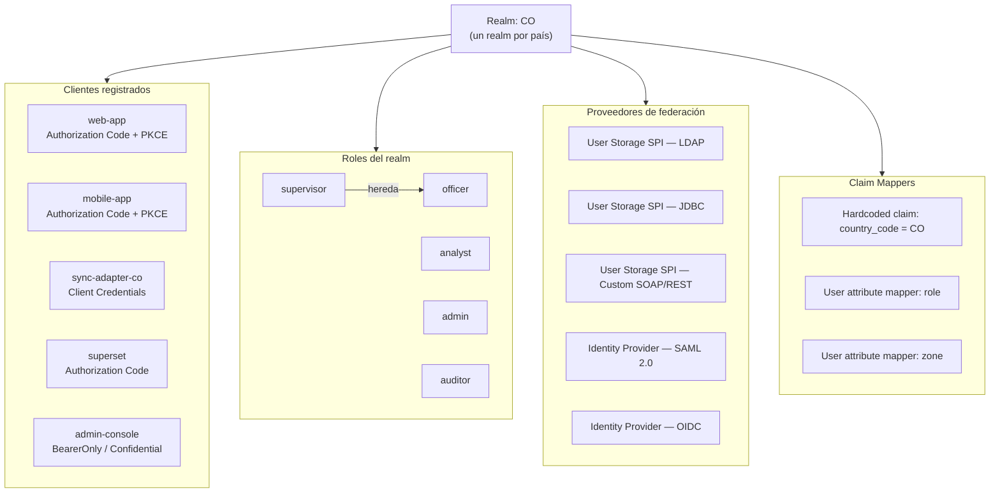

# Modelo de Realm de Keycloak

**Módulo:** `identidad-seguridad`
**Versión:** 1.0
**Última actualización:** 2026-05-13

---

## 1. Estructura de un realm

Cada país del sistema tiene un realm dedicado en Keycloak. Todos los realms siguen la misma estructura base, parametrizada por país.

---

## 2. Clientes registrados por realm

| Cliente | Flujo OAuth 2.0 | Tipo | Descripción |
|---|---|---|---|
| `web-app` | Authorization Code + PKCE | Public | Aplicación web React. El usuario es redirigido a Keycloak para autenticarse. |
| `mobile-app` | Authorization Code + PKCE | Public | Aplicación móvil para oficiales en terreno (fase futura). |
| `sync-adapter-{country}` | Client Credentials | Confidential | Adaptador de sincronización de vehículos hurtados. Secreto almacenado en Vault. |
| `superset` | Authorization Code | Confidential | Dashboard analítico Apache Superset. SSO desde la web app. |
| `admin-console` | Bearer-only | Confidential | Consola de administración interna. Valida JWT de operadores. |
| `upload-service` | Client Credentials | Confidential | Upload Service para pre-signed URLs. Secreto en Vault. |

---

## 3. Configuración de sesión y tokens

| Parámetro | Valor por defecto | Descripción |
|---|---|---|
| `accessTokenLifespan` | `300 s` (5 min) | TTL del access token (JWT). Tras expiración, se usa el refresh token. |
| `refreshTokenMaxReuse` | `0` (sin reutilización) | Rotación activa de refresh token: cada uso genera uno nuevo. |
| `ssoSessionIdleTimeout` | `1800 s` (30 min) | Sesión SSO inactiva se cierra. |
| `ssoSessionMaxLifespan` | `36000 s` (10 h) | Duración máxima de sesión SSO independientemente de actividad. |
| `offlineSessionIdleTimeout` | `2592000 s` (30 días) | Para sessiones offline (refresh token de larga duración). |
| `refreshTokenLifespan` | `1800 s` (30 min) | TTL del refresh token tras su última renovación. |
| Key rotation | `90 días` | El par de claves RS256 del realm se rota cada 90 días. La clave anterior permanece en JWKS durante 30 días adicionales. |

### Rotación activa de refresh token

Cuando la rotación de refresh token está activa (`refreshTokenMaxReuse=0`):

- Cada uso del refresh token invalida el token presentado y emite uno nuevo.
- Si un refresh token ya usado se presenta nuevamente, Keycloak detecta reutilización, invalida toda la sesión del usuario y registra el evento como `REFRESH_TOKEN_REUSE_DETECTED`.

---

## 4. SSO entre clientes del mismo realm

Keycloak gestiona SSO a nivel de realm. Un usuario autenticado en `web-app` tiene una sesión SSO activa. Al acceder a `superset` (que pertenece al mismo realm), Keycloak detecta la sesión activa y emite un nuevo access token para `superset` sin solicitar credenciales.

El SSO se implementa mediante cookie de sesión Keycloak (`KEYCLOAK_SESSION`) con `SameSite=Lax` y `Secure=true`.

No existe SSO entre realms (entre países): la sesión de un realm `CO` no es reconocida por el realm `MX`.

---

## 5. Configuración de MFA por realm

| Parámetro | Descripción |
|---|---|
| `otpPolicy` | TOTP (Time-based One-Time Password) con HOTP como alternativa. Compatible con Google Authenticator, Authy, FreeOTP. |
| `browserFlowRequiredActions` | `CONFIGURE_TOTP` se configura como acción requerida para roles `supervisor`, `analyst`, `admin`, `auditor`. El rol `officer` puede ser excluido por país. |
| `mfaProvider` | Heredado del IdP del país si el IdP SAML/OIDC ya implementa MFA: Keycloak puede confiar en el claim `acr_values` del IdP. |
| `pushNotification` | Disponible vía proveedor externo de MFA (integración opcional por país). |

La configuración exacta de MFA (roles obligados, método permitido) se parametriza por realm y puede diferir entre países según sus requisitos de seguridad.

---

## 6. Política de contraseñas

La política de contraseñas de Keycloak se aplica cuando el usuario gestiona su contraseña directamente en Keycloak (no aplica cuando la contraseña es validada en el IdP externo federado).

Parámetros configurables por realm:

| Parámetro | Valor recomendado |
|---|---|
| `length` | Mínimo 12 caracteres |
| `upperCase` | Al menos 1 mayúscula |
| `lowerCase` | Al menos 1 minúscula |
| `digits` | Al menos 1 dígito |
| `specialChars` | Al menos 1 carácter especial |
| `notUsername` | Contraseña no puede ser igual al nombre de usuario |
| `passwordHistory` | Últimas 5 contraseñas no pueden reutilizarse |
| `hashIterations` | 210 000 iteraciones PBKDF2-HMAC-SHA256 (estándar NIST 2024) |

---

## 7. Backend de PostgreSQL para Keycloak

Keycloak almacena toda su configuración, usuarios importados y sesiones en PostgreSQL.

| Parámetro | Configuración |
|---|---|
| **Driver** | `org.postgresql.Driver` |
| **JDBC URL** | `jdbc:postgresql://{pg_host}:5432/keycloak?sslmode=require` |
| **Credenciales** | Inyectadas por Vault Agent sidecar desde `secret/keycloak/db`. Nunca en variables de entorno. |
| **Pool** | HikariCP: `minimumIdle=10`, `maximumPoolSize=50`, `connectionTimeout=30000` |
| **HA** | PostgreSQL con Patroni (on-prem) o servicio gestionado (RDS, Cloud SQL, Aurora). Keycloak se conecta al endpoint de escritura (primario) vía PgBouncer o JDBC de alta disponibilidad. |
| **Backups** | PITR habilitado; backup completo diario; retención 30 días. Crítico: incluir en el plan de DR. |
