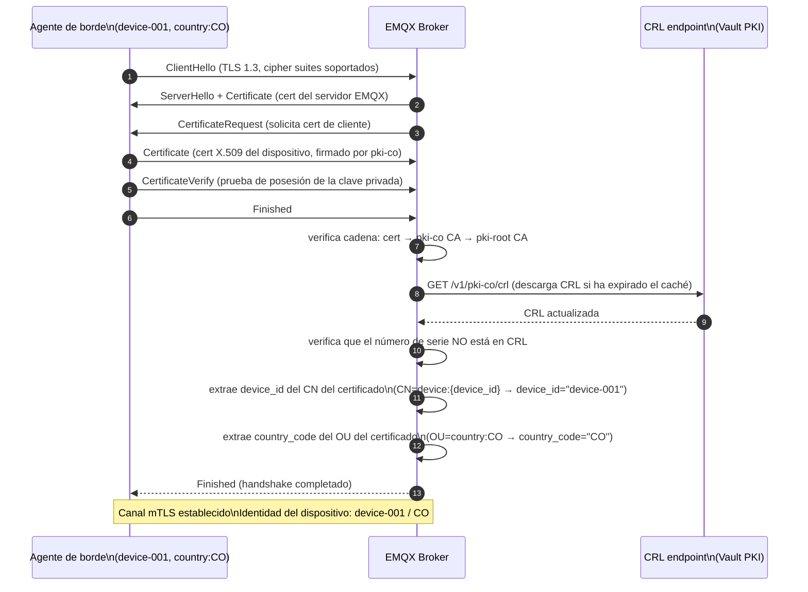
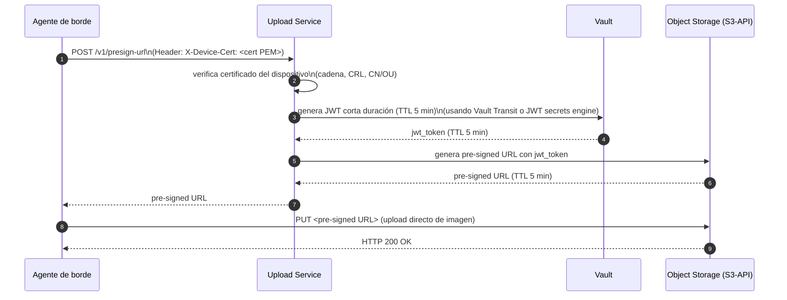

# Política de mTLS para Dispositivos

**Módulo:** `identidad-seguridad`
**Versión:** 1.0
**Última actualización:** 2026-05-13

---

## 1. Handshake TLS 1.3 con certificado de cliente



---

## 2. Especificación ACL de EMQX por `device_id`

La ACL evalúa los permisos de publicación y suscripción usando el `device_id` extraído del CN del certificado como username interno de EMQX.

| Patrón de tópico | Operación | Acción | Descripción |
|---|---|---|---|
| `devices/{device_id}/events` | PUBLISH | ALLOW | El dispositivo publica sus propios eventos de captura |
| `devices/{device_id}/images` | PUBLISH | ALLOW | El dispositivo publica la URI de imagen |
| `devices/{device_id}/health` | PUBLISH | ALLOW | El dispositivo publica heartbeat y métricas de salud |
| `devices/+/events` | SUBSCRIBE | DENY | Un dispositivo no puede suscribirse a eventos de otros |
| `devices/+/health` | SUBSCRIBE | DENY | Un dispositivo no puede suscribirse a datos de salud de otros |
| `config/{device_id}/#` | SUBSCRIBE | ALLOW | El dispositivo recibe su configuración y actualizaciones OTA |
| `config/+/#` | SUBSCRIBE | DENY | Un dispositivo no puede leer configuración de otros dispositivos |
| `bloomfilter/{country_code}/#` | SUBSCRIBE | ALLOW | El dispositivo recibe actualizaciones del Bloom filter de su país |
| `bloomfilter/+/#` | SUBSCRIBE | DENY si `country_code` no coincide | Un dispositivo no puede recibir Bloom filters de otros países |
| `#` | PUBLISH | DENY (default) | Todo lo no listado explícitamente está denegado |

La evaluación de ACL es en el critical path de publicación: EMQX la realiza localmente usando el CN del certificado, sin consultar ningún servicio externo durante la publicación de mensajes.

### Ejemplo de rechazo de ACL

Si `device-003` (CN=`device:device-003`) intenta publicar en `devices/device-999/events`:

1. EMQX extrae `device_id = "device-003"` del CN del certificado.
2. Evalúa la ACL: `devices/device-999/events` contra `devices/{device_id}/events` → `device_id ≠ device-999` → DENY.
3. Para MQTT 5: responde con PUBACK con código de razón `0x87 Not Authorized`.
4. El dispositivo sigue conectado y puede publicar en sus propios tópicos.
5. El rechazo queda registrado en los logs de EMQX con `device_id` y tópico denegado.

---

## 3. Flujo alternativo — Upload Service con JWT de corta duración

Para la subida de imágenes al object storage, el dispositivo usa el Upload Service con un JWT de corta duración emitido por Vault, no el certificado mTLS directamente:



El JWT de corta duración (TTL 5 minutos) garantiza que incluso si la URL pre-firmada es interceptada, su ventana de uso es mínima.

---

## 4. Configuración de EMQX para mTLS

```erlang
## emqx.conf — configuración del listener SSL externo

listener.ssl.external = 8883
listener.ssl.external.cacertfile = /vault/secrets/pki-root-ca-chain.pem
listener.ssl.external.certfile   = /vault/secrets/emqx-server.crt
listener.ssl.external.keyfile    = /vault/secrets/emqx-server.key

## Requerir certificado de cliente (mTLS)
listener.ssl.external.verify               = verify_peer
listener.ssl.external.fail_if_no_peer_cert = true

## TLS 1.3 únicamente
listener.ssl.external.tls_versions = tlsv1.3

## Cipher suites TLS 1.3
listener.ssl.external.ciphers = TLS_AES_256_GCM_SHA384:TLS_CHACHA20_POLY1305_SHA256

## Verificación de CRL
listener.ssl.external.crl_check                   = true
listener.ssl.external.crl_cache_http_timeout       = 300
listener.ssl.external.crl_cache_http_refresh_time  = 300

## El plugin de ACL por certificado extrae el CN del cert
listener.ssl.external.peer_cert_as_username = cn

## ACL por certificado
acl_nomatch = deny
allow_anonymous = false
```

Los certificados de servidor de EMQX y la cadena de CAs son inyectados por Vault Agent sidecar en `/vault/secrets/`. La cadena de CA (`pki-root-ca-chain.pem`) incluye la root CA y todas las CAs intermedias de los países activos.
