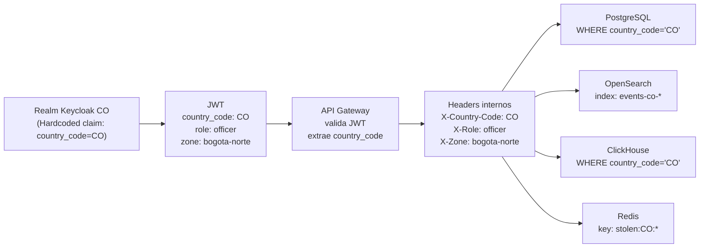

# Seguridad Multi-tenant

**Módulo:** `identidad-seguridad`
**Versión:** 1.0
**Última actualización:** 2026-05-13

---

## 1. Modelo de aislamiento técnico

El sistema implementa aislamiento multi-tenant en dos capas complementarias:

| Capa | Barrera técnica | Qué aísla |
|---|---|---|
| **Capa de autenticación** | Realm de Keycloak (uno por país) | Sesiones, tokens, usuarios, federación, claves de firma |
| **Capa de datos** | Claim `country_code` en JWT | Particionamiento de tablas, aliases de índice, prefijos de clave |

Estas dos capas son independientes y se refuerzan mutuamente. Un fallo en una capa no compromete a la otra.

---

## 2. Los cinco controles de aislamiento técnico

1. **Realm como barrera de autenticación (Keycloak):** cada país tiene su propio realm con claves de firma RS256 independientes. Un token emitido por el realm `CO` no puede ser verificado contra el JWKS del realm `MX` ni viceversa. No existe ningún flujo de cross-realm federation. Este control es técnicamente ineludible: no es una cuestión de configuración sino de separación criptográfica.

2. **Claim `country_code` fijado por el realm (inmutable):** el claim `country_code` es un Hardcoded claim mapper configurado en el realm. No puede ser sobreescrito por el usuario, por la fuente de identidad federada ni por el cliente. Este control garantiza que todos los servicios downstream que reciben el JWT pueden confiar en `country_code` sin validación adicional.

3. **Filtrado de datos en capa de almacenamiento:** todas las tablas de PostgreSQL, índices de OpenSearch y claves de Redis incluyen `country_code` como parte de su clave o partición. Las consultas de los servicios internos siempre incluyen `WHERE country_code = $1` o equivalente, usando el valor del header `X-Country-Code` inyectado por el API Gateway.

4. **Filtrado de datos en el API Gateway:** el API Gateway extrae `country_code` del JWT verificado y lo inyecta como header interno. Los servicios internos no necesitan re-validar el JWT; confían en el header. Si un servicio interno recibe una solicitud sin el header `X-Country-Code`, la rechaza con error 500 (indica un problema de configuración del API Gateway, no un intento legítimo).

5. **Aislamiento de secrets por país en Vault:** los secretos de infraestructura de cada país se almacenan en paths separados en Vault (`secret/keycloak/ldap-co/`, `secret/keycloak/ldap-mx/`). Las políticas de Vault garantizan que el adaptador de Colombia solo puede leer secretos del path `co` y no puede acceder a los de México.

---

## 3. Diagrama de propagación del `country_code`

---

## 4. Escenario de penetration testing recomendado

Para validar el aislamiento multi-tenant, se recomienda el siguiente escenario en el ambiente de pruebas de seguridad:

### Escenario: Acceso cruzado entre países

1. Autenticar un usuario legítimo en el realm `CO` y obtener un access token válido.
2. Intentar usar ese token para acceder al endpoint `/v1/plates/XYZ/events` con el header falsificado `X-Country-Code: MX`.
3. **Resultado esperado:** el API Gateway ignora el header falsificado, usa únicamente el `country_code` del JWT verificado (`CO`), y devuelve únicamente datos de Colombia.
4. Intentar modificar el payload del JWT (cambiar `country_code` de `CO` a `MX`) y re-usar la firma original.
5. **Resultado esperado:** el API Gateway rechaza la solicitud con HTTP 401 (firma inválida).
6. Intentar autenticar el usuario `CO` en el endpoint de token del realm `MX` (`/realms/MX/protocol/openid-connect/token`).
7. **Resultado esperado:** Keycloak devuelve HTTP 401 (credenciales inválidas en el realm `MX`).

---

## 5. Política de acceso del administrador del sistema (superadmin)

El rol de superadministrador de Keycloak (acceso a la consola `master` realm) tiene visibilidad sobre la configuración de todos los realms. Por ello, su uso está sujeto a controles estrictos:

| Control | Implementación |
|---|---|
| **MFA obligatorio** | La cuenta superadmin de Keycloak requiere TOTP (o push notification) en cada inicio de sesión, sin excepción. |
| **Audit trail completo** | Todas las operaciones de administración en la consola de Keycloak quedan registradas en el event log del realm `master` y exportadas al log centralizado. |
| **Principio de mínimo privilegio** | El superadmin no tiene acceso a la capa de datos del sistema (PostgreSQL, OpenSearch, ClickHouse). Su alcance es solo la configuración de Keycloak. |
| **Rotación de credenciales** | Las credenciales del superadmin se rotan cada 90 días. Se almacenan en Vault con acceso restringido a un número mínimo de personas (SRE lead). |
| **Acceso de emergencia** | Si el superadmin necesita acceder fuera de horario, se requiere aprobación de dos personas del equipo de seguridad (four-eyes principle). |
| **No acceso directo a datos** | El superadmin no puede ver ni modificar datos de eventos, vehículos hurtados ni imágenes. El aislamiento de datos está en la capa de almacenamiento, no en la capa de administración de Keycloak. |
