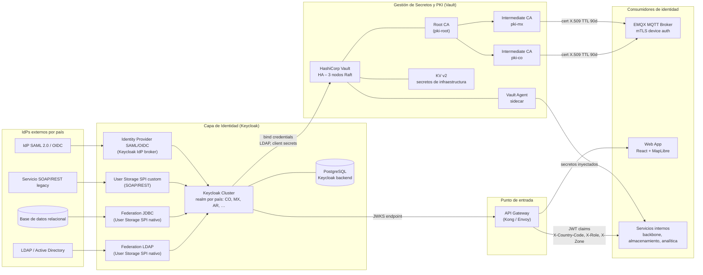
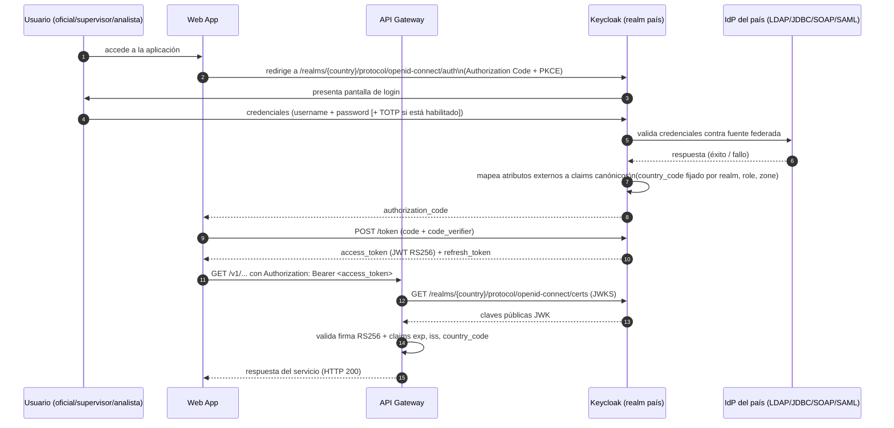
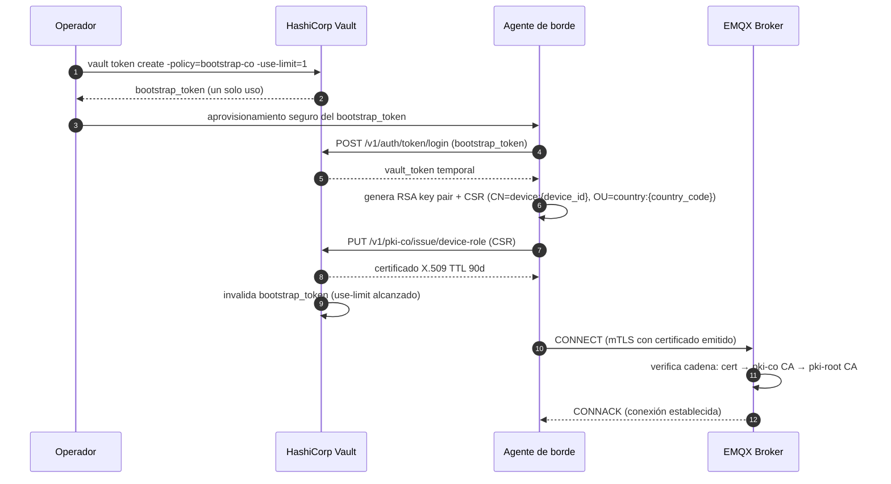
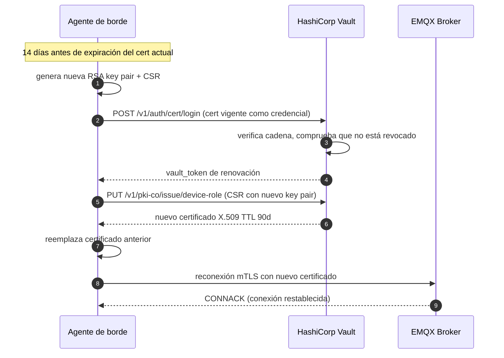

# Identidad Federada y Seguridad — Visión General

**Módulo:** `identidad-seguridad`
**Versión:** 1.0
**Última actualización:** 2026-05-13

Documentación de soporte: consultar los documentos de detalle enlazados en cada sección.

---

## 1. Objetivo del módulo

Este módulo define la capa de identidad federada y seguridad del Sistema Anti-Hurto de Vehículos. Sus responsabilidades son:

- **Autenticar** usuarios humanos (oficiales, supervisores, analistas, administradores, auditores) contra fuentes heterogéneas de identidad por país (LDAP, base de datos relacional, SOAP/REST legacy, SAML 2.0, OIDC).
- **Autenticar** dispositivos de borde mediante certificados X.509 emitidos por una PKI propia (mTLS).
- **Emitir** tokens JWT canónicos con los claims `country_code`, `role`, `zone` para el consumo uniforme por todos los servicios internos.
- **Aislar** identidades por país mediante el modelo realm-per-country de Keycloak (barrera técnica de ADR-011).
- **Gestionar** secretos de infraestructura con HashiCorp Vault y automatizar la rotación.

Decisiones de diseño aplicadas: **ADR-005** (puertos/adaptadores hexagonales para `DevicePKIPort` y `VaultUnsealPort`), **ADR-007** (Keycloak como broker), **ADR-011** (aislamiento multi-tenant por `country_code`).

---

## 2. Diagrama C4 Nivel 2 — Capa de Identidad y Seguridad

---

## 3. Flujo de autenticación humana

El siguiente diagrama muestra el flujo de autenticación de un usuario humano desde la aplicación web hasta la emisión del JWT canónico.

---

## 4. Flujo de autenticación de dispositivo — Bootstrap inicial

---

## 5. Flujo de autenticación de dispositivo — Renovación de certificado

---

## 6. Tabla de componentes

| Componente | Responsabilidad | Documento de detalle |
|---|---|---|
| **Keycloak Cluster** | Broker de identidad; un realm por país; emisión de JWT RS256; SSO | [keycloak-realm-model.md](./keycloak-realm-model.md) |
| **Federation LDAP** | User Storage SPI nativo de Keycloak — Active Directory / OpenLDAP | [federation-ldap.md](./federation-ldap.md) |
| **Federation JDBC** | User Storage SPI nativo — bases de datos SQL relacionales | [federation-jdbc.md](./federation-jdbc.md) |
| **SPI Custom SOAP/REST** | Adaptador de autenticación para endpoints legacy; caché TTL | [federation-spi-custom.md](./federation-spi-custom.md) |
| **Federation SAML/OIDC** | IdP broker de Keycloak para delegación a IdPs externos estándar | [federation-saml-oidc.md](./federation-saml-oidc.md) |
| **HashiCorp Vault PKI** | Emisión, renovación y revocación de certificados de dispositivo; CA hierarchy | [vault-pki-device.md](./vault-pki-device.md) |
| **Vault Secrets Engine** | KV v2, Database secrets, AppRole, Kubernetes auth | [vault-secrets-engine.md](./vault-secrets-engine.md) |
| **Vault HA (Raft)** | Alta disponibilidad con Raft consensus; auto-unseal hexagonal | [vault-ha-unseal.md](./vault-ha-unseal.md) |
| **JWT Claims Schema** | Contrato canónico de claims: tipos, formatos, restricciones | [jwt-claims-schema.md](./jwt-claims-schema.md) |
| **RBAC Model** | Cinco roles, permisos, scope geográfico, matriz de autorización | [rbac-model.md](./rbac-model.md) |
| **mTLS Device Policy** | Handshake TLS 1.3, ACL EMQX, CRL verification | [mtls-device-policy.md](./mtls-device-policy.md) |
| **Multitenancy Security** | Modelo de aislamiento técnico por realm y country_code | [multitenancy-security.md](./multitenancy-security.md) |
| **Audit Authentication** | Exportación de eventos de auditoría, retención, alertas | [audit-authentication.md](./audit-authentication.md) |
| **Onboarding Nuevo País** | Checklist ordenado para incorporar un país nuevo | [onboarding-nuevo-pais.md](./onboarding-nuevo-pais.md) |
| **Helm** | Valores configurables para Keycloak y Vault en Kubernetes | [helm/README.md](./helm/README.md) |
| **Terraform** | Módulos IaC para realms, PKI, secretos | [terraform/README.md](./terraform/README.md) |

---

## 7. Relaciones con otros módulos del sistema

| Módulo relacionado | Tipo de relación | Contrato |
|---|---|---|
| **`agente-borde`** | Upstream (consumidor de PKI) | Bootstrap token → primer cert X.509; renovación vía cert auth; TTL 90 días |
| **`ingestion-mqtt`** | Upstream (consumidor de mTLS config) | CA certs por país para EMQX; ACL por `device_id` extraído de CN |
| **`almacenamiento-lectura`** | Upstream (consumidor de JWT) | Claim `country_code` (ISO 3166-1 alpha-2) como discriminador de tenant en particionamiento y aliases |
| **`backbone-procesamiento`** | Upstream (consumidor de JWT) | Headers internos `X-Country-Code`, `X-Role`, `X-Zone` propagados por API Gateway |
| **`api-frontend-analitica`** | Downstream (spec de interfaz) | JWKS endpoint por realm; estructura JWT; flujo OIDC Authorization Code + PKCE |

---

## 8. ADRs aplicados en este módulo

| ADR | Decisión | Documento |
|---|---|---|
| **ADR-005** | Arquitectura hexagonal — `DevicePKIPort` y `VaultUnsealPort` como puertos para evitar lock-in | [adr-vault-pki.md](./adr-vault-pki.md), [vault-ha-unseal.md](./vault-ha-unseal.md) |
| **ADR-007** | Keycloak como broker de identidad con federación heterogénea | [keycloak-realm-model.md](./keycloak-realm-model.md) |
| **ADR-010** | PKI propia con certificados cortos (TTL 90 días) para dispositivos | [vault-pki-device.md](./vault-pki-device.md) |
| **ADR-011** (extendido por `adr-realm-por-pais.md`) | Multi-tenant por país con aislamiento de datos; realm por país como barrera técnica de aislamiento | [adr-realm-por-pais.md](./adr-realm-por-pais.md), [multitenancy-security.md](./multitenancy-security.md) |
| **ADR-vault-pki** | Vault PKI Engine detrás de `DevicePKIPort` | [adr-vault-pki.md](./adr-vault-pki.md) |
| **ADR-spi-cache** | Caché en memoria con TTL configurable en SPI custom | [adr-spi-cache.md](./adr-spi-cache.md) |
