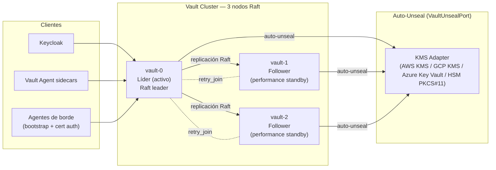
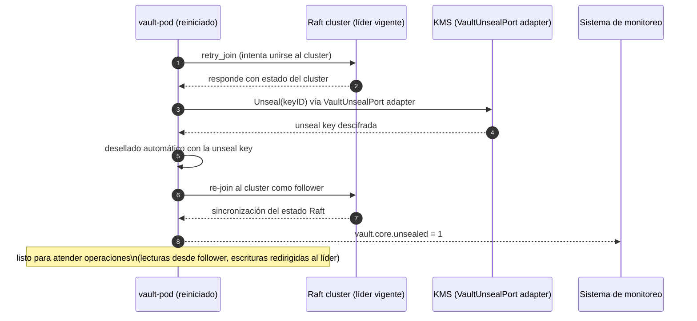

# Vault HA y Auto-Unseal

**Módulo:** `identidad-seguridad`
**Versión:** 1.0
**Última actualización:** 2026-05-13

---

## 1. Topología HA con Raft



---

## 2. Configuración de Raft

```hcl
# vault-config.hcl (parte del ConfigMap del Helm chart)
storage "raft" {
  path    = "/vault/data"
  node_id = "vault-0"  # se parametriza por pod index via env

  retry_join {
    leader_api_addr = "http://vault-0.vault-internal:8200"
  }
  retry_join {
    leader_api_addr = "http://vault-1.vault-internal:8200"
  }
  retry_join {
    leader_api_addr = "http://vault-2.vault-internal:8200"
  }
}

listener "tcp" {
  address       = "0.0.0.0:8200"
  tls_cert_file = "/vault/userconfig/vault-tls/tls.crt"
  tls_key_file  = "/vault/userconfig/vault-tls/tls.key"
}

# performance_standby_nodes permite que los followers atiendan lecturas
performance_standby_nodes = 2
```

---

## 3. Auto-Unseal hexagonal — `VaultUnsealPort`

El auto-unseal sigue el patrón hexagonal (ADR-005). El puerto `VaultUnsealPort` abstrae el proveedor de KMS, permitiendo cambiar de proveedor cloud sin modificar la configuración de Vault más allá del Helm value `unsealProvider`.

### Interfaz del puerto

```
VaultUnsealPort:
  Unseal(keyID string) (unsealKey []byte, err error)
```

### Adaptadores disponibles

| Implementación | `unsealProvider` (Helm) | Configuración adicional |
|---|---|---|
| **AWS KMS** | `awskms` | `kmsKeyId`, `kmsRegion`, `awsAccessKeyId` (via IAM role) |
| **GCP KMS** | `gcpckms` | `gcpProject`, `gcpRegion`, `gcpKeyRing`, `gcpCryptoKey` |
| **Azure Key Vault** | `azurekeyvault` | `azureKeyVaultName`, `azureKeyName`, `azureKeyVersion` |
| **HSM PKCS#11** | `pkcs11` | `lib`, `slot`, `pin`, `keyLabel` |

### Configuración del unseal en Vault (ejemplo AWS KMS)

```hcl
seal "awskms" {
  region     = "us-east-1"
  kms_key_id = "arn:aws:kms:us-east-1:123456789012:key/mrk-xxxxxxxxxxxxxxxxxxxxxxxxxxxxxxxx"
}
```

### Configuración del unseal en Helm

```yaml
# values.yaml para el Helm chart de Vault
vault:
  unsealProvider: awskms   # awskms | gcpckms | azurekeyvault | pkcs11

  unseal:
    awskms:
      region: us-east-1
      kmsKeyId: "arn:aws:kms:us-east-1:123456789012:key/mrk-xxx"
    gcpckms:
      gcpProject: ""
      gcpRegion: ""
      gcpKeyRing: ""
      gcpCryptoKey: ""
    azurekeyvault:
      azureKeyVaultName: ""
      azureKeyName: ""
      azureKeyVersion: ""
```

---

## 4. Flujo de auto-unseal al reiniciar un nodo



El tiempo de recuperación ante caída de un nodo (sin cambio de líder) es menor de 30 segundos. Si el líder cae, Raft elige un nuevo líder en menos de 30 segundos adicionales.

---

## 5. Runbook de inicialización y emergency unseal con Shamir

La inicialización se realiza una única vez al desplegar el cluster por primera vez.

```bash
# 1. Inicializar Vault (ejecutar en vault-0)
vault operator init \
  -key-shares=5 \
  -key-threshold=3 \
  -format=json > /tmp/vault-init.json

# Las 5 unseal shares y el root token quedan en /tmp/vault-init.json
# CRÍTICO: almacenar las shares en ubicaciones físicas separadas y seguras
# El root token se usa solo para la configuración inicial y luego se revoca

# 2. Para emergency unseal manual (si el KMS no está disponible)
# Requiere 3 de las 5 shares (threshold=3)
vault operator unseal <share_1>
vault operator unseal <share_2>
vault operator unseal <share_3>

# 3. Verificar estado del cluster
vault status
vault operator raft list-peers
```

Las 5 shares de Shamir se distribuyen entre 5 custodios designados (equipo SRE senior) y se almacenan en dispositivos cifrados físicos fuera del datacenter. El umbral de 3/5 permite la operación incluso con 2 custodios no disponibles.

---

## 6. Métricas de monitoreo

| Métrica Prometheus | Descripción | Umbral de alerta |
|---|---|---|
| `vault_core_unsealed` | Estado de unsealed (1=activo, 0=sellado) | Alert si = 0 por más de 60 s |
| `vault_raft_leader` | Es líder Raft (1=sí, 0=follower) | Informativo |
| `vault_core_active` | Nodo activo | Alert si ningún nodo activo por más de 30 s |
| `vault_raft_replication_appendEntries_logs` | Entradas de log Raft replicadas por segundo | Informativo |
| `vault_core_performance_standby` | Nodo en modo standby de rendimiento | Informativo |
| `vault_secret_kv_count` | Número de secretos KV | Informativo |
| `vault_token_count` | Tokens activos | Alert si crece anormalmente |

---

## 7. Política de backup del almacenamiento Raft

```bash
# Backup del snapshot Raft (ejecutar periódicamente — al menos cada 6h)
vault operator raft snapshot save /backup/vault-snapshot-$(date +%Y%m%d-%H%M%S).snap

# Copiar el snapshot a object storage (S3-compatible)
aws s3 cp /backup/vault-snapshot-*.snap s3://backups-sistema/vault/

# Restaurar desde snapshot (procedimiento DR)
vault operator raft snapshot restore /backup/vault-snapshot-YYYYMMDD-HHMMSS.snap
```

Los snapshots se almacenan en el object storage de DR con retención de 30 días. La restauración desde snapshot forma parte del runbook de DR y se prueba en drills trimestrales.
