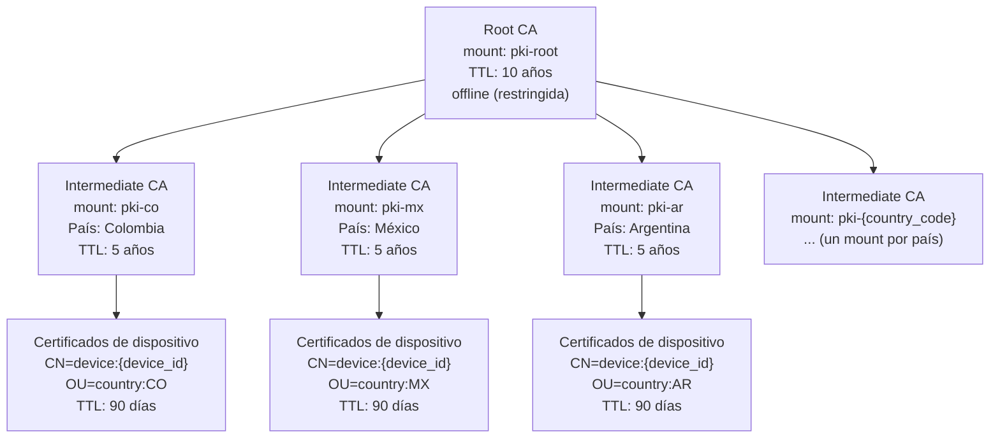
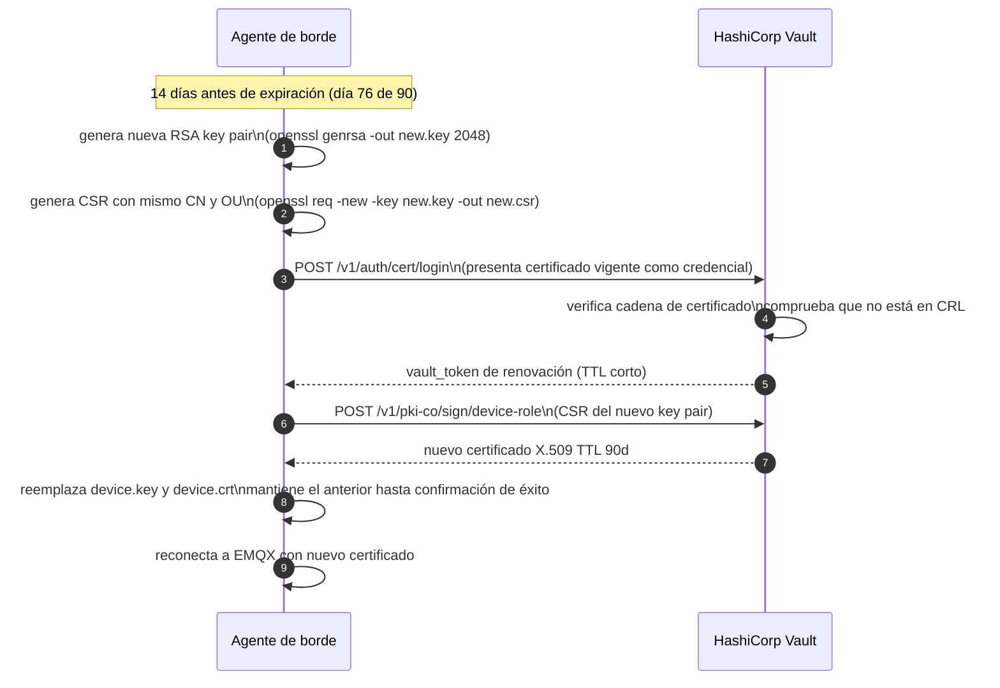

# Vault PKI — Certificados de Dispositivo

**Módulo:** `identidad-seguridad`
**Versión:** 1.0
**Última actualización:** 2026-05-13

---

## 1. Jerarquía de CA

El sistema usa una jerarquía de CA de dos niveles. La root CA está en línea solo para emitir y renovar las CAs intermedias; las CAs intermedias emiten los certificados de dispositivo.



---

## 2. Proceso de bootstrap — primer certificado del dispositivo

### 2.1 Descripción del proceso

1. El operador genera un token de bootstrap de un solo uso para el dispositivo.
2. El agente de borde recibe el token de forma segura (aprovisionamiento físico o canal seguro).
3. El agente genera su par de claves RSA y una CSR.
4. El agente presenta el token a Vault y solicita el primer certificado.
5. Vault emite el certificado, invalida el token y registra la operación en el audit log.
6. El dispositivo usa el certificado para establecer conexiones mTLS con EMQX.

### 2.2 Comandos de operación — Bootstrap

#### Paso 1: El operador crea un token de bootstrap de un solo uso

```bash
# Crear política de bootstrap para un país específico
vault policy write bootstrap-co - <<'EOF'
path "pki-co/issue/device-role" {
  capabilities = ["create", "update"]
}
EOF

# Crear token de un solo uso (-use-limit=1)
vault token create \
  -policy="bootstrap-co" \
  -use-limit=1 \
  -ttl=24h \
  -display-name="bootstrap-device-001-co" \
  -format=json | jq -r '.auth.client_token'
# Salida: hvs.xxxxxxxxxxxxxxxxxxxxxxxxxx (bootstrap_token)
```

#### Paso 2: El agente de borde solicita el primer certificado

```bash
# El agente genera su key pair (ejecutado en el dispositivo)
openssl genrsa -out /var/lib/agent/device.key 2048

# El agente genera la CSR
openssl req -new \
  -key /var/lib/agent/device.key \
  -out /var/lib/agent/device.csr \
  -subj "/CN=device:device-001/OU=country:CO"

# El agente autentica con el bootstrap_token y solicita el certificado
VAULT_TOKEN="hvs.xxxxxxxxxxxxxxxxxxxxxxxxxx"

curl -s \
  -H "X-Vault-Token: ${VAULT_TOKEN}" \
  -X POST \
  -d "{\"csr\": \"$(base64 -w0 /var/lib/agent/device.csr)\", \"common_name\": \"device:device-001\", \"ttl\": \"2160h\"}" \
  "${VAULT_ADDR}/v1/pki-co/sign/device-role" \
  | jq -r '.data.certificate' > /var/lib/agent/device.crt

# El bootstrap_token queda automáticamente invalidado tras este uso
```

---

## 3. Proceso de renovación automática — cert auth



**Comando de renovación:**

```bash
# Login con cert auth usando el certificado vigente
vault write auth/cert/login \
  name=device-role \
  -format=json > /tmp/vault_auth.json

VAULT_TOKEN=$(cat /tmp/vault_auth.json | jq -r '.auth.client_token')

# Solicitar nuevo certificado con el vault_token de renovación
vault write pki-co/sign/device-role \
  csr=@/var/lib/agent/device_new.csr \
  common_name="device:device-001" \
  ttl="2160h" \
  -format=json | jq -r '.data.certificate' > /var/lib/agent/device_new.crt
```

---

## 4. Proceso de revocación

Cuando un dispositivo es comprometido, dado de baja o robado, se revoca su certificado:

```bash
# Obtener el número de serie del certificado a revocar
SERIAL=$(openssl x509 -in device.crt -noout -serial | cut -d= -f2)
# Formato de Vault: XX:XX:XX:XX (separado por dos puntos)
SERIAL_VAULT=$(echo $SERIAL | sed 's/../&:/g;s/:$//')

# Revocar el certificado
vault write pki-co/revoke \
  serial_number="${SERIAL_VAULT}"

# Forzar actualización de la CRL (normalmente se actualiza automáticamente)
vault write pki-co/tidy \
  tidy_cert_store=true \
  tidy_revoked_certs=true
```

La CRL se publica en `/v1/pki-co/crl` y EMQX la descarga periódicamente. El OCSP está disponible en `/v1/pki-co/ocsp`.

---

## 5. Configuración del rol de emisión `device-role`

```bash
# Crear el rol de emisión en el mount de CA intermedia del país
vault write pki-co/roles/device-role \
  allow_any_name=true \
  enforce_hostnames=false \
  allow_subdomains=false \
  allow_bare_domains=false \
  allow_glob_domains=false \
  key_type="rsa" \
  key_bits=2048 \
  ttl="2160h" \
  max_ttl="2160h" \
  allow_ip_sans=false \
  allow_uri_sans=false \
  require_cn=true \
  generate_lease=false \
  no_store=false
```

| Parámetro | Valor | Justificación |
|---|---|---|
| `allow_any_name` | `true` | Permite nombres de CN con formato `device:{device_id}` (incluye dos puntos, no es un hostname RFC válido) |
| `enforce_hostnames` | `false` | Desactiva la validación de hostname RFC, necesario para el esquema `device:{id}` |
| `key_type` | `rsa` | Algoritmo RSA |
| `key_bits` | `2048` | Mínimo recomendado por NIST; compatible con hardware de borde |
| `ttl` | `2160h` (90 días) | TTL definido en ADR-010 |
| `no_store` | `false` | Vault almacena referencias para soporte de revocación |

> **Nota:** Se usa `allow_any_name=true` en lugar de `allowed_domains` porque el esquema de CN `device:{device_id}` (p.ej. `device:device-001`) contiene dos puntos y no sigue el formato de hostname RFC 5280. La restricción de emisión al país se implementa a nivel de política de Vault (la política `bootstrap-co` solo autoriza `path "pki-co/issue/device-role"`), no en el parámetro `allowed_domains` del rol.

---

## 6. Endpoint OCSP y publicación de CRL

| Endpoint | URL | Descripción |
|---|---|---|
| CRL DER | `{VAULT_ADDR}/v1/pki-co/crl` | Certificate Revocation List en formato DER |
| CRL PEM | `{VAULT_ADDR}/v1/pki-co/crl/pem` | CRL en formato PEM |
| OCSP | `{VAULT_ADDR}/v1/pki-co/ocsp` | OCSP responder para verificación en tiempo real |
| CA cert | `{VAULT_ADDR}/v1/pki-co/ca/pem` | Certificado de la CA intermedia |
| CA chain | `{VAULT_ADDR}/v1/pki-co/ca_chain` | Cadena completa hasta la root CA |

EMQX se configura para descargar la CRL desde el endpoint correspondiente al país cada 300 segundos (`crl_cache_http_timeout = 300`).

---

## 7. Montaje de la jerarquía completa (operación inicial)

```bash
# 1. Montar y configurar la root CA
vault secrets enable -path=pki-root pki
vault secrets tune -max-lease-ttl=87600h pki-root
vault write pki-root/root/generate/internal \
  common_name="Sistema Anti-Hurto Vehicles Root CA" \
  ttl=87600h \
  key_type=rsa \
  key_bits=4096

# 2. Configurar las URLs del root CA
vault write pki-root/config/urls \
  issuing_certificates="${VAULT_ADDR}/v1/pki-root/ca" \
  crl_distribution_points="${VAULT_ADDR}/v1/pki-root/crl"

# 3. Para cada país: montar CA intermedia, generar CSR, firmar con root CA
vault secrets enable -path=pki-co pki
vault secrets tune -max-lease-ttl=43800h pki-co

# Generar CSR de la CA intermedia
vault write pki-co/intermediate/generate/internal \
  common_name="Sistema Anti-Hurto Vehicles Intermediate CA CO" \
  key_type=rsa key_bits=4096 \
  -format=json | jq -r '.data.csr' > pki-co.csr

# Firmar con root CA
vault write pki-root/root/sign-intermediate \
  csr=@pki-co.csr \
  common_name="Sistema Anti-Hurto Vehicles Intermediate CA CO" \
  ttl=43800h \
  -format=json | jq -r '.data.certificate' > pki-co-signed.crt

# Importar el certificado firmado en el mount intermedio
vault write pki-co/intermediate/set-signed certificate=@pki-co-signed.crt

# Configurar URLs del mount intermedio
vault write pki-co/config/urls \
  issuing_certificates="${VAULT_ADDR}/v1/pki-co/ca" \
  crl_distribution_points="${VAULT_ADDR}/v1/pki-co/crl" \
  ocsp_servers="${VAULT_ADDR}/v1/pki-co/ocsp"
```
