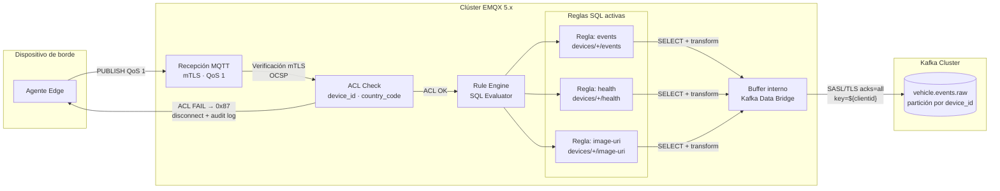

# MQTT→Kafka Bridge — Especificación Operacional

**Pilar:** 2 — Comunicación Segura y Eficiente  
**ADR gobernante:** [adr-bridge-decision.md](./adr-bridge-decision.md)  
**ADRs de referencia:** ADR-002 · ADR-012  
**Referencia:** [Visión General](./overview.md) · [topic-schema.md](./topic-schema.md) · [emqx-cluster.md](./emqx-cluster.md) · [operations.md](./operations.md)  
**Última actualización:** 2026-05-13

---

## 1. Descripción

El bridge MQTT→Kafka es el mecanismo que transfiere los mensajes de telemetría publicados por los dispositivos en el clúster EMQX 5.x hacia el topic Kafka `vehicle.events.raw`. Según la decisión en [adr-bridge-decision.md](./adr-bridge-decision.md), el bridge se implementa mediante el **EMQX Rule Engine** con **EMQX Kafka Data Bridge nativo** — sin microservicio Go adicional.

El Rule Engine actúa como filtro y enrutador; el Data Bridge gestiona la conexión al clúster Kafka con SASL/TLS, la partition key por `device_id` y el acknowledgement `acks=all`.

---

## 2. Diagrama de Flujo de Procesamiento



**Descripción del flujo:**
1. El agente publica un mensaje MQTT QoS 1 en `devices/{device_id}/events`, `health` o `image-uri`.
2. EMQX verifica el certificado mTLS y la ACL. Si la ACL falla, desconecta al cliente (ver [security.md §4](./security.md)).
3. El Rule Engine evalúa el mensaje contra las reglas SQL configuradas.
4. Los mensajes que satisfacen alguna regla son enrutados al Kafka Data Bridge.
5. El Data Bridge los publica en `vehicle.events.raw` con partition key = `${clientid}` (== `device_id`).
6. Solo cuando Kafka confirma la escritura (acks=all), el Data Bridge libera el buffer interno y permite que EMQX envíe el PUBACK al dispositivo.

---

## 3. Configuración del Rule Engine

### 3.1 Regla: Eventos de Dispositivo

Procesa mensajes del topic `devices/+/events` y los enruta al bridge Kafka.

```sql
-- Regla: vehicle_events
SELECT
  payload,
  clientid                         AS device_id,
  topic                            AS source_topic,
  timestamp                        AS emqx_timestamp_ms
FROM "devices/+/events"
WHERE is_not_null(payload.event_id)
  AND is_not_null(payload.device_id)
  AND is_not_null(payload.plate)
```

**Acción:** enrutar al Data Bridge `vehicle_events_bridge`.

### 3.2 Regla: Health Beacon

Procesa mensajes del topic `devices/+/health`.

```sql
-- Regla: device_health
SELECT
  payload,
  clientid     AS device_id,
  topic        AS source_topic,
  timestamp    AS emqx_timestamp_ms
FROM "devices/+/health"
WHERE is_not_null(payload.device_id)
```

**Acción:** enrutar al Data Bridge `vehicle_events_bridge` (mismo topic Kafka `vehicle.events.raw`; el consumidor downstream distingue por el campo `source_topic`).

### 3.3 Regla: Image-URI

Procesa mensajes del topic `devices/+/image-uri`, que notifican la disponibilidad de una imagen ya subida al object storage.

```sql
-- Regla: image_uri_notification
SELECT
  payload,
  clientid     AS device_id,
  topic        AS source_topic,
  timestamp    AS emqx_timestamp_ms
FROM "devices/+/image-uri"
WHERE is_not_null(payload.event_id)
  AND is_not_null(payload.image_uri)
```

**Acción:** enrutar al Data Bridge `vehicle_events_bridge`.

---

## 4. Configuración del Kafka Data Bridge

### 4.1 Parámetros de Conexión

```hocon
bridges.kafka.vehicle_events_bridge {
  enable = true

  # Kafka cluster con SASL/TLS
  bootstrap_hosts = "kafka-0.kafka-headless.kafka.svc:9093,kafka-1.kafka-headless.kafka.svc:9093,kafka-2.kafka-headless.kafka.svc:9093"
  connect_timeout = "5s"

  authentication {
    mechanism = scram_sha_512
    username  = "${env:KAFKA_SASL_USERNAME}"
    password  = "${env:KAFKA_SASL_PASSWORD}"
  }

  ssl {
    enable     = true
    verify     = verify_peer
    versions   = ["tlsv1.3"]
    cacertfile = "/etc/emqx/certs/kafka-ca.crt"
  }
}
```

### 4.2 Parámetros del Productor Kafka

```hocon
bridges.kafka.vehicle_events_bridge.producer {
  # Topic destino
  topic = "vehicle.events.raw"

  # Partition key = clientid (== device_id)
  # Garantía de orden por dispositivo (CA-06, CA-07)
  partition_strategy = key_dispatch
  message_key        = "${clientid}"

  # Valor del mensaje: payload JSON del mensaje MQTT
  message_value = "${payload}"

  # Sin compresión (los payloads son pequeños, ~1 KB)
  compression = no_compression

  # Acknowledgement: todos los réplicas deben confirmar
  required_acks = all_isr

  # Máximo de mensajes en vuelo por partición
  max_inflight = 10

  # Serialización: JSON (el payload MQTT ya es JSON)
  # No se aplica transformación adicional en el bridge
}
```

### 4.3 Configuración del Buffer (Backpressure)

```hocon
bridges.kafka.vehicle_events_bridge.producer.buffer {
  # Modo de buffer: en memoria para menor latencia
  # Alternativa: disk para durabilidad ante reinicios del nodo EMQX
  mode = memory

  # Límite de buffer por partición Kafka
  per_partition_limit = "100MB"

  # Tamaño de segmento del buffer
  segment_bytes = "10MB"

  # Protección contra sobrecarga de memoria:
  # Si el buffer alcanza el límite, los nuevos mensajes son descartados
  # (el PUBACK al dispositivo NO se enviará; el dispositivo reintentará)
  memory_overload_protection = true
}
```

---

## 5. Garantía de Orden por Dispositivo

La garantía de orden por `device_id` (CA-06) se implementa mediante:

1. **Partition key = `${clientid}`:** el Data Bridge configura la partition key Kafka como el `clientid` del cliente MQTT, que es idéntico al `device_id`. El hash consistente del `clientid` asigna todos los mensajes del mismo dispositivo a la misma partición Kafka.

2. **`max_inflight = 10`:** se permite un número controlado de mensajes en vuelo por partición, pero el orden se preserva porque Kafka garantiza el orden dentro de una partición.

3. **`required_acks = all_isr`:** el productor espera confirmación de todos los réplicas en sincronía antes de considerar el mensaje escrito. Esto previene pérdida de mensajes ante fallos de un broker Kafka.

**Nota CA-07 (dispositivos distintos):** dos dispositivos con `device_id` distintos pueden ser asignados a la misma partición Kafka por coincidencia de hash. Esto es correcto y esperado: el orden relativo entre dispositivos distintos no es una garantía del sistema. La garantía de orden es **dentro de cada dispositivo** (misma partición para el mismo `device_id`).

---

## 6. Manejo de Backpressure (Kafka No Disponible)

Cuando el clúster Kafka no está disponible o tiene latencia elevada (CR-06):

1. El Data Bridge intenta publicar el mensaje. Si Kafka no responde en el timeout de conexión, el mensaje va al buffer interno.
2. El buffer en memoria absorbe los mensajes pendientes hasta `per_partition_limit = 100 MB`.
3. EMQX **no envía PUBACK** al dispositivo hasta que el mensaje sea confirmado por Kafka. El dispositivo mantiene el mensaje en estado `in_flight` en su SQLite local.
4. Si el buffer se agota (`memory_overload_protection = true`), los nuevos mensajes son descartados. Los dispositivos afectados no recibirán PUBACK y reintentarán.
5. Cuando Kafka se recupera, el Data Bridge drena el buffer en orden FIFO.

**Implicación para sesiones EMQX:** los mensajes QoS 1 permanecen pendientes en la sesión EMQX hasta que el dispositivo recibe PUBACK. Si el `session_expiry_interval` (2 horas) expira antes de que Kafka se recupere, los mensajes de sesión se pierden en el broker. Sin embargo, el dispositivo tiene los mensajes persistidos en SQLite y los reintentará al reconectar.

---

## 7. Métricas Expuestas (CA-15)

El Data Bridge expone métricas vía el endpoint Prometheus de EMQX (`/metrics`):

| Métrica | Tipo | Descripción |
|---|---|---|
| `emqx_bridges_kafka_received` | Counter | Mensajes recibidos desde el Rule Engine para enviar a Kafka |
| `emqx_bridges_kafka_sent` | Counter | Mensajes publicados exitosamente en Kafka |
| `emqx_bridges_kafka_dropped` | Counter | Mensajes descartados (buffer lleno u otros errores) |
| `emqx_bridges_kafka_failed` | Counter | Intentos de publicación fallidos (error Kafka) |
| `emqx_bridges_kafka_inflight` | Gauge | Mensajes actualmente en vuelo (enviados, sin confirmación Kafka) |
| `emqx_bridges_kafka_queue_size` | Gauge | Mensajes en buffer local del bridge |
| `emqx_bridges_kafka_latency_ms` | Histogram | Latencia de confirmación Kafka en ms (P50, P95, P99) |

**Alertas recomendadas:**

| Alerta | Condición | Severidad |
|---|---|---|
| `BridgeKafkaLagHigh` | `emqx_bridges_kafka_queue_size > 10000` | WARNING |
| `BridgeKafkaLagCritical` | `emqx_bridges_kafka_queue_size > 50000` | CRITICAL |
| `BridgeKafkaErrorRateHigh` | `rate(emqx_bridges_kafka_failed[5m]) > 10` | WARNING |
| `BridgeKafkaDropped` | `increase(emqx_bridges_kafka_dropped[5m]) > 0` | CRITICAL |
| `BridgeKafkaLatencyP95High` | `histogram_quantile(0.95, emqx_bridges_kafka_latency_ms) > 500` | WARNING |

Ver [operations.md §4](./operations.md) para los procedimientos de respuesta a estas alertas.

---

## 8. Topic Kafka: vehicle.events.raw

| Parámetro | Valor |
|---|---|
| Nombre | `vehicle.events.raw` |
| Partition key | `device_id` (== `clientid` MQTT) |
| Serialización | JSON (UTF-8) |
| Schema | Ver ejemplos en [topic-schema.md §4](./topic-schema.md) |
| Replication factor | 3 |
| `min.insync.replicas` | 2 |
| Retención | 7 días (configurable; suficiente para reprocessing del Deduplicator) |
| Consumidores | Deduplicator → Enrichment → Matcher (ver propuesta §3.3) |

---

## 9. Referencias Cruzadas

| Documento | Relación |
|---|---|
| [adr-bridge-decision.md](./adr-bridge-decision.md) | ADR que justifica la elección del EMQX nativo vs. Go custom |
| [emqx-cluster.md §7](./emqx-cluster.md) | Configuración HOCON completa del Kafka Data Bridge |
| [topic-schema.md](./topic-schema.md) | Definición de los topics que alimentan al Rule Engine |
| [operations.md §4](./operations.md) | Procedimiento de respuesta a lag del bridge |
| [`docs/almacenamiento-lectura/`](../almacenamiento-lectura/overview.md) | Consumidores del topic `vehicle.events.raw` |
