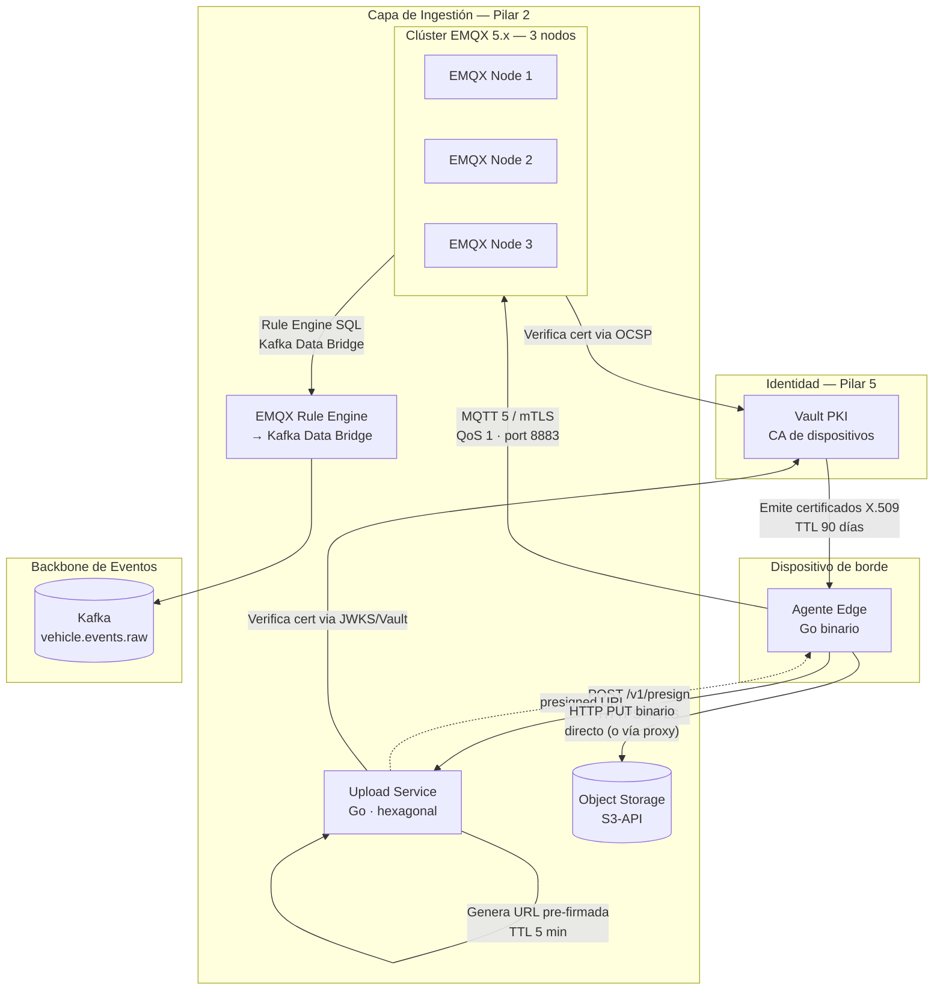

# Capa de Ingestión — Visión General

**Pilar:** 2 — Comunicación Segura y Eficiente  
**Estado:** Aprobado  
**ADRs aplicados:** ADR-002 · ADR-003 · ADR-005 · ADR-010 · ADR-011  
**Propietario:** Equipo de Plataforma  
**Última actualización:** 2026-05-13

---

## 1. Propósito

La capa de ingestión es el punto de entrada único de telemetría desde los dispositivos de borde hacia la plataforma cloud del Sistema Anti-Hurto de Vehículos. Dos canales paralelos e independientes convergen aquí:

1. **Canal de metadatos (MQTT):** eventos normalizados de placa, salud del dispositivo y URIs de imagen viajan a través de un clúster EMQX 5.x con autenticación mTLS y QoS 1. El clúster reenvía los mensajes relevantes al backbone Kafka mediante el Rule Engine nativo de EMQX (ADR decisión de bridge).
2. **Canal de imágenes (HTTP PUT):** las imágenes binarias no transitan por el broker MQTT. El dispositivo solicita una URL pre-firmada al Upload Service y realiza un `PUT` directo al object storage compatible con la S3-API (ADR-003). Esto evita saturar el broker con payloads de dos a tres órdenes de magnitud superiores.

La separación de canales es una decisión explícita de diseño (ADR-002, ADR-003) que permite escalar cada canal de forma independiente y adaptar el transport a la capacidad GSM disponible.

---

## 2. Diagrama de Topología de Componentes



**Descripción de componentes:**

| Componente | Rol en la ingestión |
|---|---|
| **Clúster EMQX 5.x** | Receptor de telemetría MQTT con mTLS, ACL por `device_id`, sesiones persistentes |
| **Upload Service** | Emisor de URLs pre-firmadas; validación de identidad; modo proxy para NAT/APN |
| **Object Storage** | Almacén durable de imágenes con SSE-KMS y lifecycle policy |
| **EMQX Rule Engine → Kafka Data Bridge** | Bridge declarativo que replica eventos MQTT al topic Kafka `vehicle.events.raw` |
| **Kafka** | Backbone downstream; garantía de orden por `device_id` via partition key |

---

## 3. Flujo de Datos Dispositivo → Cloud

### 3.1 Flujo de Metadatos (eventos, health, image-uri)

```
1. El dispositivo establece sesión MQTT 5 con clean_start=false y keep-alive 60 s
   presentando su certificado X.509 emitido por Vault PKI (ADR-010).

2. EMQX valida el certificado:
   a. Verifica la cadena de confianza contra la CA raíz del realm del país.
   b. Consulta OCSP al endpoint de Vault para comprobar revocación.
   c. Extrae el device_id del campo CN o SAN del certificado.
   d. Asocia el device_id a la sesión MQTT.

3. El agente publica en topics propios (ADR-002):
   - devices/{device_id}/events       — metadatos del evento de placa (JSON, QoS 1)
   - devices/{device_id}/health       — health beacon (msgpack, QoS 1)
   - devices/{device_id}/image-uri    — URI de imagen ya subida (JSON, QoS 1)

4. EMQX aplica ACL: el dispositivo solo puede publicar en sus propios topics.
   Intentos de publicar en topics ajenos reciben MQTT5 reason code 0x87 Not Authorized.

5. El Rule Engine evalúa los mensajes de los topics de eventos e image-uri
   contra las reglas SQL configuradas.

6. Los mensajes que pasan las reglas se envían al Kafka Data Bridge configurado:
   - Topic Kafka: vehicle.events.raw
   - Partition key: ${clientid}  (== device_id, garantía de orden por dispositivo)
   - Serialización: JSON
   - Acknowledgement: acks=all

7. El consumidor Kafka (Deduplicator → Enrichment → Matcher) procesa el evento
   downstream manteniendo el orden de publicación por dispositivo (CA-06).
```

### 3.2 Flujo de Imágenes (presigned URL)

```
1. El agente solicita URL pre-firmada al Upload Service:
   POST /v1/presign
   Autenticación: mTLS (certificado de dispositivo) o JWT Bearer emitido por Vault

2. El Upload Service valida la identidad del solicitante:
   a. Verifica el CN/SAN del certificado contra la CA de Vault.
   b. Extrae device_id y country_code del certificado.

3. El Upload Service genera la URL pre-firmada via el ObjectStoragePort:
   - Método HTTP: PUT
   - TTL: exactamente 300 segundos (5 minutos) — (CA-08, CR-01)
   - Path: images/{country_code}/{device_id}/{date}/{image_id}
   - Server-side encryption: SSE-KMS obligatorio

4. El dispositivo realiza HTTP PUT directo al object storage con el binario de la imagen.
   El object storage almacena la imagen cifrada con la clave KMS.

5. El dispositivo publica la URI resultante en devices/{device_id}/image-uri (QoS 1).
   El event downstream en Kafka queda enriquecido con la referencia a la imagen.

MODO ALTERNATIVO — Proxy Upload (CA-10, CR-08):
   Si el dispositivo no puede alcanzar el object storage directamente (NAT/APN restrictivo),
   envía el binario al endpoint POST /v1/upload del Upload Service.
   El servicio recibe el multipart, realiza el stream al object storage en nombre
   del dispositivo y devuelve la URI final.
```

---

## 4. Glosario del Pilar

| Término | Definición |
|---|---|
| **device_id** | Identificador único del dispositivo. Formato: `{CC}-{CITY}-DEV-{NNNNN}` (ej. `CO-BOG-DEV-00142`). Extraído del campo CN o SAN del certificado X.509. Es inmutable por el tiempo de vida del dispositivo. |
| **country_code** | Código ISO 3166-1 alpha-2 del país operador (ej. `CO`, `MX`, `PE`). Discriminador de tenant en ACLs, bucket paths y topics (ADR-011). |
| **mTLS** | Mutual TLS: autenticación bidireccional donde tanto el servidor (EMQX) como el cliente (dispositivo) presentan un certificado X.509. Requerido para toda conexión MQTT a la plataforma (ADR-010). |
| **Presigned URL** | URL temporal con credenciales embebidas emitida por el Upload Service que autoriza un único `PUT` al object storage. TTL: 5 minutos. Invalida automáticamente por expiración o por uso (dependiendo del proveedor). |
| **ObjectStoragePort** | Interfaz hexagonal (ADR-005) que abstrae las operaciones de object storage. Implementaciones: MinIO, AWS S3, GCS (interoperabilidad S3), Azure Blob (interoperabilidad S3). |
| **Rule Engine** | Motor de reglas declarativo de EMQX 5.x. Permite filtrar mensajes MQTT con SQL y enrutarlos a destinos externos (Data Bridges) sin código custom. |
| **Kafka Data Bridge** | Conector nativo de EMQX 5.x que publica mensajes seleccionados por el Rule Engine en un topic Kafka. Reemplaza la necesidad de un Kafka Connect externo. |
| **session_expiry_interval** | Parámetro MQTT 5 que controla cuánto tiempo retiene EMQX el estado de una sesión tras la desconexión del dispositivo. Debe ser finito para evitar agotamiento de memoria (CR-05). |
| **SSE-KMS** | Server-Side Encryption con clave gestionada por KMS. Todos los objetos almacenados en el bucket deben estar cifrados con SSE-KMS (CA-14). |
| **QoS 1** | Quality of Service level 1 de MQTT: entrega garantizada al menos una vez, con acuse de recibo (PUBACK). |
| **retained message** | Mensaje MQTT que el broker conserva para entregar a nuevas suscripciones. Usado en topics de configuración y bloom-filter. |
| **OCSP** | Online Certificate Status Protocol. Protocolo para consultar en tiempo real el estado de revocación de un certificado X.509. La integración con Vault PKI es la fuente de verdad (CA-13). |
| **proxy-upload** | Modo alternativo de subida de imágenes donde el Upload Service actúa como intermediario entre el dispositivo y el object storage. Activado cuando el dispositivo no puede alcanzar el storage directamente (CA-10). |
| **vehicle.events.raw** | Topic Kafka destino de todos los eventos de telemetría desde EMQX. Particionado por `device_id` para garantizar orden por dispositivo (CA-06). |

---

## 5. ADRs Aplicados

| ADR | Decisión | Impacto en este pilar |
|---|---|---|
| **ADR-002** | MQTT 5 como protocolo principal de telemetría | Define el protocolo, QoS 1, sesiones persistentes, keep-alive 60 s |
| **ADR-003** | Imágenes vía URLs pre-firmadas a object storage | Separa el canal de imágenes del broker MQTT |
| **ADR-005** | Arquitectura hexagonal para servicios sensibles a la nube | `ObjectStoragePort` con 4 implementaciones intercambiables |
| **ADR-010** | PKI propia con certificados cortos para dispositivos | mTLS obligatorio; certificados emitidos por Vault PKI, TTL 90 días |
| **ADR-011** | Multi-tenant por país con aislamiento de datos | `country_code` como discriminador en ACLs, topics y bucket paths |

La decisión específica del mecanismo de bridge (EMQX Rule Engine → Kafka Data Bridge vs. Go bridge custom) se documenta en detalle en [`adr-bridge-decision.md`](./adr-bridge-decision.md).

---

## 6. Documentos de Esta Sección

| Documento | Contenido |
|---|---|
| [topic-schema.md](./topic-schema.md) | Esquema autoritative de topics MQTT: tabla, ACL, formatos, ejemplos |
| [adr-bridge-decision.md](./adr-bridge-decision.md) | ADR formal: evaluación de opciones de bridge MQTT→Kafka |
| [emqx-cluster.md](./emqx-cluster.md) | Configuración del clúster EMQX: mTLS, ACL, HA, Kafka Data Bridge |
| [upload-service.md](./upload-service.md) | Especificación del Upload Service: API REST, contratos, hexagonal |
| [object-storage.md](./object-storage.md) | Estructura del bucket, lifecycle policy, cifrado, replicación |
| [bridge.md](./bridge.md) | Spec operacional del bridge: Rule Engine SQL, métricas, backpressure |
| [security.md](./security.md) | Flujo mTLS completo, OCSP, rotación de certificados, ACL detallada |
| [operations.md](./operations.md) | Runbooks: escalado EMQX, tormentas de reconexión, rotación CA Vault |
| [helm/README.md](./helm/README.md) | Guía de despliegue Kubernetes con Helm |
| [terraform/README.md](./terraform/README.md) | Guía de módulos Terraform para provisión de infraestructura |

---

## 7. Referencias Cruzadas

| Documento | Relación |
|---|---|
| [`docs/agente-borde/uploader.md`](../agente-borde/uploader.md) | Especificación del cliente MQTT y del cliente de presigned URL en el dispositivo |
| [`docs/identidad-seguridad/vault-pki-device.md`](../identidad-seguridad/vault-pki-device.md) | PKI de dispositivos: emisión, rotación y revocación de certificados |
| [`docs/identidad-seguridad/mtls-device-policy.md`](../identidad-seguridad/mtls-device-policy.md) | Política mTLS para dispositivos en EMQX |
| [`docs/almacenamiento-lectura/`](../almacenamiento-lectura/overview.md) | Consumidores downstream del topic `vehicle.events.raw` |
| [`docs/propuesta-arquitectura-hurto-vehiculos.md`](../propuesta-arquitectura-hurto-vehiculos.md) | Propuesta general; sección §3.2 y ADRs 002, 003, 005, 010, 011 |
