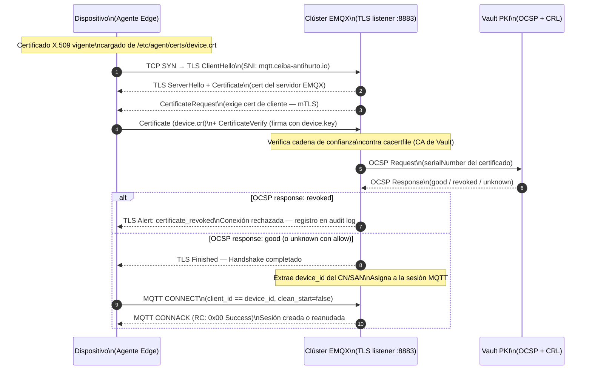

# Seguridad de la Capa de Ingestión

**Pilar:** 2 — Comunicación Segura y Eficiente  
**ADRs aplicados:** ADR-010 · ADR-011 · ADR-005  
**Referencia:** [Visión General](./overview.md) · [emqx-cluster.md](./emqx-cluster.md) · [upload-service.md](./upload-service.md) · [object-storage.md](./object-storage.md)  
**Última actualización:** 2026-05-13

---

## 1. Flujo mTLS Completo

### 1.1 Diagrama de Secuencia — Handshake mTLS



### 1.2 Extracción del device_id

El `device_id` se extrae del certificado del cliente en el siguiente orden de prioridad:

1. **Campo `Subject.CN`** (Common Name): el valor completo del CN es el `device_id`. Ej: `CO-BOG-DEV-00142`.
2. **SAN de tipo `DNS` o `URI`**: si el CN no sigue el formato canónico, se busca en los SANs un valor que coincida con `^[A-Z]{2}-[A-Z]{3}-DEV-\d{5}$`.

El `client_id` MQTT debe ser igual al `device_id` extraído del certificado. Si difieren, el broker rechaza el CONNECT con código `0x85 Client Identifier not valid`.

### 1.3 Extracción del country_code

El `country_code` se extrae de los primeros dos caracteres del `device_id`. Opcionalmente, el certificado puede incluir un SAN personalizado `country_code={CC}` generado por Vault PKI durante la emisión. Si este SAN está presente, tiene precedencia.

---

## 2. Integración OCSP con Vault

### 2.1 Endpoint OCSP de Vault

Vault PKI expone el endpoint OCSP en:

```
http://vault.internal:8200/v1/pki/ocsp
```

Este endpoint implementa el protocolo RFC 6960 (OCSP) y responde con el estado del certificado consultado.

### 2.2 Caché de Respuestas OCSP

EMQX almacena en caché las respuestas OCSP para reducir la carga en Vault PKI:

```hocon
ocsp_response_cache_ttl = "5m"
```

Una respuesta OCSP positiva (`good`) es cacheada durante 5 minutos. Si se revoca un certificado, el broker puede tardar hasta 5 minutos en detectar la revocación (ventana de caché). Para revocaciones urgentes, el operador puede limpiar la caché OCSP de EMQX via API de administración.

### 2.3 Timeout de Solicitud OCSP

```hocon
ocsp_request_timeout = "5s"
```

Si el servidor OCSP no responde en 5 segundos, se aplica el comportamiento configurado en `ocsp_unavailable_action`:

```hocon
ocsp_unavailable_action = "allow"
```

**Justificación:** en escenarios de conectividad GSM intermitente o mantenimiento de Vault, bloquear todas las conexiones de dispositivos sería más perjudicial que permitir conexiones con certificados potencialmente no verificados por OCSP. La CRL sirve como mecanismo de fallback (ver §3.2).

### 2.4 Comportamiento Ante OCSP No Disponible

| Estado | Comportamiento |
|---|---|
| Vault OCSP responde `good` | Conexión permitida |
| Vault OCSP responde `revoked` | Conexión rechazada; registro en audit log |
| Vault OCSP no disponible (timeout) | Conexión **permitida** (modo `allow`); registro en log con nivel WARN |
| Certificado expirado (verificado por TLS) | Conexión rechazada por el stack TLS antes de llegar a OCSP |

---

## 3. Política de Revocación CRL (Fallback)

### 3.1 Uso de la CRL como Fallback

Vault PKI publica una CRL (Certificate Revocation List) actualizada en:

```
http://vault.internal:8200/v1/pki/crl
```

EMQX puede configurarse para descargar periódicamente la CRL y usarla cuando OCSP no esté disponible:

```hocon
ssl_options.crl_check = peer
ssl_options.crl_cache = {
  http { refresh_interval = "1h" }
}
```

La CRL descargada se mantiene en caché durante 1 hora. Si la CRL tampoco está disponible (ambas fuentes de revocación inaccesibles), prevalece el comportamiento de `allow` para no bloquear operaciones de borde.

### 3.2 Escenario de Operación Degradada

Si tanto OCSP como la CRL están inaccesibles (escenario de incidente grave de Vault):

1. EMQX permite conexiones mTLS con certificados vigentes (sin verificación de revocación activa).
2. El equipo de operaciones es alertado via Prometheus/Alertmanager.
3. Se activa el runbook de incidente de Vault (ver [operations.md §3](./operations.md)).
4. Dentro del período de tolerancia, los dispositivos con certificados revocados previamente podrían conectarse.

**Mitigación:** los certificados tienen TTL de 90 días. Un certificado comprometido pierde su validez en máximo 90 días incluso sin revocación activa.

---

## 4. Rotación de Certificados Sin Downtime

### 4.1 Parámetros de Ciclo de Vida

| Parámetro | Valor |
|---|---|
| TTL del certificado | 90 días (ADR-010) |
| Inicio de renovación anticipada | 75 días desde emisión (83 % del TTL) |
| Ventana de solapamiento | 15 días (el certificado anterior y el nuevo son válidos simultáneamente) |
| Bootstrap token | Un solo uso, emitido por Vault para el aprovisionamiento inicial |

### 4.2 Proceso de Renovación del Dispositivo

```
Día 0:   Vault emite certificado (TTL = 90 días). Expira: Día 90.
Día 75:  El Config/OTA Manager del agente detecta que el certificado
         expira en < 15 días y solicita renovación a Vault PKI.
         Vault emite un nuevo certificado (TTL = 90 días, expira: Día 165).
Día 75+: El agente carga el nuevo certificado. En la siguiente reconexión
         MQTT usa el nuevo certificado. El anterior sigue siendo válido
         hasta el Día 90.
Día 90:  El certificado anterior expira. Solo el nuevo certificado es válido.
```

El solapamiento de 15 días garantiza que no haya período de downtime durante la rotación incluso si la reconexión MQTT tarda varios días (ej. dispositivo con GSM muy intermitente).

### 4.3 Revocación Inmediata

Si un dispositivo es comprometido o retirado de servicio, el operador revoca el certificado en Vault:

```bash
vault write pki/revoke serial_number="<serial>"
```

Vault actualiza la CRL y el endpoint OCSP inmediatamente. EMQX detectará la revocación en la siguiente verificación OCSP (máximo `ocsp_response_cache_ttl = 5m`).

---

## 5. Restricciones ACL Detalladas

### 5.1 Tabla de Permisos

Para un dispositivo autenticado con `device_id = D-001` y `country_code = CO`:

| Topic | PUBLISH | SUBSCRIBE | Razón si se deniega |
|---|---|---|---|
| `devices/D-001/events` | **Permitido** | Denegado | N/A |
| `devices/D-001/health` | **Permitido** | Denegado | N/A |
| `devices/D-001/image-uri` | **Permitido** | Denegado | N/A |
| `devices/D-001/config` | Denegado | **Permitido** | `0x87 Not Authorized` en PUBLISH |
| `countries/CO/bloom-filter` | Denegado | **Permitido** | `0x87 Not Authorized` en PUBLISH |
| `devices/D-001/ota` | Denegado | **Permitido** | `0x87 Not Authorized` en PUBLISH |
| `devices/D-002/events` | **Denegado** | Denegado | `0x87 Not Authorized` (CA-04) |
| `devices/+/events` (wildcard) | **Denegado** | Denegado | `0x87 Not Authorized` |
| `countries/MX/bloom-filter` | Denegado | **Denegado** | `0x87 Not Authorized` |
| Cualquier otro topic | Denegado | Denegado | `0x87 Not Authorized` |

### 5.2 Ejemplos de Patrones de Topic en Reglas ACL

```
# Permitido: publicar en topics propios
ALLOW PUBLISH  devices/${username}/events
ALLOW PUBLISH  devices/${username}/health
ALLOW PUBLISH  devices/${username}/image-uri

# Permitido: suscribirse a topics de recepción propios
ALLOW SUBSCRIBE devices/${username}/config
ALLOW SUBSCRIBE devices/${username}/ota
ALLOW SUBSCRIBE countries/${cert.country_code}/bloom-filter

# Denegado: todo lo demás (regla de no_match = deny)
DENY  *
```

### 5.3 Consecuencias de Violación ACL

Al detectar una violación ACL (CA-04):
1. El broker retorna MQTT5 reason code `0x87 Not Authorized` en el PUBACK.
2. El broker desconecta al cliente (`disconnect_on_acl_deny = true`).
3. Se registra en el audit log: `{timestamp, client_id, device_id, topic_attempted, action, reason: acl_violation}`.
4. El dispositivo legítimo (bug o error de configuración) se reconectará y reintentará con el topic correcto.
5. Un dispositivo malicioso que intente publicar en topics ajenos será bloqueado y sus intentos quedarán auditados.

---

## 6. Cifrado en Tránsito

### 6.1 Conexiones MQTT

- **Protocolo:** TLS 1.3 únicamente. No se admiten versiones anteriores.
- **Suites de cifrado:** ver [emqx-cluster.md §2.1](./emqx-cluster.md).
- **mTLS:** obligatorio. Toda conexión MQTT que no presente certificado de cliente es rechazada durante el handshake TLS (CA-02).
- **Puerto:** 8883 (MQTT sobre TLS).

### 6.2 Conexiones HTTP (Upload Service)

- **Protocolo:** TLS 1.3 mínimo.
- **HSTS:** `Strict-Transport-Security: max-age=31536000; includeSubDomains` en todas las respuestas.
- **mTLS:** opcional en TLS (el certificado de cliente no es obligatorio a nivel TLS); la validación de identidad ocurre en la capa de aplicación (ver [upload-service.md §3](./upload-service.md)).

### 6.3 Conexiones Internas (EMQX → Kafka)

- **Protocolo:** TLS 1.3 con SASL/SCRAM-SHA-512.
- **Verificación mutua:** `verify = verify_peer` (Kafka verifica el certificado de EMQX si está configurado).

---

## 7. Cifrado en Reposo

### 7.1 Object Storage

Todos los objetos almacenados en el bucket de imágenes están cifrados con SSE-KMS (CA-14):

- El Upload Service incluye el header `x-amz-server-side-encryption: aws:kms` en todos los PUTs.
- La bucket policy deniega cualquier PUT que no incluya el header de cifrado.
- La respuesta del object storage incluye el header `x-amz-server-side-encryption` con valor no vacío.
- Ver [object-storage.md §3](./object-storage.md) para la configuración detallada.

### 7.2 Volúmenes de Kubernetes

Los volúmenes de datos de los pods EMQX (si se usa persistencia para buffer) se cifran a nivel de volumen con la solución del proveedor de infraestructura (AWS EBS encryption, GCP PD encryption, Azure Disk encryption).

---

## 8. Controles de Privacidad

Alineado con la propuesta §5.3 y §5.8, y con la Ley 1581 de Colombia y equivalentes:

| Control | Implementación |
|---|---|
| **Solo imágenes de vehículos** | El sistema solo procesa y almacena imágenes del vehículo (placa + carrocería). No hay reconocimiento facial. Los dispositivos no capturan imágenes de personas. |
| **No biométricos** | Ningún componente de la capa de ingestión almacena o procesa datos biométricos. |
| **Retención máxima 24 meses (thumbnails)** | Lifecycle policy en object storage elimina automáticamente thumbnails a los 730 días (CA-11, Supuesto 10). |
| **Retención máxima 6 meses (imágenes completas)** | Lifecycle policy elimina imágenes completas a los 180 días (CA-11). |
| **Acceso por `country_code`** | Las ACL del bucket restringen el acceso por prefijo de país. Los operadores de un país no pueden acceder a imágenes de otro país (ADR-011). |
| **Audit log de accesos** | Todo acceso al Upload Service y toda violación ACL en EMQX queda registrado en el audit log estructurado (append-only). |

---

## 9. Referencias Cruzadas

| Documento | Relación |
|---|---|
| [emqx-cluster.md](./emqx-cluster.md) | Configuración HOCON de mTLS, OCSP y ACL en EMQX |
| [upload-service.md](./upload-service.md) | Validación de identidad en el Upload Service |
| [object-storage.md](./object-storage.md) | SSE-KMS y bucket policy |
| [operations.md](./operations.md) | Runbook de rotación de CA Vault y respuesta a incidentes de certificados |
| [`docs/identidad-seguridad/vault-pki-device.md`](../identidad-seguridad/vault-pki-device.md) | Detalles de emisión de certificados por Vault PKI |
| [`docs/identidad-seguridad/mtls-device-policy.md`](../identidad-seguridad/mtls-device-policy.md) | Política mTLS a nivel de plataforma |
| [`docs/agente-borde/security.md`](../agente-borde/security.md) | Gestión del certificado en el lado del dispositivo |
