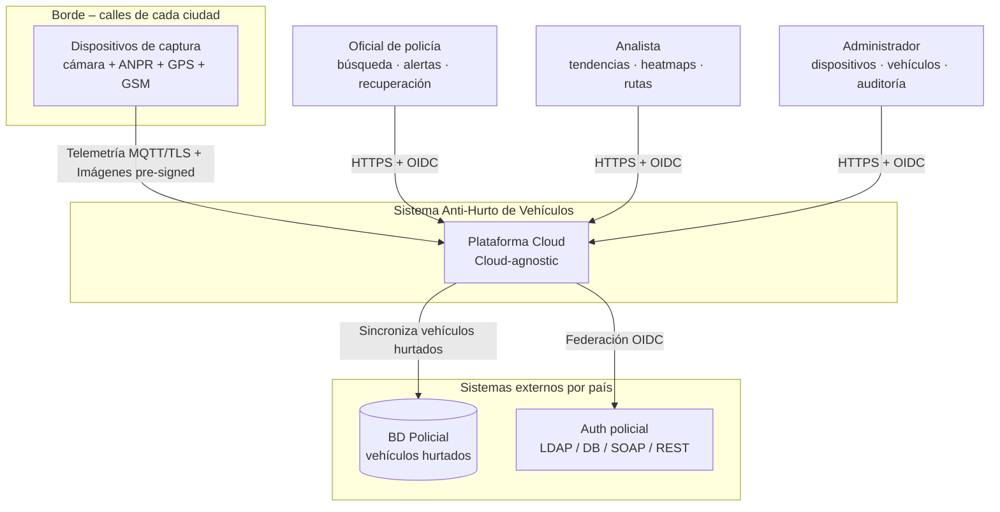
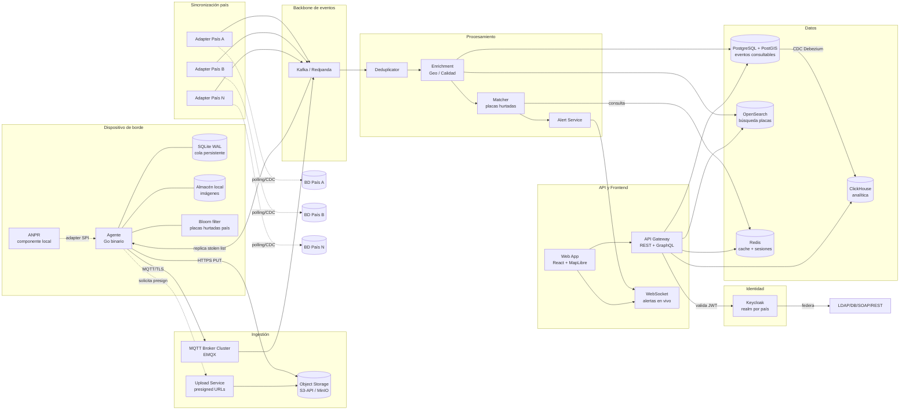
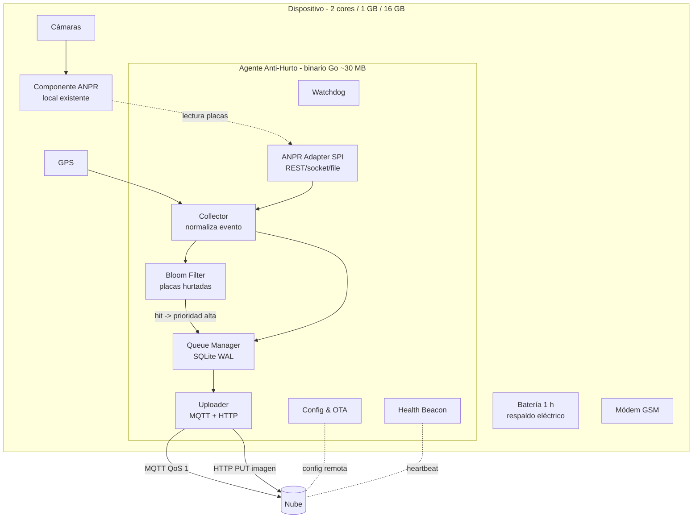
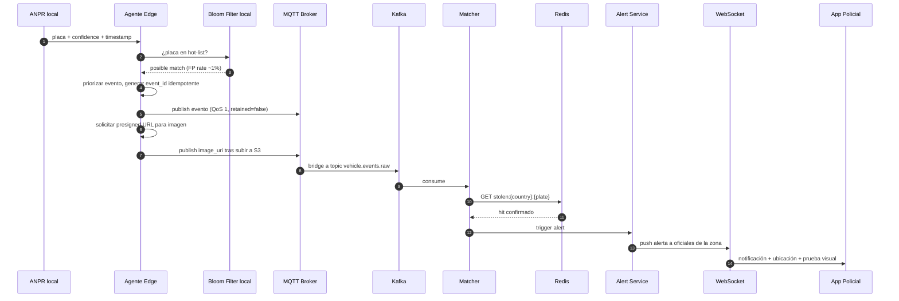
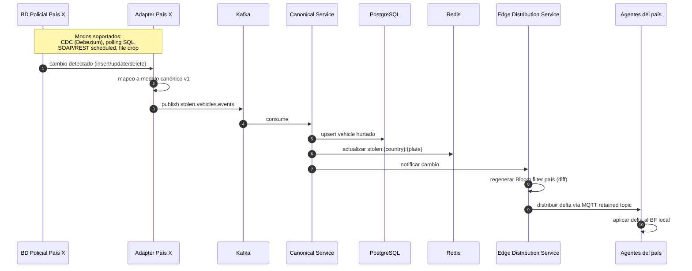
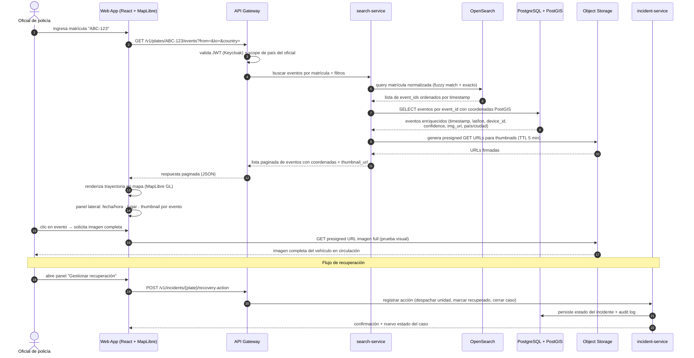
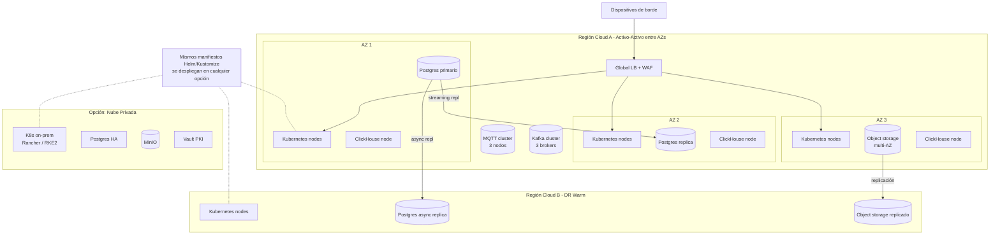

# Propuesta de Arquitectura — Sistema para Combatir el Hurto de Vehículos

**Caso:** Evaluación técnica · Cargo: Coach Técnico — Ceiba
**Autor:** Erik Rodríguez
**Versión:** 1.0
**Última actualización:** 2026-05-13 — Documentación detallada de `ingestion-mqtt` completada (EMQX cluster, Upload Service, Object Storage, Bridge, Security, Operations). Ver Pilar 2. Previamente: `api-frontend-analitica` completada (API Gateway, 6 microservicios, Web App React, Apache Superset). Ver Pilar 6.

---

## 1. Resumen de la Propuesta

Se propone una **plataforma distribuida edge-to-cloud** que captura eventos de tránsito en dispositivos de borde con recursos limitados, los sincroniza de forma confiable hacia una nube portable, los enriquece y correlaciona contra bases de datos heterogéneas de vehículos hurtados por país, y los expone a usuarios policiales mediante consultas, mapas, alertas y analítica.

La arquitectura se sostiene sobre seis pilares:

1. **Edge resiliente con store-and-forward.** Cada dispositivo opera de forma autónoma con cola persistente local, generación de alertas locales contra Bloom-filters de placas hurtadas, y reintento idempotente cuando recupera energía o conectividad. Hasta 4 h sin red y hasta 1 h sin energía son escenarios cubiertos. *Esto responde al requisito de garantizar la recolección y sincronización de datos ante fallos de energía y comunicaciones, dado el hardware limitado (2 cores, 1 GB RAM, 16 GB disco) con batería de respaldo y GSM intermitente.*
2. **Comunicación segura y eficiente.** MQTT 5 sobre TLS con autenticación mutua mTLS por certificado de dispositivo emitido por una PKI propia. Imágenes vía URLs pre-firmadas a object storage para no saturar el broker. *Esto responde al requisito de garantizar una comunicación segura entre los dispositivos y el sistema, evitando información de dispositivos o personas no autorizadas, con un protocolo adecuado para conexiones GSM intermitentes y payloads de distintos tamaños.*

   > **Especificación detallada de la capa de ingestión MQTT:** consultar [`docs/ingestion-mqtt/`](./ingestion-mqtt/overview.md) para la documentación completa del Pilar 2:
   > [Visión General (topología + flujos)](./ingestion-mqtt/overview.md) ·
   > [Esquema de Topics MQTT](./ingestion-mqtt/topic-schema.md) ·
   > [ADR Decisión del Bridge](./ingestion-mqtt/adr-bridge-decision.md) ·
   > [Clúster EMQX (mTLS, ACL, HA)](./ingestion-mqtt/emqx-cluster.md) ·
   > [Upload Service (presigned URL, proxy)](./ingestion-mqtt/upload-service.md) ·
   > [Object Storage (lifecycle, SSE-KMS)](./ingestion-mqtt/object-storage.md) ·
   > [Bridge MQTT→Kafka (Rule Engine)](./ingestion-mqtt/bridge.md) ·
   > [Seguridad (mTLS, OCSP, rotación)](./ingestion-mqtt/security.md) ·
   > [Operaciones (runbooks)](./ingestion-mqtt/operations.md) ·
   > [Helm](./ingestion-mqtt/helm/README.md) ·
   > [Terraform](./ingestion-mqtt/terraform/README.md)
3. **Cloud-agnostic por diseño.** Stack basado en Kubernetes, PostgreSQL, Kafka, Keycloak, Redis, OpenSearch, MinIO/S3-API, ClickHouse. Servicios sensibles a la nube quedan detrás de puertos/adaptadores hexagonales para permitir migración o despliegue on-prem. *Esto responde al requisito de evitar el acoplamiento con un proveedor cloud (Amazon, Azure o Google), poder cambiar de proveedor o montar una nube privada, y escalar dinámicamente desde Latinoamérica hasta cobertura global con alta disponibilidad.*
4. **Anti-Corruption Layer por país.** Cada base de datos policial se sincroniza a un modelo canónico mediante un adaptador específico; cambios se propagan como eventos al núcleo. *Esto responde al requisito de integrar las bases de datos de vehículos hurtados de cada país, que pueden tener diferente formato y tecnología, unificándolas bajo los 9 campos canónicos requeridos más campos adicionales opcionales por país.*
5. **Identidad federada con Keycloak como broker.** Un realm por país como barrera técnica de aislamiento multi-tenant (ADR-011); federación nativa de LDAP y bases de datos, SPI custom para SOAP/REST y delegación a IdPs SAML/OIDC del país; tokens JWT con claims canónicos `country_code`/`role`/`zone` firmados con RS256; cinco roles RBAC (officer, supervisor, analyst, admin, auditor) con scope geográfico por zona; PKI de dispositivos via HashiCorp Vault con certificados X.509 TTL 90 días y mTLS obligatorio en EMQX. *Esto responde al requisito de integrar el sistema con los mecanismos de autenticación heterogéneos de las instituciones policiales (LDAP, bases de datos, servicios SOAP y/o REST), sin imponer un único estándar a cada entidad.*

   > **Especificación detallada de identidad y seguridad:** consultar [`docs/identidad-seguridad/`](./identidad-seguridad/overview.md) para la documentación completa:
   > [Visión General (C4 L2 + flujos)](./identidad-seguridad/overview.md) ·
   > [ADR Realm por País](./identidad-seguridad/adr-realm-por-pais.md) ·
   > [ADR Vault PKI](./identidad-seguridad/adr-vault-pki.md) ·
   > [ADR Caché SPI](./identidad-seguridad/adr-spi-cache.md) ·
   > [Schema JWT Claims](./identidad-seguridad/jwt-claims-schema.md) ·
   > [Modelo de Realm Keycloak](./identidad-seguridad/keycloak-realm-model.md) ·
   > [Federación LDAP](./identidad-seguridad/federation-ldap.md) ·
   > [Federación JDBC](./identidad-seguridad/federation-jdbc.md) ·
   > [Federación SPI Custom](./identidad-seguridad/federation-spi-custom.md) ·
   > [Federación SAML/OIDC](./identidad-seguridad/federation-saml-oidc.md) ·
   > [Vault PKI Dispositivos](./identidad-seguridad/vault-pki-device.md) ·
   > [Vault Secrets Engine](./identidad-seguridad/vault-secrets-engine.md) ·
   > [Vault HA y Auto-Unseal](./identidad-seguridad/vault-ha-unseal.md) ·
   > [Modelo RBAC](./identidad-seguridad/rbac-model.md) ·
   > [Política mTLS Dispositivos](./identidad-seguridad/mtls-device-policy.md) ·
   > [Seguridad Multi-tenant](./identidad-seguridad/multitenancy-security.md) ·
   > [Auditoría de Autenticación](./identidad-seguridad/audit-authentication.md) ·
   > [Onboarding Nuevo País](./identidad-seguridad/onboarding-nuevo-pais.md) ·
   > [Helm](./identidad-seguridad/helm/README.md) ·
   > [Terraform](./identidad-seguridad/terraform/README.md)
6. **Hot path / Cold path separados.** Ruta caliente para matching y alertas (objetivo p95 < 2 s desde captura). Ruta fría para analítica y dashboards (Superset, ClickHouse, PostGIS). *Esto responde al doble requisito funcional del caso: (a) buscar una matrícula y visualizar en un mapa todos los eventos de avistamiento con fecha/hora, lugar y prueba visual, facilitando la recuperación del vehículo; y (b) identificar tendencias como zonas de mayor hurto, vías peligrosas y rutas de escape mediante herramientas de análisis de datos.*

   > **Especificación detallada del backbone de procesamiento (hot path + cold path):** consultar [`docs/backbone-procesamiento/`](./backbone-procesamiento/overview.md) para la documentación completa del Pilar 6:
   > [Visión General (pipeline + presupuesto de latencia)](./backbone-procesamiento/overview.md) ·
   > [Tópicos Kafka](./backbone-procesamiento/kafka-topics.md) ·
   > [ADR Geocodificación Síncrona](./backbone-procesamiento/adr-geocoding-strategy.md) ·
   > [ADR Matcher Fail Closed](./backbone-procesamiento/adr-matcher-fallback.md) ·
   > [PostgreSQL Schema (perspectiva escritura)](./backbone-procesamiento/postgresql-schema.md) ·
   > [OpenSearch Schema (perspectiva indexación)](./backbone-procesamiento/opensearch-schema.md) ·
   > [Deduplicator](./backbone-procesamiento/deduplicator.md) ·
   > [Enrichment Service](./backbone-procesamiento/enrichment-service.md) ·
   > [Matcher Service](./backbone-procesamiento/matcher-service.md) ·
   > [Alert Service](./backbone-procesamiento/alert-service.md) ·
   > [WebSocket Gateway](./backbone-procesamiento/websocket-gateway.md) ·
   > [incident-service](./backbone-procesamiento/incident-service.md) ·
   > [Debezium CDC](./backbone-procesamiento/debezium-cdc.md) ·
   > [SLOs y Observabilidad](./backbone-procesamiento/slo-observability.md) ·
   > [Helm](./backbone-procesamiento/helm/README.md) ·
   > [Terraform](./backbone-procesamiento/terraform/README.md)

   > **Especificación detallada de API, frontend y analítica:** consultar [`docs/api-frontend-analitica/`](./api-frontend-analitica/overview.md) para la documentación completa de la capa de exposición:
   > [Visión General (C4 L2 + SLOs + perfiles)](./api-frontend-analitica/overview.md) ·
   > [ADR API Gateway (Kong OSS)](./api-frontend-analitica/adr-api-gateway.md) ·
   > [ADR Protocolo Tiempo Real (Socket.IO)](./api-frontend-analitica/adr-realtime-protocol.md) ·
   > [ADR Cartografía (MapLibre GL JS)](./api-frontend-analitica/adr-cartography.md) ·
   > [API Gateway — Configuración](./api-frontend-analitica/api-gateway.md) ·
   > [search-service](./api-frontend-analitica/search-service.md) ·
   > [alerts-service](./api-frontend-analitica/alerts-service.md) ·
   > [incident-service](./api-frontend-analitica/incident-service.md) ·
   > [analytics-service](./api-frontend-analitica/analytics-service.md) ·
   > [devices-service](./api-frontend-analitica/devices-service.md) ·
   > [vehicles-service](./api-frontend-analitica/vehicles-service.md) ·
   > [Web App React](./api-frontend-analitica/webapp-architecture.md) ·
   > [Apache Superset](./api-frontend-analitica/superset-integration.md) ·
   > [SLOs y Observabilidad](./api-frontend-analitica/slo-observability.md) ·
   > [Helm](./api-frontend-analitica/helm/README.md) ·
   > [Terraform](./api-frontend-analitica/terraform/README.md)

El resultado: un sistema **portable**, **escalable horizontalmente por país y por región**, **alta disponibilidad (objetivo 99.9 %)**, **tolerante a fallos de borde**, **seguro de extremo a extremo**, y que **cierra el ciclo operacional**: desde la detección en la calle hasta la recuperación del vehículo y la actualización de la base policial.

---

## 2. Arquitectura de la Solución

### 2.1 Diagrama de Contexto (C4 Nivel 1)

**Descripción.** El sistema recibe eventos de placa desde miles a millones de dispositivos de borde, los correlaciona contra las bases policiales de cada país y expone consultas, alertas y analítica a tres tipos de usuarios. Todas las integraciones con sistemas externos (BD policial y proveedores de identidad) ocurren a través de capas de adaptación para evitar acoplamiento.

---

### 2.2 Diagrama de Contenedores (C4 Nivel 2)

**Descripción.** Los dispositivos publican eventos por MQTT (telemetría liviana) y suben imágenes por HTTPS directo al object storage tras solicitar URL pre-firmada. Kafka actúa como backbone de eventos donde convergen ingestiones y sincronizaciones. Las proyecciones a Postgres, OpenSearch y ClickHouse desacoplan escritura de lectura (CQRS pragmático). La identidad se centraliza en Keycloak con federaciones por país. Cada base policial llega al sistema vía su propio Adapter (ACL).

---

### 2.3 Diagrama del Agente de Borde

**Descripción.** El agente actúa como un único proceso Go (footprint < 50 MB RSS, < 5 % CPU sostenido). Lee placas del ANPR vía un *adapter SPI* (REST local, socket UNIX o archivo, según el dispositivo), construye un evento normalizado con GPS + timestamp dual (wall-clock + monotonic), verifica contra el Bloom filter de placas hurtadas para priorizar el envío, persiste en SQLite (WAL para resistir cortes de energía) y reintenta hasta confirmación de entrega. Las imágenes se guardan localmente y se suben de forma diferida vía URL pre-firmada cuando hay capacidad GSM.

> **Especificación detallada del agente de borde:** consultar [`docs/agente-borde/`](./agente-borde/overview.md) para la documentación completa de cada subsistema:
> [Visión General y ciclo de vida](./agente-borde/overview.md) ·
> [ANPR Adapter SPI](./agente-borde/anpr-adapter-spi.md) ·
> [Collector](./agente-borde/collector.md) ·
> [Bloom Filter](./agente-borde/bloom-filter.md) ·
> [Queue Manager](./agente-borde/queue-manager.md) ·
> [Image Store](./agente-borde/image-store.md) ·
> [Uploader](./agente-borde/uploader.md) ·
> [Health Beacon](./agente-borde/health-beacon.md) ·
> [Config/OTA Manager](./agente-borde/config-ota-manager.md) ·
> [Watchdog](./agente-borde/watchdog.md) ·
> [Seguridad](./agente-borde/security.md) ·
> [ADRs Locales](./agente-borde/adr-local.md)

---

### 2.4 Hot Path — Captura, Match y Alerta

**Descripción.** Latencia objetivo desde captura hasta notificación al oficial: **p95 < 2 segundos** cuando hay conectividad nominal. El Bloom filter local elimina la mayor parte del tráfico irrelevante antes incluso de subir el evento, reduciendo la presión sobre el broker. La confirmación de match se hace en cloud contra la lista canónica (Redis con TTL controlado por CDC del país) para evitar falsos positivos.

---

### 2.5 Cold Path — Sincronización de Vehículos Hurtados por País

**Descripción.** Cada país tiene su propio adapter que mapea su esquema y tecnología a un modelo canónico versionado. El modelo canónico siempre incluye los campos obligatorios (matrícula, fecha y lugar de hurto, DNI propietario, marca, clase, línea, color, modelo) y permite campos adicionales en una propiedad `extensions` (JSONB). Los Bloom filters de cada país se mantienen actualizados en el borde por diff, no por descarga completa.

---

### 2.6 Read Path — Búsqueda por Matrícula y Facilitar Recuperación

**Descripción.** El oficial busca una matrícula y obtiene la trayectoria completa del vehículo en el mapa — cada punto es un avistamiento con fecha/hora, lugar y prueba visual (thumbnail). La imagen completa se sirve directamente desde object storage vía URL pre-firmada de corta duración. La información consolidada proviene de todos los dispositivos del país que hayan captado esa placa, independientemente de cuántos sean.

El flujo de recuperación está integrado: el oficial puede despachar una unidad al último punto conocido, escalar el incidente o marcar el vehículo como recuperado. Al marcarse recuperado, el `incident-service` notifica al `sincronizacion-paises` para actualizar el estado canónico y, si la policía lo permite, propagar la baja al adapter del país correspondiente. El sistema así cierra el ciclo: **detección → alerta → localización → recuperación → registro**.

---

### 2.7 Vista de Despliegue (Cloud-Agnostic sobre Kubernetes)

**Descripción.** El despliegue base es multi-AZ activo-activo en una región primaria, con replicación asíncrona a una región DR. Toda la plataforma se describe con Helm/Kustomize + Terraform modular, lo que permite levantar la misma topología en AWS, Azure, GCP u on-prem (Rancher/RKE2 + MinIO + Vault) sin reescribir la solución.

---

## 3. Componentes Principales

### 3.1 Borde

| Componente | Responsabilidad | Tecnología propuesta |
|---|---|---|
| **Agente Edge** ([visión general](./agente-borde/overview.md)) | Captura, normaliza, encola y reenvía eventos; aplica Bloom filter local; orquesta subida de imágenes; expone health y ejecuta OTA | Binario Go estático (~30 MB), systemd service |
| **ANPR Adapter (SPI)** ([especificación](./agente-borde/anpr-adapter-spi.md)) | Abstracción para leer placas desde el componente ANPR del dispositivo (REST local, socket UNIX, watch file, named pipe) | Interfaz Go con implementaciones intercambiables |
| **Queue Manager** ([especificación](./agente-borde/queue-manager.md)) | Persiste eventos pendientes; sobrevive a cortes de energía; orden y prioridad (alertas primero) | SQLite con modo WAL + `synchronous=NORMAL` |
| **Image Store local** ([especificación](./agente-borde/image-store.md)) | Buffer rotativo de imágenes; política configurable (ej. 7 días o 10 GB, lo que ocurra primero) | Filesystem ext4, rotación por tamaño y antigüedad |
| **Bloom Filter de placas hurtadas** ([especificación](./agente-borde/bloom-filter.md)) | Filtrado probabilístico local de hot-list por país, FP ~1 %, < 1 MB para 1 M placas | Implementación Go en memoria + persistencia |
| **Health Beacon** ([especificación](./agente-borde/health-beacon.md)) | Reporta CPU, RAM, disco, batería, cobertura GSM, drift NTP | Métricas comprimidas vía MQTT (msgpack) |
| **Config/OTA Manager** ([especificación](./agente-borde/config-ota-manager.md)) | Recibe configuración remota y actualizaciones firmadas | Suscripción a topic MQTT retained; verificación de firma cosign |
| **Watchdog** ([especificación](./agente-borde/watchdog.md)) | Reinicia el agente ante hangs o consumo anómalo de recursos | Proceso systemd con `WatchdogSec` |

### 3.2 Ingestión

| Componente | Responsabilidad | Tecnología | Especificación detallada |
|---|---|---|---|
| **MQTT Broker** | Recibir telemetría de dispositivos con QoS 1, autenticación mTLS, ACL por device | EMQX 5.x cluster (3 nodos, anti-afinidad por AZ) | [emqx-cluster.md](./ingestion-mqtt/emqx-cluster.md) |
| **Upload Service** | Emitir URLs pre-firmadas (TTL 5 min) para subida directa de imágenes; modo proxy para NAT/APN; validar mTLS/JWT del dispositivo | Servicio Go; arquitectura hexagonal con `ObjectStoragePort` (ADR-005) | [upload-service.md](./ingestion-mqtt/upload-service.md) |
| **Object Storage** | Almacenar imágenes (full + thumbnail) con lifecycle policy (180 d / 730 d) y SSE-KMS | S3-API: AWS S3, GCS, Azure Blob, o MinIO | [object-storage.md](./ingestion-mqtt/object-storage.md) |
| **MQTT→Kafka Bridge** | Mover mensajes del broker a Kafka manteniendo orden por `device_id` (partition key) | EMQX Rule Engine + Kafka Data Bridge nativo (sin microservicio adicional; ver ADR) | [bridge.md](./ingestion-mqtt/bridge.md) · [adr-bridge-decision.md](./ingestion-mqtt/adr-bridge-decision.md) |
| **Seguridad de ingestión** | mTLS con OCSP/CRL, ACL por `device_id`/`country_code`, cifrado en tránsito y en reposo | TLS 1.3, Vault PKI, SSE-KMS | [security.md](./ingestion-mqtt/security.md) |

> **Esquema de topics MQTT** (contrato compartido entre agente, broker y bridge): [`docs/ingestion-mqtt/topic-schema.md`](./ingestion-mqtt/topic-schema.md)

### 3.3 Backbone y Procesamiento

| Componente | Responsabilidad | Tecnología | Especificación detallada |
|---|---|---|---|
| **Event Bus** | Backbone durable para eventos (telemetría, hurtos, alertas, auditoría). 6 tópicos del pipeline con replication factor 3 y `min.insync.replicas=2`. | Apache Kafka (alt: Redpanda — API-compatible, sin ZooKeeper) | [kafka-topics.md](./backbone-procesamiento/kafka-topics.md) |
| **Deduplicator** | Elimina reenvíos idempotentes usando `event_id` único por dispositivo; ventana de 24 h en state store RocksDB; exactly-once semantics. | Kafka Streams con state store RocksDB | [deduplicator.md](./backbone-procesamiento/deduplicator.md) |
| **Enrichment Service** | Geocodifica coordenadas (dataset local, timeout 200 ms — ADR-BP-01), normaliza placa por país, evalúa calidad de imagen; proyecta a PostgreSQL y OpenSearch. | Servicio Go / NestJS; arquitectura hexagonal (ADR-005) | [enrichment-service.md](./backbone-procesamiento/enrichment-service.md) |
| **Matcher Service** | Coteja placa normalizada contra lista roja Redis; fallback fail closed con Kafka Streams local state store si Redis no disponible (ADR-BP-02). | Servicio Go consumidor de Kafka + Redis lookup + Kafka Streams GlobalKTable | [matcher-service.md](./backbone-procesamiento/matcher-service.md) |
| **Alert Service** | Genera, persiste y rutea alertas a oficiales por zona PostGIS; deduplicación por ventana 5 min. | Go / NestJS + PostgreSQL + gRPC al WebSocket Gateway | [alert-service.md](./backbone-procesamiento/alert-service.md) |
| **WebSocket Gateway** | Sesiones WebSocket de agentes policiales (JWT Keycloak); filtro por `country_code` + geocerca; entrega alertas pendientes en reconexión. | Go / NestJS; Redis session store | [websocket-gateway.md](./backbone-procesamiento/websocket-gateway.md) |
| **incident-service** | Máquina de estados del ciclo de recuperación (CREATED→DISPATCHED→ON_SCENE→RECOVERED→CLOSED); log de auditoría append-only; produce evento RECOVERED a Kafka. | Go / NestJS + PostgreSQL | [incident-service.md](./backbone-procesamiento/incident-service.md) |
| **Debezium CDC** | Captura cambios del WAL de PostgreSQL y los publica a `pg.events.cdc`; ClickHouse ingiere vía Kafka Engine Table (cold path analítico). | Debezium 2.x + Kafka Connect cluster | [debezium-cdc.md](./backbone-procesamiento/debezium-cdc.md) |
| **Canonical Vehicles Service** | Mantiene la tabla canónica de vehículos hurtados a partir de eventos de adapters; actualiza Redis y notifica al Edge Distribution Service. | NestJS + Postgres + Redis | — |

> **Especificación completa del backbone:** ver [`docs/backbone-procesamiento/overview.md`](./backbone-procesamiento/overview.md) para el pipeline completo con presupuesto de latencia (SLO p95 < 2 s). Ver [`docs/backbone-procesamiento/slo-observability.md`](./backbone-procesamiento/slo-observability.md) para métricas Prometheus y dashboards Grafana.

### 3.4 Adaptación por País (Anti-Corruption Layer)

| Componente | Responsabilidad | Tecnología |
|---|---|---|
| **Country Adapter** | Conector específico por país; mapea su BD policial al modelo canónico; publica eventos | Microservicio por país, contenedor independiente; modos: CDC (Debezium), polling JDBC, SOAP/REST cliente, file watcher |
| **Schema Registry** | Versiona el modelo canónico de eventos y vehículos hurtados | Confluent Schema Registry o Apicurio |

### 3.5 Almacenamiento de Lectura

| Componente | Responsabilidad | Tecnología |
|---|---|---|
| **PostgreSQL + PostGIS** ([schema](./almacenamiento-lectura/postgresql-schema.md) · [HA](./almacenamiento-lectura/postgresql-ha.md)) | Eventos consultables, vehículos hurtados, usuarios, configuración; consultas geoespaciales | PostgreSQL 16 (RDS / CloudSQL / Aurora / Patroni HA on-prem) |
| **OpenSearch** ([schema](./almacenamiento-lectura/opensearch-schema.md) · [ILM](./almacenamiento-lectura/opensearch-ilm.md)) | Búsqueda rápida por matrícula, búsqueda fuzzy, agregaciones temporales | OpenSearch 2.x (alt: Elasticsearch OSS) |
| **ClickHouse** ([schema](./almacenamiento-lectura/clickhouse-schema.md) · [H3 views](./almacenamiento-lectura/clickhouse-h3-views.md)) | Analítica columnar masiva: heatmaps, rutas, tendencias por ciudad/país | ClickHouse cluster con sharding por país |
| **Redis** ([schema](./almacenamiento-lectura/redis-schema.md) · [topología ADR](./almacenamiento-lectura/adr-redis-topology.md)) | Cache de hot-list de placas, sesiones, rate-limiting, pub/sub de alertas | Redis Sentinel o Cluster |

> **Especificación detallada del almacenamiento de lectura:** consultar [`docs/almacenamiento-lectura/`](./almacenamiento-lectura/overview.md) para la documentación completa de los cuatro almacenes:
> [Visión General y SLOs](./almacenamiento-lectura/overview.md) ·
> [ADR Particionamiento PostgreSQL](./almacenamiento-lectura/adr-postgresql-partitioning.md) ·
> [ADR Ingestión ClickHouse](./almacenamiento-lectura/adr-clickhouse-ingestion.md) ·
> [ADR Topología Redis](./almacenamiento-lectura/adr-redis-topology.md) ·
> [Schema PostgreSQL](./almacenamiento-lectura/postgresql-schema.md) ·
> [HA PostgreSQL](./almacenamiento-lectura/postgresql-ha.md) ·
> [Debezium CDC](./almacenamiento-lectura/debezium-cdc.md) ·
> [Schema OpenSearch](./almacenamiento-lectura/opensearch-schema.md) ·
> [ILM OpenSearch](./almacenamiento-lectura/opensearch-ilm.md) ·
> [Schema ClickHouse](./almacenamiento-lectura/clickhouse-schema.md) ·
> [Vistas H3 ClickHouse](./almacenamiento-lectura/clickhouse-h3-views.md) ·
> [Schema Redis](./almacenamiento-lectura/redis-schema.md) ·
> [Ciclo de Vida de Datos](./almacenamiento-lectura/data-lifecycle.md) ·
> [SLOs y Observabilidad](./almacenamiento-lectura/slo-observability.md) ·
> [Helm](./almacenamiento-lectura/helm/README.md) ·
> [Terraform](./almacenamiento-lectura/terraform/README.md)

### 3.6 API, Frontend y Analítica

| Componente | Responsabilidad | Tecnología |
|---|---|---|
| **API Gateway** ([configuración](./api-frontend-analitica/api-gateway.md) · [ADR](./api-frontend-analitica/adr-api-gateway.md)) | Punto único de entrada; rate-limiting, autenticación JWT/JWKS, routing, TLS, audit log | Kong OSS (DB-less mode); adapter hexagonal `ApiGatewayPort` para equivalentes cloud |
| **search-service** ([spec](./api-frontend-analitica/search-service.md) · [OpenAPI](./api-frontend-analitica/openapi/search-service.yaml)) | Búsqueda de eventos por matrícula (exacta + fuzzy); orquesta OpenSearch + PostgreSQL + presigned URLs | NestJS o Go; puertos hexagonales `EventsIndexPort`, `EventsRepositoryPort`, `ObjectStoragePort` |
| **alerts-service** ([spec](./api-frontend-analitica/alerts-service.md) · [OpenAPI](./api-frontend-analitica/openapi/alerts-service.yaml)) | Distribución de alertas en tiempo real a oficiales de la zona via WebSocket | Socket.IO + Redis adapter; puertos `AlertsKafkaPort`, `AlertsStatePort` |
| **incident-service** ([spec](./api-frontend-analitica/incident-service.md) · [OpenAPI](./api-frontend-analitica/openapi/incident-service.yaml)) | Ciclo de vida de recuperación (created → dispatched → escalated → recovered → closed); write-back al país | NestJS o Go; puerto hexagonal `CountrySyncPort` |
| **analytics-service** ([spec](./api-frontend-analitica/analytics-service.md) · [OpenAPI](./api-frontend-analitica/openapi/analytics-service.yaml)) | Heatmaps H3, tendencias de hurto, rutas de escape; detección de staleness | NestJS o Go; puerto `AnalyticsRepositoryPort` sobre ClickHouse |
| **devices-service** ([spec](./api-frontend-analitica/devices-service.md) · [OpenAPI](./api-frontend-analitica/openapi/devices-service.yaml)) | CRUD de dispositivos captura; OTA asíncrono (202 → pending_ota) | NestJS o Go; multi-tenant por `country_code` |
| **vehicles-service** ([spec](./api-frontend-analitica/vehicles-service.md) · [OpenAPI](./api-frontend-analitica/openapi/vehicles-service.yaml)) | CRUD manual de `stolen_vehicles` (role=admin); coordina cache Redis | NestJS o Go; genera audit_log y actualiza `stolen:{cc}:{plate}` en Redis |
| **Web App** ([arquitectura](./api-frontend-analitica/webapp-architecture.md)) | Mapa de trayectorias, búsqueda por placa, alertas en vivo, gestión de recuperación, analítica, admin | React + TypeScript + MapLibre GL JS ([ADR](./api-frontend-analitica/adr-cartography.md)) + Kepler.gl + Socket.IO ([ADR](./api-frontend-analitica/adr-realtime-protocol.md)) |
| **BI / Analytics** ([integración](./api-frontend-analitica/superset-integration.md)) | Dashboards interactivos de tendencias, zonas peligrosas, vías de escape con Row Level Security por país | Apache Superset OSS + ClickHouse |

**Flujo de recuperación.** El sistema cierra el ciclo de extremo a extremo: el agente de borde detecta el vehículo → la alerta llega al oficial en tiempo real con ubicación y prueba visual → el oficial despacha unidades al punto exacto → al recuperar el vehículo, lo marca en el sistema → el `incident-service` propaga el cambio de estado al `sincronizacion-paises` y, si el adapter del país lo soporta, actualiza la BD policial. Esto convierte la plataforma en una herramienta de gestión operacional, no sólo de monitoreo.

### 3.7 Identidad

| Componente | Responsabilidad | Tecnología |
|---|---|---|
| **Keycloak** | Broker de identidad; un realm por país; emisión de JWT; SSO web | Keycloak 24+ sobre K8s con Postgres dedicado |
| **Federation Providers** | LDAP nativo, JDBC nativo, SPI custom para SOAP/REST | Keycloak SPIs (User Storage SPI / Identity Provider SPI) |
| **Device PKI** | Emisión, rotación y revocación de certificados de dispositivo | HashiCorp Vault PKI (alt: step-ca) |

### 3.8 Observabilidad y Operación

| Componente | Responsabilidad | Tecnología |
|---|---|---|
| **Métricas** | Recolección y alerting de métricas de plataforma y negocio | Prometheus + Alertmanager + Grafana |
| **Logs** | Logs estructurados centralizados | Loki o OpenSearch (logs) |
| **Trazas** | Tracing distribuido extremo a extremo | OpenTelemetry SDK + Tempo o Jaeger |
| **Secrets** | Custodia de secretos y rotación | Vault (cloud-agnostic) |
| **GitOps** | Despliegue declarativo y reproducible | ArgoCD + Helm/Kustomize |
| **IaC** | Provisión de infraestructura | Terraform con módulos por proveedor |

---

## 4. Decisiones de Diseño

Cada decisión se presenta en formato ADR resumido: contexto, decisión, alternativas, consecuencias.

### ADR-001 · Patrón Edge-First con Store-and-Forward

- **Contexto.** La energía falla hasta 4 h y la batería dura 1 h; GSM no es continua. No se puede perder evidencia de tránsito.
- **Decisión.** Cada dispositivo ejecuta un agente autónomo que persiste cada evento en disco (SQLite WAL) antes de intentar enviarlo. Reintenta indefinidamente con backoff exponencial. Cada evento lleva un `event_id` idempotente.
- **Alternativas.**
  - *Streaming directo sin buffer:* descartada, pierde datos en cortes.
  - *Buffer en RAM:* descartada, no sobrevive a corte de energía.
- **Consecuencias.** El sistema central debe deduplicar (lo hace el Deduplicator). El disco de 16 GB acomoda meses de metadatos y semanas de imágenes con rotación.

### ADR-002 · MQTT 5 como Protocolo Principal de Telemetría

- **Contexto.** Conexión GSM intermitente, payloads pequeños y frecuentes, miles a millones de dispositivos.
- **Decisión.** MQTT 5 con QoS 1, sesiones persistentes, keep-alive 60 s, autenticación mTLS por device. Broker EMQX en cluster.
- **Alternativas.**
  - *HTTP/2 o REST:* mayor overhead por conexión, sin QoS nativa, sin sesiones persistentes.
  - *gRPC streaming:* sufre en GSM intermitente, requiere reconexión costosa.
  - *AMQP:* más pesado que MQTT, optimizado para escenarios distintos.
- **Consecuencias.** Se opera un broker dedicado con su propia HA y monitoreo. Las imágenes no viajan por MQTT — se separan en HTTPS para no saturar el broker.

### ADR-003 · Imágenes vía URLs Pre-firmadas a Object Storage

- **Contexto.** Las imágenes pesan dos a tres órdenes de magnitud más que la metadata. Saturar el broker con ellas es contraproducente.
- **Decisión.** El agente solicita una URL pre-firmada al Upload Service y hace `PUT` directo al object storage (S3-API). En el evento MQTT viaja sólo la URI resultante.
- **Alternativas.**
  - *Subir por MQTT:* satura el broker, malo para QoS.
  - *Subir por HTTP a un backend:* introduce cuello de botella y duplica tráfico.
- **Consecuencias.** El dispositivo necesita acceso de red al object storage. Si no es factible directo (NAT, regulaciones), se interpone un proxy de subida.

### ADR-004 · Kubernetes como Plataforma de Cómputo

- **Contexto.** Necesidad de escalar dinámicamente, alta disponibilidad, portabilidad entre nubes.
- **Decisión.** Kubernetes en la nube elegida (EKS / GKE / AKS) y RKE2/Rancher para on-prem. Todos los servicios se empaquetan como contenedores con manifiestos Helm.
- **Alternativas.**
  - *FaaS / Serverless:* el más rápido para arrancar, pero acoplado a la nube.
  - *VMs con autoscaling:* peor utilización y operación más manual.
  - *Nomad:* menos ecosistema y herramientas.
- **Consecuencias.** Se asume el costo operativo de K8s (SRE skills, observabilidad). Se gana la unidad de despliegue entre cualquier infraestructura.

### ADR-005 · Arquitectura Hexagonal para Servicios Sensibles a la Nube

- **Contexto.** Requisito explícito de evitar acoplamiento con un proveedor cloud.
- **Decisión.** Encapsular en puertos/adaptadores todo lo que toca cloud: object storage, KMS, secret manager, colas administradas, email/SMS. Implementaciones intercambiables: S3 ↔ GCS ↔ Azure Blob ↔ MinIO; AWS KMS ↔ Vault Transit ↔ Azure Key Vault.
- **Alternativas.**
  - *Usar SDK cloud directo en servicios:* lock-in, costoso migrar.
  - *Usar sólo OSS:* pierde ventajas managed.
- **Consecuencias.** Mayor esfuerzo inicial. Tests con dobles más sencillos. Migración entre nubes factible en semanas, no meses.

### ADR-006 · Anti-Corruption Layer por País + Modelo Canónico Versionado

- **Contexto.** Cada policía tiene formato y tecnología distintos para vehículos hurtados.
- **Decisión.** Por cada país, un microservicio adapter dedicado que conoce su BD específica. El modelo canónico tiene los campos obligatorios y una propiedad `extensions: jsonb` para campos adicionales por país. El esquema está versionado (Avro + Schema Registry).
- **Alternativas.**
  - *Imponer un único formato a las policías:* no factible institucionalmente.
  - *Adaptador genérico parametrizable:* nunca cubre los casos reales (CDC, SOAP heredado, drops de archivo).
- **Consecuencias.** Hay un costo de mantenimiento por país. A cambio, se aísla el núcleo de cualquier cambio de esquema externo, y onboarding de un nuevo país es un proyecto delimitado.

### ADR-007 · Keycloak como Broker de Identidad

- **Contexto.** Las policías usan LDAP, DBs, SOAP y REST para autenticación. El sistema debe integrarse con todas.
- **Decisión.** Un Keycloak central con un *realm* por país. Federación nativa para LDAP y DB (User Storage SPI built-in). SPI custom para SOAP/REST. Las apps reciben JWT estándar OIDC. Posibilidad de delegar el inicio de sesión al IdP del país si éste soporta SAML/OIDC.
- **Alternativas.**
  - *Construir OIDC propio:* reinventar la rueda.
  - *Cognito / Azure AD B2C:* lock-in, menos flexible para federaciones heterogéneas.
- **Consecuencias.** Keycloak es una pieza crítica con su propia operación. Se gana un único punto de federación y SSO real entre apps internas.

### ADR-008 · CQRS Pragmático con Eventos como Fuente

- **Contexto.** Alta tasa de eventos, necesidad de lectura optimizada (búsqueda por placa, mapa) y analítica (tendencias, heatmaps).
- **Decisión.** Los eventos en Kafka son el log de cambios. Servicios independientes proyectan a Postgres (consultas operacionales), OpenSearch (búsqueda), ClickHouse (analítica). Sin event-sourcing puro: se persiste el estado materializado, no se rehidrata desde eventos.
- **Alternativas.**
  - *Una sola DB para todo:* no rinde tanto en transaccional como en analítica.
  - *Event-sourcing puro:* exceso de complejidad para este caso.
- **Consecuencias.** Consistencia eventual entre proyecciones. Necesidad de herramientas de replay para reconstruir una proyección. Lecturas mucho más rápidas y barata.

### ADR-009 · Bloom Filter en Borde para Hot-Path de Alertas

- **Contexto.** Un dispositivo puede ver miles de placas al día, pero sólo una fracción mínima corresponde a vehículos hurtados. Notificar todo y filtrar en cloud aumenta latencia y costo.
- **Decisión.** Cada dispositivo mantiene un Bloom filter de las placas hurtadas de su país (típicamente < 1 MB para 1 M placas con FP < 1 %). El filtro se actualiza incrementalmente vía MQTT retained topic. Cuando hay hit local, el evento se prioriza en la cola y se publica de inmediato.
- **Alternativas.**
  - *Lista completa en disco:* posible, pero costosa de sincronizar y consultar.
  - *Sólo cloud-side matching:* añade latencia y depende de conectividad.
- **Consecuencias.** Confirmación canónica del match siempre ocurre en cloud (para evitar falsos positivos del BF). El BF acelera la priorización, no la decisión final.

### ADR-010 · PKI Propia con Certificados Cortos para Dispositivos

- **Contexto.** Necesidad de identidad fuerte por dispositivo, revocación eficiente, rotación segura.
- **Decisión.** Vault PKI emite un certificado por dispositivo con TTL 90 días. El agente rota automáticamente con CSR firmado antes del vencimiento. Provisioning inicial vía bootstrap token de un solo uso.
- **Alternativas.**
  - *API keys estáticas:* débiles, difíciles de revocar masivamente.
  - *Cert long-lived sin rotación:* riesgo si una unidad es comprometida.
- **Consecuencias.** Operación PKI no trivial pero estándar. Revocación inmediata por device sin afectar a otros.

### ADR-011 · Multi-tenant por País con Aislamiento de Datos

- **Contexto.** Soberanía de datos, regulaciones por país, separación de operación.
- **Decisión.** `country_code` como discriminador de tenant en todas las tablas y topics. Posibilidad de despliegues regionales separados (por ejemplo, datos de Colombia residen en región sudamericana). Keycloak con un realm por país. Bloom filters segmentados por país.
- **Alternativas.**
  - *Tenant único global:* ignora regulación local.
  - *Despliegue completamente separado por país:* multiplica costos de operación.
- **Consecuencias.** Diseño multi-tenant disciplinado desde el inicio. Posibilidad de aislar regionalmente cuando un país lo exija.

### ADR-012 · Stack de Streaming sobre Kafka (con opción Redpanda)

- **Contexto.** Necesidad de backbone durable, alto throughput, compatible cloud-agnostic.
- **Decisión.** Apache Kafka como referencia; se permite Redpanda en clústeres on-prem por simplicidad operacional (sin ZooKeeper, mismo API).
- **Alternativas.**
  - *AWS Kinesis / Google Pub-Sub:* lock-in.
  - *RabbitMQ:* no diseñado para replay masivo ni retention prolongado.
- **Consecuencias.** Se gana ecosistema (Connect, Streams, Schema Registry, Debezium). Operación no trivial — se mitiga con managed (MSK, Confluent Cloud) detrás de la abstracción cuando aplica.

---

## 5. Consideraciones de Calidad

### 5.1 Disponibilidad

**Objetivo:** 99.9 % anual (≈ 8.7 h de indisponibilidad).

- Despliegue multi-AZ activo-activo en la región primaria.
- Réplica asíncrona a región DR con RPO ≤ 5 min y RTO ≤ 30 min.
- Postgres en HA (Patroni, RDS Multi-AZ o equivalente) con failover automático.
- Kafka cluster mínimo de 3 brokers, replication factor 3, `min.insync.replicas=2`.
- MQTT broker en cluster con session persistence.
- Servicios stateless con `PodDisruptionBudget` y `topologySpreadConstraints`.
- Object storage replicado entre AZs y opcionalmente cross-region.
- **Edge:** la propia arquitectura store-and-forward absorbe caídas del backend sin pérdida de evidencia (durante horas o días según retención de disco).

### 5.2 Escalabilidad

- **Horizontal en cómputo:** todos los servicios son stateless o particionables; HPA por CPU/RPS/queue lag.
- **Particionamiento de Kafka:** topics particionados por `device_id` (orden por device garantizado).
- **Sharding de ClickHouse por país y mes.** Sharding lógico de Postgres por país si una sola instancia no escala (mediante Citus o múltiples instancias por país).
- **OpenSearch con índices por país + tiempo (rolling indices).**
- **Crecimiento previsto.** Diseño dimensionado para 100 K dispositivos en LatAm con crecimiento a 1 M+ globalmente. A 100 K devices con promedio ~1 K eventos/día/device: ~1.2 K eventos/seg promedio, picos ~5 K/seg, manejables con un cluster Kafka modesto (3 brokers de 8 vCPU). A 1 M devices: re-particionamiento y crecimiento de cluster, sin cambios arquitectónicos.

### 5.3 Seguridad

- **Borde ↔ Nube.** mTLS con cert por dispositivo emitido por PKI propia; rotación cada 90 días; CRL/OCSP.
- **Identidad de usuarios.** OIDC vía Keycloak; MFA configurable por realm; políticas de password heredadas del IdP del país cuando aplique.
- **Autorización.** RBAC fino: oficial, supervisor, analista, administrador, auditor; permisos por país/ciudad.
- **Datos en tránsito.** TLS 1.2+ end-to-end; HSTS en frontend.
- **Datos en reposo.** Cifrado a nivel de volumen (LUKS / KMS-managed); cifrado a nivel de campo (pgcrypto) para PII sensible (DNI propietario, coordenadas históricas).
- **Pseudonimización.** El DNI se almacena hashed (HMAC con sal por país) en la capa analítica; sólo el dominio operativo retiene el valor en claro, accesible bajo audit log.
- **Secrets.** Vault con auto-rotación; cero secretos en imágenes ni en variables de entorno en git.
- **Auditoría.** Todos los accesos a placas y eventos de vehículos quedan en un audit log inmutable (append-only, S3 Object Lock).
- **Supply chain.** Imágenes firmadas con cosign; SBOM con Syft; escaneo con Trivy en CI; gates en ArgoCD.
- **Borde.** Validación de firmas en OTA; modo "config locked" si watchdog detecta tampering.
- **Privacidad.** Cumplimiento Ley 1581 (Colombia) y equivalentes; consentimiento institucional; minimización (no se almacenan rostros, sólo placas y vehículo); retención configurable por país.

### 5.4 Rendimiento

| Operación | SLO |
|---|---|
| Captura → recepción en cloud (red nominal) | p95 < 1 s, p99 < 3 s |
| Captura → alerta entregada a oficial (hot path) | p95 < 2 s, p99 < 5 s |
| Búsqueda por placa (UI) | p95 < 300 ms |
| Consulta de mapa con ≤ 10 K eventos | p95 < 800 ms |
| Dashboard agregado (rango 7 días, 1 ciudad) | p95 < 3 s |
| Sincronización inicial de Bloom filter en device | < 30 s sobre GSM 3G |

- Caches Redis para hot-list de vehículos y para búsquedas frecuentes.
- ClickHouse pre-agrega por hora/día/celda H3 mediante materialized views.
- CDN delante del frontend y de las imágenes thumbnails para reducir latencia geográfica.

### 5.5 Mantenibilidad y Evolución

- **12-factor apps** para todos los servicios.
- **Domain-Driven Design ligero:** límites por bounded context (devices, events, vehicles, identity, alerts, analytics).
- **Versionado de contratos** (schemas Avro + Schema Registry; OpenAPI para REST).
- **IaC total** con Terraform; clústeres reproducibles.
- **GitOps** vía ArgoCD; promociones por PR.
- **Observabilidad nativa:** todo servicio expone métricas Prometheus, logs JSON, trazas OTel.
- **Testing piramidal:** unit (host), integration (Testcontainers), contract (Pact), e2e mínimo, smoke en cada despliegue.

### 5.6 Portabilidad (Cloud-agnostic)

| Capacidad | Implementación de referencia | Alternativas portables |
|---|---|---|
| Cómputo | K8s (EKS/GKE/AKS) | RKE2, OpenShift, Kubespray |
| Object storage | S3-API | MinIO, Ceph RadosGW, GCS, Azure Blob |
| Database | PostgreSQL gestionado | Patroni, CrunchyData on-prem |
| Streaming | Kafka gestionado | Strimzi en K8s, Redpanda |
| Identidad | Keycloak | Keycloak (mismo) |
| Secretos | Vault | Vault (mismo) o KMS-cloud detrás de adapter |
| BI | Superset | Superset (mismo) |

> Estrategia: **preferir OSS portable**. Cuando se use un servicio gestionado, hacerlo siempre **detrás de un puerto/adapter**. La migración entre nubes pasa por reemplazar adapters, no por reescribir lógica de dominio.

### 5.7 Resiliencia Operacional

- **Caos engineering** periódico (Litmus/Chaos Mesh) en pre-prod: kill de pods, partición de red, lag de Kafka, latencia de S3.
- **Runbooks** versionados por incidente típico.
- **Backups** Postgres (PITR), Kafka (snapshots de topics críticos), ClickHouse, Keycloak realms.
- **DR drills** trimestrales.

### 5.8 Cumplimiento y Soberanía de Datos

- Capacidad de **residencia por país**: datos de Colombia en región sudamericana, etc.
- **Retención configurable** por país (eventos, imágenes, audit log).
- **Right to be forgotten** aplicable cuando un vehículo sale de la lista de hurtos (lifecycle automático).
- **Consentimiento institucional** documentado por país.

---

## 6. Supuestos

1. **ANPR existente.** El componente de ANPR del dispositivo expone su salida por al menos uno de: REST local, socket UNIX, archivo plano vigilable o named pipe. El agente Edge implementa un *adapter SPI* para cada modalidad. Si no fuera así, se requiere una conversación con el fabricante para acordar un contrato de salida.
2. **APN privado o IP enrutable.** Los dispositivos pueden alcanzar los endpoints públicos del sistema (MQTT broker y object storage) directamente sobre GSM, idealmente vía APN privado del operador. En caso contrario, se interpone un edge proxy regional.
3. **Volumen de captura.** Se asume promedio de ~1 000 placas/día por dispositivo, con picos de hasta 10 000 en intersecciones de alto flujo. Esto se valida en pruebas piloto antes del rollout.
4. **Imágenes.** Las cámaras producen imágenes JPEG razonablemente comprimidas (≤ 500 KB full, ≤ 50 KB thumbnail). En caso contrario, el agente aplica compresión adicional para no agotar el disco ni la cuota GSM.
5. **Reloj del dispositivo.** Existe un RTC que sobrevive cortes de energía; cuando hay conectividad se sincroniza vía NTP. Los eventos llevan timestamp wall-clock y monotonic para forensía.
6. **Disponibilidad GSM.** Hay cobertura suficiente para sincronizar varias veces al día en promedio. Casos extremos (zonas sin cobertura por semanas) requieren cosecha física, fuera de alcance de esta propuesta.
7. **Compromiso institucional.** Cada policía proporciona:
   - Acceso programático a su BD de hurtos (cuenta de servicio, credencial, ventana de mantenimiento conocida).
   - Endpoints o credenciales para federación de autenticación.
   - Persona técnica de contraparte para onboarding del adapter.
8. **Modelo canónico extensible.** Los nueve campos del enunciado (matrícula, fecha, lugar, DNI propietario, marca, clase, línea, color, modelo) son obligatorios. Los campos extra de cada país viajan en `extensions: jsonb` y se documentan por país.
9. **Imágenes de evidencia.** Se almacena la imagen completa más una *thumbnail* indexada. No se almacenan rostros ni se hace reconocimiento facial — fuera de alcance y de cumplimiento.
10. **Retención por defecto.** Eventos crudos 24 meses; imágenes full 6 meses; thumbnails 24 meses; audit log 7 años. Configurable por país.
11. **Operador del sistema.** Ceiba (o quien opere) cuenta con un equipo SRE / DevOps capaz de operar Kubernetes y servicios distribuidos. De no haberlo, se ajusta el plan operativo y se evalúan servicios gestionados con la abstracción descrita.
12. **Provisioning de dispositivos.** El fabricante incluye un bootstrap token de un solo uso por unidad (o un certificado de fábrica) que permite intercambiarlo por el certificado operativo emitido por Vault PKI.
13. **OTA.** Existe ventana para enviar actualizaciones del agente; los dispositivos toleran reinicios controlados.
14. **Idioma.** Las UIs son al menos español/inglés. La internacionalización está prevista en el frontend desde el día uno.
15. **Tiempo a producción.** Se asume un piloto inicial con 1–2 países y 1 000–5 000 dispositivos antes del rollout regional. La propuesta no implica que todo lo descrito se construya en la primera iteración: muchas piezas (analítica avanzada, multi-región DR, federaciones SOAP) llegan en fases posteriores.
16. **Modo de captura del agente (`upload_mode`).** Por defecto el agente sube al cloud **únicamente los eventos con hit en el Bloom filter** (`upload_mode: stolen_only`). Esto minimiza el volumen de datos, el consumo de banda GSM y la exposición de datos de tránsito de vehículos no relacionados con hurtos (privacidad por defecto, Ley 1581 y equivalentes). El parámetro es **configurable remotamente** vía Config/OTA Manager sin redeploy del binario; con `upload_mode: all` el agente sube todos los eventos y el Bloom filter solo determina prioridad de transmisión. El cambio de modo requiere autorización institucional explícita del país operador, dado que `all` implica registro masivo de tránsito vehicular. La limitación de `stolen_only` es que no permite búsqueda retroactiva de placas que no estaban en la lista de hurtados al momento de ser captadas.

---

## Apéndice A — Mapeo Requisito ↔ Decisión

| Requisito del enunciado | Decisión / componente |
|---|---|
| Hardware limitado (2c/1GB/16GB) | Agente Go ligero (ADR-001), SQLite WAL, Bloom filter (ADR-009) |
| GSM intermitente | Store-and-forward (ADR-001), MQTT QoS 1 (ADR-002) |
| Batería 1 h / cortes hasta 4 h | Persistencia local antes de envío; reintento idempotente |
| ANPR ya existente | ANPR Adapter SPI con múltiples implementaciones |
| 9 campos canónicos + extra por país | Modelo canónico + `extensions: jsonb` (ADR-006) |
| Cambio de cloud / nube privada | Hexagonal (ADR-005), K8s (ADR-004), tabla 5.6 |
| Escalado dinámico | K8s + HPA, particionamiento Kafka (5.2) |
| Alta disponibilidad | Multi-AZ + DR (5.1) |
| Comunicación segura device↔sistema | mTLS + PKI (ADR-010), ACL en broker |
| Integración LDAP/DB/SOAP/REST policial | Keycloak broker + SPIs (ADR-007) |
| Buscar placa → eventos + mapa + prueba visual | search-service + OpenSearch + MapLibre + thumbnails en object storage (§2.6) |
| Facilitar la recuperación de vehículos | Alerta en tiempo real con ubicación exacta + incident-service (despacho, cierre, propagación al país) (§2.6, §3.6) |
| Análisis de tendencias / vías peligrosas / rutas de escape | ClickHouse + H3 + Superset + Kepler.gl (§3.6) |
| Consolidar info de cada dispositivo | Pipeline Enrichment + proyecciones CQRS (ADR-008) |

---

## Apéndice B — Roadmap Sugerido (3 Fases)

**Fase 1 — Piloto.** Un país, 1 000 dispositivos. Edge agent + ingestión MQTT + S3-compat + Postgres + UI búsqueda y mapa básicos. Adapter país piloto. Keycloak con federación LDAP. PKI básica. Sin DR, sin analítica avanzada.

**Fase 2 — Producción Regional.** 2–4 países, hasta 100 K dispositivos. ClickHouse + Superset. Alertas en tiempo real. DR warm. Multi-tenant pulido. SPI custom para SOAP/REST. GitOps maduro. Observabilidad completa.

**Fase 3 — Expansión Global.** Multi-región, residencia por país. Modelos ML para predicción de zonas calientes. App móvil para oficiales en terreno. Federación interpaís opcional. Optimización de costos con tiering de imágenes.
