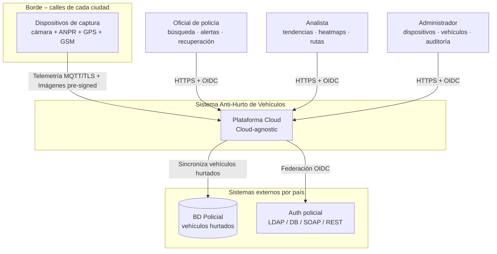
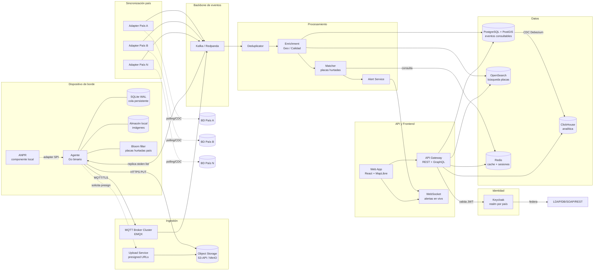
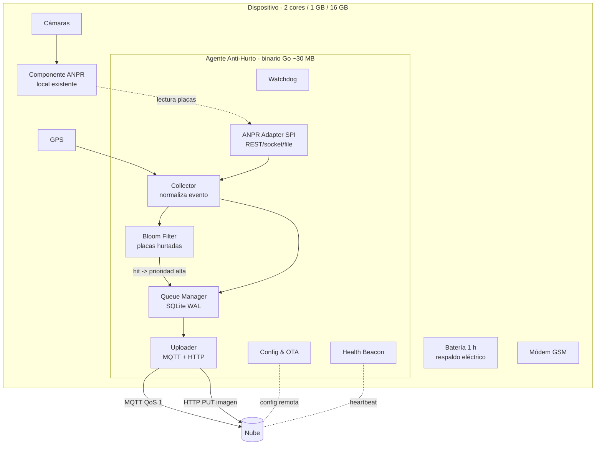
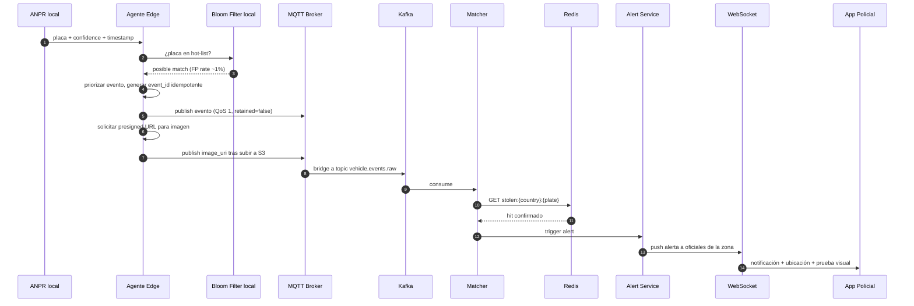
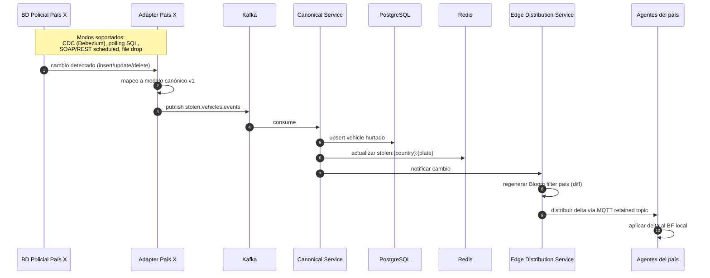
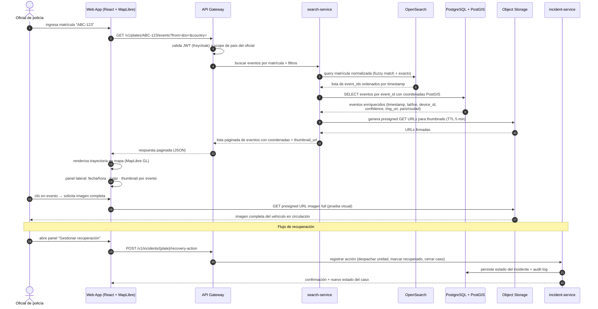
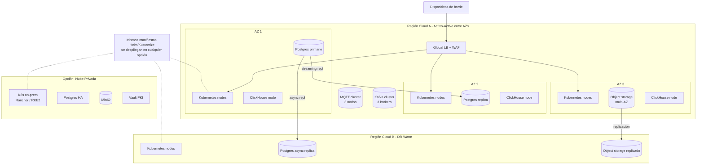

# 2. Arquitectura de la Solución

← [Índice](../propuesta-arquitectura-hurto-vehiculos.md)

---

## 2.1 Diagrama de Contexto (C4 Nivel 1)

**Descripción.** El sistema recibe eventos de placa desde miles a millones de dispositivos de borde, los correlaciona contra las bases policiales de cada país y expone consultas, alertas y analítica a tres tipos de usuarios. Todas las integraciones con sistemas externos ocurren a través de capas de adaptación para evitar acoplamiento.

---

## 2.2 Diagrama de Contenedores (C4 Nivel 2)

**Descripción.** Los dispositivos publican eventos por MQTT (telemetría liviana) y suben imágenes por HTTPS directo al object storage tras solicitar URL pre-firmada. Kafka actúa como backbone de eventos donde convergen ingestiones y sincronizaciones. Las proyecciones a Postgres, OpenSearch y ClickHouse desacoplan escritura de lectura (CQRS pragmático). La identidad se centraliza en Keycloak con federaciones por país. Cada base policial llega al sistema vía su propio Adapter (ACL).

---

## 2.3 Diagrama del Agente de Borde

**Descripción.** El agente es un único proceso Go (footprint < 50 MB RSS, < 5 % CPU sostenido). Lee placas del ANPR vía un *adapter SPI*, construye un evento normalizado con GPS + timestamp dual, verifica contra el Bloom filter de placas hurtadas para priorizar el envío, persiste en SQLite (WAL) y reintenta hasta confirmación de entrega. Las imágenes se suben de forma diferida vía URL pre-firmada.

> **Especificación detallada:** [`docs/agente-borde/overview.md`](../agente-borde/overview.md)

---

## 2.4 Hot Path — Captura, Match y Alerta

**Descripción.** Latencia objetivo desde captura hasta notificación al oficial: **p95 < 2 segundos** cuando hay conectividad nominal. El Bloom filter local elimina la mayor parte del tráfico irrelevante antes incluso de subir el evento. La confirmación de match se hace en cloud contra la lista canónica (Redis) para evitar falsos positivos.

---

## 2.5 Cold Path — Sincronización de Vehículos Hurtados por País

**Descripción.** Cada país tiene su propio adapter que mapea su esquema y tecnología a un modelo canónico versionado (9 campos obligatorios + `extensions` JSONB). Los Bloom filters se actualizan por diff en el borde, no por descarga completa.

> **Especificación detallada:** [`docs/sincronizacion-paises/overview.md`](../sincronizacion-paises/overview.md)

---

## 2.6 Read Path — Búsqueda por Matrícula y Facilitar Recuperación

**Descripción.** El oficial busca una matrícula y obtiene la trayectoria completa del vehículo en el mapa — cada punto es un avistamiento con fecha/hora, lugar y prueba visual. La imagen completa se sirve directamente desde object storage vía URL pre-firmada de corta duración.

El flujo de recuperación está integrado: el oficial puede despachar una unidad al último punto conocido, escalar el incidente o marcar el vehículo como recuperado. Al marcarse recuperado, el `incident-service` notifica al `sincronizacion-paises` para actualizar el estado canónico. El sistema así cierra el ciclo: **detección → alerta → localización → recuperación → registro**.

---

## 2.7 Vista de Despliegue (Cloud-Agnostic sobre Kubernetes)

**Descripción.** El despliegue base es multi-AZ activo-activo en una región primaria, con replicación asíncrona a una región DR. Toda la plataforma se describe con Helm/Kustomize + Terraform modular, lo que permite levantar la misma topología en AWS, Azure, GCP u on-prem sin reescribir la solución.
