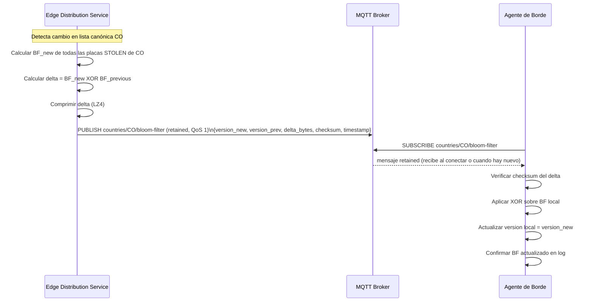
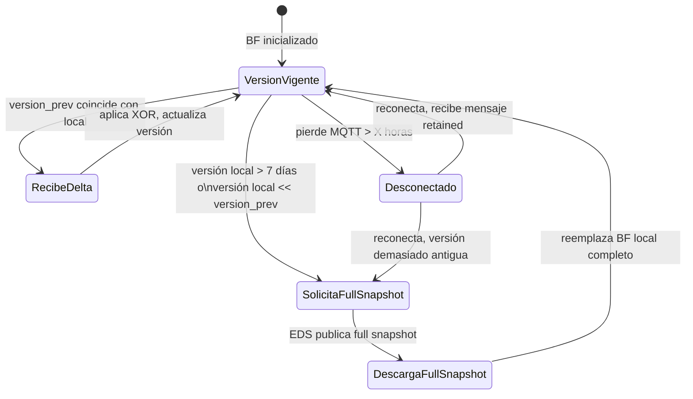

# ADR-009 — Bloom Filter en Borde para Hot-Path de Alertas

**Estado:** Aprobado
**Fecha:** 2026-05-13
**Autores:** Erik Rodríguez
**Revisores:** Equipo de arquitectura
**Change asociado:** `sincronizacion-paises`

---

## Contexto

El Sistema Anti-Hurto de Vehículos despliega dispositivos de borde que capturan placas vehiculares a razón de ~1 000 eventos/día en condiciones normales y hasta 10 000 en intersecciones de alto flujo. La fracción de placas que corresponde a vehículos hurtados es muy pequeña (estimado < 0.1 % del tráfico en un día normal).

El agente de borde opera con recursos limitados: 2 cores, 1 GB RAM, 16 GB disco. La conectividad GSM es intermitente. El SLO del hot path es p95 < 2 s desde captura hasta alerta al oficial.

El sistema debe poder determinar, en el borde, si una placa recién capturada merece priorización inmediata (posible hit en la lista roja) o puede ser encolada para envío diferido.

Existen hasta 1 000 000 de placas hurtadas activas por país.

---

## Restricciones del Caso de Estudio

Las siguientes restricciones son fijas y no negociables para esta decisión:

- **Tasa de falsos positivos ≤ 1 %** (FP rate ≤ 0.01).
- **Tamaño serializado del BF completo < 1 MB** para 1 000 000 de elementos.
- **Sin falsos negativos:** el Bloom filter nunca puede afirmar que una placa no está hurtada cuando sí lo está. Esta propiedad es garantizada por definición matemática del BF.
- La confirmación canónica siempre ocurre en cloud (contra Redis). El BF solo sirve para priorización; no es la decisión final.

---

## Análisis de Parámetros del Bloom Filter

Para n = 1 000 000 elementos y tasa de FP p = 0.01:

- Número óptimo de bits: `m = -n * ln(p) / (ln(2))^2 ≈ 9 585 058 bits ≈ 1.14 MB`

Para ajustar al requisito de < 1 MB (8 388 608 bits):

- Con m = 8 388 608 bits y n = 1 000 000: `p ≈ 0.0084 (< 1 %)` ✓
- Número óptimo de funciones hash: `k = (m/n) * ln(2) ≈ 5.83 → k = 6`

**Parámetros fijos adoptados:**

| Parámetro | Valor |
|---|---|
| Tamaño del bit array (m) | 8 388 608 bits (1 048 576 bytes = 1 MB exacto) |
| Funciones hash (k) | 6 (MurmurHash3 con semillas distintas) |
| Elementos máximos (n) | 1 000 000 |
| Tasa de FP esperada | ≈ 0.84 % (< 1 %) |
| Tamaño serializado (wire) | < 1 MB (con compresión LZ4: ~200–400 KB típico) |

---

## Opciones Evaluadas

### Opción A — Lista completa de placas en disco (archivo o SQLite)

Mantener una copia completa de la lista de placas hurtadas en el dispositivo como archivo de texto o tabla SQLite. Cada consulta es un lookup directo.

**Pros:**
- Sin falsos positivos.
- Lookup O(1) con índice hash.
- Fácil de actualizar: reemplazar el archivo.

**Contras:**
- 1 000 000 de placas × ~10 bytes cada una = ~10 MB mínimo solo de datos. Con índices SQLite, puede superar 30 MB por país, lo que excede el presupuesto de RAM para el BF.
- Sincronización costosa: el archivo completo debe descargarse periódicamente o mantenerse como patch incremental, aumentando la complejidad.
- Lookup en SQLite tiene mayor latencia que un lookup en memoria en un BF (µs vs. ns).
- La lista en disco puede ser extraída y contiene datos de registros policiales (PII).

**Veredicto:** Descartada.

### Opción B — Matching exclusivamente en cloud (sin estructura local)

El agente de borde envía todos los eventos a la nube. El Matcher Service en cloud coteja contra Redis la lista roja completa. No hay estructura local en el dispositivo.

**Pros:**
- Sin lógica de sincronización en el borde.
- Sin falsos positivos.
- La lista roja siempre está actualizada al momento de la consulta.

**Contras:**
- Latencia: el hot path p95 < 2 s requiere que el evento viaje al cloud, sea procesado y la alerta regrese. En GSM con alta latencia (>300 ms de RTT frecuente), esto es difícilmente alcanzable de forma consistente.
- Disponibilidad: durante períodos de desconexión GSM (hasta 4 h), ningún evento puede ser priorizado como alerta. Se pierde toda detección local.
- Costo: todos los eventos deben enviarse, incluidos los no relevantes. A 10 000 eventos/día/dispositivo con ~500 bytes/evento = ~5 MB/día/dispositivo. A 100 000 dispositivos: 500 GB/día de telemetría bruta.
- Privacidad: todas las matrículas capturadas salen del dispositivo, incluyendo las de vehículos que no son de interés.

**Veredicto:** Descartada como mecanismo único. Se mantiene como la confirmación canónica final (cloud-side matching sigue siendo el árbitro definitivo).

### Opción C — Bloom Filter en memoria con sincronización delta (DECISIÓN)

El agente de borde mantiene un Bloom filter en memoria para las placas hurtadas de su país. El BF es consultado localmente para cada placa capturada. Los eventos con hit en el BF se priorizan en la cola y se envían de inmediato. El BF se mantiene actualizado mediante deltas incrementales publicados por el Edge Distribution Service vía MQTT retained.

**Pros:**
- Lookup en nanosegundos sin acceso a disco ni red.
- Funciona durante períodos de desconexión: el BF local permite detección hasta que se reciba el siguiente delta.
- Tamaño: < 1 MB en memoria para 1 000 000 de placas — dentro del presupuesto de RAM.
- Privacidad por diseño: el BF no permite extraer la lista de placas desde el dispositivo (propiedad matemática del BF).
- Sincronización eficiente: el delta es solo la diferencia entre dos versiones, típicamente decenas de KB en lugar de 1 MB.

**Contras:**
- Tasa de FP ≈ 0.84 %: algunos vehículos no hurtados serán priorizados erróneamente. La confirmación canónica en cloud filtra estos falsos positivos antes de generar la alerta.
- Sin falsos negativos garantizados: una placa hurtada nunca será omitida (propiedad matemática).
- El protocolo de sincronización delta tiene complejidad adicional (versionado, full snapshot).

**Veredicto:** Seleccionada.

---

## Decisión

**Se adopta la Opción C: Bloom Filter en memoria sincronizado por delta vía MQTT.**

### Parámetros adoptados (fijos, no configurables por país)

Los parámetros del BF son **fijos para todos los países** para garantizar interoperabilidad y simplificar la implementación del agente de borde:

```go
const (
    BFSizeBits   = 8_388_608  // 1 MB exacto
    BFHashFuncs  = 6          // k óptimo para n=1M, p≈0.84%
    BFMaxElements = 1_000_000 // máximo de placas activas por país
)
```

### Protocolo de sincronización delta



### Política de full snapshot

Si la versión local del BF en el dispositivo es anterior al umbral configurable (valor de referencia: **7 días**), el Edge Distribution Service detecta que el delta acumulado sería demasiado grande o que los deltas intermedios ya no están disponibles, y publica un full snapshot en lugar de un delta.



**Criterio para full snapshot:** el Edge Distribution Service publica full snapshot cuando:
1. La diferencia entre `version_current` del servicio y la versión local del dispositivo supera 7 días.
2. No existen deltas intermedios almacenados para reconstruir la cadena desde la versión del dispositivo.

El payload de full snapshot incluye el BF serializado completo (< 1 MB, comprimido LZ4 < 400 KB típico) y usa el mismo topic MQTT retained.

### Formato del payload MQTT

```json
{
  "type": "DELTA",
  "country_code": "CO",
  "version_new": "2026-01-15T14:30:00Z",
  "version_prev": "2026-01-15T08:00:00Z",
  "delta_bytes": "<base64>",
  "checksum_sha256": "abc123...",
  "bf_size_bits": 8388608,
  "bf_hash_funcs": 6,
  "timestamp": "2026-01-15T14:31:00Z"
}
```

Para full snapshot: `"type": "FULL_SNAPSHOT"` y `"delta_bytes"` contiene el BF completo serializado.

---

## Consecuencias

### Positivas

- Detección local en nanosegundos sin dependencia de red.
- FP < 1 %: el sistema puede priorizar con alta precisión. La confirmación canónica final elimina los FP antes de alertar al oficial.
- Tamaño en memoria garantizado < 1 MB por país — viable en el hardware de borde.
- La sincronización delta es eficiente: en días normales el delta es de pocas KB.
- El BF no expone la lista de placas: un atacante con acceso al BF serializado no puede extraer las placas almacenadas.
- El retained topic garantiza que un dispositivo recién conectado recibe el BF actualizado sin solicitud adicional.

### Negativas y mitigaciones

| Consecuencia negativa | Mitigación |
|---|---|
| FP ≈ 0.84 %: eventos no relevantes priorizados | La confirmación canónica en cloud (Redis lookup) es el árbitro final. Ninguna alerta se genera sin confirmación cloud. El FP solo implica un viaje extra a cloud, no una falsa alerta. |
| BF se desactualiza durante desconexión prolongada | El campo `version` en el payload permite detectar antigüedad. El full snapshot reconstruye el estado correcto al reconectar. El SLA de frescura del BF se documenta en [`sla-freshness.md`](./sla-freshness.md). |
| No se pueden eliminar elementos del BF (propiedad matemática) | La estrategia de delta usa XOR sobre el bit array completo: se recalcula el BF desde cero con la lista actualizada y se calcula la diferencia. Los elementos RECOVERED quedan fuera del nuevo BF. |
| Posible confusión con placas de distintos países con el mismo número | El BF almacena `{country_code}:{plate}` (no solo la placa), eliminando ambigüedades entre países. |

---

## Relación con Otros ADRs

| ADR | Relación |
|---|---|
| ADR-005 | El Edge Distribution Service expone el puerto `BloomFilterStorePort` para el almacenamiento de versiones BF (implementado sobre MinIO). |
| ADR-006 | El modelo canónico proporciona la lista de placas `STOLEN` con la que se construye el BF. Sin modelo canónico uniforme no sería posible un BF compartido. |
| ADR-011 | El BF es segmentado por `country_code`: cada país tiene su propio BF, publicado en su propio topic MQTT `countries/{cc}/bloom-filter`. |
| ADR-012 | El tópico `stolen.vehicles.canonical` en Kafka es la fuente que activa la regeneración del BF ante cambios. |

---

## Referencias

- [`edge-distribution-service.md`](./edge-distribution-service.md) — Implementación del servicio de distribución
- [`sla-freshness.md`](./sla-freshness.md) — SLA de frescura del BF en los dispositivos
- [`canonical-model.md`](./canonical-model.md) — Modelo canónico: fuente de datos del BF
- Bloom, Burton H. *Space/Time Trade-offs in Hash Coding with Allowable Errors*, 1970
- Propuesta de arquitectura, sección 4 (ADR-009 resumido): [`propuesta-arquitectura-hurto-vehiculos.md`](../propuesta-arquitectura-hurto-vehiculos.md#adr-009--bloom-filter-en-borde-para-hot-path-de-alertas)
- Agente de borde, Bloom Filter: [`docs/agente-borde/bloom-filter.md`](../agente-borde/bloom-filter.md)
