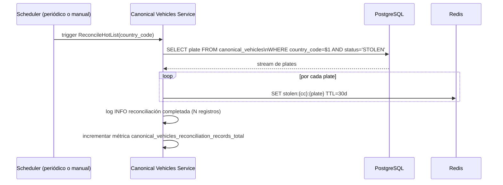

# Canonical Vehicles Service

**Change:** `sincronizacion-paises`
**Versión:** 1.0
**Última actualización:** 2026-05-13

---

## 1. Responsabilidad

El Canonical Vehicles Service es el procesador central del Pilar 4. Consume eventos del tópico `stolen.vehicles.events`, los valida, los persiste en PostgreSQL, actualiza la lista roja en Redis y notifica al Edge Distribution Service.

**Criterios de aceptación que implementa:** CA-05, CA-06, CA-07, CA-08, CA-12, CA-14, CA-15; CR-01, CR-02, CR-06, CR-07.

---

## 2. Puertos Hexagonales (ADR-005)

```mermaid
graph LR
    subgraph Dominio["Dominio — Canonical Vehicles Service"]
        UC_PROC[ProcessCanonicalEvent\nuse case]
        UC_RECOV[ProcessRecoveredEvent\nuse case]
        UC_RECON[ReconcileHotList\nuse case]
    end

    subgraph PrimariosIn["Puertos de entrada (primarios)"]
        KAFKA_IN[CanonicalEventsConsumerPort\nconsumir stolen.vehicles.events]
    end

    subgraph SecundariosOut["Puertos de salida (secundarios)"]
        VRP[VehiclesRepositoryPort\nPostgreSQL canonical_vehicles]
        HLP[HotListPort\nRedis stolen:{cc}:{plate}]
        CEP[CanonicalEventsProducerPort\nKafka stolen.vehicles.canonical]
        BFN[BloomFilterNotifyPort\nnotificar al EDS]
        DLQP[DLQProducerPort\nKafka stolen.vehicles.events.dlq]
    end

    KAFKA_IN --> UC_PROC
    KAFKA_IN --> UC_RECOV
    UC_PROC --> VRP
    UC_PROC --> HLP
    UC_PROC --> CEP
    UC_PROC --> BFN
    UC_PROC --> DLQP
    UC_RECOV --> VRP
    UC_RECOV --> HLP
    UC_RECOV --> CEP
    UC_RECOV --> BFN
    UC_RECON --> VRP
    UC_RECON --> HLP
```

### 2.1 Definición de puertos

```
// CanonicalVehicle incluye todos los campos mandatorios, campos de control y el campo extensions (JSONB/map).
interface VehiclesRepositoryPort {
    upsert(vehicle: CanonicalVehicle): UpsertResult  // extensions se persiste en la columna JSONB de canonical_vehicles
    findByKey(country_code: string, plate: string): CanonicalVehicle | null
    findAllStolen(country_code: string): Iterator<{plate: string}>
}

interface HotListPort {
    set(country_code: string, plate: string, ttl_seconds: int): void
    delete(country_code: string, plate: string): void
    exists(country_code: string, plate: string): bool
    setWithRetry(country_code: string, plate: string, ttl_seconds: int, max_retries: int): void
}

interface CanonicalEventsProducerPort {
    publish(event: CanonicalVehicleEvent): void
}

interface BloomFilterNotifyPort {
    notifyChange(country_code: string): void
}

interface DLQProducerPort {
    send(original_message: bytes, error_code: string, detail: string): void
}
```

---

## 3. Flujo de Procesamiento

### 3.1 Flujo principal — evento STOLEN (CA-05 → CA-07)

```mermaid
sequenceDiagram
    participant K as Kafka\nstolen.vehicles.events
    participant CVS as Canonical Vehicles Service
    participant SR as Schema Registry
    participant DLQ as DLQ Topic
    participant PG as PostgreSQL
    participant RDS as Redis
    participant K_CAN as stolen.vehicles.canonical
    participant EDS as Edge Distribution Service

    K->>CVS: consume mensaje (Avro)

    CVS->>SR: deserializar (validar schema)
    alt schema inválido
        CVS->>DLQ: publish con error SCHEMA_DESERIALIZATION_FAILURE
        Note over CVS: continuar con siguiente mensaje
    end

    CVS->>CVS: validar campos mandatorios
    alt campo mandatorio ausente
        CVS->>DLQ: publish con error MISSING_MANDATORY_FIELD
        Note over CVS: continuar
    end

    CVS->>CVS: validar country_code registrado
    alt country_code inválido
        CVS->>DLQ: publish con error INVALID_COUNTRY_CODE
        Note over CVS: continuar
    end

    CVS->>CVS: verificar deduplicación por event_id
    alt event_id ya procesado
        Note over CVS: descartar silenciosamente, incrementar métrica
    end

    CVS->>PG: UPSERT canonical_vehicles (ON CONFLICT DO UPDATE)\nincluye extensions JSONB; updated_at = timestamp del evento
    PG-->>CVS: confirmación + updated_at

    CVS->>RDS: SET stolen:{cc}:{plate} TTL=30d
    alt Redis falla
        CVS->>CVS: reintento backoff exp. hasta max_retries
        Note over CVS: PG ya confirmado; estado consistente
    end

    CVS->>K_CAN: publish evento canónico confirmado
    CVS->>EDS: notifyChange(country_code) vía BloomFilterNotifyPort
    CVS->>CVS: confirmar offset Kafka (commit)
```

### 3.2 Flujo — evento RECOVERED (CA-08, CR-06)

```mermaid
sequenceDiagram
    participant K as Kafka\nstolen.vehicles.events
    participant CVS as Canonical Vehicles Service
    participant PG as PostgreSQL
    participant RDS as Redis
    participant K_CAN as stolen.vehicles.canonical
    participant EDS as Edge Distribution Service

    K->>CVS: consume evento RECOVERED

    CVS->>PG: SELECT WHERE country_code=$1 AND plate=$2
    alt placa no existe en canonical_vehicles (CR-06)
        CVS->>CVS: log WARN canonical_vehicles_recovered_not_found_total
        CVS->>CVS: incrementar métrica canonical_vehicles_recovered_not_found_total
        Note over CVS: descartar evento; no insertar fila RECOVERED
        Note over CVS: registrar en audit log con estado ORPHAN_RECOVERED
    end

    CVS->>PG: UPDATE status='RECOVERED', recovered_at=NOW()
    CVS->>RDS: DEL stolen:{cc}:{plate}
    CVS->>K_CAN: publish evento RECOVERED
    CVS->>EDS: notifyChange(country_code) — regenerar BF sin esta placa
    CVS->>CVS: confirmar offset Kafka
```

### 3.3 Flujo de reconciliación Redis (CR-07)

Cuando Redis se recupera tras un fallo o se detecta inconsistencia, el proceso de reconciliación sincroniza el estado de PostgreSQL hacia Redis:



La reconciliación puede ejecutarse:
- Manualmente por el operador mediante un endpoint administrativo.
- Automáticamente al detectar que Redis responde tras un período de fallo (CR-07).
- Periódicamente como proceso de auditoría (valor de referencia: cada 24 h, en horario de baja carga).

### 3.4 Aislamiento multi-tenant (CA-12)

El `country_code` actúa como discriminador de tenant en todas las operaciones del servicio:

- **PostgreSQL:** cada consulta y upsert incluye `WHERE country_code = $1`; el índice primario incluye `country_code`.
- **Redis:** todas las claves tienen el prefijo `stolen:{country_code}:`.
- **Kafka:** la clave del mensaje en `stolen.vehicles.events` y `stolen.vehicles.canonical` es `{country_code}:{plate}`.
- **EDS:** `notifyChange(country_code)` acota la regeneración del Bloom filter al país afectado; los datos de otros países no se leen ni modifican.

---

## 4. Manejo de Fallos de Redis (CR-07)

```
procedure setHotListWithRetry(country_code, plate, ttl):
    max_retries = config.redis.max_retries  // valor de referencia: 5
    base_delay_ms = 100
    for attempt in 1..max_retries:
        try:
            redis.set("stolen:{country_code}:{plate}", "1", EX=ttl)
            return SUCCESS
        catch RedisConnectionError:
            metrics.increment("canonical_vehicles_redis_failures_total",
                              labels={country_code: country_code})
            if attempt < max_retries:
                sleep(base_delay_ms * 2^(attempt-1))  // backoff exponencial
    // Agotados los reintentos
    log.error("Redis no disponible tras {max_retries} intentos", ...)
    // PostgreSQL ya confirmado: estado persistente consistente
    // La reconciliación re-sincronizará cuando Redis se recupere
    return DEFERRED
```

---

## 5. Deduplicación de Eventos

El servicio mantiene una ventana de deduplicación por `event_id`. Implementación:

- **Almacén:** Redis (si disponible) o cache en memoria (fallback, con riesgo de duplicados tras reinicio).
- **Clave:** `dedup:{event_id}`
- **TTL:** 24 horas (configurable).
- **Semántica:** al encontrar `event_id` ya procesado, el mensaje se descarta silenciosamente (sin publicar en DLQ) y se incrementa la métrica `canonical_vehicles_dedup_skipped_total`.

> **Limitación con `replicaCount > 1`:** el fallback a cache en memoria solo es seguro para despliegues de réplica única. Con múltiples réplicas (ver Helm §2), si una réplica reinicia, su cache in-memory se pierde y puede re-procesar eventos que la otra réplica ya procesó, generando llamadas dobles a `notifyChange` y regeneraciones espurias del Bloom filter. Para `replicaCount > 1`, Redis **debe estar disponible** (la readiness probe ya lo verifica); si Redis no está disponible, el UNIQUE constraint de `event_id` en `canonical_vehicles` (ver `postgresql-schema.md`) actúa como guardia definitivo contra inserciones duplicadas.

---

## 6. Métricas Prometheus

| Métrica | Tipo | Descripción |
|---|---|---|
| `canonical_vehicles_consumer_lag{country_code, partition}` | Gauge | Lag del consumer group en stolen.vehicles.events |
| `canonical_vehicles_events_processed_total{country_code, status}` | Counter | Total de eventos procesados exitosamente |
| `canonical_vehicles_events_dlq_total{country_code, error_code}` | Counter | Total de eventos enviados al DLQ |
| `canonical_vehicles_rejected_invalid_country_total{country_code}` | Counter | Eventos rechazados por `country_code` ausente o no registrado (CR-02) |
| `canonical_vehicles_upsert_duration_seconds{country_code}` | Histogram | Duración del upsert en PostgreSQL |
| `canonical_vehicles_redis_failures_total{country_code}` | Counter | Fallos al actualizar Redis |
| `canonical_vehicles_redis_retries_total{country_code}` | Counter | Reintentos en Redis |
| `canonical_vehicles_recovered_not_found_total{country_code}` | Counter | Eventos RECOVERED sin registro previo en PG |
| `canonical_vehicles_dedup_skipped_total{country_code}` | Counter | Eventos descartados por deduplicación |
| `canonical_vehicles_reconciliation_records_total{country_code}` | Gauge | Número de registros en la última reconciliación |
| `canonical_vehicles_processing_errors_total{country_code, error_type}` | Counter | Errores de procesamiento no controlados |

---

## 7. Configuración del Servicio

Variables de entorno requeridas:

| Variable | Descripción | Ejemplo |
|---|---|---|
| `KAFKA_BOOTSTRAP_SERVERS` | Bootstrap servers de Kafka | `kafka:9092` |
| `SCHEMA_REGISTRY_URL` | URL del Schema Registry | `http://schema-registry:8081` |
| `KAFKA_CONSUMER_GROUP_ID` | ID del consumer group | `canonical-vehicles-service` |
| `KAFKA_INPUT_TOPIC` | Tópico de entrada | `stolen.vehicles.events` |
| `KAFKA_OUTPUT_TOPIC` | Tópico de salida | `stolen.vehicles.canonical` |
| `KAFKA_DLQ_TOPIC` | Tópico DLQ | `stolen.vehicles.events.dlq` |
| `DATABASE_URL` | URL de conexión PostgreSQL | `postgresql://user:pass@pg:5432/antihurto` |
| `REDIS_URL` | URL de Redis | `redis://redis:6379` |
| `REDIS_HOT_LIST_TTL_SECONDS` | TTL de la clave Redis | `2592000` (30 días) |
| `REDIS_MAX_RETRIES` | Reintentos máximos en Redis | `5` |
| `DEDUP_WINDOW_SECONDS` | Ventana de deduplicación | `86400` (24 h) |
| `BLOOM_FILTER_NOTIFY_ENABLED` | Habilitar notificación al EDS | `true` |
| `VALID_COUNTRY_CODES` | Lista de country_codes registrados | `CO,VE,MX,AR` |

---

## 8. Health y Liveness

El servicio expone:

- `GET /health/live` — liveness: siempre 200 si el proceso responde.
- `GET /health/ready` — readiness: 200 si Kafka consumer activo, PostgreSQL accesible y Schema Registry accesible. 503 si alguno falla.
- `GET /metrics` — métricas Prometheus.

---

## 9. Referencias Cruzadas

| Documento | Relación |
|---|---|
| [`canonical-model.md`](./canonical-model.md) | Modelo de datos procesado |
| [`postgresql-schema.md`](./postgresql-schema.md) | DDL de la tabla que gestiona |
| [`kafka-topics.md`](./kafka-topics.md) | Tópicos que consume y produce |
| [`edge-distribution-service.md`](./edge-distribution-service.md) | Servicio notificado por `BloomFilterNotifyPort` |
| [`sla-freshness.md`](./sla-freshness.md) | SLA de latencia que este servicio contribuye a cumplir |
| [`slo-observability.md`](./slo-observability.md) | Alertas basadas en las métricas de este servicio |
