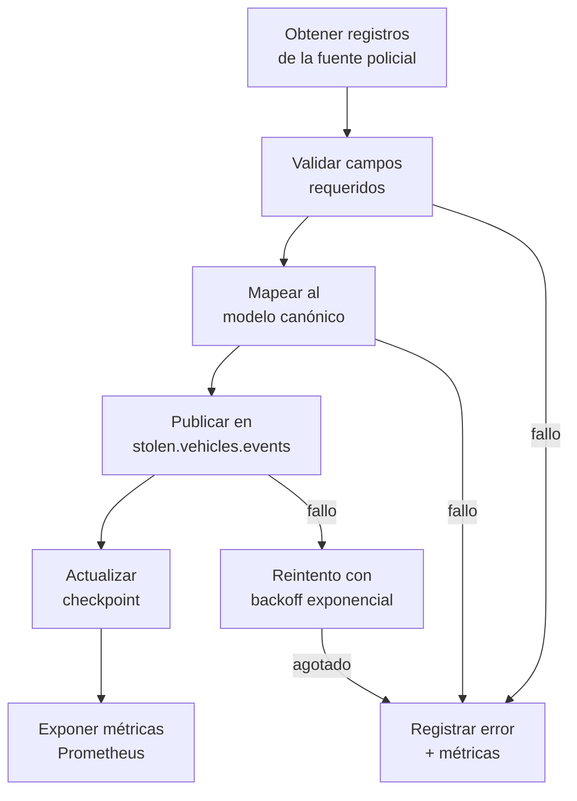
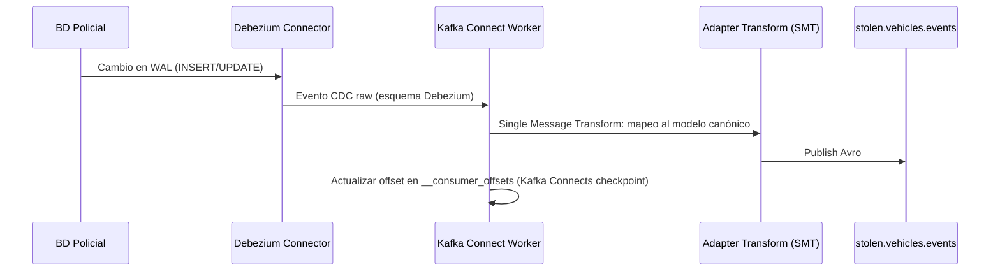
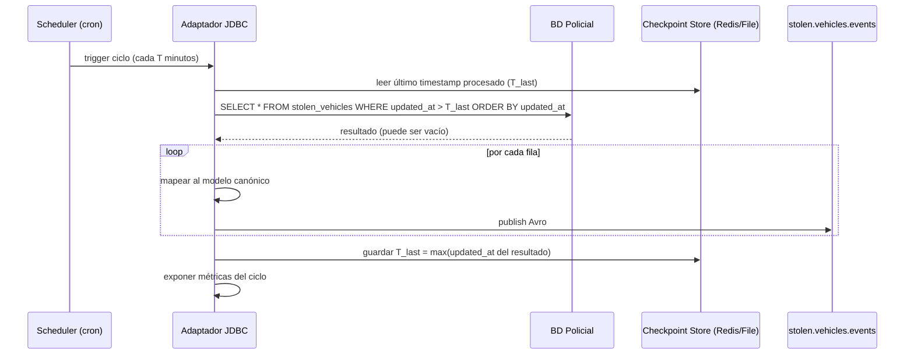
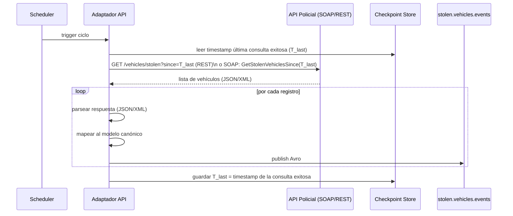
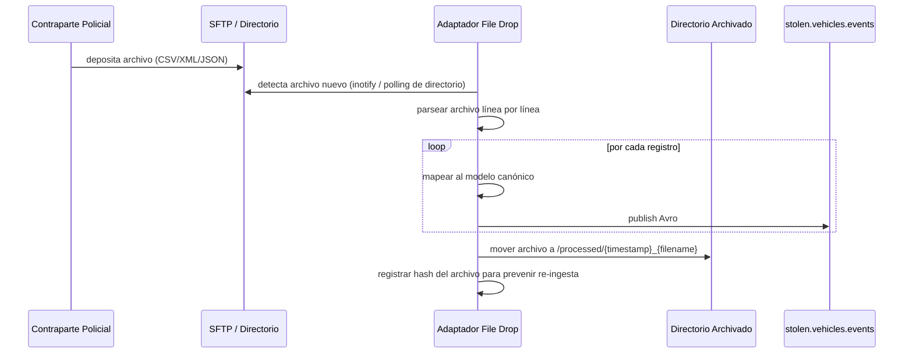

# Marco de Adaptadores de País

**Change:** `sincronizacion-paises`
**Versión:** 1.0
**Última actualización:** 2026-05-13

---

## 1. Propósito

Este documento define el contrato de interfaz que todo adaptador de país debe cumplir, los cuatro modos de integración soportados, la lógica de checkpoint e idempotencia, y las métricas que cada adaptador debe exponer. Es la referencia normativa para implementar un nuevo adaptador.

---

## 2. Contrato de Interfaz del Adaptador

Todo adaptador de país, independientemente de su modo de integración, debe implementar las siguientes responsabilidades:



### 2.1 Interfaz lógica del adaptador (pseudocódigo)

```
interface CountryAdapterPort {
    // Inicialización del adaptador
    initialize(config: AdapterConfig): void

    // Ejecutar un ciclo de ingesta (llamado por el scheduler o por el evento CDC)
    ingest(): IngestResult

    // Obtener el checkpoint actual (para reinicio tras fallo)
    getCheckpoint(): Checkpoint

    // Actualizar el checkpoint tras procesamiento exitoso
    saveCheckpoint(checkpoint: Checkpoint): void

    // Verificar conectividad con la fuente policial
    healthCheck(): HealthStatus

    // Exponer métricas Prometheus
    getMetrics(): []Metric
}

struct AdapterConfig {
    country_code: string           // ISO 3166-1 alpha-2
    source_system: string          // Identificador del sistema fuente
    mode: AdapterMode              // CDC | JDBC | SOAP_REST | FILE_DROP
    connection: ConnectionConfig   // Credenciales y endpoint de la BD policial
    field_mapping: FieldMapping    // Mapeo de campos propietarios al modelo canónico
    extensions_allowed: []string   // Lista de campos adicionales autorizados para extensions
    kafka: KafkaConfig             // Bootstrap servers, schema registry URL
    checkpoint_store: string       // Tipo de almacén: REDIS | FILE | POSTGRES
}

struct IngestResult {
    records_processed: int
    records_published: int
    records_failed: int
    records_skipped_duplicate: int
    checkpoint: Checkpoint
    errors: []AdapterError
}
```

### 2.2 Responsabilidades obligatorias del adaptador

1. **Mapeo completo de los 9 campos mandatorios.** Si alguno no puede mapearse desde la fuente, el registro se descarta (no se publica) y se registra en métricas.
2. **Normalización de la placa.** Mayúsculas, sin espacios ni guiones. Si la fuente usa formatos distintos, la normalización es responsabilidad del adaptador.
3. **Idempotencia.** El adaptador no debe publicar el mismo registro dos veces dentro de la ventana de deduplicación. El mecanismo varía por modo (ver sección 4).
4. **Checkpoint persistido.** Antes de reiniciar, el adaptador retoma desde su último checkpoint. No procesa desde el inicio.
5. **Manejo de fallos de conectividad.** Si la fuente no está disponible, el adaptador activa backoff exponencial y no publica mensajes parciales.
6. **Métricas.** Todas las métricas listadas en la sección 6 deben estar disponibles en `/metrics` en formato Prometheus.
7. **Configuración externalizada.** Credenciales y parámetros de conexión se inyectan vía variables de entorno o Vault. No se almacenan en el repositorio.

---

## 3. Modos de Integración

### 3.1 Modo CDC — Debezium

Aplica a bases de datos que permiten acceso al WAL o a un stream de cambios (PostgreSQL, MySQL, Oracle LogMiner, SQL Server CDC).

**Flujo:**



**Características:**
- Latencia: < 1 s desde el cambio en la BD hasta la publicación en Kafka (requisito CA-01).
- Checkpoint: manejado por Kafka Connect (offsets en `connect-offsets` topic).
- Idempotencia: el offset del connector garantiza que cada evento CDC se procesa exactamente una vez bajo condiciones normales; ante reinicios, puede haber reenvíos que el Canonical Vehicles Service deduplica por `event_id`.

**Configuración mínima (Debezium PostgreSQL):**

```json
{
  "connector.class": "io.debezium.connector.postgresql.PostgresConnector",
  "database.hostname": "${POLICE_DB_HOST}",
  "database.port": "5432",
  "database.user": "${POLICE_DB_USER}",
  "database.password": "${POLICE_DB_PASSWORD}",
  "database.dbname": "${POLICE_DB_NAME}",
  "table.include.list": "${STOLEN_VEHICLES_TABLE}",
  "topic.prefix": "country.co",
  "transforms": "canonicalMapping",
  "transforms.canonicalMapping.type": "com.antihurto.adapter.CanonicalMappingTransform",
  "transforms.canonicalMapping.country_code": "CO",
  "transforms.canonicalMapping.field.mapping": "matricula:plate,fecha_hurto:stolen_date,...",
  "transforms.canonicalMapping.target.topic": "stolen.vehicles.events",
  "key.converter": "org.apache.kafka.connect.storage.StringConverter",
  "value.converter": "io.confluent.connect.avro.AvroConverter",
  "value.converter.schema.registry.url": "${SCHEMA_REGISTRY_URL}"
}
```

**Cuándo usar:** disponible acceso al WAL o CDC nativo de la BD policial. Es el modo de menor latencia y mayor confiabilidad.

---

### 3.2 Modo JDBC Polling

Aplica a bases de datos relacionales accesibles por JDBC que no tienen CDC disponible o no se puede habilitar.

**Flujo:**



**Características:**
- Latencia: ventana de polling máxima configurada (valor de referencia 15 min para VE — CA-02).
- Checkpoint: timestamp del último registro procesado, almacenado en Redis o archivo local.
- Idempotencia: si el polling re-procesa registros ya enviados (solapamiento de ventanas), el `event_id` debe ser determinístico basado en `(country_code, plate, updated_at)` para permitir deduplicación en el Canonical Vehicles Service.

**Requisito en la BD policial:** la tabla debe tener una columna `updated_at` (o equivalente) indexada. Si no existe, se negocia con la contraparte policial su creación; si no es posible, se aplica hashing de fila para detectar cambios.

**Ventana de polling recomendada por tamaño de tabla:**

| Tamaño de tabla | Ventana recomendada |
|---|---|
| < 100 000 registros | 5 minutos |
| 100 000 – 1 000 000 | 10 minutos |
| > 1 000 000 | 15 minutos (coordinar con contraparte) |

---

### 3.3 Modo SOAP/REST Programado

Aplica a instituciones policiales que exponen una API (SOAP heredado o REST moderno) para consultar vehículos hurtados nuevos o actualizados.

**Flujo:**



**Características:**
- Latencia: depende de la periodicidad de la API y la ventana configurada.
- Checkpoint: timestamp de la última consulta exitosa, no del último registro procesado.
- Idempotencia: la API puede devolver los mismos registros si el delta se solapa. El `event_id` determinístico previene duplicados downstream.
- Manejo de paginación: el adaptador debe iterar todas las páginas de la respuesta antes de actualizar el checkpoint.

**Configuración de autenticación soportada:**

| Mecanismo | Soporte |
|---|---|
| API Key en header | Sí |
| OAuth 2.0 Client Credentials | Sí |
| Basic Auth sobre HTTPS | Sí (legacy) |
| WS-Security (SOAP) | Sí (mediante library CXF/Axis2) |
| mTLS | Sí (certificado de cliente emitido por Vault PKI) |

---

### 3.4 Modo File Drop Watcher

Aplica a instituciones que entregan lotes de datos en archivos (CSV, XML, JSON Lines) depositados en un directorio local o SFTP.

**Flujo:**



**Características:**
- Latencia: depende de la frecuencia con que la contraparte deposita archivos.
- Checkpoint: hash SHA-256 del archivo procesado. El adaptador mantiene una tabla de hashes procesados para evitar re-ingesta si el archivo es redepositado.
- Idempotencia: cada archivo se procesa exactamente una vez. El archivo se mueve a `/processed` al finalizar exitosamente. Si el procesamiento falla a mitad, el archivo permanece en el directorio de entrada y se reintenta.

**Formatos soportados:**

| Formato | Observaciones |
|---|---|
| CSV | Separador configurable. Primera fila como encabezado opcional. |
| XML | Namespace configurable. XPath para extracción de campos. |
| JSON Lines (JSONL) | Un objeto JSON por línea. |
| Fixed-width text | Posiciones de campo configurables (legacy). |

---

## 4. Checkpoint e Idempotencia

### 4.1 Almacenes de checkpoint

| Tipo | Cuándo usar | Pros | Contras |
|---|---|---|---|
| **Redis** | Adaptador en cloud con Redis disponible | Persistencia durable, bajo latencia | Dependencia de Redis |
| **PostgreSQL** | Adaptador con acceso a la BD del sistema | Transaccional, auditable | Mayor latencia |
| **Archivo local** | Adaptador on-prem sin acceso a almacenes remotos | Sin dependencias externas | Riesgo si el sistema de archivos falla |

El adaptador debe configurarse con exactamente un tipo de almacén de checkpoint. El tipo se configura mediante la variable `CHECKPOINT_STORE_TYPE`.

### 4.2 Estrategia de idempotencia por modo

| Modo | Mecanismo de `event_id` |
|---|---|
| CDC | UUID v4 generado por el adaptador por cada evento CDC; no es determinístico porque cada evento CDC es único. |
| JDBC | `UUIDv5(namespace="antihurto.adapter", name="{country_code}:{plate}:{updated_at_ms}")` — determinístico, permite deduplicación si se re-procesa. |
| SOAP/REST | `UUIDv5(namespace="antihurto.adapter", name="{country_code}:{plate}:{source_timestamp_ms}")` — idem. |
| File Drop | `UUIDv5(namespace="antihurto.adapter", name="{country_code}:{plate}:{file_hash}:{row_number}")` — determinístico por archivo y fila. |

---

## 5. Manejo de Fallos de Conectividad

Cuando el adaptador pierde conectividad con la fuente policial (CR-03):

1. **Registra el error** en log estructurado con nivel `ERROR`.
2. **Activa backoff exponencial:** espera inicial 5 s, factor 2, máximo 300 s (5 min).
3. **Expone la métrica** `adapter_connectivity_failures_total{country_code, mode}` incrementada.
4. **Preserva el checkpoint** de la última operación exitosa. No avanza el checkpoint hasta reanudar procesamiento exitoso.
5. **No publica mensajes parciales.** Si el adaptador falló en medio de un lote, descarta el lote incompleto y reintenta desde el checkpoint guardado.
6. **Alerta operacional:** si el número de intentos fallidos consecutivos supera el umbral configurable (valor de referencia: 5 intentos), activa la alerta `adapter_connectivity_down`.

### 5.1 Incompatibilidad de esquema Avro (CR-04)

Si el producer Avro recibe un rechazo del Schema Registry por incompatibilidad de esquema:

1. El adaptador registra el error con nivel `ERROR`, incluyendo la versión de esquema rechazada.
2. **Detiene la publicación** de todos los mensajes siguientes inmediatamente.
3. **No reanuda** hasta que el operador resuelva la incompatibilidad y registre el esquema compatible en el Schema Registry.
4. No se publica ningún mensaje con esquema no registrado.

---

## 6. Métricas Prometheus

Todas las métricas llevan el label `country_code` para permitir segmentación por país en Grafana.

| Métrica | Tipo | Descripción |
|---|---|---|
| `adapter_records_fetched_total{country_code, mode}` | Counter | Total de registros obtenidos de la fuente policial |
| `adapter_records_published_total{country_code, mode}` | Counter | Total de registros publicados exitosamente en Kafka |
| `adapter_records_failed_total{country_code, mode, reason}` | Counter | Total de registros que fallaron (mapeo, validación, publicación) |
| `adapter_records_skipped_duplicate_total{country_code, mode}` | Counter | Registros omitidos por deduplicación en el adaptador |
| `adapter_cycle_duration_seconds{country_code, mode}` | Histogram | Duración de cada ciclo de ingesta |
| `adapter_connectivity_failures_total{country_code, mode}` | Counter | Número de fallos de conectividad con la fuente policial |
| `adapter_last_successful_sync_timestamp{country_code, mode}` | Gauge | Unix timestamp de la última sincronización exitosa |
| `adapter_checkpoint_lag_seconds{country_code, mode}` | Gauge | Diferencia entre `now` y el timestamp del último checkpoint. Indica retraso acumulado. |
| `adapter_kafka_produce_errors_total{country_code, mode}` | Counter | Errores al publicar en Kafka |
| `adapter_validation_failures_total{country_code, mode, field}` | Counter | Fallos de validación por campo mandatorio |

---

## 7. Seguridad del Adaptador

- Las credenciales de acceso a la BD policial se obtienen de Vault al iniciar. No se almacenan en variables de entorno ni en archivos de configuración en repositorio.
- El adaptador usa el rol de Vault específico para su país (`role: adapter-{country_code}`).
- Los certificados mTLS para producir en Kafka (si se usa autenticación mTLS en Kafka) se obtienen de Vault PKI.
- El adaptador on-prem se comunica con Vault usando el token de bootstrap configurado durante el onboarding (ver [`country-onboarding-guide.md`](./country-onboarding-guide.md)).

---

## 8. Biblioteca Base del Adaptador

Para reducir el costo de implementación de cada nuevo adaptador, se provee una biblioteca base (`antihurto-adapter-sdk`) que incluye:

- Validación del modelo canónico (9 campos mandatorios).
- Serialización Avro con Schema Registry.
- Producer Kafka configurado (idempotente, acks=all).
- Gestión de checkpoint (Redis / PostgreSQL / archivo).
- Métricas Prometheus (counter, gauge, histogram predefinidos).
- Backoff exponencial en fallos de conectividad.
- Logging estructurado (JSON).

El implementador del adaptador solo necesita:
1. Implementar la lógica de fetch desde la fuente.
2. Implementar el mapeo de campos propietarios al modelo canónico.
3. Configurar el campo `extensions_allowed`.

La incorporación de un nuevo país requiere únicamente estos tres pasos — sin modificar el Canonical Vehicles Service, el Edge Distribution Service ni el Schema Registry (CA-13).

---

## 9. Referencias Cruzadas

| Documento | Relación |
|---|---|
| [`canonical-model.md`](./canonical-model.md) | Modelo canónico que el adaptador debe producir |
| [`avro-schema.md`](./avro-schema.md) | Schema de serialización |
| [`kafka-topics.md`](./kafka-topics.md) | Tópico de destino |
| [`sla-freshness.md`](./sla-freshness.md) | SLA de latencia por modo |
| [`data-sovereignty.md`](./data-sovereignty.md) | Restricciones sobre qué datos pueden incluirse |
| [`country-onboarding-guide.md`](./country-onboarding-guide.md) | Proceso de incorporación de un nuevo país |
| [`slo-observability.md`](./slo-observability.md) | Alertas operacionales sobre adaptadores |
