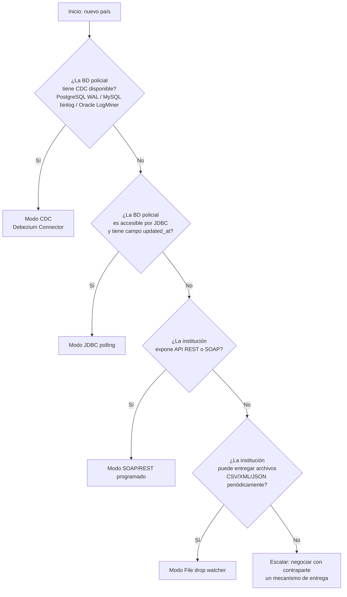

# Guía de Incorporación de un Nuevo País

**Change:** `sincronizacion-paises`
**Versión:** 1.0
**Última actualización:** 2026-05-13

---

## 1. Propósito

Esta guía describe el proceso paso a paso para incorporar un nuevo país al Pilar 4 del Sistema Anti-Hurto de Vehículos. El proceso garantiza que el primer evento canónico del país llegue a `stolen.vehicles.events` sin modificar ningún componente del núcleo del sistema (CA-13).

**Audiencia:** equipo técnico del operador del sistema + contraparte técnica de la institución policial del nuevo país.

---

## 2. Prerrequisitos

Antes de iniciar, verificar:

- [ ] Acuerdo institucional firmado entre el operador del sistema y la institución policial del país.
- [ ] Designación de una persona técnica de contraparte en la institución policial con acceso a la BD de hurtos.
- [ ] Identificación del `country_code` ISO 3166-1 alpha-2 del país (e.g., `PE` para Perú).
- [ ] Identificación del modo de integración disponible (ver [country-adapter-framework.md](./country-adapter-framework.md)).
- [ ] Acuerdo de SLA de frescura documentado (ver [sla-freshness.md](./sla-freshness.md)).
- [ ] Aprobación del equipo de arquitectura para el nivel de soberanía de datos (Nivel 1/2/3, ver [data-sovereignty.md](./data-sovereignty.md)).

---

## 3. Paso 1 — Selección del Modo de Integración

### 3.1 Árbol de decisión



### 3.2 Información a recolectar por modo

**CDC:**
- Tipo de BD (PostgreSQL, MySQL, Oracle, SQL Server).
- Versión de la BD.
- Nombre del schema y la tabla de vehículos hurtados.
- Credenciales de cuenta de replicación (con permisos de replication slot).
- IP/host de la BD y puerto.
- Indica si el adaptador debe ser on-prem o puede estar en cloud.

**JDBC:**
- Driver JDBC requerido (con versión).
- URL de conexión JDBC.
- Nombre de tabla y columna `updated_at` (o equivalente).
- Credenciales de cuenta de solo lectura.
- Ventana de polling recomendada.

**SOAP/REST:**
- URL del endpoint y formato (WSDL para SOAP, Swagger/OpenAPI para REST).
- Mecanismo de autenticación (API key, OAuth, WS-Security, mTLS).
- Parámetro para filtrar por fecha (`since`, `updatedAfter`, etc.).
- Paginación: tipo y parámetros.
- Rate limits de la API.

**File drop:**
- Protocolo de entrega (SFTP, directorio NFS, S3).
- Credenciales de acceso.
- Formato del archivo (CSV, XML, JSON Lines).
- Delimitadores, encoding (UTF-8, ISO-8859-1), estructura de columnas.
- Frecuencia de entrega.

---

## 4. Paso 2 — Implementación del Conector

### 4.1 Crear el repositorio del adaptador

```bash
# Clonar el template del adaptador de referencia
git clone https://github.com/antihurto/adapter-template adapter-{cc_lower}
cd adapter-{cc_lower}

# Configurar el país
cp config/adapter.yaml.example config/adapter.yaml
# Editar: country_code, source_system, mode, field_mapping, extensions_allowed
```

### 4.2 Estructura del repositorio del adaptador

```
adapter-{country_code_lower}/
├── cmd/
│   └── main.go           # Punto de entrada
├── internal/
│   ├── config/           # Configuración y validación
│   ├── fetch/            # Lógica de obtención de datos (específica del país)
│   ├── mapping/          # Mapeo de campos propietarios al modelo canónico
│   └── adapter.go        # Orquestación usando el SDK
├── config/
│   ├── adapter.yaml      # Configuración del adaptador (sin secretos)
│   └── field_mapping.yaml # Mapeo de campos
├── Dockerfile
├── helm/
│   └── values-{env}.yaml
└── README.md
```

### 4.3 Implementar el mapeo de campos

```yaml
# config/field_mapping.yaml (ejemplo Colombia — SIJIN)
country_code: CO
source_system: SIJIN_CO

field_mapping:
  plate:            matricula           # Columna en la BD policial
  stolen_date:      fecha_hurto         # Requiere parseo de formato dd/MM/yyyy
  stolen_location:  lugar_hurto
  owner_id:         cedula_propietario
  brand:            marca
  class:            tipo_vehiculo
  line:             linea
  color:            color_vehiculo
  model:            anio_modelo

transformations:
  plate:
    - uppercase
    - remove_spaces
    - remove_hyphens
  stolen_date:
    - parse_date: "dd/MM/yyyy"
    - to_utc_iso8601
  model:
    - to_string
    - validate_year

extensions_allowed:
  - numero_motor:   no_motor    # Campo adicional autorizado (ver oficio 2026-003)
  - numero_chasis:  no_chasis   # Campo adicional autorizado
```

---

## 5. Paso 3 — Mapeo de Campos y Validación

### 5.1 Reglas de transformación comunes

| Campo | Transformaciones frecuentes |
|---|---|
| `plate` | Uppercase, eliminar espacios, guiones y puntos |
| `stolen_date` | Parsear formato local → ISO 8601 UTC. Formatos comunes: `dd/MM/yyyy`, `MM-DD-YYYY`, `yyyyMMdd` |
| `owner_id` | Remover guiones o puntos de separación del número de documento |
| `brand`, `class`, `line`, `color` | Uppercase, trim de espacios |
| `model` | Asegurar que es string de 4 dígitos; si la fuente provee `2020-01`, tomar solo el año |

### 5.2 Validación del mapeo con la contraparte

Antes del despliegue, ejecutar una prueba de mapeo con 100 registros reales:

```bash
# Herramienta de validación del mapeo
antihurto-adapter-sdk validate \
  --config config/adapter.yaml \
  --mapping config/field_mapping.yaml \
  --source-sample data/sample_100.csv \
  --output validation_report.json
```

El reporte incluye:
- Registros válidos vs. con errores de mapeo.
- Campos mandatorios que no se pueden mapear.
- Distribución de valores por campo.
- Ejemplos de registros transformados.

**Criterio de aprobación:** al menos 95% de los registros del sample deben mapear correctamente todos los 9 campos mandatorios.

### 5.3 Revisión con la contraparte policial

Compartir el reporte con la contraparte policial y verificar:
- Los valores transformados corresponden a los datos reales.
- Los formatos de fecha y matrícula son correctos.
- Los campos en `extensions` contienen los datos esperados.
- No hay datos sensibles no autorizados en el payload.

---

## 6. Paso 4 — Configuración de Infraestructura

### 6.1 Crear la partición en PostgreSQL

```sql
-- Ejecutar en la BD de producción (coordinado con DBA)
CREATE TABLE canonical_vehicles_{cc_lower}
    PARTITION OF canonical_vehicles
    FOR VALUES IN ('{CC}');
```

### 6.2 Registrar el country_code en los servicios

Agregar el nuevo `country_code` a las listas de configuración:

```yaml
# canonical-vehicles-service / values.yaml
config:
  valid_country_codes: "CO,VE,MX,AR,PE"  # Agregar nuevo CC

# edge-distribution-service / values.yaml
config:
  active_countries: "CO,VE,MX,AR,PE"     # Agregar nuevo CC
```

### 6.3 Crear secretos en Vault

```bash
# Credenciales de la BD policial del nuevo país
vault kv put secret/adapters/{cc_lower}/db-credentials \
  host="${POLICE_DB_HOST}" \
  port="${POLICE_DB_PORT}" \
  username="${POLICE_DB_USER}" \
  password="${POLICE_DB_PASSWORD}"

# Credenciales Kafka para el adaptador
vault kv put secret/adapters/{cc_lower}/kafka-credentials \
  bootstrap_servers="${KAFKA_BOOTSTRAP_SERVERS}" \
  schema_registry_url="${SCHEMA_REGISTRY_URL}"
```

### 6.4 Desplegar el adaptador

**Opción on-prem (Nivel 1):**

```bash
# En el servidor on-prem del país
helm install adapter-{cc_lower} ./helm/adapter \
  --namespace antihurto-adapters \
  --values helm/values-{cc_lower}.yaml \
  --set config.country_code={CC} \
  --set config.mode=JDBC \
  --set secrets.vault_addr="https://vault.{territory}.{country_domain}"
```

**Opción cloud (Nivel 2/3):**

```bash
helm install adapter-{cc_lower} ./helm/adapter \
  --namespace antihurto-adapters \
  --values helm/values-{cc_lower}.yaml \
  --set config.country_code={CC} \
  --set config.mode=SOAP_REST
```

---

## 7. Checklist de Validación Pre-Producción

Completar todas las verificaciones antes de declarar el adaptador como listo para producción:

### 7.1 Conectividad

- [ ] El adaptador puede conectarse a la fuente policial (healthCheck exitoso).
- [ ] El adaptador puede conectarse al Schema Registry.
- [ ] El adaptador puede publicar en Kafka (topic `stolen.vehicles.events`).
- [ ] Si es on-prem: el túnel VPN funciona correctamente.

### 7.2 Mapeo y validación

- [ ] El 95% o más del sample de datos mapea correctamente.
- [ ] Los campos mandatorios siempre presentes en el sample.
- [ ] Los campos de `extensions` solo contienen datos autorizados.
- [ ] La normalización de placas produce el formato esperado.
- [ ] Los formatos de fecha se convierten correctamente a ISO 8601 UTC.

### 7.3 Flujo end-to-end

- [ ] Un evento de prueba publicado en `stolen.vehicles.events` es procesado por el Canonical Vehicles Service.
- [ ] La placa del evento de prueba aparece en Redis (`stolen:{CC}:{plate}`).
- [ ] El evento aparece en `stolen.vehicles.canonical`.
- [ ] El Edge Distribution Service genera un nuevo BF para el país.
- [ ] El BF se publica en el topic MQTT `countries/{CC}/bloom-filter`.
- [ ] Un agente de borde de prueba recibe el BF y puede consultarlo.

### 7.4 Operaciones

- [ ] Las métricas del adaptador están disponibles en Prometheus (`/metrics`).
- [ ] Las alertas de Grafana están configuradas para el nuevo país.
- [ ] El checkpoint del adaptador persiste correctamente tras un reinicio.
- [ ] La documentación de la ficha del país está completa (ver sección 8).
- [ ] El contacto técnico de la contraparte policial está registrado en el runbook.
- [ ] El SLA de frescura acordado está documentado en [`sla-freshness.md`](./sla-freshness.md).

### 7.5 Seguridad y soberanía

- [ ] Las credenciales de la BD policial están en Vault, no en variables de entorno directas.
- [ ] El nivel de soberanía de datos ha sido validado por el equipo legal.
- [ ] El acuerdo de SLA firmado está archivado.
- [ ] No hay PII no autorizada en el campo `extensions`.

---

## 8. Ficha del País (Documentar en el Repositorio)

Crear el archivo `docs/countries/{cc_lower}.md` con la siguiente estructura:

```markdown
# País: {COUNTRY_NAME} ({CC})

## Institución policial
- **Nombre:** {INSTITUTION_NAME}
- **Sistema fuente:** {SOURCE_SYSTEM_ID}
- **Contacto técnico:** {NAME} <{EMAIL}>
- **Contacto operativo:** {NAME} <{EMAIL}>

## Modo de integración
- **Modo:** {CDC | JDBC | SOAP_REST | FILE_DROP}
- **Versión del adaptador:** 1.0
- **SLA frescura acordado:** {FRESHNESS_WINDOW}
- **Ventana de mantenimiento:** {DAYS/HOURS}

## Nivel de soberanía
- **Nivel:** {1 | 2 | 3}
- **Topología:** {on-prem | cloud-vpn | cloud-api}

## Mapeo de campos
| Campo canónico | Campo en BD policial | Transformaciones |
|---|---|---|
| plate | {local_field} | uppercase, remove_hyphens |
| ... | ... | ... |

## Campos en `extensions`
| Campo | Autorización | Descripción |
|---|---|---|
| numero_motor | Oficio 2026-003 | Número de motor del vehículo |

## Marco legal aplicable
- {Ley o regulación relevante}

## Notas operacionales
- {Observaciones específicas del país}
```

---

## 9. Referencias Cruzadas

| Documento | Relación |
|---|---|
| [`country-adapter-framework.md`](./country-adapter-framework.md) | Framework técnico que el adaptador debe implementar |
| [`canonical-model.md`](./canonical-model.md) | Modelo canónico al que debe mapearse |
| [`sla-freshness.md`](./sla-freshness.md) | SLA de frescura a acordar con la contraparte |
| [`data-sovereignty.md`](./data-sovereignty.md) | Política de soberanía y niveles de despliegue |
| [`helm/README.md`](./helm/README.md) | Instrucciones de despliegue Helm |
| [`terraform/README.md`](./terraform/README.md) | Infraestructura a provisionar para el nuevo país |
