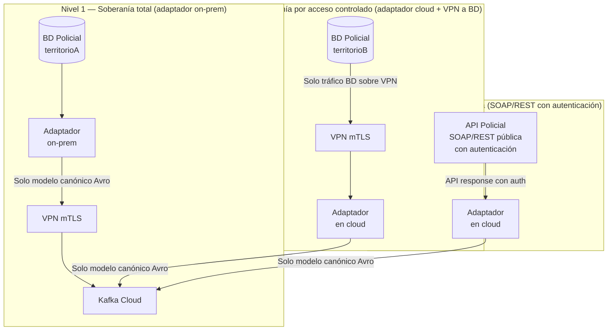

# Soberanía de Datos

**Change:** `sincronizacion-paises`
**Versión:** 1.0
**Última actualización:** 2026-05-13

---

## 1. Propósito

Este documento define la política de soberanía de datos del Pilar 4, las reglas sobre qué datos pueden salir del territorio nacional, la topología de despliegue en función del nivel de restricción de cada país, la configuración del campo `extensions` para datos autorizados, y las referencias legales aplicables.

---

## 2. Principios de Soberanía de Datos

### 2.1 Principio de minimización

Solo los campos del modelo canónico (y los campos de `extensions` explícitamente autorizados por la institución policial) pueden abandonar el territorio nacional. Los datos crudos de la BD policial — nombres de propietarios, direcciones domiciliarias, números de expediente, observaciones en texto libre — nunca deben incluirse en el payload del evento canónico si no han sido explícitamente autorizados.

### 2.2 Principio de responsabilidad del adaptador

El adaptador es la frontera técnica de soberanía. Su función principal, además del mapeo, es garantizar que solo los datos autorizados salen de su perímetro de despliegue. Un adaptador on-prem dentro del territorio nacional es la garantía técnica más fuerte de este principio.

### 2.3 Principio de autorización explícita

Ningún campo de `extensions` puede incluirse en el evento canónico sin estar listado explícitamente en la configuración `extensions_allowed` del adaptador. Esta configuración es gestionada por el operador del sistema en coordinación con la institución policial, bajo acuerdo formal documentado.

---

## 3. Topología de Despliegue por Nivel de Soberanía



### 3.1 Nivel 1 — Adaptador completamente on-prem

**Descripción:** El adaptador se despliega dentro de la red interna de la institución policial o en una infraestructura controlada por el país. Solo los mensajes Avro del modelo canónico salen del territorio a través de un túnel VPN mTLS.

**Garantía técnica:** Los datos crudos de la BD policial nunca salen del perímetro físico y lógico del territorio.

**Requisitos:**
- Servidor o VM on-prem con capacidad para ejecutar el contenedor del adaptador (mínimo 2 vCPU, 2 GB RAM).
- Conectividad de salida VPN hacia el cluster Kafka del cloud.
- Gestión de secretos local (Vault agent sidecar o variables de entorno seguras).

**Cuándo aplicar:** países con marco legal que prohíbe explícitamente que datos de registros policiales salgan del territorio en forma original (ver sección 6).

### 3.2 Nivel 2 — Adaptador en cloud con acceso VPN a la BD

**Descripción:** El adaptador corre en el cloud pero accede a la BD policial mediante un túnel VPN gestionado. La BD policial no queda expuesta a internet.

**Garantía técnica:** Los datos crudos viajan solo sobre el túnel VPN cifrado, entre la BD y el adaptador. El adaptador extrae solo los campos necesarios para el mapeo.

**Requisitos:**
- Túnel VPN (WireGuard o IPsec) entre la red del país y la red del cloud.
- Reglas de firewall que permiten solo la conexión del adaptador al puerto de la BD.

**Cuándo aplicar:** cuando la institución no puede operar contenedores on-prem pero tiene capacidad de establecer un túnel VPN gestionado.

### 3.3 Nivel 3 — API pública autenticada

**Descripción:** La institución policial expone una API REST o SOAP con autenticación fuerte. El adaptador consume esta API desde el cloud. No hay acceso directo a la BD.

**Garantía técnica:** La institución policial controla qué campos expone en la API. El adaptador solo ve los campos que la API devuelve.

**Requisitos:**
- API policial con autenticación (OAuth 2.0, mTLS, WS-Security o equivalente).
- Acuerdo formal sobre los campos expuestos en la API.

**Cuándo aplicar:** cuando la institución tiene una API pública madura y la exposición de datos ya está regulada internamente.

---

## 4. Datos que Pueden Salir del Territorio

### 4.1 Datos siempre permitidos (modelo canónico base)

Los 9 campos mandatorios del modelo canónico son datos operativos mínimos requeridos para el funcionamiento del sistema. Se considera que su compartición es inherente al objetivo de la plataforma y debe estar amparada por el convenio institucional:

| Campo | Clasificación | Justificación |
|---|---|---|
| `plate` | Dato de identificación vehicular (no personal) | Necesario para el matching en todos los componentes |
| `stolen_date` | Dato operativo | Necesario para validar frescura del registro |
| `stolen_location` | Dato de lugar (no domicilio del propietario) | Necesario para contexto geográfico |
| `brand`, `class`, `line`, `color`, `model` | Datos de identificación vehicular | Necesarios para confirmación visual del vehículo |
| `owner_id` | Dato personal (identificador del propietario) | **Restringido**: almacenado solo en PostgreSQL con control de acceso; nunca en Redis, BF ni analítica |
| `country_code` | Metadato del sistema | Necesario para aislamiento multi-tenant |
| `status`, `schema_version`, `event_id`, `source_system`, `ingested_at` | Metadatos de control | Necesarios para operación del sistema |

### 4.2 Datos permitidos solo con autorización explícita (campo `extensions`)

Cualquier campo adicional de la BD policial que no sea de los 9 canónicos requiere:

1. Autorización formal documentada de la institución policial.
2. Evaluación de impacto en privacidad según la ley del país.
3. Inclusión en la lista `extensions_allowed` de la configuración del adaptador.
4. Documentación en la ficha del país en el [`country-onboarding-guide.md`](./country-onboarding-guide.md).

**Ejemplos de campos que requieren autorización:**

| Campo | Clasificación | Evaluación |
|---|---|---|
| `numero_motor` | Identificador vehicular | Generalmente autorizable; no es PII |
| `numero_chasis` | Identificador vehicular | Generalmente autorizable; no es PII |
| `nombre_propietario` | PII directa | Requiere análisis legal detallado; en muchos países solo operadores policiales pueden acceder |
| `direccion_propietario` | PII sensible | En general no debe salir del territorio; requiere protección especial |
| `numero_cedula_adicional` | PII directa | Similar a `owner_id`; tratar con las mismas restricciones |

### 4.3 Datos que nunca deben salir

Los siguientes tipos de datos **no deben incluirse** en el evento canónico bajo ninguna circunstancia:

- Fotografías de personas (solo fotografías de vehículos en los campos de evidencia visual, fuera del alcance de este pilar).
- Datos biométricos.
- Información de procedimientos judiciales en curso.
- Datos de testigos o informantes.
- Información de inteligencia policial.

---

## 5. Configuración del Campo `extensions` para Datos Autorizados

```yaml
# Ejemplo de configuración del adaptador Colombia
country_code: CO
source_system: SIJIN_CO
extensions_allowed:
  - numero_motor       # Autorizado por SIJIN mediante oficio 2026-003
  - numero_chasis      # Autorizado por SIJIN mediante oficio 2026-003
  - tipo_combustible   # Autorizado por SIJIN mediante oficio 2026-003
# Campos NO incluidos intencionalmente:
# - nombre_propietario (PII directa, no autorizado)
# - direccion_hurto_detallada (datos de investigación, no autorizado)
```

Si la configuración `extensions_allowed` está vacía o no está definida, el adaptador produce el evento con `extensions: {}` y no incluye ningún campo adicional.

---

## 6. Marco Legal por País

### 6.1 Colombia

- **Ley 1581 de 2012** — Protección de Datos Personales. Establece principios de finalidad, necesidad y proporcionalidad en el tratamiento de datos personales. Los datos de `owner_id` son datos personales y su tratamiento requiere una base legal (p.ej., cumplimiento de función policial).
- **Decreto 1377 de 2013** — Reglamenta la Ley 1581 en aspectos de autorización de tratamiento.
- **Circular 002 de 2015 (SIC)** — Guía de implementación para operadores de datos personales.
- **Implicación para el adaptador:** el `owner_id` solo puede persistir en PostgreSQL bajo el alcance del convenio con la SIJIN. No puede propagarse a Redis ni a analítica.

### 6.2 Venezuela

- **Ley Especial contra los Delitos Informáticos (2001)** — Tipifica delitos de acceso indebido a sistemas.
- No existe una ley de protección de datos comparable a la RGPD. Sin embargo, el principio de minimización aplica igualmente.
- **Implicación:** la institución policial define qué datos pueden compartirse. El adaptador debe operar en modo Nivel 1 (on-prem) dado el contexto institucional.

### 6.3 México

- **Ley Federal de Protección de Datos Personales en Posesión de los Particulares (LFPDPPP, 2010)**.
- **Ley General de Protección de Datos Personales en Posesión de Sujetos Obligados (LGPDPPSO, 2017)** — Aplica a entidades públicas como las instituciones policiales.
- **Implicación:** el tratamiento de datos personales por entidades policiales está regulado por la LGPDPPSO. El convenio institucional debe citar esta ley.

### 6.4 Argentina

- **Ley 25.326 de Protección de los Datos Personales (2000)** y su reglamentación.
- **Implicación:** similares a las de Colombia. Los datos de identificación del propietario requieren base legal explícita.

### 6.5 Cláusula general

Para cualquier país no listado explícitamente, aplica el principio de minimización por defecto: solo los 9 campos canónicos base, sin campos de `extensions`, hasta que se obtenga autorización formal documentada.

---

## 7. Relación con el Módulo de Identidad y Seguridad

El módulo `identidad-seguridad` gestiona:
- Las credenciales de acceso del adaptador a los sistemas policiales (vía Vault).
- Los certificados de autenticación mTLS para la VPN y para el producer Kafka.
- El RBAC sobre quién puede consultar el campo `owner_id` en el Canonical Vehicles Service.

Ver [`docs/identidad-seguridad/vault-secrets-engine.md`](../identidad-seguridad/vault-secrets-engine.md) para la gestión de secretos del adaptador.

---

## 8. Auditoría

Toda publicación en el tópico `stolen.vehicles.events` queda registrada en el audit log de Kafka (configurado con `log.retention.ms` de al menos 7 años para eventos de auditoría). El audit log es inmutable (S3 Object Lock) y solo accesible por el rol `auditor`.

Ante una solicitud legal de eliminación de datos de un propietario específico, el proceso es:
1. Actualizar el campo `owner_id` en `canonical_vehicles` (PostgreSQL) mediante una operación controlada.
2. Los eventos históricos en Kafka son inmutables; el convenio institucional debe estipular el alcance de la retención histórica.

---

## 9. Referencias Cruzadas

| Documento | Relación |
|---|---|
| [`canonical-model.md`](./canonical-model.md) | Define los campos y sus clasificaciones de privacidad |
| [`country-adapter-framework.md`](./country-adapter-framework.md) | Responsabilidad del adaptador como frontera de soberanía |
| [`postgresql-schema.md`](./postgresql-schema.md) | Almacenamiento de `owner_id` con control de acceso |
| [`country-onboarding-guide.md`](./country-onboarding-guide.md) | Proceso formal de documentar autorizaciones por país |
| [`docs/identidad-seguridad/`](../identidad-seguridad/overview.md) | Gestión de credenciales y acceso |
| Propuesta de arquitectura §5.8 | Consideraciones de cumplimiento y soberanía de datos |
