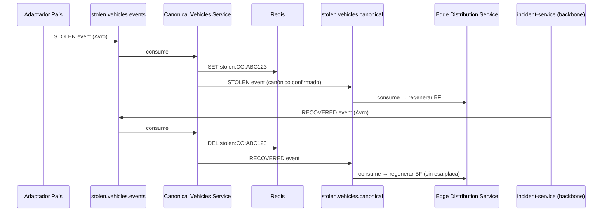

# Tópicos Kafka — Sincronización de Países

**Change:** `sincronizacion-paises`
**Versión:** 1.0
**Última actualización:** 2026-05-13

---

## 1. Propósito

Este documento es la especificación autoritativa de los tópicos Kafka del Pilar 4. Complementa la tabla de tópicos del `backbone-procesamiento` agregando los tópicos propios de la sincronización de vehículos hurtados.

Para la tabla completa del backbone ver [`docs/backbone-procesamiento/kafka-topics.md`](../backbone-procesamiento/kafka-topics.md).

---

## 2. Tabla de Tópicos

| Tópico | Tipo | Particiones | Replication Factor | Retención | Cleanup | Clave de partición |
|---|---|---|---|---|---|---|
| `stolen.vehicles.events` | Evento de ingesta | 24 | 3 | 7 días | `delete` | `{country_code}:{plate}` |
| `stolen.vehicles.canonical` | Evento canónico procesado | 24 | 3 | 30 días | `delete` | `{country_code}:{plate}` |
| `stolen.vehicles.events.dlq` | Dead-letter — ingesta | 6 | 3 | 14 días | `delete` | `{country_code}:{plate}` |
| `stolen.vehicles.canonical.dlq` | Dead-letter — canónico | 6 | 3 | 14 días | `delete` | `{country_code}:{plate}` |

`min.insync.replicas=2` en todos los tópicos. `acks=all` requerido en todos los producers.

---

## 3. Tópico `stolen.vehicles.events`

### 3.1 Propósito

Tópico de entrada del Pilar 4. Los adaptadores de país publican aquí cada evento de vehículo hurtado normalizado al modelo canónico.

### 3.2 Producers

| Producer | Quién | Modo |
|---|---|---|
| Adaptador de país (CDC) | Debezium Connector configurado por país | Automático ante cada cambio en la BD policial |
| Adaptador de país (JDBC) | Microservicio adaptador con polling periódico | Periódico según ventana configurada |
| Adaptador de país (SOAP/REST) | Microservicio adaptador con llamada programada | Periódico según ventana configurada |
| Adaptador de país (file drop) | Microservicio adaptador con watcher de directorio | Al detectar archivo nuevo |
| `incident-service` (RECOVERED) | backbone-procesamiento | Al marcar un vehículo como recuperado |

Configuración obligatoria del producer:

```properties
acks=all
enable.idempotence=true
max.in.flight.requests.per.connection=5
retries=2147483647
delivery.timeout.ms=120000
```

### 3.3 Consumers

| Consumer | Grupo | Acción |
|---|---|---|
| Canonical Vehicles Service | `canonical-vehicles-service` | Valida, hace upsert en PostgreSQL, actualiza Redis, publica en `stolen.vehicles.canonical` |

### 3.4 Clave de partición

```
{country_code}:{plate}
```

Ejemplo: `CO:ABC123`

Esta clave garantiza que todos los eventos de una misma placa en un mismo país sean procesados en orden por la misma partición. El número de particiones (24) permite distribución suficiente para el volumen previsto de múltiples países.

### 3.5 Serialización

- **Clave:** String UTF-8 (sin schema Avro).
- **Valor:** Avro con Schema Registry. Subject: `stolen.vehicles.events-value`. Compatibilidad: `BACKWARD`.

### 3.6 Headers recomendados

| Header | Tipo | Descripción |
|---|---|---|
| `X-Country-Code` | string | Código ISO del país. Permite routing y filtrado sin deserializar el value. |
| `X-Adapter-Version` | string | Versión del adaptador que produjo el mensaje. |
| `X-Source-System` | string | Identificador del sistema fuente. |

---

## 4. Tópico `stolen.vehicles.canonical`

### 4.1 Propósito

Tópico de salida del Canonical Vehicles Service. Representa el estado canónico procesado y validado de cada registro. Es la fuente que consumen los servicios downstream que necesitan saber del estado actual de un vehículo en la lista roja.

### 4.2 Producers

| Producer | Descripción |
|---|---|
| Canonical Vehicles Service | Publica tras cada upsert exitoso en PostgreSQL |

### 4.3 Consumers

| Consumer | Grupo | Acción |
|---|---|---|
| Edge Distribution Service | `edge-distribution-service` | Detecta cambios en la lista activa para regenerar el Bloom filter del país |
| Matcher Service (backbone) | `matcher-service` (opcional) | Puede usar este tópico para mantener su GlobalKTable local actualizada como alternativa a Redis |
| Analítica / ClickHouse ingestion | `analytics-ingestion` | Cold path: ingestión histórica para tendencias |

### 4.4 Formato del mensaje

El formato es idéntico al de `stolen.vehicles.events` (mismo schema Avro). La diferencia semántica es que los mensajes en este tópico han pasado por validación y upsert exitoso — representan el estado canónico confirmado en PostgreSQL.

---

## 5. Dead-Letter Topics

### 5.1 `stolen.vehicles.events.dlq`

Destino de mensajes de `stolen.vehicles.events` que el Canonical Vehicles Service no puede procesar.

**Causas típicas de enrutamiento al DLQ:**

| Código de error | Descripción |
|---|---|
| `MISSING_MANDATORY_FIELD` | Uno o más de los 9 campos mandatorios ausentes o nulos |
| `INVALID_COUNTRY_CODE` | `country_code` ausente o no registrado en la configuración |
| `SCHEMA_DESERIALIZATION_FAILURE` | Fallo al deserializar el payload Avro |
| `INVALID_STATUS` | Valor de `status` fuera del enum permitido |
| `INVALID_DATE_FORMAT` | `stolen_date` no parseable como ISO 8601 |
| `DUPLICATE_EVENT_ID` | `event_id` ya procesado dentro de la ventana de deduplicación |

**Headers añadidos al publicar en DLQ:**

```
X-DLQ-Error-Code: MISSING_MANDATORY_FIELD
X-DLQ-Error-Detail: field=owner_id
X-DLQ-Original-Topic: stolen.vehicles.events
X-DLQ-Original-Partition: 5
X-DLQ-Original-Offset: 1234567
X-DLQ-Timestamp: 2026-01-15T14:31:10Z
```

### 5.2 `stolen.vehicles.canonical.dlq`

Destino de mensajes del Edge Distribution Service o consumidores del tópico canonical que no pueden procesar un mensaje.

**Causas típicas:**

| Código de error | Descripción |
|---|---|
| `BF_GENERATION_FAILURE` | Fallo al generar o serializar el Bloom filter |
| `STORAGE_UNAVAILABLE` | MinIO / S3 no disponible al intentar persistir la versión del BF |
| `MQTT_PUBLISH_FAILURE` | Fallo al publicar en el broker MQTT tras reintentos agotados |

---

## 6. Configuración de Creación de Tópicos

```bash
# stolen.vehicles.events
kafka-topics.sh --create \
  --bootstrap-server kafka:9092 \
  --topic stolen.vehicles.events \
  --partitions 24 \
  --replication-factor 3 \
  --config min.insync.replicas=2 \
  --config retention.ms=604800000 \
  --config cleanup.policy=delete \
  --config compression.type=lz4

# stolen.vehicles.canonical
kafka-topics.sh --create \
  --bootstrap-server kafka:9092 \
  --topic stolen.vehicles.canonical \
  --partitions 24 \
  --replication-factor 3 \
  --config min.insync.replicas=2 \
  --config retention.ms=2592000000 \
  --config cleanup.policy=delete \
  --config compression.type=lz4

# stolen.vehicles.events.dlq
kafka-topics.sh --create \
  --bootstrap-server kafka:9092 \
  --topic stolen.vehicles.events.dlq \
  --partitions 6 \
  --replication-factor 3 \
  --config min.insync.replicas=2 \
  --config retention.ms=1209600000 \
  --config cleanup.policy=delete

# stolen.vehicles.canonical.dlq
kafka-topics.sh --create \
  --bootstrap-server kafka:9092 \
  --topic stolen.vehicles.canonical.dlq \
  --partitions 6 \
  --replication-factor 3 \
  --config min.insync.replicas=2 \
  --config retention.ms=1209600000 \
  --config cleanup.policy=delete
```

---

## 7. Integración con la Tabla de Tópicos del Backbone

El tópico `stolen.vehicles.events` es alimentado por este pilar y consumido por el Canonical Vehicles Service (aquí). El backbone de procesamiento no consume directamente de `stolen.vehicles.events`; accede al estado de vehículos hurtados vía Redis (`stolen:{cc}:{plate}`).

El `incident-service` del backbone **produce** en `stolen.vehicles.events` cuando marca un vehículo como `RECOVERED`, completando el ciclo.



---

## 8. Monitoreo

Las métricas de lag de estos tópicos son parte del SLO de frescura. Ver [`slo-observability.md`](./slo-observability.md) para la especificación completa.

Métricas clave a monitorear:

- `kafka_consumer_group_lag{group="canonical-vehicles-service", topic="stolen.vehicles.events"}` — lag del consumidor principal.
- `kafka_topic_messages_in_per_sec{topic="stolen.vehicles.events.dlq"}` — tasa de mensajes en DLQ (indica errores de validación).
- `kafka_topic_log_size{topic="stolen.vehicles.events"}` — tamaño del log para estimar retención vs. consumo.
