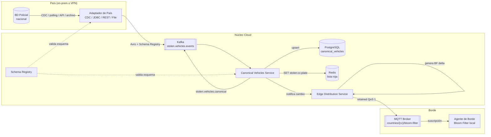

# Pilar 4 — Anti-Corruption Layer por País: Visión General

**Change:** `sincronizacion-paises`
**Versión:** 1.0
**Última actualización:** 2026-05-13

---

## 1. Propósito

El **Pilar 4** implementa la capa de ingestión de datos de vehículos hurtados desde bases de datos policiales nacionales heterogéneas. Su responsabilidad es:

1. Conectar con cada fuente policial mediante un **adaptador de país** dedicado.
2. Mapear el esquema propietario de cada BD al **modelo canónico** del sistema.
3. Distribuir la lista actualizada a los **agentes de borde** vía Bloom filter delta sobre MQTT.
4. Garantizar **soberanía de datos**: los datos crudos no salen del territorio salvo los campos explícitamente autorizados.

Este pilar responde al supuesto del caso de estudio (§6 de la propuesta): cada institución policial proporciona acceso programático a su BD de hurtos con un esquema, tecnología y modo de entrega distintos.

---

## 2. Flujo de Extremo a Extremo

El flujo completo desde la fuente policial hasta el agente de borde atraviesa cuatro etapas:



### 2.1 Descripción de cada etapa

| Etapa | Actores | Resultado |
|---|---|---|
| **Detección** | BD Policial → Adaptador de País | Cambio detectado (inserción, actualización o eliminación) en la BD policial del país |
| **Normalización** | Adaptador → Kafka | Mensaje Avro publicado en `stolen.vehicles.events` con clave `{country_code}:{plate}` y los 9 campos mandatorios del modelo canónico |
| **Procesamiento canónico** | Canonical Vehicles Service → PostgreSQL + Redis | Upsert en `canonical_vehicles`, actualización de `stolen:{cc}:{plate}` en Redis, evento publicado en `stolen.vehicles.canonical` |
| **Distribución a borde** | Edge Distribution Service → MQTT → Agente de Borde | Bloom filter delta (o full snapshot si aplica) publicado en topic MQTT retained; el agente aplica el delta en memoria |

---

## 3. Componentes del Pilar 4

```mermaid
graph TB
    subgraph Adaptadores["Adaptadores de País (uno por país)"]
        A_CO[Adapter CO\nDebezium CDC]
        A_VE[Adapter VE\nJDBC polling]
        A_MX[Adapter MX\nSOAP/REST]
        A_AR[Adapter AR\nFile drop]
    end

    subgraph Nucleo["Núcleo (servicios compartidos)"]
        SR[Schema Registry\nApicurio / Confluent]
        CVS[Canonical Vehicles Service\nNestJS / Go]
        EDS[Edge Distribution Service\nGo]
        PG[(PostgreSQL\ncanonical_vehicles)]
        RDS[(Redis\nstolen:{cc}:{plate})]
        MINIO[(MinIO / S3\nversiones BF)]
    end

    subgraph Bus["Event Bus"]
        K_EV[["stolen.vehicles.events"]]
        K_CAN[["stolen.vehicles.canonical"]]
        K_DLQ[["stolen.vehicles.events.dlq"]]
    end

    A_CO --> SR
    A_VE --> SR
    A_MX --> SR
    A_AR --> SR
    SR --> K_EV
    K_EV --> CVS
    CVS --> PG
    CVS --> RDS
    CVS --> K_CAN
    CVS --> K_DLQ
    CVS --> EDS
    EDS --> MINIO
    EDS -->|MQTT retained| BORDE[(Agentes de Borde)]
```

### 3.1 Adaptador de País

Microservicio contenedor independiente por país. Conoce el esquema propietario de la BD policial y el modo de conectividad disponible. Abstrae toda la complejidad de la fuente externa y produce mensajes conformes al modelo canónico.

Modos soportados: CDC (Debezium), JDBC polling, SOAP/REST programado, file drop watcher.

Ver especificación completa: [`country-adapter-framework.md`](./country-adapter-framework.md)

### 3.2 Schema Registry

Almacena y versiona los esquemas Avro del evento canónico. Aplica reglas de compatibilidad `BACKWARD` para garantizar que los consumers existentes no se rompan cuando el productor evoluciona el esquema.

Ver especificación: [`avro-schema.md`](./avro-schema.md)

### 3.3 Canonical Vehicles Service

Consumidor del tópico `stolen.vehicles.events`. Valida, persiste en PostgreSQL y actualiza la lista roja en Redis. Publica en `stolen.vehicles.canonical` y notifica al Edge Distribution Service ante cambios.

Ver especificación: [`canonical-vehicles-service.md`](./canonical-vehicles-service.md)

### 3.4 Edge Distribution Service

Mantiene las versiones del Bloom filter por país en MinIO. Calcula deltas incrementales y los publica vía MQTT retained. Ante una versión demasiado antigua del dispositivo, publica un full snapshot.

Ver especificación: [`edge-distribution-service.md`](./edge-distribution-service.md)

---

## 4. Topología de Despliegue: On-prem vs. Cloud

La topología de despliegue varía según el nivel de soberanía de datos exigido por cada país.

```mermaid
graph TB
    subgraph ONPREM["Instalación on-prem (territorio nacional)"]
        BD_POL[(BD Policial)]
        ADP[Adaptador de País]
        VAULT_L[Vault / Secrets\nlocal]
    end

    subgraph VPN["Túnel VPN mTLS"]
        TUN[WireGuard / IPsec]
    end

    subgraph CLOUD["Núcleo Cloud (región autorizada)"]
        KAFKA[Kafka]
        CVS[Canonical Vehicles Service]
        EDS[Edge Distribution Service]
        PG[(PostgreSQL)]
        RDS[(Redis)]
        MQTT[MQTT Broker]
    end

    BD_POL --> ADP
    ADP -->|Kafka producer sobre VPN| TUN
    TUN --> KAFKA
    KAFKA --> CVS
    CVS --> PG
    CVS --> RDS
    CVS --> EDS
    EDS --> MQTT

    subgraph CLOUD_LITE["Opción: Adaptador en cloud (países sin restricción on-prem)"]
        ADP_CLOUD[Adaptador de País\n(en cloud, acceso VPN a BD)]
    end

    ADP_CLOUD --> KAFKA
```

### 4.1 Escenario A — Adaptador completamente on-prem

El adaptador se despliega dentro de la red del país. Solo los mensajes Avro del modelo canónico (datos ya normalizados) atraviesan la VPN hacia el cloud. Los datos crudos de la BD policial nunca salen del territorio.

**Cuándo aplicar:** países con restricciones legales estrictas (p.ej. Colombia — Ley 1581, Venezuela).

### 4.2 Escenario B — Adaptador en cloud con acceso VPN a la BD

El adaptador corre en el cloud y accede a la BD policial mediante un túnel VPN. La BD policial no queda expuesta a internet; el adaptador actúa como proxy seguro.

**Cuándo aplicar:** países donde la institución policial no puede operar contenedores on-prem pero sí puede establecer un túnel VPN gestionado.

### 4.3 Escenario C — API pública de la institución policial

La institución policial expone una API REST/SOAP autenticada. El adaptador en cloud la consulta periódicamente. No hay acceso directo a la BD.

**Cuándo aplicar:** países con APIs policiales maduras (e.g., algunas regiones de México, Argentina).

---

## 5. Contratos con Otros Pilares

| Pilar | Dirección | Contrato |
|---|---|---|
| `backbone-procesamiento` | Produce → Pilar 4 | Evento `RECOVERED` en `stolen.vehicles.events` para activar baja en lista roja y regeneración de BF |
| `ingestion-mqtt` | Pilar 4 → Consume | Publica Bloom filter en tópico MQTT `countries/{cc}/bloom-filter`; usa el broker EMQX y el schema de topics definido en `ingestion-mqtt` |
| `agente-borde` | Consume ← Pilar 4 | El agente suscribe al tópico MQTT retained y aplica el delta; contrato de payload descrito en [`edge-distribution-service.md`](./edge-distribution-service.md) |
| `almacenamiento-lectura` | Pilar 4 → | La tabla `canonical_vehicles` y las claves Redis son fuente para el Matcher Service y las proyecciones analíticas |
| `identidad-seguridad` | Consume ← | Credenciales de adaptadores se obtienen de Vault; pendiente formalización (ver specs.md nota final) |

---

## 6. Decisiones de Diseño Relevantes

| ADR | Decisión |
|---|---|
| [ADR-005](../propuesta-arquitectura-hurto-vehiculos.md#adr-005--arquitectura-hexagonal-para-servicios-sensibles-a-la-nube) | Arquitectura hexagonal: puertos `VehiclesRepositoryPort`, `HotListPort`, `CanonicalEventsPort`, `BloomFilterStorePort` |
| [ADR-006](./adr-006-acl-canonical-model.md) | Anti-Corruption Layer por país con modelo canónico versionado |
| [ADR-009](./adr-009-bloom-filter-edge.md) | Bloom filter en borde: parámetros fijos, protocolo delta, full snapshot |
| [ADR-011](../propuesta-arquitectura-hurto-vehiculos.md#adr-011--multi-tenant-por-país-con-aislamiento-de-datos) | `country_code` como discriminador de tenant en todos los almacenes |
| [ADR-012](../propuesta-arquitectura-hurto-vehiculos.md#adr-012--stack-de-streaming-sobre-kafka-con-opción-redpanda) | Kafka como backbone de eventos; Schema Registry para versionado Avro |

---

## 7. Índice de Documentos del Pilar 4

| Documento | Contenido |
|---|---|
| [overview.md](./overview.md) | **Este documento** — narrativa, flujo, topología |
| [canonical-model.md](./canonical-model.md) | Especificación autoritativa del modelo canónico (9 campos + extensiones) |
| [avro-schema.md](./avro-schema.md) | Schema Avro completo, versionado y compatibilidad |
| [kafka-topics.md](./kafka-topics.md) | Tópicos Kafka, producers, consumers, retención, DLQs |
| [adr-006-acl-canonical-model.md](./adr-006-acl-canonical-model.md) | ADR-006: decisión de ACL por país |
| [adr-009-bloom-filter-edge.md](./adr-009-bloom-filter-edge.md) | ADR-009: decisión de Bloom filter en borde |
| [country-adapter-framework.md](./country-adapter-framework.md) | Marco de adaptadores: modos, checkpoint, idempotencia |
| [sla-freshness.md](./sla-freshness.md) | SLAs de frescura por modo de integración |
| [data-sovereignty.md](./data-sovereignty.md) | Soberanía de datos, topología on-prem vs. cloud |
| [postgresql-schema.md](./postgresql-schema.md) | DDL `canonical_vehicles`, índices, particionamiento |
| [canonical-vehicles-service.md](./canonical-vehicles-service.md) | Especificación del Canonical Vehicles Service |
| [edge-distribution-service.md](./edge-distribution-service.md) | Especificación del Edge Distribution Service |
| [schema-evolution.md](./schema-evolution.md) | Guía de evolución del esquema canónico |
| [country-onboarding-guide.md](./country-onboarding-guide.md) | Guía paso a paso de incorporación de nuevo país |
| [slo-observability.md](./slo-observability.md) | SLOs, métricas Prometheus, dashboards Grafana, alertas |
| [helm/README.md](./helm/README.md) | Despliegue Helm: values, instalación, actualización |
| [terraform/README.md](./terraform/README.md) | Módulos Terraform: Kafka, PostgreSQL, Redis, MQTT, MinIO |
