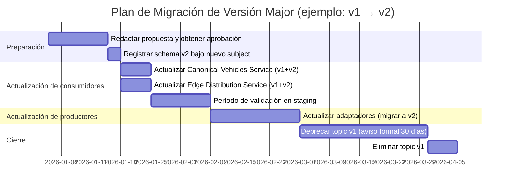

# Guía de Evolución del Esquema Canónico

**Change:** `sincronizacion-paises`
**Versión:** 1.0
**Última actualización:** 2026-05-13

---

## 1. Propósito

Este documento describe el proceso para evolucionar el esquema canónico del evento de vehículo hurtado a lo largo del tiempo. Define qué cambios son compatibles (minor), cuáles son incompatibles (major), cómo usar el campo `extensions` para postergar la promoción de un campo al modelo canónico, y el proceso formal de deprecación.

---

## 2. Principio General

El esquema canónico es un contrato entre múltiples productores (adaptadores de país) y múltiples consumidores (Canonical Vehicles Service, Edge Distribution Service, analítica). Su evolución debe ser gestionada con el mismo rigor que una API pública.

**Regla de oro:** un consumidor que funciona con la versión N del esquema debe poder procesar correctamente mensajes producidos con la versión N+1 (compatibilidad backward). La dirección inversa (forward compatibility) no es requerida pero se recomienda donde sea factible.

---

## 3. Cambios de Versión Minor (compatibles)

### 3.1 Definición

Un cambio es minor cuando un consumer con el schema antiguo puede leer mensajes producidos con el schema nuevo sin error.

Bajo la política `BACKWARD` del Schema Registry, son cambios minor:

| Tipo de cambio | Ejemplo | Acción en Schema Registry |
|---|---|---|
| Agregar campo nuevo con valor default | `recovery_location: string` con `default: ""` | Registrar nueva versión del schema |
| Agregar campo nullable con default null | `recovery_date: union(null, string)` con `default: null` | Registrar nueva versión |
| Ampliar enum con nuevo símbolo | Agregar `PENDING_CONFIRMATION` a `VehicleStatus` | Registrar nueva versión |
| Cambiar `doc` de un campo | Clarificar descripción | Registrar nueva versión (cosmético) |

### 3.2 Proceso para cambio minor

```
1. Redactar propuesta de cambio
   - Describir el nuevo campo / cambio
   - Justificar por qué es minor
   - Identificar qué adaptadores producirán el nuevo campo
   - Identificar qué consumers deben actualizarse para leer el nuevo campo

2. Validar compatibilidad con el Schema Registry
   POST /compatibility/subjects/stolen.vehicles.events-value/versions/latest
   Body: { "schema": "<nuevo schema JSON>" }
   Respuesta esperada: { "is_compatible": true }

3. Registrar nueva versión en Schema Registry
   POST /subjects/stolen.vehicles.events-value/versions
   Body: { "schema": "<nuevo schema JSON>" }

4. Actualizar field schema_version en mensajes nuevos
   (p.ej., de "1.2" a "1.3")

5. Actualizar la documentación canonical-model.md y avro-schema.md

6. Comunicar a los implementadores de adaptadores
   - El campo nuevo es opcional en la versión minor
   - Pueden comenzar a producirlo sin coordinación estricta

7. Actualizar los consumers para aprovechar el nuevo campo cuando lo encuentren
   (no es bloqueante para el despliegue)
```

### 3.3 Actualización de adaptadores en versión minor

Los adaptadores no están obligados a actualizar simultáneamente ante un cambio minor. Los mensajes sin el nuevo campo opcional son igualmente válidos — el consumer los lee y obtiene el valor default.

---

## 4. Cambios de Versión Major (incompatibles)

### 4.1 Definición

Un cambio es major cuando rompe la compatibilidad con consumers existentes:

| Tipo de cambio | Ejemplo | Por qué incompatible |
|---|---|---|
| Eliminar campo mandatorio | Eliminar `owner_id` | Consumers que acceden al campo fallarían |
| Cambiar tipo de campo | `model` de `string` a `int` | Type mismatch en deserialización |
| Renombrar campo | `plate` → `license_plate` | El nombre antiguo se ve como ausente |
| Cambiar namespace del record | `v1` → `v2` | Rompe la identidad del record Avro |
| Hacer obligatorio un campo que era opcional | `extensions` de `default: {}` a sin default | Mensajes sin el campo fallarían |
| Eliminar símbolo de enum | Eliminar `RECOVERED` | Valores existentes no deserializables |

### 4.2 Proceso para cambio major (plan de migración coordinada)

Un cambio major requiere un plan formal con al menos 30 días de aviso previo:



**Pasos detallados:**

```
1. Redactar propuesta formal con:
   - Justificación del cambio
   - Listado de campos afectados
   - Plan de migración para cada adaptador
   - Fechas tentativas

2. Crear nuevo namespace Avro para v2:
   namespace: com.antihurto.vehicles.canonical.v2

3. Registrar schema v2 bajo nuevo subject:
   subject: stolen.vehicles.events-v2-value

4. Crear nuevo tópico Kafka (si el cambio afecta la estructura de la clave):
   stolen.vehicles.events-v2

5. Actualizar los consumers para consumir AMBOS tópicos v1 y v2 en paralelo
   - Usar un multi-topic consumer group
   - Los consumers detectan la versión por el subject del schema
   - Ambas versiones producen el mismo resultado en PG y Redis

6. Migrar adaptadores país por país:
   - Cada adaptador migra a v2 de forma independiente
   - Período de gracia: el consumer acepta v1 y v2 durante la migración
   - Coordinar con cada contraparte policial si el mapeo de campos cambia

7. Declarar el tópico v1 como deprecado con aviso de 30 días

8. Confirmar que todos los adaptadores están en v2 (sin mensajes nuevos en v1)

9. Archivar el tópico v1 (reducir retención a 0, luego eliminar)

10. Actualizar documentación:
    - canonical-model.md
    - avro-schema.md
    - ADR-006
    - country-onboarding-guide.md
```

### 4.3 Cómo evitar una versión major

Antes de decidir que un cambio es major, evaluar si puede expresarse como minor usando los mecanismos disponibles:

- **Nuevo campo semánticamente nuevo:** usar versión minor con `default`.
- **Campo actualmente en `extensions`:** si un campo creció en adopción y quiere promoverse al modelo canónico, se puede agregar como campo canónico opcional (minor) manteniendo el campo en `extensions` para adaptadores que aún no actualizaron. Ver sección 5.
- **Cambio de semántica de un campo existente:** si el nombre es el mismo pero el significado cambia, es mejor agregar un campo nuevo (minor) y deprecar el antiguo gradualmente.

---

## 5. Uso de `extensions` para Postergar Cambios Major

El campo `extensions` actúa como un espacio de experimentación controlado que permite incorporar nuevos campos sin afectar la versión del schema.

### 5.1 Ciclo de vida de un campo en `extensions`

```mermaid
stateDiagram-v2
    [*] --> EnExtensions : País A necesita el campo\nnumero_motor
    EnExtensions --> PropuestaPromocion : Múltiples países adoptan el campo
    PropuestaPromocion --> VersionMinor : Se agrega al schema canónico\ncomo campo opcional
    VersionMinor --> CanonicoOpcional : Algunos adaptadores producen el campo
    CanonicoOpcional --> CanonicoMandatorio : Todos los adaptadores lo producen;\nse propone hacerlo mandatorio (major)
    CanonicoOpcional --> Deprecado : El campo no tuvo adopción
    CanonicoMandatorio --> [*] : Campo establecido
```



### 5.2 Criterios para promover un campo de `extensions` al modelo canónico

| Criterio | Umbral |
|---|---|
| Adopción en países | ≥ 3 países lo producen en `extensions` |
| Adopción en consumidores | ≥ 1 consumidor downstream lo usa desde `extensions` |
| Valor semántico claro | El campo tiene una semántica unívoca entre países |
| Sin conflicto de privacidad | La inclusión no viola las políticas de soberanía de datos |

### 5.3 Ejemplo de transición

Supongamos que el campo `numero_motor` está en `extensions` de Colombia y Venezuela. Tres países adicionales lo adoptan. Se decide promover:

1. Agregar `numero_motor: union(null, string) default null` al schema canónico (minor).
2. Los adaptadores que lo tenían en `extensions` lo mueven al campo canónico.
3. Los adaptadores que no lo tenían producen `null`.
4. Opcionalmente, cuando todos los adaptadores lo producen, se puede proponer hacerlo mandatorio en una versión major posterior.

---

## 6. Deprecación de Campos

### 6.1 Proceso de deprecación

```
1. Marcar el campo como deprecated en el `doc` del schema Avro:
   "doc": "[DEPRECATED since 1.5 — usar campo recovery_location en su lugar]"

2. Comunicar a todos los implementadores de adaptadores y consumers.

3. Período de deprecación mínimo: 90 días.

4. Durante el período:
   - Los productores deben dejar de poblar el campo (enviarlo con su valor default).
   - Los consumers no deben depender del campo para lógica crítica.

5. Tras el período, eliminar el campo en una versión major si es requerido,
   o simplemente dejarlo como campo vacío/default si no es bloqueante.
```

### 6.2 Política de deprecación de símbolos de enum

Los símbolos de enum **nunca se eliminan** del schema Avro una vez publicados, para preservar la compatibilidad con mensajes históricos. Si un símbolo queda obsoleto, se marca en el `doc` como deprecated pero permanece en el schema.

---

## 7. Control de Versiones en la Práctica

### 7.1 Campo `schema_version` en el evento

El campo `schema_version` en el payload del evento es un campo semántico (no el ID interno del Schema Registry). Su valor es una cadena `MAJOR.MINOR` que permite a los consumers tomar decisiones basadas en la versión sin consultar el Schema Registry en el hot path.

| `schema_version` | Significado |
|---|---|
| `"1.0"` | Schema inicial |
| `"1.1"` | Primer cambio minor: se agrega campo X |
| `"1.2"` | Segundo cambio minor |
| `"2.0"` | Primera versión major: cambio incompatible |

### 7.2 Mapeo con el Schema Registry

| `schema_version` en payload | Subject en Schema Registry | Version en SR |
|---|---|---|
| `1.0` | `stolen.vehicles.events-value` | 1 |
| `1.1` | `stolen.vehicles.events-value` | 2 |
| `1.2` | `stolen.vehicles.events-value` | 3 |
| `2.0` | `stolen.vehicles.events-v2-value` | 1 |

---

## 8. Referencias Cruzadas

| Documento | Relación |
|---|---|
| [`canonical-model.md`](./canonical-model.md) | Especificación del modelo; se actualiza ante cada cambio |
| [`avro-schema.md`](./avro-schema.md) | Schema Avro; evoluciona según este proceso |
| [`country-onboarding-guide.md`](./country-onboarding-guide.md) | El onboarding usa la versión actual del schema |
| [`country-adapter-framework.md`](./country-adapter-framework.md) | Los adaptadores implementan la versión activa del schema |
