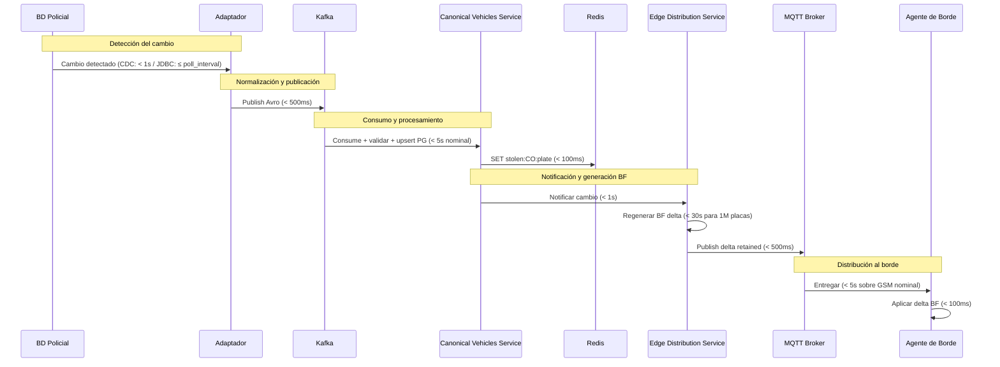

# SLA de Frescura de la Lista Roja

**Change:** `sincronizacion-paises`
**Versión:** 1.0
**Última actualización:** 2026-05-13

---

## 1. Propósito

Este documento define los SLAs de frescura para cada modo de integración, las ventanas de retraso aceptables, el impacto en la lista roja de Redis, y el proceso de comunicación del SLA al contraparte policial de cada país.

**Frescura** se define como el tiempo máximo entre el momento en que un vehículo queda registrado en la BD policial y el momento en que su placa está disponible en:
- La lista roja Redis (`stolen:{cc}:{plate}`).
- El Bloom filter local de los agentes de borde del país.

---

## 2. Tabla de Ventanas de Frescura por Modo

| Modo | Ventana máxima Redis | Ventana máxima BF en borde | Notas |
|---|---|---|---|
| **CDC (Debezium)** | < 5 s (nominal) / < 30 s (bajo carga) | < 2 min (nominal) / < 10 min (bajo carga) | Depende de la latencia del CDC y del proceso de regeneración del BF |
| **JDBC polling** | ≤ `polling_interval` + 30 s | ≤ `polling_interval` + 2 min | `polling_interval` configurable; máximo recomendado 15 min |
| **SOAP/REST programado** | ≤ `schedule_interval` + 30 s | ≤ `schedule_interval` + 2 min | Depende de la disponibilidad y latencia de la API policial |
| **File drop watcher** | Depende de la frecuencia de entrega del archivo | Depende de la frecuencia de entrega | El SLA se acuerda con la contraparte policial (e.g., diario, cada 6 h) |

El tiempo de 30 s en Redis incluye: consumo de Kafka, validación, upsert en PostgreSQL y actualización en Redis.
El tiempo de 2 min en el BF incluye: regeneración del BF, publicación en MQTT y recepción por el agente de borde.

---

## 3. Desglose del Presupuesto de Latencia



**Presupuesto total CDC:** < 1 s (BD→Kafka) + < 5 s (Kafka→Redis) + < 31 s (BF en borde) ≈ **< 40 s extremo a extremo**.

---

## 4. Impacto en la Lista Roja de Redis

### 4.1 Consecuencias del retraso

Durante la ventana de frescura, la lista roja en Redis puede no reflejar un vehículo recién hurtado. El impacto operacional es:

- El Matcher Service no encontrará la placa en Redis y no generará alerta.
- El agente de borde tampoco tendrá la placa en el BF y no priorizará el evento.
- **Mitigación:** la cobertura policial en campo suele ser la primera respuesta ante un hurto reportado; el sistema sirve como complemento de detección, no como único mecanismo.

### 4.2 TTL de la clave Redis

La clave `stolen:{cc}:{plate}` tiene un TTL configurable. Valor de referencia: **30 días**. Este TTL actúa como mecanismo de seguridad para expirar placas que el sistema nunca marcó como `RECOVERED` (e.g., si la BD policial se depuró sin notificar al sistema).

El TTL se renueva en cada evento `STOLEN` recibido. Si se recibe un evento `RECOVERED`, la clave se elimina inmediatamente.

### 4.3 Reconciliación Redis

Si Redis se reinicia o pierde datos, el Canonical Vehicles Service tiene un proceso de reconciliación que lee `canonical_vehicles` (PostgreSQL) y re-puebla las claves Redis para todos los registros con `status = STOLEN`. Ver [`canonical-vehicles-service.md`](./canonical-vehicles-service.md) para el proceso completo.

---

## 5. SLAs por Modo — Tabla de Referencia

| Modo | SLA frescura Redis (P99) | SLA frescura BF en borde (P99) | Condición |
|---|---|---|---|
| CDC | 30 s | 5 min | Conectividad y carga nominales |
| JDBC (5 min poll) | 6 min | 8 min | Polling cada 5 min |
| JDBC (15 min poll) | 16 min | 18 min | Polling cada 15 min (máximo recomendado) |
| SOAP/REST (5 min) | 6 min | 8 min | API policial con tiempo de respuesta < 30 s |
| SOAP/REST (15 min) | 16 min | 18 min | API policial con tiempo de respuesta < 30 s |
| File drop (diario) | ~24 h | ~24 h + 2 min | El archivo se entrega una vez al día |
| File drop (cada 6 h) | ~6 h | ~6 h + 2 min | El archivo se entrega 4 veces al día |

---

## 6. Proceso de Comunicación del SLA a la Contraparte Policial

### 6.1 Documentación del SLA acordado

Durante el proceso de onboarding (ver [`country-onboarding-guide.md`](./country-onboarding-guide.md)), el equipo técnico debe acordar con la contraparte policial:

1. **Modo de integración seleccionado** y sus implicaciones de latencia.
2. **SLA de frescura esperado** basado en el modo (tabla anterior).
3. **SLA de disponibilidad de la fuente:** ventanas de mantenimiento, horarios de actualización de la BD policial.
4. **Mecanismo de notificación de incidentes:** canal de comunicación (email, ticket) si el adaptador pierde conectividad por más de X horas.

### 6.2 Acuerdo de SLA (plantilla)

El siguiente documento debe ser firmado o acordado formalmente con la institución policial antes del despliegue:

```
ACUERDO DE NIVEL DE SERVICIO — INTEGRACIÓN SISTEMA ANTI-HURTO DE VEHÍCULOS
País: {COUNTRY_NAME}
Institución policial: {INSTITUTION_NAME}
Modo de integración: {MODE}
Fecha: {DATE}

1. Frescura comprometida:
   - Vehículo nuevo en BD policial → disponible en lista roja del sistema:
     ≤ {FRESHNESS_WINDOW} en condiciones nominales.

2. Disponibilidad de la fuente policial:
   - La institución garantiza disponibilidad de {SOURCE_TYPE} en horario
     {HOURS} con ventanas de mantenimiento comunicadas con {NOTICE_DAYS}
     días de anticipación.

3. Notificación de cambios en el esquema de la BD policial:
   - La institución notificará con al menos {SCHEMA_NOTICE_DAYS} días de
     anticipación cualquier cambio en el esquema de la BD policial que
     afecte los campos mapeados al modelo canónico.

4. Escalamiento:
   - Contacto técnico institución: {CONTACT_NAME} <{CONTACT_EMAIL}>
   - Contacto técnico sistema: sre-antihurto@{DOMAIN}
```

### 6.3 Monitoreo del cumplimiento del SLA

La métrica `adapter_last_successful_sync_timestamp{country_code}` permite calcular el retraso acumulado en tiempo real. Si supera el umbral del SLA acordado, se activa la alerta `adapter_sla_breach` con la gravedad correspondiente.

---

## 7. Casos Excepcionales

| Caso | Impacto | Acción |
|---|---|---|
| BD policial no disponible (mantenimiento programado) | SLA de frescura no puede cumplirse | El adaptador registra el período de no disponibilidad. Se notifica al equipo de operaciones. Se evalúa si hay backlog que procesar al reconectar. |
| BD policial caída sin aviso | Retraso acumulado ilimitado | La alerta `adapter_connectivity_down` se activa tras 5 fallos consecutivos. El equipo contacta a la contraparte mediante el canal acordado. |
| Cambio de esquema sin notificación previa | Los nuevos registros pueden fallar el mapeo | El adaptador registra los fallos. Los registros van al DLQ. El equipo actualiza el mapeo del adaptador y re-procesa el DLQ. |
| Lag de Kafka > 10 000 mensajes (CA-15) | Retraso en Redis y BF proporcional al lag | Alerta operacional. El servicio continúa procesando; la frescura se ve afectada. Se escala con el equipo de infraestructura para aumentar capacidad de cómputo del Canonical Vehicles Service. |

---

## 8. Referencias Cruzadas

| Documento | Relación |
|---|---|
| [`country-adapter-framework.md`](./country-adapter-framework.md) | Modos de integración y sus características de latencia |
| [`canonical-vehicles-service.md`](./canonical-vehicles-service.md) | Procesamiento que contribuye a la latencia post-Kafka |
| [`slo-observability.md`](./slo-observability.md) | Métricas y alertas para monitorear el SLA |
| [`country-onboarding-guide.md`](./country-onboarding-guide.md) | Proceso para acordar el SLA con la contraparte |
